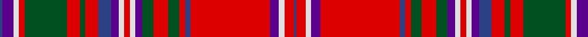

**Bands:** [BBWRGRGRBBWRWBGRGRBRBWRB](/stripes/bbwrgrgrbbwrwbgrgrbrbwrb/) · **Stripes:** [DB DP W R DG R DG R DB DP W R W DP DG R DG R DB R DP W R DB](/stripes/stripes24/) DB DP W R DG R DG R DB DP W R W DP DG R DG R DB R DP W R DB

This was sourced from register-of-tartans.  It is a [24 band tartan](/bands/bands24/).

Original link https://www.tartanregister.gov.uk/tartanDetails.aspx?ref=2409

## Register references

External register numbers recorded for this tartan.

- Scottish Register of Tartans: [2409](https://www.tartanregister.gov.uk/tartanDetails.aspx?ref=2409)
- Scottish Tartans World Register: 84

## Thread count
B/3 P12 LN6 R6 G46 R14 G6 R14 B14 P8 LN6 R6 LN6 P8 G12 R16 G12 R6 B6 R86 P10 LN6 R10 B/3

## Palette
Each colour and its ΔE from the base-6 reference it is a variant of.

| Colour | Shade | Base | ΔE (OKLab) |
|---|---|---|---|
| B | <code style="background-color:#2C4084;">#2C4084</code> `#2C4084` | B <code style="background-color:#2A418A;">#2A418A</code> | 0.01 |
| G | <code style="background-color:#005020;">#005020</code> `#005020` | G <code style="background-color:#006100;">#006100</code> | 0.07 |
| LN | <code style="background-color:#E0E0E0;">#E0E0E0</code> `#E0E0E0` | W <code style="background-color:#F7F7F7;">#F7F7F7</code> | 0.07 |
| P | <code style="background-color:#5A008C;">#5A008C</code> `#5A008C` | B <code style="background-color:#2A418A;">#2A418A</code> | 0.13 |
| R | <code style="background-color:#DC0000;">#DC0000</code> `#DC0000` | R <code style="background-color:#CC0000;">#CC0000</code> | 0.03 |

## Nearest tartans

The nearest existing variants by ΔTartan distance.

1. [MacDougall, Plaid](/setts/s24/db3p12w6r6g46r14g6r14db14p8w6r6w6p8g12r16g12r6db6r86p10w6r10db3/) — ΔT 0.54
1. [MacFarlane](/setts/s27/r42k1g12w2r3k1r3w2g2dp12k4r3w4g3w4r3k4dp12g2w2r3k1r3w2g12k1r21~x4/) — ΔT 0.72
1. [MacDonald of Boisdale](/setts/s21/r16lb1db7lb1r6lb1db34lb1r26g1g16g1r4g1g7g1r4lb1db7lb1r16~x2/) — ΔT 0.83
1. [MacDonald of Boisdale](/setts/s21/r16w1db6w1r6w1db32w1r24g1g16g1r4g1g6g1r4w1db6w1r16~x2/) — ΔT 0.88
1. [Hebridean, North Uist](/setts/s24/db5r3w2db1w2r3g9ly2w1ly2g9r1g1r27db1r1db1r27db1r1db9w1db1w4~x2/) — ΔT 1.01
1. [MacDougal](/setts/s26/g10r2db2r30dp3r2w1r2dp3r30db2r2g10r10g10dp4r2dp4db10r4g2r4g30r2dp3w1~x2/) — ΔT 1.08
1. [MacDougall - 1970 (H of E)](/setts/s27/r5g10r2db2r30dp3r2w1r2dp3r30db2r2g10r10g10dp4r2dp4db10r4g2r4g30r2dp3w1~x2/) — ΔT 1.11
1. [Unidentified #14](/setts/s17/dg4r3t1dp1r35dp1t1r3dp16r3t1dp1r2dg35r7k1t2~x2/) — ΔT 1.18
1. [MacDougall](/setts/s20/lb1r3r1dg23r3dg1r3db6r4r1r4dg6r6dg6r2db1r24r1r1lb1/) — ΔT 1.22
1. [MacDougall Clan Tartan Tartan Number: 1519. Earliest known date: 1815-16 The earliest reference to the MacDougall tartan is in the collection of the Highland Society of London where a sample exists, signed and sealed by the Clan Chief around 1815. The sett is a complex one and the nearest count to the present day day tartan comes from a sample in Paton's collection housed at the Scottish Tartans Museum, and dating to about 1830. The Highland Society also have a sample certified by the Chief MacDougall of MacDougall dated 1906, in their archives store at the Royal Caledonian School near London. See products available Copyright © Blair Urquhart, Comrie, 2015](/setts/s27/r5g10r2db2r30lr3r2w1r2lr3r30db2r2g10r10g10lr4r2lr4db10r4g2r4g30r2lr3w1~x2/) — ΔT 1.24

## Neighbour map

Every grey dot is one of 14313 variants placed by the first two principal components of the ΔTartan feature space (44% of its variance). Red is this tartan; blue dots are its nearest — click one to open its page.

<svg viewBox="0 0 640 380" role="img" style="max-width:100%;height:auto;border:1px solid #e0e0e0;border-radius:4px;display:block" xmlns="http://www.w3.org/2000/svg"><image href="/nn/cloud.v1.png" width="640" height="380"/><a href="/setts/s24/db3p12w6r6g46r14g6r14db14p8w6r6w6p8g12r16g12r6db6r86p10w6r10db3/"><circle cx="277.2" cy="54.4" r="4" fill="#3465a4"><title>MacDougall, Plaid</title></circle></a><a href="/setts/s27/r42k1g12w2r3k1r3w2g2dp12k4r3w4g3w4r3k4dp12g2w2r3k1r3w2g12k1r21~x4/"><circle cx="286.8" cy="24.4" r="4" fill="#3465a4"><title>MacFarlane</title></circle></a><a href="/setts/s21/r16lb1db7lb1r6lb1db34lb1r26g1g16g1r4g1g7g1r4lb1db7lb1r16~x2/"><circle cx="283.9" cy="61.2" r="4" fill="#3465a4"><title>MacDonald of Boisdale</title></circle></a><a href="/setts/s21/r16w1db6w1r6w1db32w1r24g1g16g1r4g1g6g1r4w1db6w1r16~x2/"><circle cx="289.7" cy="66.2" r="4" fill="#3465a4"><title>MacDonald of Boisdale</title></circle></a><a href="/setts/s24/db5r3w2db1w2r3g9ly2w1ly2g9r1g1r27db1r1db1r27db1r1db9w1db1w4~x2/"><circle cx="297.8" cy="37.4" r="4" fill="#3465a4"><title>Hebridean, North Uist</title></circle></a><a href="/setts/s26/g10r2db2r30dp3r2w1r2dp3r30db2r2g10r10g10dp4r2dp4db10r4g2r4g30r2dp3w1~x2/"><circle cx="301.7" cy="63.4" r="4" fill="#3465a4"><title>MacDougal</title></circle></a><a href="/setts/s27/r5g10r2db2r30dp3r2w1r2dp3r30db2r2g10r10g10dp4r2dp4db10r4g2r4g30r2dp3w1~x2/"><circle cx="308.3" cy="62.3" r="4" fill="#3465a4"><title>MacDougall - 1970 (H of E)</title></circle></a><a href="/setts/s17/dg4r3t1dp1r35dp1t1r3dp16r3t1dp1r2dg35r7k1t2~x2/"><circle cx="307.4" cy="53.9" r="4" fill="#3465a4"><title>Unidentified #14</title></circle></a><a href="/setts/s20/lb1r3r1dg23r3dg1r3db6r4r1r4dg6r6dg6r2db1r24r1r1lb1/"><circle cx="255.6" cy="69.4" r="4" fill="#3465a4"><title>MacDougall</title></circle></a><a href="/setts/s27/r5g10r2db2r30lr3r2w1r2lr3r30db2r2g10r10g10lr4r2lr4db10r4g2r4g30r2lr3w1~x2/"><circle cx="307.0" cy="61.4" r="4" fill="#3465a4"><title>MacDougall Clan Tartan Tartan Number: 1519. Earliest known date: 1815-16 The earliest reference to the MacDougall tartan is in the collection of the Highland Society of London where a sample exists, signed and sealed by the Clan Chief around 1815. The sett is a complex one and the nearest count to the present day day tartan comes from a sample in Paton's collection housed at the Scottish Tartans Museum, and dating to about 1830. The Highland Society also have a sample certified by the Chief MacDougall of MacDougall dated 1906, in their archives store at the Royal Caledonian School near London. See products available Copyright © Blair Urquhart, Comrie, 2015</title></circle></a><circle cx="271.0" cy="49.5" r="5" fill="#c00000"/></svg>

ID: /setts/s24/db3dp12w6r6dg46r14dg6r14db14dp8w6r6w6dp8dg12r16dg12r6db6r86dp10w6r10db3/
