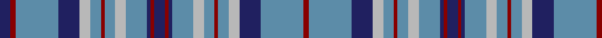

**Bands:** [RBBYBRBYBBRBRBBYBRBYBBRB](/stripes/rbbybrbybbrbrbbybrbybbrb/) · **Stripes:** [R T DB LR T R T LR T DB R DB R DB T LR T R T LR DB T R DB](/stripes/stripes24/) R T DB LR T R T LR T DB R DB R DB T LR T R T LR DB T R DB

This was sourced from register-of-tartans.  It is a [24 band tartan](/bands/bands24/).

Original link https://www.tartanregister.gov.uk/tartanDetails.aspx?ref=1817

## Also known as

This cloth is also recorded under:

- Illinois St.Andrews Society

## Register references

External register numbers recorded for this tartan.

- Scottish Register of Tartans: [1817](https://www.tartanregister.gov.uk/tartanDetails.aspx?ref=1817)
- Scottish Tartans Authority (ITI): 2051
- Scottish Tartans World Register: 2051

## Thread count
DB/12 DR6 B48 DB24 N12 B12 DR4 B12 N12 B24 DB4 DR4 DB12 DR4 DB4 B24 N12 B12 DR4 B12 N12 DB24 B48 DR/6

## Palette
Each colour and its ΔE from the base-6 reference it is a variant of.

| Colour | Shade | Base | ΔE (OKLab) |
|---|---|---|---|
| B | <code style="background-color:#5C8CA8;">#5C8CA8</code> `#5C8CA8` | B <code style="background-color:#2A418A;">#2A418A</code> | 0.23 |
| DB | <code style="background-color:#202060;">#202060</code> `#202060` | B <code style="background-color:#2A418A;">#2A418A</code> | 0.11 |
| DR | <code style="background-color:#880000;">#880000</code> `#880000` | R <code style="background-color:#CC0000;">#CC0000</code> | 0.15 |
| G | <code style="background-color:#408060;">#408060</code> `#408060` | G <code style="background-color:#006100;">#006100</code> | 0.14 |
| N | <code style="background-color:#B8B8B8;">#B8B8B8</code> `#B8B8B8` | Y <code style="background-color:#F2BF00;">#F2BF00</code> | 0.17 |

## Nearest tartans

The nearest existing variants by ΔTartan distance.

1. [Illinois State (District)](/setts/s13/db6r3t24db12lr6t6r2t6lr6t12db2r2db6~x2/) — ΔT 1.30
1. [Hannay Blue](/setts/s18/k9t4k2t4k2t30k9t4db14ly2~x2/) — ΔT 1.32
1. [Platt (Name)](/setts/s28/g16db6ly2g12r2g14db14ly1db12r2g6db24g6ly2r2~x2/) — ΔT 1.46
1. [Grampian Trade Tartan Tartan Number: 2151. Earliest known date: 1993 Designed as a district tartan to reflect the colours of the Grampian Mountains. MacNaughtons of Pitlochry introduced this sett with their new range of district tartans in 1993. See products available Copyright © Blair Urquhart, Comrie, 2015](/setts/s15/dt15lb15g3r2g26r2g3lb15dt26r2dt3lb4dt3r2dt11~x2/) — ΔT 1.53
1. [American Soc of Travel Agents Corporate Tartan Tartan Number: 2316. Earliest known date: Pre 1995 Deisgned by Kinloch Anderson for the Scottish Tourist Board trained US Travel Agents. Based on Davidson since the first President of the ASTA from 1931 - 1938 was Mr E. Irvine Davis.Designed to celebrate the ASTA 1997 world conference in Glasgow. Thread count estimated from illustration. See products available Copyright © Blair Urquhart, Comrie, 2015](/setts/s16/g10db10r1db10o1db1o10db2o10db1o1db10r1db10g10w2~x2/) — ΔT 1.58
1. [Round Table](/setts/s26/t11db2t11k2db2t5w2t5w2t5db10t1db2t1db10k4t5k2t5k4db2t2db2t11db2t1~x2/) — ΔT 1.60
1. [Scotch House (Corporate)](/setts/s18/lb16db2lb2db2lb3db6y2y22y4y22y2db6lb3db2lb2db2lb16r3~x2/) — ΔT 1.63
1. [Miyuki, House Check Grey, 1003A](/setts/s18/n12lb14r3y6lb10n28lb10y6r3lb8y10lb8r3y6lb40n6lb6n6/) — ΔT 1.66
1. [Tartan Army](/setts/s21/b22db2b4db2b4db8w2db2w2db10r5ly2r5db10w2db2w2db8b18db2b4~x2/) — ΔT 1.68
1. [Cochrane Azure](/setts/s15/t27r4t3r2t4r2t3r4t14k14r2db14r4db4ly3~x2/) — ΔT 1.72

## Neighbour map

Every grey dot is one of 14299 variants placed by the first two principal components of the ΔTartan feature space (44% of its variance). Red is this tartan; blue dots are its nearest — click one to open its page.

<svg viewBox="0 0 640 380" role="img" style="max-width:100%;height:auto;border:1px solid #e0e0e0;border-radius:4px;display:block" xmlns="http://www.w3.org/2000/svg"><image href="/nn/cloud.v1.png" width="640" height="380"/><a href="/setts/s13/db6r3t24db12lr6t6r2t6lr6t12db2r2db6~x2/"><circle cx="259.8" cy="176.3" r="4" fill="#3465a4"><title>Illinois State (District)</title></circle></a><a href="/setts/s18/k9t4k2t4k2t30k9t4db14ly2~x2/"><circle cx="299.5" cy="139.4" r="4" fill="#3465a4"><title>Hannay Blue</title></circle></a><a href="/setts/s28/g16db6ly2g12r2g14db14ly1db12r2g6db24g6ly2r2~x2/"><circle cx="300.6" cy="131.8" r="4" fill="#3465a4"><title>Platt (Name)</title></circle></a><a href="/setts/s15/dt15lb15g3r2g26r2g3lb15dt26r2dt3lb4dt3r2dt11~x2/"><circle cx="226.9" cy="156.1" r="4" fill="#3465a4"><title>Grampian Trade Tartan Tartan Number: 2151. Earliest known date: 1993 Designed as a district tartan to reflect the colours of the Grampian Mountains. MacNaughtons of Pitlochry introduced this sett with their new range of district tartans in 1993. See products available Copyright © Blair Urquhart, Comrie, 2015</title></circle></a><a href="/setts/s16/g10db10r1db10o1db1o10db2o10db1o1db10r1db10g10w2~x2/"><circle cx="227.1" cy="171.9" r="4" fill="#3465a4"><title>American Soc of Travel Agents Corporate Tartan Tartan Number: 2316. Earliest known date: Pre 1995 Deisgned by Kinloch Anderson for the Scottish Tourist Board trained US Travel Agents. Based on Davidson since the first President of the ASTA from 1931 - 1938 was Mr E. Irvine Davis.Designed to celebrate the ASTA 1997 world conference in Glasgow. Thread count estimated from illustration. See products available Copyright © Blair Urquhart, Comrie, 2015</title></circle></a><a href="/setts/s26/t11db2t11k2db2t5w2t5w2t5db10t1db2t1db10k4t5k2t5k4db2t2db2t11db2t1~x2/"><circle cx="238.7" cy="140.5" r="4" fill="#3465a4"><title>Round Table</title></circle></a><a href="/setts/s18/lb16db2lb2db2lb3db6y2y22y4y22y2db6lb3db2lb2db2lb16r3~x2/"><circle cx="242.4" cy="137.4" r="4" fill="#3465a4"><title>Scotch House (Corporate)</title></circle></a><a href="/setts/s18/n12lb14r3y6lb10n28lb10y6r3lb8y10lb8r3y6lb40n6lb6n6/"><circle cx="275.3" cy="146.5" r="4" fill="#3465a4"><title>Miyuki, House Check Grey, 1003A</title></circle></a><a href="/setts/s21/b22db2b4db2b4db8w2db2w2db10r5ly2r5db10w2db2w2db8b18db2b4~x2/"><circle cx="221.0" cy="138.7" r="4" fill="#3465a4"><title>Tartan Army</title></circle></a><a href="/setts/s15/t27r4t3r2t4r2t3r4t14k14r2db14r4db4ly3~x2/"><circle cx="230.3" cy="131.5" r="4" fill="#3465a4"><title>Cochrane Azure</title></circle></a><circle cx="269.6" cy="150.6" r="5" fill="#c00000"/></svg>

ID: /setts/s24/db6r3t24db12lr6t6r2t6lr6t12db2r2db6~x2/
