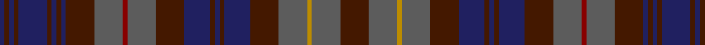

This page is one **sett** — a single exact thread-count. It belongs to the [tartan](/tartans/dr12n12dy2n12dr12db11dr2db2dr2db11dr12n12dra2n12dr12db2dr2db2dr2db12dr2db2dr2db2/)
(the same proportion at any scale), whose colour order is pattern [BBBBBBBBBBBRBBBBBBBBBYBB](/stripes/bbbbbbbbbbbrbbbbbbbbbybb/).

Sourced from register-of-tartans.  It is a [24 stripe tartan](/stripes/stripes24/).

Original link https://www.tartanregister.gov.uk/tartanDetails.aspx?ref=4973

## Register references

External register numbers recorded for this tartan.

- Scottish Register of Tartans: [4973](https://www.tartanregister.gov.uk/tartanDetails.aspx?ref=4973)
- Scottish Tartans Authority (ITI): 3122

## Thread count
DR/24 N24 DY4 N24 DR24 DB22 DR4 DB4 DR4 DB22 DR24 N24 DRa4 N24 DR24 DB4 DR4 DB4 DR4 DB24 DR4 DB4 DR4 DB/4

## Palette
Each colour and the base-6 reference it is a variant of.

| Colour | Shade | Base |
|---|---|---|
| DB | <code style="background-color:#202060;">#202060</code> `oklch(28.9% 0.111 276.9)` <small>#202060</small> | B <code style="background-color:#2A418A;">#2A418A</code> |
| DR | <code style="background-color:#441800;">#441800</code> `oklch(27.3% 0.076 46.3)` <small>#441800</small> | B <code style="background-color:#2A418A;">#2A418A</code> |
| DRa | <code style="background-color:#880000;">#880000</code> `oklch(39.4% 0.162 29.2)` <small>#880000</small> | R <code style="background-color:#CC0000;">#CC0000</code> |
| DY | <code style="background-color:#BC8C00;">#BC8C00</code> `oklch(66.8% 0.137 84.1)` <small>#BC8C00</small> | Y <code style="background-color:#F2BF00;">#F2BF00</code> |
| N | <code style="background-color:#5C5C5C;">#5C5C5C</code> `oklch(47.5% 0.000 89.9)` <small>#5C5C5C</small> | B <code style="background-color:#2A418A;">#2A418A</code> |

## Nearest tartans

The nearest existing variants by ΔTartan distance, with this tartan at the top so the swatches line up against it.

ΔTartan

Tartan

Sett

—

<a href="/ttd/edit/#slug=do12n12lo2n12do12db11do2db2do2db11do12n12r2n12do12db2do2db2do2db12do2db2do2db2~x2">Bartlam (Personal)</a> <a class="nn-out" href="/setts/s24/do12n12lo2n12do12db11do2db2do2db11do12n12r2n12do12db2do2db2do2db12do2db2do2db2~x2/" title="open its dictionary page">↗</a>

0.00

<a href="/ttd/edit/#slug=do12db2do2db2do2db12do2db2do2db2do12n12r2n12do12db11do2db2do2db11do12n12lo2n12~x2">Bartlam (Personal)</a> <a class="nn-out" href="/setts/s24/do12db2do2db2do2db12do2db2do2db2do12n12r2n12do12db11do2db2do2db11do12n12lo2n12~x2/" title="open its dictionary page">↗</a>

1.34

<a href="/setts/s24/db18r5db3r5db3k20dg18lo4dg18k20db20k6db6/">Keith District District Tartan Tartan Number: 5782. Earliest known date: 2003 Designed by Councillor Linda Gorn of Keith who was instrumental in having a tartan museum established in Keith circa 1998 under the auspices of the Scottish Tartans Society. Keith is also home to Macnaughton Group's weaving mill (Isla Mill). The House of Edgar who formalised this design is also part of the same group. See products available Copyright © Blair Urquhart, Comrie, 2015</a>

1.64

<a href="/ttd/edit/#slug=g2dt5g3r2dt11r2dt11dg18dt11r2dt11r2g3r11dt3dg5dt3r5b2~x2">Jorgensen of Taasinge Family Tartan Tartan Number: 7214. Earliest known date: 2006 Representing my family, the light green is centre of pattern, like in life. Surrounded by the colours of the autumn forest and sea, as I see them on my beloved Isle of Taasinge, all framed with the light violet which so often colours the setting sky. See products available Copyright © Blair Urquhart, Comrie, 2015</a> <a class="nn-out" href="/setts/s19/g2dt5g3r2dt11r2dt11dg18dt11r2dt11r2g3r11dt3dg5dt3r5b2~x2/" title="open its dictionary page">↗</a>

1.67

<a href="/ttd/edit/#slug=dg18r3dg3r15dy13r14dg3r3dg18dy5dg2k5dg3r2dg3db5dg2lg5~x2">Ben Murad (Personal)</a> <a class="nn-out" href="/setts/s18/dg18r3dg3r15dy13r14dg3r3dg18dy5dg2k5dg3r2dg3db5dg2lg5~x2/" title="open its dictionary page">↗</a>

1.74

<a href="/ttd/edit/#slug=dg18r3dg3r15y13r14dg3r3dg18y5dg2o5dg3r2dg3n5dg2t5~x2">Ben Murad (Personal)</a> <a class="nn-out" href="/setts/s18/dg18r3dg3r15y13r14dg3r3dg18y5dg2o5dg3r2dg3n5dg2t5~x2/" title="open its dictionary page">↗</a>

1.78

<a href="/ttd/edit/#slug=dt3r2dt13k9do3k2do14k2do3k9dt15lb3~x2">McWilliams Dress (2014)</a> <a class="nn-out" href="/setts/s12/dt3r2dt13k9do3k2do14k2do3k9dt15lb3~x2/" title="open its dictionary page">↗</a>

1.82

<a href="/ttd/edit/#slug=lr4r10dt6dg10dt6r22g6r4dt22r4dt22dg36dt22r4dt22r4g6dt10g3">Jrgensen of Taasingee (Personal)</a> <a class="nn-out" href="/setts/s19/lr4r10dt6dg10dt6r22g6r4dt22r4dt22dg36dt22r4dt22r4g6dt10g3/" title="open its dictionary page">↗</a>

1.83

<a href="/ttd/edit/#slug=dg13db2k2db2dg13y4db14dp2db14y4k12db2dg2db2dg2db2k12~x2">National Trust for Scotland</a> <a class="nn-out" href="/setts/s17/dg13db2k2db2dg13y4db14dp2db14y4k12db2dg2db2dg2db2k12~x2/" title="open its dictionary page">↗</a>

1.83

<a href="/ttd/edit/#slug=r4dg4r1k7r1k1y1r1k7r1dg4r4y1dp4r1dg7ly1dg7r1dp4y1~x4">Gordonstoun #3</a> <a class="nn-out" href="/setts/s21/r4dg4r1k7r1k1y1r1k7r1dg4r4y1dp4r1dg7ly1dg7r1dp4y1~x4/" title="open its dictionary page">↗</a>

1.83

<a href="/ttd/edit/#slug=db6dg6k3dg3k3dg3k3dg15r9dg6db3k9db3dg6r9dg15k3dg3k3dg3k3dg6dy9db3dy3db3dy3db3dy6db10dy3db3dy3db3dy3~x2">Unidentified 'Old tartan'</a> <a class="nn-out" href="/setts/s35/db6dg6k3dg3k3dg3k3dg15r9dg6db3k9db3dg6r9dg15k3dg3k3dg3k3dg6dy9db3dy3db3dy3db3dy6db10dy3db3dy3db3dy3~x2/" title="open its dictionary page">↗</a>

## Neighbour map

Every grey dot is one of 14299 variants placed by the first two principal components of the ΔTartan feature space (44% of its variance). Red is this tartan; blue dots are its nearest — click one to open its page.

<svg viewBox="0 0 640 380" role="img" style="max-width:100%;height:auto;border:1px solid #e0e0e0;border-radius:4px;display:block" xmlns="http://www.w3.org/2000/svg"><image href="/nn/cloud.v1.png" width="640" height="380"/><a href="/setts/s24/do12db2do2db2do2db12do2db2do2db2do12n12r2n12do12db11do2db2do2db11do12n12lo2n12~x2/"><circle cx="225.1" cy="207.9" r="4" fill="#3465a4"><title>Bartlam (Personal)</title></circle></a><a href="/setts/s24/db18r5db3r5db3k20dg18lo4dg18k20db20k6db6/"><circle cx="164.0" cy="207.1" r="4" fill="#3465a4"><title>Keith District District Tartan Tartan Number: 5782. Earliest known date: 2003 Designed by Councillor Linda Gorn of Keith who was instrumental in having a tartan museum established in Keith circa 1998 under the auspices of the Scottish Tartans Society. Keith is also home to Macnaughton Group's weaving mill (Isla Mill). The House of Edgar who formalised this design is also part of the same group. See products available Copyright © Blair Urquhart, Comrie, 2015</title></circle></a><a href="/setts/s19/g2dt5g3r2dt11r2dt11dg18dt11r2dt11r2g3r11dt3dg5dt3r5b2~x2/"><circle cx="252.2" cy="186.1" r="4" fill="#3465a4"><title>Jorgensen of Taasinge Family Tartan Tartan Number: 7214. Earliest known date: 2006 Representing my family, the light green is centre of pattern, like in life. Surrounded by the colours of the autumn forest and sea, as I see them on my beloved Isle of Taasinge, all framed with the light violet which so often colours the setting sky. See products available Copyright © Blair Urquhart, Comrie, 2015</title></circle></a><a href="/setts/s18/dg18r3dg3r15dy13r14dg3r3dg18dy5dg2k5dg3r2dg3db5dg2lg5~x2/"><circle cx="228.8" cy="175.3" r="4" fill="#3465a4"><title>Ben Murad (Personal)</title></circle></a><a href="/setts/s18/dg18r3dg3r15y13r14dg3r3dg18y5dg2o5dg3r2dg3n5dg2t5~x2/"><circle cx="246.2" cy="180.7" r="4" fill="#3465a4"><title>Ben Murad (Personal)</title></circle></a><a href="/setts/s12/dt3r2dt13k9do3k2do14k2do3k9dt15lb3~x2/"><circle cx="222.8" cy="224.9" r="4" fill="#3465a4"><title>McWilliams Dress (2014)</title></circle></a><a href="/setts/s19/lr4r10dt6dg10dt6r22g6r4dt22r4dt22dg36dt22r4dt22r4g6dt10g3/"><circle cx="267.8" cy="176.1" r="4" fill="#3465a4"><title>Jrgensen of Taasingee (Personal)</title></circle></a><a href="/setts/s17/dg13db2k2db2dg13y4db14dp2db14y4k12db2dg2db2dg2db2k12~x2/"><circle cx="232.6" cy="227.0" r="4" fill="#3465a4"><title>National Trust for Scotland</title></circle></a><a href="/setts/s21/r4dg4r1k7r1k1y1r1k7r1dg4r4y1dp4r1dg7ly1dg7r1dp4y1~x4/"><circle cx="144.7" cy="171.7" r="4" fill="#3465a4"><title>Gordonstoun #3</title></circle></a><a href="/setts/s35/db6dg6k3dg3k3dg3k3dg15r9dg6db3k9db3dg6r9dg15k3dg3k3dg3k3dg6dy9db3dy3db3dy3db3dy6db10dy3db3dy3db3dy3~x2/"><circle cx="131.4" cy="193.3" r="4" fill="#3465a4"><title>Unidentified 'Old tartan'</title></circle></a><circle cx="225.1" cy="207.9" r="5" fill="#c00000"/></svg>

ID: /setts/s24/do12n12lo2n12do12db11do2db2do2db11do12n12r2n12do12db2do2db2do2db12do2db2do2db2~x2/
