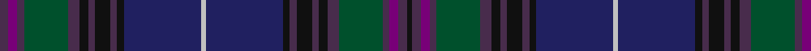

In pattern [BBBGBKBKBKBWBKBKBKBGBBBK](/stripes/bbbgbkbkbkbwbkbkbkbgbbbk/).

This was sourced from house-of-tartan.  It is a [24 stripe tartan](/stripes/stripes24/).

Original link http://www.house-of-tartan.scotland.net/house/TartanViewjs.asp?colr=Def&tnam=3445

## Thread count
N/8 P8 N6 G40 N10 K8 N6 K14 N6 K6 DB70 Na4 DB70 K6 N6 K14 N6 K8 N10 G40 N6 P8 N8 K/4

## Palette
Each colour and its ΔE from the base-6 reference it is a variant of.

| Colour | Shade | Base | ΔE (OKLab) |
|---|---|---|---|
| DB | <code style="background-color:#202060;">#202060</code> `#202060` | B <code style="background-color:#2A418A;">#2A418A</code> | 0.11 |
| DR | <code style="background-color:#680028;">#680028</code> `#680028` | B <code style="background-color:#2A418A;">#2A418A</code> | 0.21 |
| G | <code style="background-color:#00502C;">#00502C</code> `#00502C` | G <code style="background-color:#006100;">#006100</code> | 0.08 |
| K | <code style="background-color:#101010;">#101010</code> `#101010` | K <code style="background-color:#000000;">#000000</code> | 0.17 |
| N | <code style="background-color:#482C4C;">#482C4C</code> `#482C4C` | B <code style="background-color:#2A418A;">#2A418A</code> | 0.12 |
| Na | <code style="background-color:#C0C0C0;">#C0C0C0</code> `#C0C0C0` | W <code style="background-color:#F7F7F7;">#F7F7F7</code> | 0.17 |
| P | <code style="background-color:#780078;">#780078</code> `#780078` | B <code style="background-color:#2A418A;">#2A418A</code> | 0.17 |

## Nearest tartans

The nearest existing variants by ΔTartan distance.

1. [Renton (Personal)](/setts/s18/o8dy2o8k4r3k4dy8k2dy8k4dt21n8k2dy3k2n8dt24k3~x2/) — ΔT 1.55
1. [Yeomans (2016)](/setts/s16/dt22k2o3k2dt22k4dg10k2dg10r3k4r3do10dg2do10k3~x2/) — ΔT 1.62
1. [Heartlands](/setts/s20/db4b1dt20db2dt2db18dg2db2dg22m2dp4~x2/) — ΔT 1.66
1. [Passion of Scotland, Purple (Fashion](/setts/s15/db7w1k3dp3k3db3k13dp2k2dp2k2dp23db3dp2m2~x2/) — ΔT 1.79
1. [Heartlands Fancy Tartan Tartan Number: 3443. Earliest known date: 2002 Designed by Erica Randall of House of Edgar for MacGregor & MacDuff of 41 Bath Street, Glasgow G2 1HW for use in their kilt hire business. The customer requested that the tartan be based upon the Melville sett. Date of application 6th November 2002. In May 2003 the business was sold by Mr Robert Brown who elected to retain the copyright of this tartan. See products available Copyright © Blair Urquhart, Comrie, 2015](/setts/s20/db4b1dt20db2dt2db18dg2db2dg22k2dp4~x2/) — ΔT 1.79
1. [Rendell, Charles](/setts/s17/k2dg2k1dg2k1dg2k1dg12dt4k3dt3k3dt3k3dt4dp24r2~x2/) — ΔT 1.79
1. [Glaz (Fashion)](/setts/s18/n2dt9db1dt4db2dt2db4n1db15g1db3g3db2g4db1g7ly1r2~x2/) — ΔT 1.82
1. [Davies of Wales](/setts/s24/k3db30k2db4k2db30k3g30k3db30k2t2k2db30k3g30k3db30k2db4k2db30k3g3/) — ΔT 1.86
1. [St. Mary's Help of... (School)](/setts/s17/r2k1dg24k16db2k2db2k2db24k2db2k2db2k16dg24k1ly2~x2/) — ΔT 1.86
1. [Highland Cathedral](/setts/s28/r4g1db22db2dp2r1dp2r4db1dp10r2db20dp1db2ly2~x2/) — ΔT 1.90

## Neighbour map

Every grey dot is one of 14299 variants placed by the first two principal components of the ΔTartan feature space (44% of its variance). Red is this tartan; blue dots are its nearest — click one to open its page.

<svg viewBox="0 0 640 380" role="img" style="max-width:100%;height:auto;border:1px solid #e0e0e0;border-radius:4px;display:block" xmlns="http://www.w3.org/2000/svg"><image href="/nn/cloud.v1.png" width="640" height="380"/><a href="/setts/s18/o8dy2o8k4r3k4dy8k2dy8k4dt21n8k2dy3k2n8dt24k3~x2/"><circle cx="221.7" cy="176.7" r="4" fill="#3465a4"><title>Renton (Personal)</title></circle></a><a href="/setts/s16/dt22k2o3k2dt22k4dg10k2dg10r3k4r3do10dg2do10k3~x2/"><circle cx="252.7" cy="196.5" r="4" fill="#3465a4"><title>Yeomans (2016)</title></circle></a><a href="/setts/s20/db4b1dt20db2dt2db18dg2db2dg22m2dp4~x2/"><circle cx="237.0" cy="128.0" r="4" fill="#3465a4"><title>Heartlands</title></circle></a><a href="/setts/s15/db7w1k3dp3k3db3k13dp2k2dp2k2dp23db3dp2m2~x2/"><circle cx="325.1" cy="137.0" r="4" fill="#3465a4"><title>Passion of Scotland, Purple (Fashion</title></circle></a><a href="/setts/s20/db4b1dt20db2dt2db18dg2db2dg22k2dp4~x2/"><circle cx="232.2" cy="127.0" r="4" fill="#3465a4"><title>Heartlands Fancy Tartan Tartan Number: 3443. Earliest known date: 2002 Designed by Erica Randall of House of Edgar for MacGregor &amp; MacDuff of 41 Bath Street, Glasgow G2 1HW for use in their kilt hire business. The customer requested that the tartan be based upon the Melville sett. Date of application 6th November 2002. In May 2003 the business was sold by Mr Robert Brown who elected to retain the copyright of this tartan. See products available Copyright © Blair Urquhart, Comrie, 2015</title></circle></a><a href="/setts/s17/k2dg2k1dg2k1dg2k1dg12dt4k3dt3k3dt3k3dt4dp24r2~x2/"><circle cx="301.9" cy="155.5" r="4" fill="#3465a4"><title>Rendell, Charles</title></circle></a><a href="/setts/s18/n2dt9db1dt4db2dt2db4n1db15g1db3g3db2g4db1g7ly1r2~x2/"><circle cx="251.8" cy="152.5" r="4" fill="#3465a4"><title>Glaz (Fashion)</title></circle></a><a href="/setts/s24/k3db30k2db4k2db30k3g30k3db30k2t2k2db30k3g30k3db30k2db4k2db30k3g3/"><circle cx="254.3" cy="133.3" r="4" fill="#3465a4"><title>Davies of Wales</title></circle></a><a href="/setts/s17/r2k1dg24k16db2k2db2k2db24k2db2k2db2k16dg24k1ly2~x2/"><circle cx="299.2" cy="146.6" r="4" fill="#3465a4"><title>St. Mary's Help of... (School)</title></circle></a><a href="/setts/s28/r4g1db22db2dp2r1dp2r4db1dp10r2db20dp1db2ly2~x2/"><circle cx="287.2" cy="118.4" r="4" fill="#3465a4"><title>Highland Cathedral</title></circle></a><circle cx="263.6" cy="135.8" r="5" fill="#c00000"/></svg>

ID: /setts/s24/dp4dp4dp3dg20dp5k4dp3k7dp3k3db35lb2db35k3dp3k7dp3k4dp5dg20dp3dp4dp4k2~x2/
