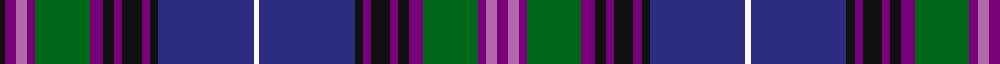

In pattern [BRBGBKBKBKBWBKBKBKBGBRBK](/stripes/brbgbkbkbkbwbkbkbkbgbrbk/).

This was sourced from register-of-tartans.  It is a [24 stripe tartan](/stripes/stripes24/).

Original link https://www.tartanregister.gov.uk/tartanDetails.aspx?ref=5066

## Register references

External register numbers recorded for this tartan.

- Scottish Register of Tartans: [5066](https://www.tartanregister.gov.uk/tartanDetails.aspx?ref=5066)
- Scottish Tartans Authority (ITI): 3445

## Thread count
P/8 Pa8 P6 G40 P10 K8 P6 K14 P6 K6 DB70 W4 DB70 K6 P6 K14 P6 K8 P10 G40 P6 Pa8 P8 K/4

## Palette
Each colour and the base-6 reference it is a variant of.

| Colour | Shade | Base |
|---|---|---|
| DB | <code style="background-color:#2C2C80;">#2C2C80</code> `oklch(35.0% 0.138 276.6)` <small>#2C2C80</small> | B <code style="background-color:#2A418A;">#2A418A</code> |
| G | <code style="background-color:#006818;">#006818</code> `oklch(45.0% 0.142 145.0)` <small>#006818</small> | G <code style="background-color:#006100;">#006100</code> |
| K | <code style="background-color:#101010;">#101010</code> `oklch(17.3% 0.000 89.9)` <small>#101010</small> | K <code style="background-color:#000000;">#000000</code> |
| P | <code style="background-color:#780078;">#780078</code> `oklch(40.2% 0.185 328.4)` <small>#780078</small> | B <code style="background-color:#2A418A;">#2A418A</code> |
| Pa | <code style="background-color:#B468AC;">#B468AC</code> `oklch(62.5% 0.131 330.9)` <small>#B468AC</small> | R <code style="background-color:#CC0000;">#CC0000</code> |
| W | <code style="background-color:#FCFCFC;">#FCFCFC</code> `oklch(99.1% 0.000 89.9)` <small>#FCFCFC</small> | W <code style="background-color:#F7F7F7;">#F7F7F7</code> |

## Nearest tartans

The nearest existing variants by ΔTartan distance, with this tartan at the top so the swatches line up against it.

ΔTartan

Tartan

Sett

—

<a href="/ttd/edit/#slug=dp4m4dp3g20dp5k4dp3k7dp3k3db35w2db35k3dp3k7dp3k4dp5g20dp3m4dp4k2~x2">Spirit of Bannockburn</a> <a class="nn-out" href="/setts/s24/dp4m4dp3g20dp5k4dp3k7dp3k3db35w2db35k3dp3k7dp3k4dp5g20dp3m4dp4k2~x2/" title="open its dictionary page">↗</a>

1.06

<a href="/ttd/edit/#slug=k2g2p1g2p1g2p1g12db4k3db3k3db3k3db4dp24r2~x2">Rendell, Charles (Personal)</a> <a class="nn-out" href="/setts/s17/k2g2p1g2p1g2p1g12db4k3db3k3db3k3db4dp24r2~x2/" title="open its dictionary page">↗</a>

1.16

<a href="/ttd/edit/#slug=db24ly1r2y2r2ly1k24y24w2db2w2y24k24ly1r2y2r2ly1db24y2~x2">Smithsonian</a> <a class="nn-out" href="/setts/s20/db24ly1r2y2r2ly1k24y24w2db2w2y24k24ly1r2y2r2ly1db24y2~x2/" title="open its dictionary page">↗</a>

1.28

<a href="/ttd/edit/#slug=db30k4g3dp2dp2dp2dp10k2dp2k4dp2g3dp2k4dp2k2dp10dp2dp2dp2g3k4db30t3~x2">Scotland 1782</a> <a class="nn-out" href="/setts/s24/db30k4g3dp2dp2dp2dp10k2dp2k4dp2g3dp2k4dp2k2dp10dp2dp2dp2g3k4db30t3~x2/" title="open its dictionary page">↗</a>

1.28

<a href="/ttd/edit/#slug=k2dp4m4dp3g20dp5k4dp3k7dp3k3db35w2~x2">Spirit of Bannockburn (Fashion)</a> <a class="nn-out" href="/setts/s13/k2dp4m4dp3g20dp5k4dp3k7dp3k3db35w2~x2/" title="open its dictionary page">↗</a>

1.35

<a href="/ttd/edit/#slug=r6db3r3db54g6db3g6db4t24db4t4db50db6db4db12lo4">St Margaret's School for Girls, Aberdeen</a> <a class="nn-out" href="/setts/s16/r6db3r3db54g6db3g6db4t24db4t4db50db6db4db12lo4/" title="open its dictionary page">↗</a>

1.36

<a href="/ttd/edit/#slug=db24g2db12k2w2k3m2k3db4k3m2k3w2k2r12g2db24~x2">Selkirk Corporate District Tartan Tartan Number: 2304. Earliest known date: 1996 . See products available Copyright © Blair Urquhart, Comrie, 2015</a> <a class="nn-out" href="/setts/s17/db24g2db12k2w2k3m2k3db4k3m2k3w2k2r12g2db24~x2/" title="open its dictionary page">↗</a>

1.38

<a href="/ttd/edit/#slug=k3db2g2db26t1db1t1db1t1db1t3t2k10db3g14k3r3~x2">St Lawrence District Tartan Tartan Number: 1030. Earliest known date: pre 1963 Presented to the STS collection by Mr A Yule in 1963. designed by Mrs. Helene Cobb of Clayton and is the registered trademark of the Thousand Islands Museum in Clayton, New York State - www.timuseum.org Woven by Peter MacArthur of Biggar, Scotland. The greens are for the cedars along the shore, the blues are for the St Lawrence River, and the red is the sunset over the Islands. John Fitzpatrick in his review of Canadian tartans in July 2008, pointed out that there were two slightly different thread counts given in the CIDD. See products available Copyright © Blair Urquhart, Comrie, 2015</a> <a class="nn-out" href="/setts/s17/k3db2g2db26t1db1t1db1t1db1t3t2k10db3g14k3r3~x2/" title="open its dictionary page">↗</a>

1.40

<a href="/ttd/edit/#slug=db24lo2db14k3w2k3lo2k4db4k4lo2k3w2k3r12lo2db24~x2">Total</a> <a class="nn-out" href="/setts/s17/db24lo2db14k3w2k3lo2k4db4k4lo2k3w2k3r12lo2db24~x2/" title="open its dictionary page">↗</a>

1.47

<a href="/setts/s26/db7k1r3k1db24k1w3k3y3k3y3g19k2w4~x2/">Strathclyde, University of</a>

1.48

<a href="/ttd/edit/#slug=db30k9db5w4db2r2db2w4db5k9db30k9db3w2db6r2db6w2db3k9~x2">Rangers F. C. Dress Corporate Tartan Tartan Number: 2171. Earliest known date: 1994 Chris Aitken designed the new 'dress' version of the Rangers F.C. tartan in 1994 to complement the existing corporate tartan which was slightly modified at the same time. The Rangers football club first introduced their clubs tartan in 1989. See products available Copyright © Blair Urquhart, Comrie, 2015</a> <a class="nn-out" href="/setts/s20/db30k9db5w4db2r2db2w4db5k9db30k9db3w2db6r2db6w2db3k9~x2/" title="open its dictionary page">↗</a>

## Neighbour map

Every grey dot is one of 14299 variants placed by the first two principal components of the ΔTartan feature space (44% of its variance). Red is this tartan; blue dots are its nearest — click one to open its page.

<svg viewBox="0 0 640 380" role="img" style="max-width:100%;height:auto;border:1px solid #e0e0e0;border-radius:4px;display:block" xmlns="http://www.w3.org/2000/svg"><image href="/nn/cloud.v1.png" width="640" height="380"/><a href="/setts/s17/k2g2p1g2p1g2p1g12db4k3db3k3db3k3db4dp24r2~x2/"><circle cx="198.9" cy="90.1" r="4" fill="#3465a4"><title>Rendell, Charles (Personal)</title></circle></a><a href="/setts/s20/db24ly1r2y2r2ly1k24y24w2db2w2y24k24ly1r2y2r2ly1db24y2~x2/"><circle cx="189.9" cy="86.2" r="4" fill="#3465a4"><title>Smithsonian</title></circle></a><a href="/setts/s24/db30k4g3dp2dp2dp2dp10k2dp2k4dp2g3dp2k4dp2k2dp10dp2dp2dp2g3k4db30t3~x2/"><circle cx="242.9" cy="89.2" r="4" fill="#3465a4"><title>Scotland 1782</title></circle></a><a href="/setts/s13/k2dp4m4dp3g20dp5k4dp3k7dp3k3db35w2~x2/"><circle cx="193.1" cy="109.1" r="4" fill="#3465a4"><title>Spirit of Bannockburn (Fashion)</title></circle></a><a href="/setts/s16/r6db3r3db54g6db3g6db4t24db4t4db50db6db4db12lo4/"><circle cx="253.5" cy="112.5" r="4" fill="#3465a4"><title>St Margaret's School for Girls, Aberdeen</title></circle></a><a href="/setts/s17/db24g2db12k2w2k3m2k3db4k3m2k3w2k2r12g2db24~x2/"><circle cx="144.6" cy="101.4" r="4" fill="#3465a4"><title>Selkirk Corporate District Tartan Tartan Number: 2304. Earliest known date: 1996 . See products available Copyright © Blair Urquhart, Comrie, 2015</title></circle></a><a href="/setts/s17/k3db2g2db26t1db1t1db1t1db1t3t2k10db3g14k3r3~x2/"><circle cx="253.2" cy="85.7" r="4" fill="#3465a4"><title>St Lawrence District Tartan Tartan Number: 1030. Earliest known date: pre 1963 Presented to the STS collection by Mr A Yule in 1963. designed by Mrs. Helene Cobb of Clayton and is the registered trademark of the Thousand Islands Museum in Clayton, New York State - www.timuseum.org Woven by Peter MacArthur of Biggar, Scotland. The greens are for the cedars along the shore, the blues are for the St Lawrence River, and the red is the sunset over the Islands. John Fitzpatrick in his review of Canadian tartans in July 2008, pointed out that there were two slightly different thread counts given in the CIDD. See products available Copyright © Blair Urquhart, Comrie, 2015</title></circle></a><a href="/setts/s17/db24lo2db14k3w2k3lo2k4db4k4lo2k3w2k3r12lo2db24~x2/"><circle cx="139.7" cy="109.2" r="4" fill="#3465a4"><title>Total</title></circle></a><a href="/setts/s26/db7k1r3k1db24k1w3k3y3k3y3g19k2w4~x2/"><circle cx="179.7" cy="61.7" r="4" fill="#3465a4"><title>Strathclyde, University of</title></circle></a><a href="/setts/s20/db30k9db5w4db2r2db2w4db5k9db30k9db3w2db6r2db6w2db3k9~x2/"><circle cx="211.1" cy="121.5" r="4" fill="#3465a4"><title>Rangers F. C. Dress Corporate Tartan Tartan Number: 2171. Earliest known date: 1994 Chris Aitken designed the new 'dress' version of the Rangers F.C. tartan in 1994 to complement the existing corporate tartan which was slightly modified at the same time. The Rangers football club first introduced their clubs tartan in 1989. See products available Copyright © Blair Urquhart, Comrie, 2015</title></circle></a><circle cx="191.5" cy="90.4" r="5" fill="#c00000"/></svg>

ID: /setts/s24/dp4m4dp3g20dp5k4dp3k7dp3k3db35w2db35k3dp3k7dp3k4dp5g20dp3m4dp4k2~x2/
