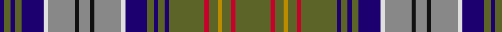

In pattern [BGBGBWRKRKRWBGBGBGRGYGRG](/patterns/bgbgbwrkrkrwbgbgbgrgygrg/).

This was sourced from tartans-authority.  It is a [24 stripes tartan](/stripes/stripes24/).

Original link http://www.tartansauthority.com/tartan-ferret/display/2169/

## Thread count
DB/4 G6 DB4 G6 DB20 LN4 N24 K4 N10 K4 N24 LN4 DB20 G6 DB4 G6 DB4 G32 R4 G8 DY4 G8 R4 G/32

## Palette
Each colour and its ΔE from the base-6 reference it is a variant of.

| Colour | Shade | Base | ΔE (OKLab) |
|---|---|---|---|
| DB | <code style="background-color:#1C0070;">#1C0070</code> `#1C0070` | B <code style="background-color:#2A418A;">#2A418A</code> | 0.14 |
| DY | <code style="background-color:#BC8C00;">#BC8C00</code> `#BC8C00` | Y <code style="background-color:#F2BF00;">#F2BF00</code> | 0.16 |
| G | <code style="background-color:#5C6428;">#5C6428</code> `#5C6428` | G <code style="background-color:#006100;">#006100</code> | 0.10 |
| K | <code style="background-color:#101010;">#101010</code> `#101010` | K <code style="background-color:#000000;">#000000</code> | 0.17 |
| LN | <code style="background-color:#E0E0E0;">#E0E0E0</code> `#E0E0E0` | W <code style="background-color:#F7F7F7;">#F7F7F7</code> | 0.07 |
| N | <code style="background-color:#888888;">#888888</code> `#888888` | R <code style="background-color:#CC0000;">#CC0000</code> | 0.24 |
| R | <code style="background-color:#C8002C;">#C8002C</code> `#C8002C` | R <code style="background-color:#CC0000;">#CC0000</code> | 0.03 |

## Nearest tartans

The nearest existing variants by ΔTartan distance.

1. [O'Sullivan McCragh Family Tartan Tartan Number: 2169. Earliest known date: 1994 O'Sullivan McCragh was designed by Chris Aitken for Geoffrey (Tailor) Highland Crafts Ltd. in June 1994. See products available Copyright © Blair Urquhart, Comrie, 2015](/setts/s24/g16r2g4y2g4r2g16b2g3b2g3b10w2wa12k2wa5k2wa12w2b10g3b2g3b2~b1c0070-g5c6428-k101010-rc8002c-we0e0e0-wac0c0c0-ye8c000~x2/) — ΔT 1.02
1. [O'Sullivan, McCragh](/setts/s24/g16r2g4ga2g4r2g16b2g3b2g3b10w2wa12k2wa5k2wa12w2b10g3b2g3b2~b000060-g607030-ga908000-k000000-rc00020-we0e0e0-wac0c0c0~x2/) — ΔT 1.21
1. [Lundie](/setts/s21/r4b2ba5g2ba2g2ba2g13ba2g2ba2g2ba5y2ba3w2g6r5b3ba4w2~b307cb8-ba003c64-g445c24-rc80000-we0e0e0-yd09800~x2/) — ΔT 1.25
1. [Gordonstoun](/setts/s22/k2r2k20r2g11r11w2b11r2g19y5g19r2b11w2r11g11r2k20r2k2w2~b5c8ca8-g408060-k101010-r800028-wa8ace8-ye8c000~x2/) — ΔT 1.27
1. [Harmon of Plenderleith Personal Tartan Tartan Number: 10021. Earliest known date: Mar. 2009 A personal tartan for the Baron of Plenderleith, his family and members of his household. Developed with the help of the House of Tartan, Comrie, Perthshire. See products available Copyright © Blair Urquhart, Comrie, 2015](/setts/s18/k2b6y2b2y2b19r2g2r2b2ba4k2ba11g2ba2g2ba6y2~b7894a4-ba003c64-g5c6428-k101010-rc80000-ybc8c00~x2/) — ΔT 1.29
1. [O'Sullivan McCragh (Personal)](/setts/s46/g16r2g4y2g4r2g16b2g3b2g3b10w2ra12k2ra5k2ra12w2b10g3b2g3b2g3b2g3b10w2ra12k2ra5k2ra12w2b10g3b2g3b2g16r2g4y2g4r2~b1c0070-g5c6428-k101010-rc8002c-ra888888-we0e0e0-ybc8c00~x2/) — ΔT 1.37
1. [Lundie (Personal)](/setts/s21/r4b2ba5g2ba2g2ba2g13ba2g2ba2g2ba5y2ba3w2g6r5b3ba4w2~b1474b4-ba003c64-g006818-rc80000-we0e0e0-ye8c000~x2/) — ΔT 1.38
1. [Recovery (Corporate)](/setts/s21/b6y1b1g1b1g1b1g5k1g1k1g1k1g1k1g6r5b2r2ga1r5~b2c2c80-g006818-ga289c18-k101010-rc80000-yfccc00~x4/) — ΔT 1.40
1. [Recovery](/setts/s21/b6k1b1g1b1g1b1g5ka1g1ka1g1ka1g1ka1g6r5b2r2ga1r5~b2c2c80-g006818-ga289c18-k000000-ka101010-rc80000~x4/) — ΔT 1.41
1. [Service of Drymen Corporate Tartan Tartan Number: 1380. Earliest known date: pre 2003 The design is based on the Sillers connection with the Isle of Arran and the Clan Stewart. See products available Copyright © Blair Urquhart, Comrie, 2015](/setts/s17/r2b14k2ra5g3w1g3w1g3k1g3k1g3ra5k2b14y2~b2c2c80-g006818-k101010-rc80000-ra888888-we0e0e0-ye8c000~x2/) — ΔT 1.42

## Neighbour map

Every grey dot is one of 15726 variants placed by the first two principal components of the ΔTartan feature space (44% of its variance). Red is this tartan; blue dots are its nearest — click one to open its page.

<svg viewBox="0 0 640 380" role="img" style="max-width:100%;height:auto;border:1px solid #e0e0e0;border-radius:4px;display:block" xmlns="http://www.w3.org/2000/svg"><image href="/nn/cloud.v1.png" width="640" height="380"/><a href="/setts/s24/g16r2g4y2g4r2g16b2g3b2g3b10w2wa12k2wa5k2wa12w2b10g3b2g3b2~b1c0070-g5c6428-k101010-rc8002c-we0e0e0-wac0c0c0-ye8c000~x2/"><circle cx="103.1" cy="92.4" r="4" fill="#3465a4"><title>O'Sullivan McCragh Family Tartan Tartan Number: 2169. Earliest known date: 1994 O'Sullivan McCragh was designed by Chris Aitken for Geoffrey (Tailor) Highland Crafts Ltd. in June 1994. See products available Copyright © Blair Urquhart, Comrie, 2015</title></circle></a><a href="/setts/s24/g16r2g4ga2g4r2g16b2g3b2g3b10w2wa12k2wa5k2wa12w2b10g3b2g3b2~b000060-g607030-ga908000-k000000-rc00020-we0e0e0-wac0c0c0~x2/"><circle cx="96.0" cy="91.9" r="4" fill="#3465a4"><title>O'Sullivan, McCragh</title></circle></a><a href="/setts/s21/r4b2ba5g2ba2g2ba2g13ba2g2ba2g2ba5y2ba3w2g6r5b3ba4w2~b307cb8-ba003c64-g445c24-rc80000-we0e0e0-yd09800~x2/"><circle cx="122.8" cy="154.7" r="4" fill="#3465a4"><title>Lundie</title></circle></a><a href="/setts/s22/k2r2k20r2g11r11w2b11r2g19y5g19r2b11w2r11g11r2k20r2k2w2~b5c8ca8-g408060-k101010-r800028-wa8ace8-ye8c000~x2/"><circle cx="107.6" cy="115.1" r="4" fill="#3465a4"><title>Gordonstoun</title></circle></a><a href="/setts/s18/k2b6y2b2y2b19r2g2r2b2ba4k2ba11g2ba2g2ba6y2~b7894a4-ba003c64-g5c6428-k101010-rc80000-ybc8c00~x2/"><circle cx="168.2" cy="116.7" r="4" fill="#3465a4"><title>Harmon of Plenderleith Personal Tartan Tartan Number: 10021. Earliest known date: Mar. 2009 A personal tartan for the Baron of Plenderleith, his family and members of his household. Developed with the help of the House of Tartan, Comrie, Perthshire. See products available Copyright © Blair Urquhart, Comrie, 2015</title></circle></a><a href="/setts/s46/g16r2g4y2g4r2g16b2g3b2g3b10w2ra12k2ra5k2ra12w2b10g3b2g3b2g3b2g3b10w2ra12k2ra5k2ra12w2b10g3b2g3b2g16r2g4y2g4r2~b1c0070-g5c6428-k101010-rc8002c-ra888888-we0e0e0-ybc8c00~x2/"><circle cx="97.2" cy="76.9" r="4" fill="#3465a4"><title>O'Sullivan McCragh (Personal)</title></circle></a><a href="/setts/s21/r4b2ba5g2ba2g2ba2g13ba2g2ba2g2ba5y2ba3w2g6r5b3ba4w2~b1474b4-ba003c64-g006818-rc80000-we0e0e0-ye8c000~x2/"><circle cx="107.8" cy="152.0" r="4" fill="#3465a4"><title>Lundie (Personal)</title></circle></a><a href="/setts/s21/b6y1b1g1b1g1b1g5k1g1k1g1k1g1k1g6r5b2r2ga1r5~b2c2c80-g006818-ga289c18-k101010-rc80000-yfccc00~x4/"><circle cx="106.1" cy="135.8" r="4" fill="#3465a4"><title>Recovery (Corporate)</title></circle></a><a href="/setts/s21/b6k1b1g1b1g1b1g5ka1g1ka1g1ka1g1ka1g6r5b2r2ga1r5~b2c2c80-g006818-ga289c18-k000000-ka101010-rc80000~x4/"><circle cx="107.9" cy="137.5" r="4" fill="#3465a4"><title>Recovery</title></circle></a><a href="/setts/s17/r2b14k2ra5g3w1g3w1g3k1g3k1g3ra5k2b14y2~b2c2c80-g006818-k101010-rc80000-ra888888-we0e0e0-ye8c000~x2/"><circle cx="155.6" cy="92.2" r="4" fill="#3465a4"><title>Service of Drymen Corporate Tartan Tartan Number: 1380. Earliest known date: pre 2003 The design is based on the Sillers connection with the Isle of Arran and the Clan Stewart. See products available Copyright © Blair Urquhart, Comrie, 2015</title></circle></a><circle cx="131.7" cy="106.0" r="5" fill="#c00000"/></svg>

ID: /setts/s24/g16r2g4y2g4r2g16b2g3b2g3b10w2ra12k2ra5k2ra12w2b10g3b2g3b2~b1c0070-g5c6428-k101010-rc8002c-ra888888-we0e0e0-ybc8c00~x2/
