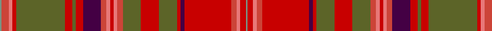

In pattern [GRRRGRGRBRRRRRGRGRBRRRRG](/patterns/grrrgrgrbrrrrrgrgrbrrrrg/).

This was sourced from tartans-authority.  It is a [24 stripes tartan](/stripes/stripes24/).

Original link http://www.tartansauthority.com/tartan-ferret/display/567/

## Thread count
LG/2 R8 LR4 Ra4 G54 Ra8 G4 Ra8 DP20 R6 LR4 Ra4 LR4 R6 G20 Ra20 G20 Ra4 DP4 Ra52 R6 LR4 Ra6 LG/2

## Palette
Each colour and its ΔE from the base-6 reference it is a variant of.

| Colour | Shade | Base | ΔE (OKLab) |
|---|---|---|---|
| DP | <code style="background-color:#440044;">#440044</code> `#440044` | B <code style="background-color:#2A418A;">#2A418A</code> | 0.18 |
| G | <code style="background-color:#5C6428;">#5C6428</code> `#5C6428` | G <code style="background-color:#006100;">#006100</code> | 0.10 |
| LG | <code style="background-color:#789484;">#789484</code> `#789484` | G <code style="background-color:#006100;">#006100</code> | 0.24 |
| LR | <code style="background-color:#E87878;">#E87878</code> `#E87878` | R <code style="background-color:#CC0000;">#CC0000</code> | 0.19 |
| R | <code style="background-color:#CC4438;">#CC4438</code> `#CC4438` | R <code style="background-color:#CC0000;">#CC0000</code> | 0.06 |
| Ra | <code style="background-color:#C80000;">#C80000</code> `#C80000` | R <code style="background-color:#CC0000;">#CC0000</code> | 0.01 |

## Nearest tartans

The nearest existing variants by ΔTartan distance.

1. [MacDougal 1](/setts/s24/b1r4ra2rb2g27rb4g2rb4ba10r3ra2rb2ra2r3g10rb10g10rb2ba2rb26r3ra2rb3b1~b5480b0-ba800080-g008000-rd00000-rad03030-rbc00000~x2/) — ΔT 1.13
1. [MacDougall #2](/setts/s24/b1r5ra2rb3g24rb5g2rb5ba11r3ra2rb2ra2r3g11rb11g11rb2ba2rb25r3ra2rb5b1~b3c82af-ba2c4084-g005020-r960028-rac82828-rbdc0000~x2/) — ΔT 1.26
1. [MacDougall 5](/setts/s24/b1r5ra2rb3g24rb5g2rb5ba11r3ra2rb2ra2r3g11rb11g11rb2ba2rb25r3ra2rb5b1~b5480b0-ba304080-g008000-r900030-rad03030-rbc00000~x2/) — ΔT 1.34
1. [MacDougall (Wilson)](/setts/s24/b1r4ra2rb2g27rb4g2rb4ba10r3ra2rb2ra2r3g10rb10g10rb2ba2rb26r3ra2rb3b1~b3c82af-ba5a008c-g005020-rc80050-rac82828-rbdc0000~x2/) — ΔT 1.38
1. [MacDougall 4](/setts/s16/r6ra4rb2r3g34ra3rb2r4rb2ra3b8ba2r40ra4rb2r6~b800080-ba5480b0-g008000-rc00000-ra800000-rbd03030~x2/) — ΔT 1.46
1. [MacColl, hunting](/setts/s18/r6ra3r6b22r7ra2w1r2b2r2w1ra2r7g22r7g2r2ra2~b304080-g607030-rc00000-ra900030-we0e0e0~x2/) — ΔT 1.48
1. [Caithness](/setts/s15/r28ra3b2g2b2ra3g8rb2b8rb5b3w2b2rb3b1~b401000-g808080-r806050-rac00000-rb906030-we0e0e0~x2/) — ΔT 1.62
1. [MacDougall #9](/setts/s16/r6ra4rb2r3g34ra3rb2r4rb2ra3b8ba2r40ra4rb2r6~b5a008c-ba3c82af-g005020-rdc0000-ra960000-rbc82828~x2/) — ΔT 1.63
1. [Golden Broom #2](/setts/s14/g12y3g6r19k1ra8k2b4k2g19k1r19k1ra9~b07648c-g585c20-k101010-r960000-rac82828-ye8c000~x2/) — ΔT 1.65
1. [Ryutokukan High School (Corporate)](/setts/s12/r3b20ra1b4ra2b2ra4b2ra5g2rb20w3~b5c5c5c-g289c18-r888888-rac80000-rb880000-wfcfcfc~x2/) — ΔT 1.73

## Neighbour map

Every grey dot is one of 15726 variants placed by the first two principal components of the ΔTartan feature space (44% of its variance). Red is this tartan; blue dots are its nearest — click one to open its page.

<svg viewBox="0 0 640 380" role="img" style="max-width:100%;height:auto;border:1px solid #e0e0e0;border-radius:4px;display:block" xmlns="http://www.w3.org/2000/svg"><image href="/nn/cloud.v1.png" width="640" height="380"/><a href="/setts/s24/b1r4ra2rb2g27rb4g2rb4ba10r3ra2rb2ra2r3g10rb10g10rb2ba2rb26r3ra2rb3b1~b5480b0-ba800080-g008000-rd00000-rad03030-rbc00000~x2/"><circle cx="235.7" cy="55.1" r="4" fill="#3465a4"><title>MacDougal 1</title></circle></a><a href="/setts/s24/b1r5ra2rb3g24rb5g2rb5ba11r3ra2rb2ra2r3g11rb11g11rb2ba2rb25r3ra2rb5b1~b3c82af-ba2c4084-g005020-r960028-rac82828-rbdc0000~x2/"><circle cx="230.2" cy="65.2" r="4" fill="#3465a4"><title>MacDougall #2</title></circle></a><a href="/setts/s24/b1r5ra2rb3g24rb5g2rb5ba11r3ra2rb2ra2r3g11rb11g11rb2ba2rb25r3ra2rb5b1~b5480b0-ba304080-g008000-r900030-rad03030-rbc00000~x2/"><circle cx="229.6" cy="67.2" r="4" fill="#3465a4"><title>MacDougall 5</title></circle></a><a href="/setts/s24/b1r4ra2rb2g27rb4g2rb4ba10r3ra2rb2ra2r3g10rb10g10rb2ba2rb26r3ra2rb3b1~b3c82af-ba5a008c-g005020-rc80050-rac82828-rbdc0000~x2/"><circle cx="229.5" cy="51.4" r="4" fill="#3465a4"><title>MacDougall (Wilson)</title></circle></a><a href="/setts/s16/r6ra4rb2r3g34ra3rb2r4rb2ra3b8ba2r40ra4rb2r6~b800080-ba5480b0-g008000-rc00000-ra800000-rbd03030~x2/"><circle cx="290.8" cy="74.4" r="4" fill="#3465a4"><title>MacDougall 4</title></circle></a><a href="/setts/s18/r6ra3r6b22r7ra2w1r2b2r2w1ra2r7g22r7g2r2ra2~b304080-g607030-rc00000-ra900030-we0e0e0~x2/"><circle cx="259.0" cy="100.0" r="4" fill="#3465a4"><title>MacColl, hunting</title></circle></a><a href="/setts/s15/r28ra3b2g2b2ra3g8rb2b8rb5b3w2b2rb3b1~b401000-g808080-r806050-rac00000-rb906030-we0e0e0~x2/"><circle cx="251.4" cy="81.2" r="4" fill="#3465a4"><title>Caithness</title></circle></a><a href="/setts/s16/r6ra4rb2r3g34ra3rb2r4rb2ra3b8ba2r40ra4rb2r6~b5a008c-ba3c82af-g005020-rdc0000-ra960000-rbc82828~x2/"><circle cx="286.3" cy="70.1" r="4" fill="#3465a4"><title>MacDougall #9</title></circle></a><a href="/setts/s14/g12y3g6r19k1ra8k2b4k2g19k1r19k1ra9~b07648c-g585c20-k101010-r960000-rac82828-ye8c000~x2/"><circle cx="226.7" cy="125.0" r="4" fill="#3465a4"><title>Golden Broom #2</title></circle></a><a href="/setts/s12/r3b20ra1b4ra2b2ra4b2ra5g2rb20w3~b5c5c5c-g289c18-r888888-rac80000-rb880000-wfcfcfc~x2/"><circle cx="253.6" cy="105.9" r="4" fill="#3465a4"><title>Ryutokukan High School (Corporate)</title></circle></a><circle cx="266.1" cy="63.9" r="5" fill="#c00000"/></svg>

ID: /setts/s24/g1r4ra2rb2ga27rb4ga2rb4b10r3ra2rb2ra2r3ga10rb10ga10rb2b2rb26r3ra2rb3g1~b440044-g789484-ga5c6428-rcc4438-rae87878-rbc80000~x2/
