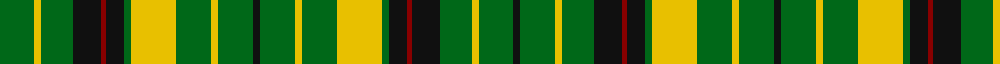

In pattern [GYGKRKGYGYGKGYGYGKRKGYGK](/patterns/gygkrkgygygkgygygkrkgygk/).

This was sourced from register-of-tartans.  It is a [24 stripes tartan](/stripes/stripes24/).

Original link https://www.tartanregister.gov.uk/tartanDetails.aspx?ref=1531

## Thread count
G/20 Y4 G18 K16 DR3 K10 G4 Y26 G20 Y4 G20 K4 G20 Y4 G20 Y26 G4 K10 DR3 K16 G18 Y4 G20 K/4

## Palette
Each colour and its ΔE from the base-6 reference it is a variant of.

| Colour | Shade | Base | ΔE (OKLab) |
|---|---|---|---|
| DR | <code style="background-color:#880000;">#880000</code> `#880000` | R <code style="background-color:#CC0000;">#CC0000</code> | 0.15 |
| G | <code style="background-color:#006818;">#006818</code> `#006818` | G <code style="background-color:#006100;">#006100</code> | 0.02 |
| K | <code style="background-color:#101010;">#101010</code> `#101010` | K <code style="background-color:#000000;">#000000</code> | 0.17 |
| Y | <code style="background-color:#E8C000;">#E8C000</code> `#E8C000` | Y <code style="background-color:#F2BF00;">#F2BF00</code> | 0.02 |

## Nearest tartans

The nearest existing variants by ΔTartan distance.

1. [Greenshields, Alan (Personal)](/setts/s13/k4g20y4g20y26g4k10r3k16g18y4g20k4~g006818-k101010-r880000-ye8c000/) — ΔT 1.27
1. [Ross, hunting](/setts/s14/g4b6g3b2g3b2g3k5g3k5g20r3g4r3~b5480b0-g008000-k000000-rc00000~x2/) — ΔT 1.68
1. [Stewart hunting](/setts/s22/b9g4b9k3b3k8g27r4g27k8g5k13g4k13g5k8g27y4g27k8b3k3~b304080-g008000-k000000-rc00000-yf0c000/) — ΔT 1.70
1. [Confessore](/setts/s15/g12ga2g2ga7y4r2y8r2y4ga7g2ga2g16w2g4~g004010-ga607030-rc00020-we0e0e0-yf0c000~x2/) — ΔT 1.78
1. [Confessore Family Tartan Tartan Number: 2165. Earliest known date: 1994 Designed for Mr Confessore of Napoli, Italy in 1994 by Mr. Keith Lumsden, researcher at the Scottish Tartans Society. The colours reflect the shades and tones of the Italian countryside. See products available Copyright © Blair Urquhart, Comrie, 2015](/setts/s15/g12ga2g2ga7y4r2y8r2y4ga7g2ga2g16w2g4~g003820-ga5c6428-ra03400-we0e0e0-ye8c000~x2/) — ΔT 1.82
1. [MacMillan (1946)](/setts/s16/g22k2g5k2y10k3y10k2g5k2g22r8k2r8k2r8~g006818-k101010-rc80000-ye8c000~x2/) — ΔT 1.86
1. [Scottish National, dress](/setts/s23/g11k2g3k2g11k8ga2ga2ga2w2ga11ga2ga2ga2k8g11k2g3k2g11ga12w11ga3~g004010-ga30a010-k000000-we0e0e0~x2/) — ΔT 1.91
1. [Vaughan (Welsh Name) Welsh Name Tartan Tartan Number: 6168. Earliest known date: pre 2004 The tartan for this Welsh surname and its variations, Baughan, Bawn, Fychan, Vain, Vaughan, Vaughn, Vauhan, Vayne, Vychan, Vachan, Vaghann, Young, Younger, is actually woven in Wales at the Cambrian Woollen Mill, weaving on the same site since 1830. This tartan differs from many traditional patterns in that the warp and weft differ, giving the finished worsted wool cloth more of a predominant stripe, vertically noticeable in the finished Kilt, or Cilt in Wales. See products available Copyright © Blair Urquhart, Comrie, 2015](/setts/s29/k4w6k23w2k3y17k2y4k2y17k3g17k20w6y4w6k20g17k3y17k2y4k2y17k3w2k23w6k4~g00643c-k101010-wfcfcfc-yd0b414/) — ΔT 1.99
1. [Major, Frazer](/setts/s15/w2r18w2r5w2g13w2g13w2r5w2g13w2g13w2~g008000-rc00000-we0e0e0~x2/) — ΔT 1.99
1. [Harmer](/setts/s12/g36y8k9y24g4y12g4y24k9y8g36r4~g003820-k101010-r880000-ybc8c00/) — ΔT 1.99

## Neighbour map

Every grey dot is one of 15726 variants placed by the first two principal components of the ΔTartan feature space (44% of its variance). Red is this tartan; blue dots are its nearest — click one to open its page.

<svg viewBox="0 0 640 380" role="img" style="max-width:100%;height:auto;border:1px solid #e0e0e0;border-radius:4px;display:block" xmlns="http://www.w3.org/2000/svg"><image href="/nn/cloud.v1.png" width="640" height="380"/><a href="/setts/s13/k4g20y4g20y26g4k10r3k16g18y4g20k4~g006818-k101010-r880000-ye8c000/"><circle cx="221.1" cy="193.8" r="4" fill="#3465a4"><title>Greenshields, Alan (Personal)</title></circle></a><a href="/setts/s14/g4b6g3b2g3b2g3k5g3k5g20r3g4r3~b5480b0-g008000-k000000-rc00000~x2/"><circle cx="281.4" cy="169.8" r="4" fill="#3465a4"><title>Ross, hunting</title></circle></a><a href="/setts/s22/b9g4b9k3b3k8g27r4g27k8g5k13g4k13g5k8g27y4g27k8b3k3~b304080-g008000-k000000-rc00000-yf0c000/"><circle cx="221.3" cy="146.1" r="4" fill="#3465a4"><title>Stewart hunting</title></circle></a><a href="/setts/s15/g12ga2g2ga7y4r2y8r2y4ga7g2ga2g16w2g4~g004010-ga607030-rc00020-we0e0e0-yf0c000~x2/"><circle cx="177.7" cy="159.4" r="4" fill="#3465a4"><title>Confessore</title></circle></a><a href="/setts/s15/g12ga2g2ga7y4r2y8r2y4ga7g2ga2g16w2g4~g003820-ga5c6428-ra03400-we0e0e0-ye8c000~x2/"><circle cx="177.7" cy="160.2" r="4" fill="#3465a4"><title>Confessore Family Tartan Tartan Number: 2165. Earliest known date: 1994 Designed for Mr Confessore of Napoli, Italy in 1994 by Mr. Keith Lumsden, researcher at the Scottish Tartans Society. The colours reflect the shades and tones of the Italian countryside. See products available Copyright © Blair Urquhart, Comrie, 2015</title></circle></a><a href="/setts/s16/g22k2g5k2y10k3y10k2g5k2g22r8k2r8k2r8~g006818-k101010-rc80000-ye8c000~x2/"><circle cx="212.1" cy="150.3" r="4" fill="#3465a4"><title>MacMillan (1946)</title></circle></a><a href="/setts/s23/g11k2g3k2g11k8ga2ga2ga2w2ga11ga2ga2ga2k8g11k2g3k2g11ga12w11ga3~g004010-ga30a010-k000000-we0e0e0~x2/"><circle cx="110.4" cy="170.6" r="4" fill="#3465a4"><title>Scottish National, dress</title></circle></a><a href="/setts/s29/k4w6k23w2k3y17k2y4k2y17k3g17k20w6y4w6k20g17k3y17k2y4k2y17k3w2k23w6k4~g00643c-k101010-wfcfcfc-yd0b414/"><circle cx="159.3" cy="118.5" r="4" fill="#3465a4"><title>Vaughan (Welsh Name) Welsh Name Tartan Tartan Number: 6168. Earliest known date: pre 2004 The tartan for this Welsh surname and its variations, Baughan, Bawn, Fychan, Vain, Vaughan, Vaughn, Vauhan, Vayne, Vychan, Vachan, Vaghann, Young, Younger, is actually woven in Wales at the Cambrian Woollen Mill, weaving on the same site since 1830. This tartan differs from many traditional patterns in that the warp and weft differ, giving the finished worsted wool cloth more of a predominant stripe, vertically noticeable in the finished Kilt, or Cilt in Wales. See products available Copyright © Blair Urquhart, Comrie, 2015</title></circle></a><a href="/setts/s15/w2r18w2r5w2g13w2g13w2r5w2g13w2g13w2~g008000-rc00000-we0e0e0~x2/"><circle cx="274.7" cy="179.8" r="4" fill="#3465a4"><title>Major, Frazer</title></circle></a><a href="/setts/s12/g36y8k9y24g4y12g4y24k9y8g36r4~g003820-k101010-r880000-ybc8c00/"><circle cx="225.9" cy="189.1" r="4" fill="#3465a4"><title>Harmer</title></circle></a><circle cx="213.7" cy="171.6" r="5" fill="#c00000"/></svg>

ID: /setts/s24/g20y4g18k16r3k10g4y26g20y4g20k4g20y4g20y26g4k10r3k16g18y4g20k4~g006818-k101010-r880000-ye8c000/
