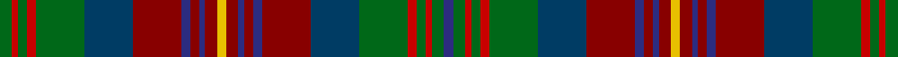

This page is one **sett** — a single exact thread-count. It belongs to the [tartan](/tartans/g4r2g3r3g16dt16ri16db3ri3db2ri4ly3ri4db2ri3db3ri16dt16g16r3g3r2g4db3/)
(the same proportion at any scale), whose colour order is pattern [BGRGRGBRBRBRYRBRBRBGRGRG](/stripes/bgrgrgbrbrbryrbrbrbgrgrg/).

Sourced from house-of-tartan.  It is a [24 stripe tartan](/stripes/stripes24/).

Original link http://www.house-of-tartan.scotland.net/house/TartanViewjs.asp?colr=Def&tnam=6954

## Thread count
G/8 R4 G6 R6 G32 DBa32 DR32 DB6 DR6 DB4 DR8 Y6 DR8 DB4 DR6 DB6 DR32 DBa32 G32 R6 G6 R4 G8 DB/6

## Palette

Palette: <strong>Tartan Register</strong>
<table><thead><tr><th>Colour</th><th>Threads</th><th>Shade</th><th>Base</th><th>OKLCh</th></tr></thead><tbody><tr><td>G/</td><td style="text-align:right;font-variant-numeric:tabular-nums">8</td><td><code style="background-color:#006818;">#006818</code> <small style="color:#888">#006818</small></td><td>G <code style="background-color:#006100;">#006100</code></td><td><small style="color:#888">oklch(45.0% 0.142 145.0)</small></td></tr><tr><td>R</td><td style="text-align:right;font-variant-numeric:tabular-nums">4</td><td><code style="background-color:#C80000;">#C80000</code> <small style="color:#888">#C80000</small></td><td>R <code style="background-color:#CC0000;">#CC0000</code></td><td><small style="color:#888">oklch(52.3% 0.215 29.2)</small></td></tr><tr><td>G</td><td style="text-align:right;font-variant-numeric:tabular-nums">6</td><td><code style="background-color:#006818;">#006818</code> <small style="color:#888">#006818</small></td><td>G <code style="background-color:#006100;">#006100</code></td><td><small style="color:#888">oklch(45.0% 0.142 145.0)</small></td></tr><tr><td>R</td><td style="text-align:right;font-variant-numeric:tabular-nums">6</td><td><code style="background-color:#C80000;">#C80000</code> <small style="color:#888">#C80000</small></td><td>R <code style="background-color:#CC0000;">#CC0000</code></td><td><small style="color:#888">oklch(52.3% 0.215 29.2)</small></td></tr><tr><td>G</td><td style="text-align:right;font-variant-numeric:tabular-nums">32</td><td><code style="background-color:#006818;">#006818</code> <small style="color:#888">#006818</small></td><td>G <code style="background-color:#006100;">#006100</code></td><td><small style="color:#888">oklch(45.0% 0.142 145.0)</small></td></tr><tr><td>DBa</td><td style="text-align:right;font-variant-numeric:tabular-nums">32</td><td><code style="background-color:#003C64;">#003C64</code> <small style="color:#888">#003C64</small></td><td>B <code style="background-color:#2A418A;">#2A418A</code></td><td><small style="color:#888">oklch(34.5% 0.089 246.0)</small></td></tr><tr><td>DR</td><td style="text-align:right;font-variant-numeric:tabular-nums">32</td><td><code style="background-color:#880000;">#880000</code> <small style="color:#888">#880000</small></td><td>R <code style="background-color:#CC0000;">#CC0000</code></td><td><small style="color:#888">oklch(39.4% 0.162 29.2)</small></td></tr><tr><td>DB</td><td style="text-align:right;font-variant-numeric:tabular-nums">6</td><td><code style="background-color:#2C2C80;">#2C2C80</code> <small style="color:#888">#2C2C80</small></td><td>B <code style="background-color:#2A418A;">#2A418A</code></td><td><small style="color:#888">oklch(35.0% 0.138 276.6)</small></td></tr><tr><td>DR</td><td style="text-align:right;font-variant-numeric:tabular-nums">6</td><td><code style="background-color:#880000;">#880000</code> <small style="color:#888">#880000</small></td><td>R <code style="background-color:#CC0000;">#CC0000</code></td><td><small style="color:#888">oklch(39.4% 0.162 29.2)</small></td></tr><tr><td>DB</td><td style="text-align:right;font-variant-numeric:tabular-nums">4</td><td><code style="background-color:#2C2C80;">#2C2C80</code> <small style="color:#888">#2C2C80</small></td><td>B <code style="background-color:#2A418A;">#2A418A</code></td><td><small style="color:#888">oklch(35.0% 0.138 276.6)</small></td></tr><tr><td>DR</td><td style="text-align:right;font-variant-numeric:tabular-nums">8</td><td><code style="background-color:#880000;">#880000</code> <small style="color:#888">#880000</small></td><td>R <code style="background-color:#CC0000;">#CC0000</code></td><td><small style="color:#888">oklch(39.4% 0.162 29.2)</small></td></tr><tr><td>Y</td><td style="text-align:right;font-variant-numeric:tabular-nums">6</td><td><code style="background-color:#E8C000;">#E8C000</code> <small style="color:#888">#E8C000</small></td><td>Y <code style="background-color:#F2BF00;">#F2BF00</code></td><td><small style="color:#888">oklch(81.9% 0.168 93.7)</small></td></tr><tr><td>DR</td><td style="text-align:right;font-variant-numeric:tabular-nums">8</td><td><code style="background-color:#880000;">#880000</code> <small style="color:#888">#880000</small></td><td>R <code style="background-color:#CC0000;">#CC0000</code></td><td><small style="color:#888">oklch(39.4% 0.162 29.2)</small></td></tr><tr><td>DB</td><td style="text-align:right;font-variant-numeric:tabular-nums">4</td><td><code style="background-color:#2C2C80;">#2C2C80</code> <small style="color:#888">#2C2C80</small></td><td>B <code style="background-color:#2A418A;">#2A418A</code></td><td><small style="color:#888">oklch(35.0% 0.138 276.6)</small></td></tr><tr><td>DR</td><td style="text-align:right;font-variant-numeric:tabular-nums">6</td><td><code style="background-color:#880000;">#880000</code> <small style="color:#888">#880000</small></td><td>R <code style="background-color:#CC0000;">#CC0000</code></td><td><small style="color:#888">oklch(39.4% 0.162 29.2)</small></td></tr><tr><td>DB</td><td style="text-align:right;font-variant-numeric:tabular-nums">6</td><td><code style="background-color:#2C2C80;">#2C2C80</code> <small style="color:#888">#2C2C80</small></td><td>B <code style="background-color:#2A418A;">#2A418A</code></td><td><small style="color:#888">oklch(35.0% 0.138 276.6)</small></td></tr><tr><td>DR</td><td style="text-align:right;font-variant-numeric:tabular-nums">32</td><td><code style="background-color:#880000;">#880000</code> <small style="color:#888">#880000</small></td><td>R <code style="background-color:#CC0000;">#CC0000</code></td><td><small style="color:#888">oklch(39.4% 0.162 29.2)</small></td></tr><tr><td>DBa</td><td style="text-align:right;font-variant-numeric:tabular-nums">32</td><td><code style="background-color:#003C64;">#003C64</code> <small style="color:#888">#003C64</small></td><td>B <code style="background-color:#2A418A;">#2A418A</code></td><td><small style="color:#888">oklch(34.5% 0.089 246.0)</small></td></tr><tr><td>G</td><td style="text-align:right;font-variant-numeric:tabular-nums">32</td><td><code style="background-color:#006818;">#006818</code> <small style="color:#888">#006818</small></td><td>G <code style="background-color:#006100;">#006100</code></td><td><small style="color:#888">oklch(45.0% 0.142 145.0)</small></td></tr><tr><td>R</td><td style="text-align:right;font-variant-numeric:tabular-nums">6</td><td><code style="background-color:#C80000;">#C80000</code> <small style="color:#888">#C80000</small></td><td>R <code style="background-color:#CC0000;">#CC0000</code></td><td><small style="color:#888">oklch(52.3% 0.215 29.2)</small></td></tr><tr><td>G</td><td style="text-align:right;font-variant-numeric:tabular-nums">6</td><td><code style="background-color:#006818;">#006818</code> <small style="color:#888">#006818</small></td><td>G <code style="background-color:#006100;">#006100</code></td><td><small style="color:#888">oklch(45.0% 0.142 145.0)</small></td></tr><tr><td>R</td><td style="text-align:right;font-variant-numeric:tabular-nums">4</td><td><code style="background-color:#C80000;">#C80000</code> <small style="color:#888">#C80000</small></td><td>R <code style="background-color:#CC0000;">#CC0000</code></td><td><small style="color:#888">oklch(52.3% 0.215 29.2)</small></td></tr><tr><td>G</td><td style="text-align:right;font-variant-numeric:tabular-nums">8</td><td><code style="background-color:#006818;">#006818</code> <small style="color:#888">#006818</small></td><td>G <code style="background-color:#006100;">#006100</code></td><td><small style="color:#888">oklch(45.0% 0.142 145.0)</small></td></tr><tr><td>DB/</td><td style="text-align:right;font-variant-numeric:tabular-nums">6</td><td><code style="background-color:#2C2C80;">#2C2C80</code> <small style="color:#888">#2C2C80</small></td><td>B <code style="background-color:#2A418A;">#2A418A</code></td><td><small style="color:#888">oklch(35.0% 0.138 276.6)</small></td></tr></tbody></table>

## Nearest tartans

The nearest existing variants by ΔTartan distance, with this tartan at the top so the swatches line up against it.

ΔTartan

Tartan

Sett

—

<a href="/ttd/edit/#slug=g4r2g3r3g16dt16ri16db3ri3db2ri4ly3ri4db2ri3db3ri16dt16g16r3g3r2g4db3~x2">Cuthill Clan/Family Tartan Tartan Number: 6954. Earliest known date: 2006 July Mr Cuthill based his design on Lindsay tartan which his family have worn since c1800 following the wedding between James Cuthill and Margaret Lindsay. (Unconfirmed and awaiting further research: a daughter of the Earl of Crawford) See products available Copyright © Blair Urquhart, Comrie, 2015</a> <a class="nn-out" href="/setts/s24/g4r2g3r3g16dt16ri16db3ri3db2ri4ly3ri4db2ri3db3ri16dt16g16r3g3r2g4db3~x2/" title="open its dictionary page">↗</a>

0.97

<a href="/ttd/edit/#slug=dg3r2o2r2n20db3n3r8dg2r2dg2r2dg8o2dg2o2dg2o8ly3~x2">Wcwm 1528</a> <a class="nn-out" href="/setts/s19/dg3r2o2r2n20db3n3r8dg2r2dg2r2dg8o2dg2o2dg2o8ly3~x2/" title="open its dictionary page">↗</a>

0.97

<a href="/ttd/edit/#slug=r2g4o2g11dt9ri12dt2ri12dt9g2dt2g2dt2g6r2g6dt2g2dt2g2dt9ri12lo2ri12dt9g11o2g4r2~x2">Shearer</a> <a class="nn-out" href="/setts/s29/r2g4o2g11dt9ri12dt2ri12dt9g2dt2g2dt2g6r2g6dt2g2dt2g2dt9ri12lo2ri12dt9g11o2g4r2~x2/" title="open its dictionary page">↗</a>

1.11

<a href="/ttd/edit/#slug=dg10k1o1k3o1k1dg1o1dg3o1dg1y1dy3y1dy1lr1y3lr1y1lr10~x4">Spice of Life</a> <a class="nn-out" href="/setts/s20/dg10k1o1k3o1k1dg1o1dg3o1dg1y1dy3y1dy1lr1y3lr1y1lr10~x4/" title="open its dictionary page">↗</a>

1.18

<a href="/ttd/edit/#slug=r4dg4r1k7r1k1y1r1k7r1dg4r4y1dp4r1dg7ly1dg7r1dp4y1~x4">Gordonstoun #3</a> <a class="nn-out" href="/setts/s21/r4dg4r1k7r1k1y1r1k7r1dg4r4y1dp4r1dg7ly1dg7r1dp4y1~x4/" title="open its dictionary page">↗</a>

1.28

<a href="/ttd/edit/#slug=db3g4r2g3r3g16dt16ri16db3ri3db2ri4ly3~x2">Cuthill (Personal)</a> <a class="nn-out" href="/setts/s13/db3g4r2g3r3g16dt16ri16db3ri3db2ri4ly3~x2/" title="open its dictionary page">↗</a>

1.33

<a href="/ttd/edit/#slug=r43dy5g27dy5lo40r5lo40dy5g27dy5dg40g27dg40dy5g27dy5r43do8">Cuillins of Skye (Fashion)</a> <a class="nn-out" href="/setts/s18/r43dy5g27dy5lo40r5lo40dy5g27dy5dg40g27dg40dy5g27dy5r43do8/" title="open its dictionary page">↗</a>

1.33

<a href="/setts/s21/db6k1db1gi1db1gi1db1gi5ki1gi1ki1gi1ki1gi1ki1gi6r5db2r2g1r5~x4/">Recovery</a>

1.35

<a href="/ttd/edit/#slug=dt8n3lb3n3o28lb4o8n12dt3n3dt3n3dt8dy3dt3dy3dt3dy12g4">Glenlea</a> <a class="nn-out" href="/setts/s19/dt8n3lb3n3o28lb4o8n12dt3n3dt3n3dt8dy3dt3dy3dt3dy12g4/" title="open its dictionary page">↗</a>

1.37

<a href="/ttd/edit/#slug=db6ly1db1gi1db1gi1db1gi5k1gi1k1gi1k1gi1k1gi6r5db2r2g1r5~x4">Recovery (Corporate)</a> <a class="nn-out" href="/setts/s21/db6ly1db1gi1db1gi1db1gi5k1gi1k1gi1k1gi1k1gi6r5db2r2g1r5~x4/" title="open its dictionary page">↗</a>

1.39

<a href="/ttd/edit/#slug=y4oi2y11k9do12o2do12k9y2k2y2k2y6r2y6k2y2k2y2k9do12k2do12k9y11oi2y4r2~x2">Shearer (Name)</a> <a class="nn-out" href="/setts/s28/y4oi2y11k9do12o2do12k9y2k2y2k2y6r2y6k2y2k2y2k9do12k2do12k9y11oi2y4r2~x2/" title="open its dictionary page">↗</a>

## Neighbour map

Every grey dot is one of 14359 variants placed by the first two principal components of the ΔTartan feature space (44% of its variance). Red is this tartan; blue dots are its nearest — click one to open its page.

<svg viewBox="0 0 640 380" role="img" style="max-width:100%;height:auto;border:1px solid #e0e0e0;border-radius:4px;display:block" xmlns="http://www.w3.org/2000/svg"><image href="/nn/cloud.v1.png" width="640" height="380"/><a href="/setts/s19/dg3r2o2r2n20db3n3r8dg2r2dg2r2dg8o2dg2o2dg2o8ly3~x2/"><circle cx="151.1" cy="133.5" r="4" fill="#3465a4"><title>Wcwm 1528</title></circle></a><a href="/setts/s29/r2g4o2g11dt9ri12dt2ri12dt9g2dt2g2dt2g6r2g6dt2g2dt2g2dt9ri12lo2ri12dt9g11o2g4r2~x2/"><circle cx="125.9" cy="159.9" r="4" fill="#3465a4"><title>Shearer</title></circle></a><a href="/setts/s20/dg10k1o1k3o1k1dg1o1dg3o1dg1y1dy3y1dy1lr1y3lr1y1lr10~x4/"><circle cx="136.8" cy="113.6" r="4" fill="#3465a4"><title>Spice of Life</title></circle></a><a href="/setts/s21/r4dg4r1k7r1k1y1r1k7r1dg4r4y1dp4r1dg7ly1dg7r1dp4y1~x4/"><circle cx="144.8" cy="172.5" r="4" fill="#3465a4"><title>Gordonstoun #3</title></circle></a><a href="/setts/s13/db3g4r2g3r3g16dt16ri16db3ri3db2ri4ly3~x2/"><circle cx="125.5" cy="159.5" r="4" fill="#3465a4"><title>Cuthill (Personal)</title></circle></a><a href="/setts/s18/r43dy5g27dy5lo40r5lo40dy5g27dy5dg40g27dg40dy5g27dy5r43do8/"><circle cx="108.2" cy="171.0" r="4" fill="#3465a4"><title>Cuillins of Skye (Fashion)</title></circle></a><a href="/setts/s21/db6k1db1gi1db1gi1db1gi5ki1gi1ki1gi1ki1gi1ki1gi6r5db2r2g1r5~x4/"><circle cx="110.3" cy="143.0" r="4" fill="#3465a4"><title>Recovery</title></circle></a><a href="/setts/s19/dt8n3lb3n3o28lb4o8n12dt3n3dt3n3dt8dy3dt3dy3dt3dy12g4/"><circle cx="128.3" cy="138.6" r="4" fill="#3465a4"><title>Glenlea</title></circle></a><a href="/setts/s21/db6ly1db1gi1db1gi1db1gi5k1gi1k1gi1k1gi1k1gi6r5db2r2g1r5~x4/"><circle cx="108.4" cy="141.0" r="4" fill="#3465a4"><title>Recovery (Corporate)</title></circle></a><a href="/setts/s28/y4oi2y11k9do12o2do12k9y2k2y2k2y6r2y6k2y2k2y2k9do12k2do12k9y11oi2y4r2~x2/"><circle cx="114.4" cy="160.3" r="4" fill="#3465a4"><title>Shearer (Name)</title></circle></a><circle cx="129.5" cy="139.8" r="5" fill="#c00000"/></svg>

ID: /setts/s24/g4r2g3r3g16dt16ri16db3ri3db2ri4ly3ri4db2ri3db3ri16dt16g16r3g3r2g4db3~x2/
