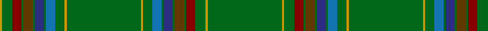

**Bands:** [GYGRGGGBGBGYGYGBGBGGGRGY](/stripes/gygrgggbgbgygygbgbgggrgy/) · **Stripes:** [G LO G R G DY G DB G B G LO G LO G B G DB G DY G R G LO](/stripes/stripes24/) G LO G R G DY G DB G B G LO G LO G B G DB G DY G R G LO

This was sourced from register-of-tartans.  It is a [24 band tartan](/bands/bands24/).

Original link https://www.tartanregister.gov.uk/tartanDetails.aspx?ref=4877

## Register references

External register numbers recorded for this tartan.

- Scottish Register of Tartans: [4877](https://www.tartanregister.gov.uk/tartanDetails.aspx?ref=4877)
- Scottish Tartans Authority (ITI): 3838

## Thread count
DY/4 G20 DR18 G4 T18 G4 DBa18 G4 Ba18 G18 DY4 G144 DY4 G18 Ba18 G4 DBa18 G4 T18 G4 DR18 G20 DY4 G/144

## Palette
Each colour and its ΔE from the base-6 reference it is a variant of.

| Colour | Shade | Base | ΔE (OKLab) |
|---|---|---|---|
| B | <code style="background-color:#48A4C0;">#48A4C0</code> `#48A4C0` | Y <code style="background-color:#F2BF00;">#F2BF00</code> | 0.29 |
| Ba | <code style="background-color:#1474B4;">#1474B4</code> `#1474B4` | B <code style="background-color:#2A418A;">#2A418A</code> | 0.15 |
| DB | <code style="background-color:#1C0070;">#1C0070</code> `#1C0070` | B <code style="background-color:#2A418A;">#2A418A</code> | 0.14 |
| DBa | <code style="background-color:#2C2C80;">#2C2C80</code> `#2C2C80` | B <code style="background-color:#2A418A;">#2A418A</code> | 0.06 |
| DR | <code style="background-color:#880000;">#880000</code> `#880000` | R <code style="background-color:#CC0000;">#CC0000</code> | 0.15 |
| DY | <code style="background-color:#D09800;">#D09800</code> `#D09800` | Y <code style="background-color:#F2BF00;">#F2BF00</code> | 0.12 |
| G | <code style="background-color:#006818;">#006818</code> `#006818` | G <code style="background-color:#006100;">#006100</code> | 0.02 |
| T | <code style="background-color:#603800;">#603800</code> `#603800` | G <code style="background-color:#006100;">#006100</code> | 0.16 |

## Nearest tartans

The nearest existing variants by ΔTartan distance.

1. [Murphy & his Gang (Personal)](/setts/s20/g29b1g2b2g2b3g2b5r1k1r1b5g2b3g2b2g2b1g14lo3~x2/) — ΔT 1.24
1. [Murphy and his Gang (Phoenix Arizona) (Personal)](/setts/s20/dg29n1dg2n2dg2n3dg2n5r1k1r1n5dg2n3dg2n2dg2n1dg14lo3~x2/) — ΔT 1.48
1. [Wexford Irish County Tartan Tartan Number: 2251. Earliest known date: 1995 One of a series of Irish District tartans designed by Polly Wittering of the House of Edgar, with colours reminiscent of the Country with soft warm colours dominating. See products available Copyright © Blair Urquhart, Comrie, 2015](/setts/s14/g11dg6g6w1dg2w1g6dg6g36k1lo3k1g5dg5~x2/) — ΔT 1.60
1. [Berry Tribute](/setts/s12/g43dp3o3dp2o4r3g2g13g2o9g1lo2~x2/) — ΔT 1.70
1. [Wexford, County](/setts/s14/g11dg6g6w1k2w1g6dg6g36k1ly3k1g5dg5~x2/) — ΔT 1.74
1. [Berry Tribute](/setts/s12/dg43dp3o3dp2o4r3g2dg13g2o9dg1lo2~x2/) — ΔT 1.81
1. [Holmes](/setts/s28/g3ly2g5r2g3r2g32db9k3db5k3db9g39ly4g39db9k3db5k3db9g32r2g3r2g5ly2g3r3~x2/) — ΔT 2.07
1. [Ettrick Forest](/setts/s24/db2g2r1g4r1db6r2g1ly1g1r1g1r1g1t1g1r2db6g26r1g1r1g1db1~x2/) — ΔT 2.13
1. [Sea Bees Regimental Tartan Tartan Number: 2197. Earliest known date: 1986 US military unit. See products available Copyright © Blair Urquhart, Comrie, 2015](/setts/s24/db6g3lb6g7ly2g36ly2g7lb6g3db6g3dy6g3r6g7ly2g36ly2g7r6g3dy6g3~x2/) — ΔT 2.14
1. [Anderson Green](/setts/s15/dg32do1lo1dg1k1o1k1o1k1do3dg2k1o4k1lo1~x4/) — ΔT 2.14

## Neighbour map

Every grey dot is one of 14313 variants placed by the first two principal components of the ΔTartan feature space (44% of its variance). Red is this tartan; blue dots are its nearest — click one to open its page.

<svg viewBox="0 0 640 380" role="img" style="max-width:100%;height:auto;border:1px solid #e0e0e0;border-radius:4px;display:block" xmlns="http://www.w3.org/2000/svg"><image href="/nn/cloud.v1.png" width="640" height="380"/><a href="/setts/s20/g29b1g2b2g2b3g2b5r1k1r1b5g2b3g2b2g2b1g14lo3~x2/"><circle cx="462.4" cy="112.4" r="4" fill="#3465a4"><title>Murphy &amp; his Gang (Personal)</title></circle></a><a href="/setts/s20/dg29n1dg2n2dg2n3dg2n5r1k1r1n5dg2n3dg2n2dg2n1dg14lo3~x2/"><circle cx="485.5" cy="120.8" r="4" fill="#3465a4"><title>Murphy and his Gang (Phoenix Arizona) (Personal)</title></circle></a><a href="/setts/s14/g11dg6g6w1dg2w1g6dg6g36k1lo3k1g5dg5~x2/"><circle cx="495.6" cy="124.3" r="4" fill="#3465a4"><title>Wexford Irish County Tartan Tartan Number: 2251. Earliest known date: 1995 One of a series of Irish District tartans designed by Polly Wittering of the House of Edgar, with colours reminiscent of the Country with soft warm colours dominating. See products available Copyright © Blair Urquhart, Comrie, 2015</title></circle></a><a href="/setts/s12/g43dp3o3dp2o4r3g2g13g2o9g1lo2~x2/"><circle cx="463.6" cy="99.7" r="4" fill="#3465a4"><title>Berry Tribute</title></circle></a><a href="/setts/s14/g11dg6g6w1k2w1g6dg6g36k1ly3k1g5dg5~x2/"><circle cx="482.0" cy="124.5" r="4" fill="#3465a4"><title>Wexford, County</title></circle></a><a href="/setts/s12/dg43dp3o3dp2o4r3g2dg13g2o9dg1lo2~x2/"><circle cx="467.0" cy="101.3" r="4" fill="#3465a4"><title>Berry Tribute</title></circle></a><a href="/setts/s28/g3ly2g5r2g3r2g32db9k3db5k3db9g39ly4g39db9k3db5k3db9g32r2g3r2g5ly2g3r3~x2/"><circle cx="401.0" cy="103.2" r="4" fill="#3465a4"><title>Holmes</title></circle></a><a href="/setts/s24/db2g2r1g4r1db6r2g1ly1g1r1g1r1g1t1g1r2db6g26r1g1r1g1db1~x2/"><circle cx="390.0" cy="76.7" r="4" fill="#3465a4"><title>Ettrick Forest</title></circle></a><a href="/setts/s24/db6g3lb6g7ly2g36ly2g7lb6g3db6g3dy6g3r6g7ly2g36ly2g7r6g3dy6g3~x2/"><circle cx="363.7" cy="94.3" r="4" fill="#3465a4"><title>Sea Bees Regimental Tartan Tartan Number: 2197. Earliest known date: 1986 US military unit. See products available Copyright © Blair Urquhart, Comrie, 2015</title></circle></a><a href="/setts/s15/dg32do1lo1dg1k1o1k1o1k1do3dg2k1o4k1lo1~x4/"><circle cx="483.1" cy="91.3" r="4" fill="#3465a4"><title>Anderson Green</title></circle></a><circle cx="477.9" cy="79.2" r="5" fill="#c00000"/></svg>

ID: /setts/s24/g72lo2g10r9g2dy9g2db9g2b9g9lo2g72lo2g9b9g2db9g2dy9g2r9g10lo2~x2/
