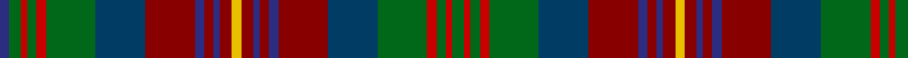

In pattern [BGRGRGBRBRBRYRBRBRBGRGRG](/patterns/bgrgrgbrbrbryrbrbrbgrgrg/).

This was sourced from house-of-tartan.  It is a [24 stripes tartan](/stripes/stripes24/).

Original link http://www.house-of-tartan.scotland.net/house/TartanViewjs.asp?colr=Def&tnam=6954

## Thread count
DB/6 G8 R4 G6 R6 G32 DBa32 DR32 DB6 DR6 DB4 DR8 Y6 DR8 DB4 DR6 DB6 DR32 DBa32 G32 R6 G6 R4 G/8

## Palette
Each colour and its ΔE from the base-6 reference it is a variant of.

| Colour | Shade | Base | ΔE (OKLab) |
|---|---|---|---|
| DB | <code style="background-color:#2C2C80;">#2C2C80</code> `#2C2C80` | B <code style="background-color:#2C4084;">#2C4084</code> | 0.05 |
| DBa | <code style="background-color:#003C64;">#003C64</code> `#003C64` | B <code style="background-color:#2C4084;">#2C4084</code> | 0.07 |
| DR | <code style="background-color:#880000;">#880000</code> `#880000` | R <code style="background-color:#C80000;">#C80000</code> | 0.14 |
| G | <code style="background-color:#006818;">#006818</code> `#006818` | G <code style="background-color:#006400;">#006400</code> | 0.02 |
| R | <code style="background-color:#C80000;">#C80000</code> `#C80000` | R <code style="background-color:#C80000;">#C80000</code> | 0.00 |
| Y | <code style="background-color:#E8C000;">#E8C000</code> `#E8C000` | Y <code style="background-color:#E8C000;">#E8C000</code> | 0.00 |

## Nearest tartans

The nearest existing variants by ΔTartan distance.

1. [Wcwm 1528](/setts/s19/g6r4ra4r4b40ba6b6r16g4r4g4r4g16ra4g4ra4g4ra16y6-b78788c-ba00008c-g004c00-r8c0000-ra783c10-yc89800/) — ΔT 0.97
1. [Shearer](/setts/s29/r4g8ra4g22b18rb24b4rb24b18g4b4g4b4g12r4g12b4g4b4g4b18rb24y4rb24b18g22ra4g8r4-b14283c-g006818-rc80000-ra888888-rb880000-yd09800/) — ΔT 0.97
1. [Spice of Life](/setts/s20/b40k4r4k12r4k4b4r4b12r4b4g4ga12g4ga4y4g12y4g4y40-b21352a-g725b49-ga463f2c-k101010-r661e08-yab9b8e/) — ΔT 1.11
1. [Gordonstoun #3](/setts/s21/r16g16r4k28r4k4ga4r4k28r4g16r16ga4b16r4g28y4g28r4b16ga4-b440044-g003820-ga789484-k101010-r880000-yd8b000/) — ΔT 1.17
1. [Cuthill (Personal)](/setts/s13/b6g8r4g6r6g32ba32ra32b6ra6b4ra8y6-b2c2c80-ba003c64-g006818-rc80000-ra880000-ye8c000/) — ΔT 1.29
1. [Recovery](/setts/s21/b24k4b4g4b4g4b4g20ka4g4ka4g4ka4g4ka4g24r20b8r8ga4r20-b2c2c80-g006818-ga289c18-k000000-ka101010-rc80000/) — ΔT 1.32
1. [Cuillins of Skye (Fashion)](/setts/s18/r43g5ga27g5y40r5y40g5ga27g5gb40ga27gb40g5ga27g5r43b8-b441800-g604000-ga006818-gb003820-r901c38-ya08858/) — ΔT 1.32
1. [Glenlea](/setts/s19/b8ba3w3ba3r28w4r8ba12b3ba3b3ba3b8g3b3g3b3g12ga4-b14283c-ba646464-g485444-ga009468-r8c8c8c-wc8c8c8/) — ΔT 1.35
1. [Recovery (Corporate)](/setts/s21/b24y4b4g4b4g4b4g20k4g4k4g4k4g4k4g24r20b8r8ga4r20-b2c2c80-g006818-ga289c18-k101010-rc80000-yfccc00/) — ΔT 1.35
1. [Shearer (Name)](/setts/s28/g8r4g22k18b24ra4b24k18g4k4g4k4g12rb4g12k4g4k4g4k18b24k4b24k18g22r4g8rb4-b441800-g5c6428-k00002c-r888888-raa07828-rb880000/) — ΔT 1.38

## Neighbour map

Every grey dot is one of 15726 variants placed by the first two principal components of the ΔTartan feature space (44% of its variance). Red is this tartan; blue dots are its nearest — click one to open its page.

<svg viewBox="0 0 640 380" role="img" style="max-width:100%;height:auto;border:1px solid #e0e0e0;border-radius:4px;display:block" xmlns="http://www.w3.org/2000/svg"><image href="/nn/cloud.v1.png" width="640" height="380"/><a href="/setts/s19/g6r4ra4r4b40ba6b6r16g4r4g4r4g16ra4g4ra4g4ra16y6-b78788c-ba00008c-g004c00-r8c0000-ra783c10-yc89800/"><circle cx="145.5" cy="126.9" r="4" fill="#3465a4"><title>Wcwm 1528</title></circle></a><a href="/setts/s29/r4g8ra4g22b18rb24b4rb24b18g4b4g4b4g12r4g12b4g4b4g4b18rb24y4rb24b18g22ra4g8r4-b14283c-g006818-rc80000-ra888888-rb880000-yd09800/"><circle cx="120.9" cy="153.7" r="4" fill="#3465a4"><title>Shearer</title></circle></a><a href="/setts/s20/b40k4r4k12r4k4b4r4b12r4b4g4ga12g4ga4y4g12y4g4y40-b21352a-g725b49-ga463f2c-k101010-r661e08-yab9b8e/"><circle cx="130.6" cy="108.4" r="4" fill="#3465a4"><title>Spice of Life</title></circle></a><a href="/setts/s21/r16g16r4k28r4k4ga4r4k28r4g16r16ga4b16r4g28y4g28r4b16ga4-b440044-g003820-ga789484-k101010-r880000-yd8b000/"><circle cx="139.4" cy="165.0" r="4" fill="#3465a4"><title>Gordonstoun #3</title></circle></a><a href="/setts/s13/b6g8r4g6r6g32ba32ra32b6ra6b4ra8y6-b2c2c80-ba003c64-g006818-rc80000-ra880000-ye8c000/"><circle cx="120.6" cy="154.2" r="4" fill="#3465a4"><title>Cuthill (Personal)</title></circle></a><a href="/setts/s21/b24k4b4g4b4g4b4g20ka4g4ka4g4ka4g4ka4g24r20b8r8ga4r20-b2c2c80-g006818-ga289c18-k000000-ka101010-rc80000/"><circle cx="105.7" cy="139.5" r="4" fill="#3465a4"><title>Recovery</title></circle></a><a href="/setts/s18/r43g5ga27g5y40r5y40g5ga27g5gb40ga27gb40g5ga27g5r43b8-b441800-g604000-ga006818-gb003820-r901c38-ya08858/"><circle cx="103.0" cy="164.0" r="4" fill="#3465a4"><title>Cuillins of Skye (Fashion)</title></circle></a><a href="/setts/s19/b8ba3w3ba3r28w4r8ba12b3ba3b3ba3b8g3b3g3b3g12ga4-b14283c-ba646464-g485444-ga009468-r8c8c8c-wc8c8c8/"><circle cx="122.0" cy="132.0" r="4" fill="#3465a4"><title>Glenlea</title></circle></a><a href="/setts/s21/b24y4b4g4b4g4b4g20k4g4k4g4k4g4k4g24r20b8r8ga4r20-b2c2c80-g006818-ga289c18-k101010-rc80000-yfccc00/"><circle cx="103.9" cy="137.8" r="4" fill="#3465a4"><title>Recovery (Corporate)</title></circle></a><a href="/setts/s28/g8r4g22k18b24ra4b24k18g4k4g4k4g12rb4g12k4g4k4g4k18b24k4b24k18g22r4g8rb4-b441800-g5c6428-k00002c-r888888-raa07828-rb880000/"><circle cx="108.9" cy="154.5" r="4" fill="#3465a4"><title>Shearer (Name)</title></circle></a><circle cx="123.9" cy="133.7" r="5" fill="#c00000"/></svg>

ID: /setts/s24/g8r4g6r6g32b32ra32ba6ra6ba4ra8y6ra8ba4ra6ba6ra32b32g32r6g6r4g8ba6-b003c64-ba2c2c80-g006818-rc80000-ra880000-ye8c000/
