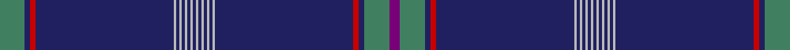

In pattern [BGBRBYBYBYBYBYBYBYBYBRBG](/stripes/bgbrbybybybybybybybybrbg/).

This was sourced from house-of-tartan.  It is a [24 stripe tartan](/stripes/stripes24/).

Original link http://www.house-of-tartan.scotland.net/house/TartanViewjs.asp?colr=Def&tnam=6490

## Thread count
G/18 DB4 R4 DB100 N2 DB2 N2 DB2 N2 DB2 N2 DB2 N2 DB2 N2 DB2 N2 DB2 N2 DB100 R4 DB4 G18 P/8

## Palette
Each colour and the base-6 reference it is a variant of.

| Colour | Shade | Base |
|---|---|---|
| DB | <code style="background-color:#202060;">#202060</code> `oklch(28.9% 0.111 276.9)` <small>#202060</small> | B <code style="background-color:#2A418A;">#2A418A</code> |
| DR | <code style="background-color:#880000;">#880000</code> `oklch(39.4% 0.162 29.2)` <small>#880000</small> | R <code style="background-color:#CC0000;">#CC0000</code> |
| G | <code style="background-color:#408060;">#408060</code> `oklch(54.8% 0.084 160.1)` <small>#408060</small> | G <code style="background-color:#006100;">#006100</code> |
| LN | <code style="background-color:#E0E0E0;">#E0E0E0</code> `oklch(90.7% 0.000 89.9)` <small>#E0E0E0</small> | W <code style="background-color:#F7F7F7;">#F7F7F7</code> |
| N | <code style="background-color:#B8B8B8;">#B8B8B8</code> `oklch(78.3% 0.000 89.9)` <small>#B8B8B8</small> | Y <code style="background-color:#F2BF00;">#F2BF00</code> |
| P | <code style="background-color:#780078;">#780078</code> `oklch(40.2% 0.185 328.4)` <small>#780078</small> | B <code style="background-color:#2A418A;">#2A418A</code> |
| R | <code style="background-color:#C80000;">#C80000</code> `oklch(52.3% 0.215 29.2)` <small>#C80000</small> | R <code style="background-color:#CC0000;">#CC0000</code> |

## Nearest tartans

The nearest existing variants by ΔTartan distance.

1. [G8 Summit](/setts/s13/dp4g9db2r2db50lr1db1lr1db1lr1db1lr1db1~x2/) — ΔT 1.29
1. [New York Tartan Day Parade (Corp.)](/setts/s34/db2w1db28lo1db4r4db1g2db1r8db1n2db1n2db1n2db1n2db1n2db1n2db1r8db1g2db1r4db4lo1db56w1db2w2~x2/) — ΔT 1.71
1. [Suffolk County Police](/setts/s20/db74db6k12ly3k3w3db16db8k3db4w3~x2/) — ΔT 1.79
1. [Wcwm 9275-1446](/setts/s12/db56r1g4r1g3r1db10g1r10db2r3lb2~x4/) — ΔT 1.89
1. [United States (Personal)](/setts/s16/b7db5w6db5r7db2b2db70w2/) — ΔT 1.93
1. [Gorman Spring (Personal)](/setts/s19/db72t4db10g4w4m6w4g4db10g4w4m6w4g4db10t4db23ly2db18/) — ΔT 1.95
1. [Oxford University Dress](/setts/s18/db44g5w2g2db2g2r2db3ly3db3r2g2db2g2w2g5db44ly4~x2/) — ΔT 1.95
1. [Wcwm 9275-1563](/setts/s21/db124k4r5k4r20k4r5k4dg12k4db22k4dg12k4r5k4r20k4r5k4db124~x2/) — ΔT 1.99
1. [Jewish (Kosher) (Corporate)](/setts/s11/w3db3w1dt44o1dt2o1r4o1dt5lo2~x2/) — ΔT 2.06
1. [World Youth Congress](/setts/s18/db8ly1db16w1g12db27w1db1w1db1w1db27g12w1db16ly1db8r2~x2/) — ΔT 2.19

## Neighbour map

Every grey dot is one of 14299 variants placed by the first two principal components of the ΔTartan feature space (44% of its variance). Red is this tartan; blue dots are its nearest — click one to open its page.

<svg viewBox="0 0 640 380" role="img" style="max-width:100%;height:auto;border:1px solid #e0e0e0;border-radius:4px;display:block" xmlns="http://www.w3.org/2000/svg"><image href="/nn/cloud.v1.png" width="640" height="380"/><a href="/setts/s13/dp4g9db2r2db50lr1db1lr1db1lr1db1lr1db1~x2/"><circle cx="542.1" cy="67.0" r="4" fill="#3465a4"><title>G8 Summit</title></circle></a><a href="/setts/s34/db2w1db28lo1db4r4db1g2db1r8db1n2db1n2db1n2db1n2db1n2db1n2db1r8db1g2db1r4db4lo1db56w1db2w2~x2/"><circle cx="456.7" cy="14.0" r="4" fill="#3465a4"><title>New York Tartan Day Parade (Corp.)</title></circle></a><a href="/setts/s20/db74db6k12ly3k3w3db16db8k3db4w3~x2/"><circle cx="482.6" cy="103.8" r="4" fill="#3465a4"><title>Suffolk County Police</title></circle></a><a href="/setts/s12/db56r1g4r1g3r1db10g1r10db2r3lb2~x4/"><circle cx="538.8" cy="96.5" r="4" fill="#3465a4"><title>Wcwm 9275-1446</title></circle></a><a href="/setts/s16/b7db5w6db5r7db2b2db70w2/"><circle cx="545.5" cy="88.7" r="4" fill="#3465a4"><title>United States (Personal)</title></circle></a><a href="/setts/s19/db72t4db10g4w4m6w4g4db10g4w4m6w4g4db10t4db23ly2db18/"><circle cx="433.5" cy="58.3" r="4" fill="#3465a4"><title>Gorman Spring (Personal)</title></circle></a><a href="/setts/s18/db44g5w2g2db2g2r2db3ly3db3r2g2db2g2w2g5db44ly4~x2/"><circle cx="456.6" cy="81.4" r="4" fill="#3465a4"><title>Oxford University Dress</title></circle></a><a href="/setts/s21/db124k4r5k4r20k4r5k4dg12k4db22k4dg12k4r5k4r20k4r5k4db124~x2/"><circle cx="463.8" cy="91.4" r="4" fill="#3465a4"><title>Wcwm 9275-1563</title></circle></a><a href="/setts/s11/w3db3w1dt44o1dt2o1r4o1dt5lo2~x2/"><circle cx="505.9" cy="64.8" r="4" fill="#3465a4"><title>Jewish (Kosher) (Corporate)</title></circle></a><a href="/setts/s18/db8ly1db16w1g12db27w1db1w1db1w1db27g12w1db16ly1db8r2~x2/"><circle cx="470.6" cy="117.4" r="4" fill="#3465a4"><title>World Youth Congress</title></circle></a><circle cx="543.3" cy="42.4" r="5" fill="#c00000"/></svg>

ID: /setts/s24/g9db2r2db50lr1db1lr1db1lr1db1lr1db1lr1db1lr1db1lr1db1lr1db50r2db2g9dp4~x2/
