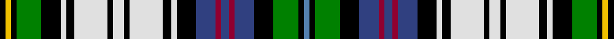

In pattern [BKGKBRBRBKWKWKWKWKWKGKYK](/stripes/bkgkbrbrbkwkwkwkwkwkgkyk/).

This was sourced from weddslist.  It is a [24 stripe tartan](/stripes/stripes24/).

Original link http://www.weddslist.com/cgi-bin/tartans/pg.pl?source=sts

## Thread count
K/4 Y4 K4 G18 K14 LN4 K6 LN24 K4 LN8 K4 LN24 K6 LN4 K14 B14 DR4 B6 DR4 B14 K14 G18 K4 Ba/4

## Palette
Each colour and the base-6 reference it is a variant of.

| Colour | Shade | Base |
|---|---|---|
| B | <code style="background-color:#304080;">#304080</code> `oklch(39.4% 0.109 270.2)` <small>#304080</small> | B <code style="background-color:#2A418A;">#2A418A</code> |
| Ba | <code style="background-color:#5480B0;">#5480B0</code> `oklch(58.8% 0.089 251.5)` <small>#5480B0</small> | B <code style="background-color:#2A418A;">#2A418A</code> |
| DR | <code style="background-color:#900030;">#900030</code> `oklch(41.6% 0.166 13.6)` <small>#900030</small> | R <code style="background-color:#CC0000;">#CC0000</code> |
| G | <code style="background-color:#008000;">#008000</code> `oklch(52.0% 0.177 142.5)` <small>#008000</small> | G <code style="background-color:#006100;">#006100</code> |
| K | <code style="background-color:#000000;">#000000</code> `oklch(0.0% 0.000 0.0)` <small>#000000</small> | K <code style="background-color:#000000;">#000000</code> |
| LN | <code style="background-color:#E0E0E0;">#E0E0E0</code> `oklch(90.7% 0.000 89.9)` <small>#E0E0E0</small> | W <code style="background-color:#F7F7F7;">#F7F7F7</code> |
| Y | <code style="background-color:#F0C000;">#F0C000</code> `oklch(82.7% 0.169 90.5)` <small>#F0C000</small> | Y <code style="background-color:#F2BF00;">#F2BF00</code> |

## Nearest tartans

The nearest existing variants by ΔTartan distance.

1. [Malcolm Dress](/setts/s24/k7g9k2ly2k2y2k2g9k7db7r2db3r2db7k7w2k2w11k2w3k2w11k2w2~x4/) — ΔT 0.49
1. [Unidentified 29](/setts/s20/t3k3o1k1o1k1o1k1o3t2k1ly1k1o1k2db2w7k1w2o1~x2/) — ΔT 1.15
1. [Unidentified #18](/setts/s20/t3k3dy1k1dy1k1dy1k1dy3t2k1ly1k1dy1k2db2w7k1w2dy1~x2/) — ΔT 1.20
1. [Innes Dress](/setts/s16/t4k12r2k2r2k2w12ly2w3db6w3k2dg12k2w3r2~x2/) — ΔT 1.31
1. [Kennedy](/setts/s17/k8w9ly6w10p5g6p5w36db8k8db8k8db8k8db8g38r8/) — ΔT 1.31
1. [Innes Dress Clan Tartan Tartan Number: 360. Earliest known date: pre 2003 Inglis, or Ingles, tartan is a variation of the MacIntyre tartan recognised by Lord Lyon. The green stripe of the MacIntyre is replaced by yellow in the Inglis tartan. The pattern comes from the collection of the late James MacKinlay which he called MacIntyre or Inglis. MacKinlay collected samples of tartan between 1930 and 1950 but did not provide details of the origins of the specimens. The original MacIntyre tartan can be seen on a doublet at the Kingussie museum dated 1800. It was registered in the Public Register of All Arms and Bearings in 1955. See products available Copyright © Blair Urquhart, Comrie, 2015](/setts/s16/t4k12r2k2r2k2w12ly2w3db6w3k2g12k2w3r2~x2/) — ΔT 1.34
1. [Campbell, dress](/setts/s24/k12g12ly3g12k9w5b6w19b2w6b2w19b6w5k9g12w3g12k12db10k2db2k2db10~x2/) — ΔT 1.35
1. [Innes Dress (Dance)](/setts/s15/lg4k12r2k2r2k2w12ly2w3b6k3g12k2w3r2~x3/) — ΔT 1.38
1. [Innes, hunting](/setts/s16/t3k18o3k4o3k3o18ly3o3db8o3db3g15k3o3w3~x2/) — ΔT 1.40
1. [Campbell Dress #2](/setts/s24/k12dg12ly3dg12k9w5b6w19b2w6b2w19b6w5k9dg12w3dg12k12db10k2db2k2db10~x2/) — ΔT 1.44

## Neighbour map

Every grey dot is one of 14299 variants placed by the first two principal components of the ΔTartan feature space (44% of its variance). Red is this tartan; blue dots are its nearest — click one to open its page.

<svg viewBox="0 0 640 380" role="img" style="max-width:100%;height:auto;border:1px solid #e0e0e0;border-radius:4px;display:block" xmlns="http://www.w3.org/2000/svg"><image href="/nn/cloud.v1.png" width="640" height="380"/><a href="/setts/s24/k7g9k2ly2k2y2k2g9k7db7r2db3r2db7k7w2k2w11k2w3k2w11k2w2~x4/"><circle cx="14.0" cy="112.6" r="4" fill="#3465a4"><title>Malcolm Dress</title></circle></a><a href="/setts/s20/t3k3o1k1o1k1o1k1o3t2k1ly1k1o1k2db2w7k1w2o1~x2/"><circle cx="29.2" cy="120.0" r="4" fill="#3465a4"><title>Unidentified 29</title></circle></a><a href="/setts/s20/t3k3dy1k1dy1k1dy1k1dy3t2k1ly1k1dy1k2db2w7k1w2dy1~x2/"><circle cx="37.4" cy="124.8" r="4" fill="#3465a4"><title>Unidentified #18</title></circle></a><a href="/setts/s16/t4k12r2k2r2k2w12ly2w3db6w3k2dg12k2w3r2~x2/"><circle cx="14.0" cy="112.9" r="4" fill="#3465a4"><title>Innes Dress</title></circle></a><a href="/setts/s17/k8w9ly6w10p5g6p5w36db8k8db8k8db8k8db8g38r8/"><circle cx="14.0" cy="99.2" r="4" fill="#3465a4"><title>Kennedy</title></circle></a><a href="/setts/s16/t4k12r2k2r2k2w12ly2w3db6w3k2g12k2w3r2~x2/"><circle cx="14.0" cy="112.7" r="4" fill="#3465a4"><title>Innes Dress Clan Tartan Tartan Number: 360. Earliest known date: pre 2003 Inglis, or Ingles, tartan is a variation of the MacIntyre tartan recognised by Lord Lyon. The green stripe of the MacIntyre is replaced by yellow in the Inglis tartan. The pattern comes from the collection of the late James MacKinlay which he called MacIntyre or Inglis. MacKinlay collected samples of tartan between 1930 and 1950 but did not provide details of the origins of the specimens. The original MacIntyre tartan can be seen on a doublet at the Kingussie museum dated 1800. It was registered in the Public Register of All Arms and Bearings in 1955. See products available Copyright © Blair Urquhart, Comrie, 2015</title></circle></a><a href="/setts/s24/k12g12ly3g12k9w5b6w19b2w6b2w19b6w5k9g12w3g12k12db10k2db2k2db10~x2/"><circle cx="14.0" cy="117.5" r="4" fill="#3465a4"><title>Campbell, dress</title></circle></a><a href="/setts/s15/lg4k12r2k2r2k2w12ly2w3b6k3g12k2w3r2~x3/"><circle cx="14.0" cy="118.1" r="4" fill="#3465a4"><title>Innes Dress (Dance)</title></circle></a><a href="/setts/s16/t3k18o3k4o3k3o18ly3o3db8o3db3g15k3o3w3~x2/"><circle cx="56.7" cy="123.2" r="4" fill="#3465a4"><title>Innes, hunting</title></circle></a><a href="/setts/s24/k12dg12ly3dg12k9w5b6w19b2w6b2w19b6w5k9dg12w3dg12k12db10k2db2k2db10~x2/"><circle cx="21.6" cy="121.4" r="4" fill="#3465a4"><title>Campbell Dress #2</title></circle></a><circle cx="14.0" cy="112.6" r="5" fill="#c00000"/></svg>

ID: /setts/s24/k2ly2k2g9k7w2k3w12k2w4k2w12k3w2k7db7r2db3r2db7k7g9k2t2~x2/
