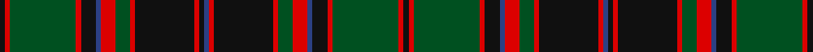

In pattern [KRGRKBRGRKRBKRKRGRBKRGRK](/stripes/krgrkbrgrkrbkrkrgrbkrgrk/).

This was sourced from register-of-tartans.  It is a [24 stripe tartan](/stripes/stripes24/).

Original link https://www.tartanregister.gov.uk/tartanDetails.aspx?ref=839

## Register references

External register numbers recorded for this tartan.

- Scottish Register of Tartans: [839](https://www.tartanregister.gov.uk/tartanDetails.aspx?ref=839)
- Scottish Tartans World Register: 1149

## Thread count
K/4 R4 G54 R4 K12 B4 R12 G12 R4 K48 R4 K4 B4 R4 K48 R4 G12 R12 B4 K12 R4 G54 R4 K/4

## Palette
Each colour and the base-6 reference it is a variant of.

| Colour | Shade | Base |
|---|---|---|
| B | <code style="background-color:#2C4084;">#2C4084</code> `oklch(39.4% 0.117 268.3)` <small>#2C4084</small> | B <code style="background-color:#2A418A;">#2A418A</code> |
| G | <code style="background-color:#005020;">#005020</code> `oklch(37.7% 0.105 149.6)` <small>#005020</small> | G <code style="background-color:#006100;">#006100</code> |
| K | <code style="background-color:#101010;">#101010</code> `oklch(17.3% 0.000 89.9)` <small>#101010</small> | K <code style="background-color:#000000;">#000000</code> |
| R | <code style="background-color:#DC0000;">#DC0000</code> `oklch(56.2% 0.230 29.2)` <small>#DC0000</small> | R <code style="background-color:#CC0000;">#CC0000</code> |

## Nearest tartans

The nearest existing variants by ΔTartan distance, with this tartan at the top so the swatches line up against it.

ΔTartan

Tartan

Sett

—

<a href="/ttd/edit/#slug=k2r2dg27r2k6db2r6dg6r2k24r2k2db2r2k24r2dg6r6db2k6r2dg27r2k2~x2">Cumming/Buchan Hunting</a> <a class="nn-out" href="/setts/s24/k2r2dg27r2k6db2r6dg6r2k24r2k2db2r2k24r2dg6r6db2k6r2dg27r2k2~x2/" title="open its dictionary page">↗</a>

0.44

<a href="/ttd/edit/#slug=r6g6r2k24r2db2k2r2k24r2g6r6db2k6r2g27r2k2r2g27r2k6db2~x2">Buchan</a> <a class="nn-out" href="/setts/s23/r6g6r2k24r2db2k2r2k24r2g6r6db2k6r2g27r2k2r2g27r2k6db2~x2/" title="open its dictionary page">↗</a>

0.97

<a href="/setts/s20/db30k2db2k2db2k32g15r2g4r4g30~x2/">Scottish Tourist Board (1981)</a>

1.21

<a href="/setts/s18/r47g14k5ly2k3g7k3ly2k5g14~x2/">Harbor Club</a>

1.28

<a href="/setts/s16/db12r1db1r1db1r4g12ly1g2~x4/">Durie Clan Tartan Tartan Number: 2228. Earliest known date: 1988 When the matriculation of the Durie 'Arms' was updated in June 1988, this tartan was designed for family use by Harry G Lindlay of Kinloch &amp; Anderson of Edinburgh. The design is said to be based on the Argyle &amp; Southern Highlanders regimental tartan - the yellow is from the mess dress (military uniform evening wear) facings (lapels) and the burgundy represents the Durie family's French connections. Andrew, son of Lt. Col. Raymond Varley Dewar Durie succeded his father as clan chieftain in 1999. See products available Copyright © Blair Urquhart, Comrie, 2015</a>

1.32

<a href="/ttd/edit/#slug=g20r2g4r6g32k32r2db32r6db3r2db20r2db3r6db32r2k32g32r6g4r2g10~x2">MacDonald</a> <a class="nn-out" href="/setts/s23/g20r2g4r6g32k32r2db32r6db3r2db20r2db3r6db32r2k32g32r6g4r2g10~x2/" title="open its dictionary page">↗</a>

1.33

<a href="/setts/s22/r3db16k16g4k2g2k2g34r4g3r2g3~x2/">Park Clan/Family Weavers Tartan Tartan Number: 2387. Earliest known date: September 1996 William D. Park wished to have a tartan for himself and family. Can be worn by those of the same name. See products available Copyright © Blair Urquhart, Comrie, 2015</a>

1.33

<a href="/setts/s26/db2t1r2g16r2db6t1r2g6r2db16t1r2g2~x2/">Norwich No.023</a>

1.37

<a href="/ttd/edit/#slug=g13k2g2k2g2k12dp16k1g2k1dp16k12g12k1ly2dp1~x2">Kettles, Ryan &amp; Alan (Personal)</a> <a class="nn-out" href="/setts/s16/g13k2g2k2g2k12dp16k1g2k1dp16k12g12k1ly2dp1~x2/" title="open its dictionary page">↗</a>

1.43

<a href="/setts/s32/g34k2b2k2g34r3k34r2k34r3b33k2g2k2g2k2b33~x2/">Stewart of Bute</a>

1.46

<a href="/ttd/edit/#slug=r3g20k2dt3k12dt3k2r20g3r20k2dt3k12dt3k2g20r3dt2~x2">Matthew Gloag Corporate Tartan Tartan Number: 2397. Earliest known date: 1996 Designed by Gillian Kirkwood of House of Edgar in 1996 for Matthew Gloag &amp; Son Ltd who were established in 1800 as a whisky blenders and makers of the Famous Grouse Whisky. The company is based in Perth, Scotland and now (2002) has a major new visitor attraction at Crieff, 17 miles west of Perth. See products available Copyright © Blair Urquhart, Comrie, 2015</a> <a class="nn-out" href="/setts/s18/r3g20k2dt3k12dt3k2r20g3r20k2dt3k12dt3k2g20r3dt2~x2/" title="open its dictionary page">↗</a>

## Neighbour map

Every grey dot is one of 14299 variants placed by the first two principal components of the ΔTartan feature space (44% of its variance). Red is this tartan; blue dots are its nearest — click one to open its page.

<svg viewBox="0 0 640 380" role="img" style="max-width:100%;height:auto;border:1px solid #e0e0e0;border-radius:4px;display:block" xmlns="http://www.w3.org/2000/svg"><image href="/nn/cloud.v1.png" width="640" height="380"/><a href="/setts/s23/r6g6r2k24r2db2k2r2k24r2g6r6db2k6r2g27r2k2r2g27r2k6db2~x2/"><circle cx="254.5" cy="135.1" r="4" fill="#3465a4"><title>Buchan</title></circle></a><a href="/setts/s20/db30k2db2k2db2k32g15r2g4r4g30~x2/"><circle cx="243.7" cy="137.8" r="4" fill="#3465a4"><title>Scottish Tourist Board (1981)</title></circle></a><a href="/setts/s18/r47g14k5ly2k3g7k3ly2k5g14~x2/"><circle cx="263.2" cy="110.0" r="4" fill="#3465a4"><title>Harbor Club</title></circle></a><a href="/setts/s16/db12r1db1r1db1r4g12ly1g2~x4/"><circle cx="275.7" cy="152.7" r="4" fill="#3465a4"><title>Durie Clan Tartan Tartan Number: 2228. Earliest known date: 1988 When the matriculation of the Durie 'Arms' was updated in June 1988, this tartan was designed for family use by Harry G Lindlay of Kinloch &amp; Anderson of Edinburgh. The design is said to be based on the Argyle &amp; Southern Highlanders regimental tartan - the yellow is from the mess dress (military uniform evening wear) facings (lapels) and the burgundy represents the Durie family's French connections. Andrew, son of Lt. Col. Raymond Varley Dewar Durie succeded his father as clan chieftain in 1999. See products available Copyright © Blair Urquhart, Comrie, 2015</title></circle></a><a href="/setts/s23/g20r2g4r6g32k32r2db32r6db3r2db20r2db3r6db32r2k32g32r6g4r2g10~x2/"><circle cx="200.3" cy="139.3" r="4" fill="#3465a4"><title>MacDonald</title></circle></a><a href="/setts/s22/r3db16k16g4k2g2k2g34r4g3r2g3~x2/"><circle cx="293.8" cy="130.2" r="4" fill="#3465a4"><title>Park Clan/Family Weavers Tartan Tartan Number: 2387. Earliest known date: September 1996 William D. Park wished to have a tartan for himself and family. Can be worn by those of the same name. See products available Copyright © Blair Urquhart, Comrie, 2015</title></circle></a><a href="/setts/s26/db2t1r2g16r2db6t1r2g6r2db16t1r2g2~x2/"><circle cx="244.4" cy="124.1" r="4" fill="#3465a4"><title>Norwich No.023</title></circle></a><a href="/setts/s16/g13k2g2k2g2k12dp16k1g2k1dp16k12g12k1ly2dp1~x2/"><circle cx="227.1" cy="160.9" r="4" fill="#3465a4"><title>Kettles, Ryan &amp; Alan (Personal)</title></circle></a><a href="/setts/s32/g34k2b2k2g34r3k34r2k34r3b33k2g2k2g2k2b33~x2/"><circle cx="229.5" cy="107.9" r="4" fill="#3465a4"><title>Stewart of Bute</title></circle></a><a href="/setts/s18/r3g20k2dt3k12dt3k2r20g3r20k2dt3k12dt3k2g20r3dt2~x2/"><circle cx="208.5" cy="172.7" r="4" fill="#3465a4"><title>Matthew Gloag Corporate Tartan Tartan Number: 2397. Earliest known date: 1996 Designed by Gillian Kirkwood of House of Edgar in 1996 for Matthew Gloag &amp; Son Ltd who were established in 1800 as a whisky blenders and makers of the Famous Grouse Whisky. The company is based in Perth, Scotland and now (2002) has a major new visitor attraction at Crieff, 17 miles west of Perth. See products available Copyright © Blair Urquhart, Comrie, 2015</title></circle></a><circle cx="251.9" cy="129.2" r="5" fill="#c00000"/></svg>

ID: /setts/s24/k2r2dg27r2k6db2r6dg6r2k24r2k2db2r2k24r2dg6r6db2k6r2dg27r2k2~x2/
