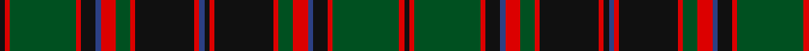

In pattern [KRGRKBRGRKRBKRKRGRBKRGRK](/patterns/krgrkbrgrkrbkrkrgrbkrgrk/).

This was sourced from register-of-tartans.  It is a [24 stripes tartan](/stripes/stripes24/).

Original link https://www.tartanregister.gov.uk/tartanDetails.aspx?ref=839

## Thread count
K/4 R4 G54 R4 K12 B4 R12 G12 R4 K48 R4 B4 K4 R4 K48 R4 G12 R12 B4 K12 R4 G54 R4 K/4

## Palette
Each colour and its ΔE from the base-6 reference it is a variant of.

| Colour | Shade | Base | ΔE (OKLab) |
|---|---|---|---|
| B | <code style="background-color:#2C4084;">#2C4084</code> `#2C4084` | B <code style="background-color:#2A418A;">#2A418A</code> | 0.01 |
| G | <code style="background-color:#005020;">#005020</code> `#005020` | G <code style="background-color:#006100;">#006100</code> | 0.07 |
| K | <code style="background-color:#101010;">#101010</code> `#101010` | K <code style="background-color:#000000;">#000000</code> | 0.17 |
| R | <code style="background-color:#DC0000;">#DC0000</code> `#DC0000` | R <code style="background-color:#CC0000;">#CC0000</code> | 0.03 |

## Nearest tartans

The nearest existing variants by ΔTartan distance.

1. [Buchan](/setts/s23/r12g12r4k48r4b4k4r4k48r4g12r12b4k12r4g54r4k4r4g54r4k12b4-b2c2c80-g006818-k101010-ra00000/) — ΔT 0.44
1. [Buchan Cumming MacIntyre District Tartan Tartan Number: 1991. Earliest known date: 1790 Also MacIntyre and Glenorchy. Adopted by the Buchan family around 1965, on account of their long association with the Cummings which began with the marriage of Margaret, daughter of King Edgar, to William Coymen, sheriff of Forfar in 1210. The name, Buchan, though a family name, is territorial in origin. The sett is asymmetrical. There is a sample in the collection of the Highland Society of London, housed in the National Museums of Scotland, Edinburgh. See products available Copyright © Blair Urquhart, Comrie, 2015](/setts/s23/r12g12r4k48r4b4k4r4k48r4g12r12b4k12r4g54r4k4r4g54r4k12b4-b2c2c80-g006818-k101010-rc80000/) — ΔT 0.49
1. [Scottish Tourist Board (1981)](/setts/s20/b60k4b4k4b4k64g30r4g8r8g60r8g8r4g30k64b4k4b4k4-b2c2c80-g006818-k101010-rc80000/) — ΔT 0.97
1. [Harbor Club](/setts/s18/g28k10y4k6g14k6y4k10g28r94g28k10y4k6g14k6y4k10-g006428-k101010-r800028-ye8c000/) — ΔT 1.21
1. [Durie Clan Tartan Tartan Number: 2228. Earliest known date: 1988 When the matriculation of the Durie 'Arms' was updated in June 1988, this tartan was designed for family use by Harry G Lindlay of Kinloch & Anderson of Edinburgh. The design is said to be based on the Argyle & Southern Highlanders regimental tartan - the yellow is from the mess dress (military uniform evening wear) facings (lapels) and the burgundy represents the Durie family's French connections. Andrew, son of Lt. Col. Raymond Varley Dewar Durie succeded his father as clan chieftain in 1999. See products available Copyright © Blair Urquhart, Comrie, 2015](/setts/s16/g8y4g48r16b4r4b4r4b48r4b4r4b4r16g48y4-b202060-g006818-r880000-ye8c000/) — ΔT 1.28
1. [Park Clan/Family Weavers Tartan Tartan Number: 2387. Earliest known date: September 1996 William D. Park wished to have a tartan for himself and family. Can be worn by those of the same name. See products available Copyright © Blair Urquhart, Comrie, 2015](/setts/s22/g6r4g6r8g68k4g4k4g8k32b32r6b32k32g8k4g4k4g68r8g6r4-b2c2c80-g006818-k101010-rc80000/) — ΔT 1.33
1. [Norwich No.023](/setts/s26/g4r4b2ba32r4g12r4b2ba12r4g32r4b2ba4b2r4g32r4ba12b2r4g12r4ba32b2r4-b5c8ca8-ba2c2c80-g006818-rc80000/) — ΔT 1.33
1. [Kettles, Ryan & Alan (Personal)](/setts/s16/g26k4g4k4g4k24b32k2g4k2b32k24g24k2y4b2-b440044-g006818-k101010-yfccc00/) — ΔT 1.37
1. [Stewart of Bute](/setts/s32/b66k4g4k4g4k4b66r6k68r4k68r6g68k4b4k4g68k4b4k4g68r6k68r4k68r6b66k4g4k4g4k4-b1474b4-g006818-k101010-rc80000/) — ΔT 1.43
1. [Wilson Clan Tartan Tartan Number: 626. Earliest known date: 1780 Named after Janet Wilson, wife of the Bannockburn weaver, William Wilson who manufactured tartans from 1765. It is suggested in the extensive archives of the company that the tartan was prepared for the wedding in 1780 between the William Wilson, the son of the founder, and Janet Paterson. The sett was later introduced as the Wilson family tartan. Variations show blue instead of purple in the broad band and blue instead of azure (light blue) in the narrow stripes. See products available Copyright © Blair Urquhart, Comrie, 2015](/setts/s22/b45w4b6g6b6g6b6g37r6g6r6g6r6g6r6g39r27g6b6r12w4r30-b2c2c80-g006818-rc80000-we0e0e0/) — ΔT 1.44

## Neighbour map

Every grey dot is one of 15726 variants placed by the first two principal components of the ΔTartan feature space (44% of its variance). Red is this tartan; blue dots are its nearest — click one to open its page.

<svg viewBox="0 0 640 380" role="img" style="max-width:100%;height:auto;border:1px solid #e0e0e0;border-radius:4px;display:block" xmlns="http://www.w3.org/2000/svg"><image href="/nn/cloud.v1.png" width="640" height="380"/><a href="/setts/s23/r12g12r4k48r4b4k4r4k48r4g12r12b4k12r4g54r4k4r4g54r4k12b4-b2c2c80-g006818-k101010-ra00000/"><circle cx="249.3" cy="130.6" r="4" fill="#3465a4"><title>Buchan</title></circle></a><a href="/setts/s23/r12g12r4k48r4b4k4r4k48r4g12r12b4k12r4g54r4k4r4g54r4k12b4-b2c2c80-g006818-k101010-rc80000/"><circle cx="237.6" cy="123.8" r="4" fill="#3465a4"><title>Buchan Cumming MacIntyre District Tartan Tartan Number: 1991. Earliest known date: 1790 Also MacIntyre and Glenorchy. Adopted by the Buchan family around 1965, on account of their long association with the Cummings which began with the marriage of Margaret, daughter of King Edgar, to William Coymen, sheriff of Forfar in 1210. The name, Buchan, though a family name, is territorial in origin. The sett is asymmetrical. There is a sample in the collection of the Highland Society of London, housed in the National Museums of Scotland, Edinburgh. See products available Copyright © Blair Urquhart, Comrie, 2015</title></circle></a><a href="/setts/s20/b60k4b4k4b4k64g30r4g8r8g60r8g8r4g30k64b4k4b4k4-b2c2c80-g006818-k101010-rc80000/"><circle cx="237.7" cy="132.5" r="4" fill="#3465a4"><title>Scottish Tourist Board (1981)</title></circle></a><a href="/setts/s18/g28k10y4k6g14k6y4k10g28r94g28k10y4k6g14k6y4k10-g006428-k101010-r800028-ye8c000/"><circle cx="258.2" cy="106.6" r="4" fill="#3465a4"><title>Harbor Club</title></circle></a><a href="/setts/s16/g8y4g48r16b4r4b4r4b48r4b4r4b4r16g48y4-b202060-g006818-r880000-ye8c000/"><circle cx="271.3" cy="148.5" r="4" fill="#3465a4"><title>Durie Clan Tartan Tartan Number: 2228. Earliest known date: 1988 When the matriculation of the Durie 'Arms' was updated in June 1988, this tartan was designed for family use by Harry G Lindlay of Kinloch &amp; Anderson of Edinburgh. The design is said to be based on the Argyle &amp; Southern Highlanders regimental tartan - the yellow is from the mess dress (military uniform evening wear) facings (lapels) and the burgundy represents the Durie family's French connections. Andrew, son of Lt. Col. Raymond Varley Dewar Durie succeded his father as clan chieftain in 1999. See products available Copyright © Blair Urquhart, Comrie, 2015</title></circle></a><a href="/setts/s22/g6r4g6r8g68k4g4k4g8k32b32r6b32k32g8k4g4k4g68r8g6r4-b2c2c80-g006818-k101010-rc80000/"><circle cx="288.5" cy="125.3" r="4" fill="#3465a4"><title>Park Clan/Family Weavers Tartan Tartan Number: 2387. Earliest known date: September 1996 William D. Park wished to have a tartan for himself and family. Can be worn by those of the same name. See products available Copyright © Blair Urquhart, Comrie, 2015</title></circle></a><a href="/setts/s26/g4r4b2ba32r4g12r4b2ba12r4g32r4b2ba4b2r4g32r4ba12b2r4g12r4ba32b2r4-b5c8ca8-ba2c2c80-g006818-rc80000/"><circle cx="238.8" cy="119.5" r="4" fill="#3465a4"><title>Norwich No.023</title></circle></a><a href="/setts/s16/g26k4g4k4g4k24b32k2g4k2b32k24g24k2y4b2-b440044-g006818-k101010-yfccc00/"><circle cx="221.9" cy="156.1" r="4" fill="#3465a4"><title>Kettles, Ryan &amp; Alan (Personal)</title></circle></a><a href="/setts/s32/b66k4g4k4g4k4b66r6k68r4k68r6g68k4b4k4g68k4b4k4g68r6k68r4k68r6b66k4g4k4g4k4-b1474b4-g006818-k101010-rc80000/"><circle cx="222.8" cy="103.3" r="4" fill="#3465a4"><title>Stewart of Bute</title></circle></a><a href="/setts/s22/b45w4b6g6b6g6b6g37r6g6r6g6r6g6r6g39r27g6b6r12w4r30-b2c2c80-g006818-rc80000-we0e0e0/"><circle cx="210.5" cy="135.1" r="4" fill="#3465a4"><title>Wilson Clan Tartan Tartan Number: 626. Earliest known date: 1780 Named after Janet Wilson, wife of the Bannockburn weaver, William Wilson who manufactured tartans from 1765. It is suggested in the extensive archives of the company that the tartan was prepared for the wedding in 1780 between the William Wilson, the son of the founder, and Janet Paterson. The sett was later introduced as the Wilson family tartan. Variations show blue instead of purple in the broad band and blue instead of azure (light blue) in the narrow stripes. See products available Copyright © Blair Urquhart, Comrie, 2015</title></circle></a><circle cx="246.8" cy="125.0" r="5" fill="#c00000"/></svg>

ID: /setts/s24/k4r4g54r4k12b4r12g12r4k48r4b4k4r4k48r4g12r12b4k12r4g54r4k4-b2c4084-g005020-k101010-rdc0000/
