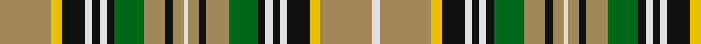

In pattern [WYYKWKWKGYKYWYKYGKWKWKYY](/stripes/wyykwkwkgykywykygkwkwkyy/).

This was sourced from register-of-tartans.  It is a [24 stripe tartan](/stripes/stripes24/).

Original link https://www.tartanregister.gov.uk/tartanDetails.aspx?ref=3221

## Register references

External register numbers recorded for this tartan.

- Scottish Register of Tartans: [3221](https://www.tartanregister.gov.uk/tartanDetails.aspx?ref=3221)
- Scottish Tartans Authority (ITI): 1875
- Scottish Tartans World Register: 1875

## Thread count
LTa/28 Y6 K12 LN4 K4 LN4 K4 G16 LTa12 K4 LTa6 LN2 LTa6 K4 LTa12 G16 K4 LN4 K4 LN4 K12 Y6 LTa28 LN/4

## Palette
Each colour and the base-6 reference it is a variant of.

| Colour | Shade | Base |
|---|---|---|
| DR | <code style="background-color:#441800;">#441800</code> `oklch(27.3% 0.076 46.3)` <small>#441800</small> | B <code style="background-color:#2A418A;">#2A418A</code> |
| DY | <code style="background-color:#D09800;">#D09800</code> `oklch(71.4% 0.147 82.1)` <small>#D09800</small> | Y <code style="background-color:#F2BF00;">#F2BF00</code> |
| G | <code style="background-color:#006818;">#006818</code> `oklch(45.0% 0.142 145.0)` <small>#006818</small> | G <code style="background-color:#006100;">#006100</code> |
| K | <code style="background-color:#101010;">#101010</code> `oklch(17.3% 0.000 89.9)` <small>#101010</small> | K <code style="background-color:#000000;">#000000</code> |
| LN | <code style="background-color:#E0E0E0;">#E0E0E0</code> `oklch(90.7% 0.000 89.9)` <small>#E0E0E0</small> | W <code style="background-color:#F7F7F7;">#F7F7F7</code> |
| LR | <code style="background-color:#E87878;">#E87878</code> `oklch(70.0% 0.139 21.2)` <small>#E87878</small> | R <code style="background-color:#CC0000;">#CC0000</code> |
| LT | <code style="background-color:#8C7038;">#8C7038</code> `oklch(56.0% 0.082 83.0)` <small>#8C7038</small> | G <code style="background-color:#006100;">#006100</code> |
| LTa | <code style="background-color:#A08858;">#A08858</code> `oklch(63.7% 0.071 84.0)` <small>#A08858</small> | Y <code style="background-color:#F2BF00;">#F2BF00</code> |
| N | <code style="background-color:#C0C0C0;">#C0C0C0</code> `oklch(80.8% 0.000 89.9)` <small>#C0C0C0</small> | W <code style="background-color:#F7F7F7;">#F7F7F7</code> |
| T | <code style="background-color:#604000;">#604000</code> `oklch(39.8% 0.083 76.8)` <small>#604000</small> | G <code style="background-color:#006100;">#006100</code> |
| Y | <code style="background-color:#E8C000;">#E8C000</code> `oklch(81.9% 0.168 93.7)` <small>#E8C000</small> | Y <code style="background-color:#F2BF00;">#F2BF00</code> |

## Nearest tartans

The nearest existing variants by ΔTartan distance, with this tartan at the top so the swatches line up against it.

ΔTartan

Tartan

Sett

—

<a href="/ttd/edit/#slug=lo14ly3k6w2k2w2k2g8lo6k2lo3w1lo3k2lo6g8k2w2k2w2k6ly3lo14w2~x2">O'Farrell</a> <a class="nn-out" href="/setts/s24/lo14ly3k6w2k2w2k2g8lo6k2lo3w1lo3k2lo6g8k2w2k2w2k6ly3lo14w2~x2/" title="open its dictionary page">↗</a>

0.71

<a href="/ttd/edit/#slug=g6r5g6r1g1r9dg3r3dg3g9g1r1g6r5g6r1g1w1g1w12r1w12g1w1~x4">Maple Leaf Dress (Dance)</a> <a class="nn-out" href="/setts/s24/g6r5g6r1g1r9dg3r3dg3g9g1r1g6r5g6r1g1w1g1w12r1w12g1w1~x4/" title="open its dictionary page">↗</a>

1.26

<a href="/ttd/edit/#slug=w2lo14ly3k6w2k2w2k2g8lo6k2lo3w1~x2">O'Farrell (Name)</a> <a class="nn-out" href="/setts/s13/w2lo14ly3k6w2k2w2k2g8lo6k2lo3w1~x2/" title="open its dictionary page">↗</a>

1.31

<a href="/ttd/edit/#slug=r6g5r6dg1r1dg9o3g3o3r9r1dg1r6g5r6dg1r1w1r1w12g1w12r1w1~x4">Maple Leaf Dress</a> <a class="nn-out" href="/setts/s24/r6g5r6dg1r1dg9o3g3o3r9r1dg1r6g5r6dg1r1w1r1w12g1w12r1w1~x4/" title="open its dictionary page">↗</a>

1.32

<a href="/ttd/edit/#slug=k4w6k23w2k3ly17k2ly4k2ly17k3g17k20w6ly4w6k20g17k3ly17k2ly4k2ly17k3w2k23w6k4">Vaughan (Welsh Name) Welsh Name Tartan Tartan Number: 6168. Earliest known date: pre 2004 The tartan for this Welsh surname and its variations, Baughan, Bawn, Fychan, Vain, Vaughan, Vaughn, Vauhan, Vayne, Vychan, Vachan, Vaghann, Young, Younger, is actually woven in Wales at the Cambrian Woollen Mill, weaving on the same site since 1830. This tartan differs from many traditional patterns in that the warp and weft differ, giving the finished worsted wool cloth more of a predominant stripe, vertically noticeable in the finished Kilt, or Cilt in Wales. See products available Copyright © Blair Urquhart, Comrie, 2015</a> <a class="nn-out" href="/setts/s29/k4w6k23w2k3ly17k2ly4k2ly17k3g17k20w6ly4w6k20g17k3ly17k2ly4k2ly17k3w2k23w6k4/" title="open its dictionary page">↗</a>

1.37

<a href="/ttd/edit/#slug=r15w2r15ly1dt8w2dt8ly1dt12r1ly3r1dt12w2g20w2ly1dt20ly1~x2">Hébert Kitenge Family (Personal)</a> <a class="nn-out" href="/setts/s19/r15w2r15ly1dt8w2dt8ly1dt12r1ly3r1dt12w2g20w2ly1dt20ly1~x2/" title="open its dictionary page">↗</a>

1.37

<a href="/ttd/edit/#slug=ly2r15ly2dr2ly2k14ly2g10w1g6w1g10ly2r7g10w1~x2">Dalrymple of Castleton #2</a> <a class="nn-out" href="/setts/s16/ly2r15ly2dr2ly2k14ly2g10w1g6w1g10ly2r7g10w1~x2/" title="open its dictionary page">↗</a>

1.43

<a href="/ttd/edit/#slug=dg7ly2r1n4lb15n1ly2n1ly2n2ly2n1ly2n1lb15n4r1ly2dg7ly1~x4">Hutt #1 (Personal)</a> <a class="nn-out" href="/setts/s20/dg7ly2r1n4lb15n1ly2n1ly2n2ly2n1ly2n1lb15n4r1ly2dg7ly1~x4/" title="open its dictionary page">↗</a>

1.44

<a href="/setts/s16/r12g3ly4k2ly4g12ly2r3w1~x4/">Unnamed C18th - Prince Charles Edward #4</a>

1.45

<a href="/ttd/edit/#slug=r5k3g22k3ly3dp7r7k2dp4w2dp4r7k2r7ly3k3g22k2~x2">Derbyshire</a> <a class="nn-out" href="/setts/s18/r5k3g22k3ly3dp7r7k2dp4w2dp4r7k2r7ly3k3g22k2~x2/" title="open its dictionary page">↗</a>

1.49

<a href="/ttd/edit/#slug=w23dt2w2dt2w2dt22g12dt2g12dt10w3dt1o2dt10y8g4y8dt10o2dt1g5y23dt22w2g2w2dt2y2w2~x2">House of Timber Wolf (Personal)</a> <a class="nn-out" href="/setts/s29/w23dt2w2dt2w2dt22g12dt2g12dt10w3dt1o2dt10y8g4y8dt10o2dt1g5y23dt22w2g2w2dt2y2w2~x2/" title="open its dictionary page">↗</a>

## Neighbour map

Every grey dot is one of 14299 variants placed by the first two principal components of the ΔTartan feature space (44% of its variance). Red is this tartan; blue dots are its nearest — click one to open its page.

<svg viewBox="0 0 640 380" role="img" style="max-width:100%;height:auto;border:1px solid #e0e0e0;border-radius:4px;display:block" xmlns="http://www.w3.org/2000/svg"><image href="/nn/cloud.v1.png" width="640" height="380"/><a href="/setts/s24/g6r5g6r1g1r9dg3r3dg3g9g1r1g6r5g6r1g1w1g1w12r1w12g1w1~x4/"><circle cx="123.2" cy="100.9" r="4" fill="#3465a4"><title>Maple Leaf Dress (Dance)</title></circle></a><a href="/setts/s13/w2lo14ly3k6w2k2w2k2g8lo6k2lo3w1~x2/"><circle cx="166.0" cy="129.9" r="4" fill="#3465a4"><title>O'Farrell (Name)</title></circle></a><a href="/setts/s24/r6g5r6dg1r1dg9o3g3o3r9r1dg1r6g5r6dg1r1w1r1w12g1w12r1w1~x4/"><circle cx="128.5" cy="95.2" r="4" fill="#3465a4"><title>Maple Leaf Dress</title></circle></a><a href="/setts/s29/k4w6k23w2k3ly17k2ly4k2ly17k3g17k20w6ly4w6k20g17k3ly17k2ly4k2ly17k3w2k23w6k4/"><circle cx="162.1" cy="116.5" r="4" fill="#3465a4"><title>Vaughan (Welsh Name) Welsh Name Tartan Tartan Number: 6168. Earliest known date: pre 2004 The tartan for this Welsh surname and its variations, Baughan, Bawn, Fychan, Vain, Vaughan, Vaughn, Vauhan, Vayne, Vychan, Vachan, Vaghann, Young, Younger, is actually woven in Wales at the Cambrian Woollen Mill, weaving on the same site since 1830. This tartan differs from many traditional patterns in that the warp and weft differ, giving the finished worsted wool cloth more of a predominant stripe, vertically noticeable in the finished Kilt, or Cilt in Wales. See products available Copyright © Blair Urquhart, Comrie, 2015</title></circle></a><a href="/setts/s19/r15w2r15ly1dt8w2dt8ly1dt12r1ly3r1dt12w2g20w2ly1dt20ly1~x2/"><circle cx="217.0" cy="96.7" r="4" fill="#3465a4"><title>Hébert Kitenge Family (Personal)</title></circle></a><a href="/setts/s16/ly2r15ly2dr2ly2k14ly2g10w1g6w1g10ly2r7g10w1~x2/"><circle cx="148.8" cy="106.9" r="4" fill="#3465a4"><title>Dalrymple of Castleton #2</title></circle></a><a href="/setts/s20/dg7ly2r1n4lb15n1ly2n1ly2n2ly2n1ly2n1lb15n4r1ly2dg7ly1~x4/"><circle cx="175.4" cy="88.1" r="4" fill="#3465a4"><title>Hutt #1 (Personal)</title></circle></a><a href="/setts/s16/r12g3ly4k2ly4g12ly2r3w1~x4/"><circle cx="165.1" cy="132.2" r="4" fill="#3465a4"><title>Unnamed C18th - Prince Charles Edward #4</title></circle></a><a href="/setts/s18/r5k3g22k3ly3dp7r7k2dp4w2dp4r7k2r7ly3k3g22k2~x2/"><circle cx="121.4" cy="94.3" r="4" fill="#3465a4"><title>Derbyshire</title></circle></a><a href="/setts/s29/w23dt2w2dt2w2dt22g12dt2g12dt10w3dt1o2dt10y8g4y8dt10o2dt1g5y23dt22w2g2w2dt2y2w2~x2/"><circle cx="165.1" cy="66.6" r="4" fill="#3465a4"><title>House of Timber Wolf (Personal)</title></circle></a><circle cx="160.7" cy="108.6" r="5" fill="#c00000"/></svg>

ID: /setts/s24/lo14ly3k6w2k2w2k2g8lo6k2lo3w1lo3k2lo6g8k2w2k2w2k6ly3lo14w2~x2/
