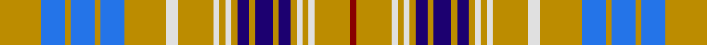

In pattern [RYWYWYBYBYBYWYWYWYBYBYBY](/stripes/rywywybybybywywywybybyby/).

This was sourced from tartans-authority.  It is a [24 stripe tartan](/stripes/stripes24/).

Original link http://www.tartansauthority.com/tartan-ferret/display/2021/

## Attestations

This cloth appears in 2 source records; the oldest owns this page.

- 1966 — Ottawa (District) (tartans-authority, [record](http://www.tartansauthority.com/tartan-ferret/display/2021/))
- 21/11/1967 — Ottawa (register-of-tartans, [record](https://www.tartanregister.gov.uk/tartanDetails.aspx?ref=3277))

## Register references

External register numbers recorded for this tartan.

- Scottish Register of Tartans: [3277](https://www.tartanregister.gov.uk/tartanDetails.aspx?ref=3277)
- Scottish Tartans Authority (ITI): 2021
- Scottish Tartans World Register: 2021

## Thread count
DY/28 B16 DY4 B16 DY4 B16 DY28 LN8 DY24 LN4 DY4 LN4 DY4 DB8 DY4 DB12 DY4 DB8 DY4 LN4 DY4 LN4 DY24 DR/4

## Palette
Each colour and the base-6 reference it is a variant of.

| Colour | Shade | Base |
|---|---|---|
| B | <code style="background-color:#2474E8;">#2474E8</code> `oklch(57.8% 0.192 258.7)` <small>#2474E8</small> | B <code style="background-color:#2A418A;">#2A418A</code> |
| DB | <code style="background-color:#1C0070;">#1C0070</code> `oklch(26.3% 0.162 277.1)` <small>#1C0070</small> | B <code style="background-color:#2A418A;">#2A418A</code> |
| DR | <code style="background-color:#880000;">#880000</code> `oklch(39.4% 0.162 29.2)` <small>#880000</small> | R <code style="background-color:#CC0000;">#CC0000</code> |
| DY | <code style="background-color:#BC8C00;">#BC8C00</code> `oklch(66.8% 0.137 84.1)` <small>#BC8C00</small> | Y <code style="background-color:#F2BF00;">#F2BF00</code> |
| LN | <code style="background-color:#E0E0E0;">#E0E0E0</code> `oklch(90.7% 0.000 89.9)` <small>#E0E0E0</small> | W <code style="background-color:#F7F7F7;">#F7F7F7</code> |

## Nearest tartans

The nearest existing variants by ΔTartan distance, with this tartan at the top so the swatches line up against it.

ΔTartan

Tartan

Sett

—

<a href="/ttd/edit/#slug=lo7b4lo1b4lo1b4lo7w2lo6w1lo1w1lo1db2lo1db3lo1db2lo1w1lo1w1lo6r1~x4">Ottawa (District)</a> <a class="nn-out" href="/setts/s24/lo7b4lo1b4lo1b4lo7w2lo6w1lo1w1lo1db2lo1db3lo1db2lo1w1lo1w1lo6r1~x4/" title="open its dictionary page">↗</a>

0.80

<a href="/ttd/edit/#slug=y7t4y1t4y1t4y7w2y6w1y1w1y1db2y1db3y1db2y1w1y1w1y6r1~x4">Ottawa</a> <a class="nn-out" href="/setts/s24/y7t4y1t4y1t4y7w2y6w1y1w1y1db2y1db3y1db2y1w1y1w1y6r1~x4/" title="open its dictionary page">↗</a>

1.37

<a href="/ttd/edit/#slug=ly7t4ly1t4ly1t4ly7w2ly6w1ly1w1ly1db2ly1db3ly1db2ly1w1ly1w1ly6r1~x4">Ottawa District Tartan Tartan Number: 2021. Earliest known date: 1966 In two blocks - Navy Block ends on 14th colour change Gold 24. Azure Block starts on the following White 8. The design was accepted as the Official Tartan of Ottawa by order of the Council on November 21st 1966. In 1985 it was no longer in commercial production. See products available Copyright © Blair Urquhart, Comrie, 2015</a> <a class="nn-out" href="/setts/s24/ly7t4ly1t4ly1t4ly7w2ly6w1ly1w1ly1db2ly1db3ly1db2ly1w1ly1w1ly6r1~x4/" title="open its dictionary page">↗</a>

1.57

<a href="/ttd/edit/#slug=n12lb14k3r6lb10n28lb10r6k3lb8r10lb8k3r6lb40n6lb6n6">Miyuki #3 (Fashion)</a> <a class="nn-out" href="/setts/s18/n12lb14k3r6lb10n28lb10r6k3lb8r10lb8k3r6lb40n6lb6n6/" title="open its dictionary page">↗</a>

1.60

<a href="/ttd/edit/#slug=lb5r3lb24n7k6lb3n3lb3n11lb6k3lb3r3~x2">Balmoral (Royal)</a> <a class="nn-out" href="/setts/s13/lb5r3lb24n7k6lb3n3lb3n11lb6k3lb3r3~x2/" title="open its dictionary page">↗</a>

1.62

<a href="/ttd/edit/#slug=lb5g3lb24n7k6lb3n3lb3n11lb6k3lb3g3~x2">Balmoral (Green) (Royal)</a> <a class="nn-out" href="/setts/s13/lb5g3lb24n7k6lb3n3lb3n11lb6k3lb3g3~x2/" title="open its dictionary page">↗</a>

1.64

<a href="/ttd/edit/#slug=w5n3w3n20k15n10g2n2g3n2g3n6lp3n4lp5~x2">Thistle Dubh</a> <a class="nn-out" href="/setts/s15/w5n3w3n20k15n10g2n2g3n2g3n6lp3n4lp5~x2/" title="open its dictionary page">↗</a>

1.66

<a href="/ttd/edit/#slug=w54dt7w19k5w8y8w8y16k8dy8w21r11y7dt11y8w7~x2">Beckett Beaumont</a> <a class="nn-out" href="/setts/s16/w54dt7w19k5w8y8w8y16k8dy8w21r11y7dt11y8w7~x2/" title="open its dictionary page">↗</a>

1.75

<a href="/ttd/edit/#slug=k36lb8lb33k4lb6lb8lb24k12lb4lb4lb6lb4k4lb48lb4k4k4lb6lb16k6k12">Abergaveny (Fashion)</a> <a class="nn-out" href="/setts/s21/k36lb8lb33k4lb6lb8lb24k12lb4lb4lb6lb4k4lb48lb4k4k4lb6lb16k6k12/" title="open its dictionary page">↗</a>

1.83

<a href="/ttd/edit/#slug=ly4db5ly4db5lb8dg2lb24r2lb8db5ly4db5ly4~x2">Aelfleda Arisaid (Personal)</a> <a class="nn-out" href="/setts/s13/ly4db5ly4db5lb8dg2lb24r2lb8db5ly4db5ly4~x2/" title="open its dictionary page">↗</a>

1.84

<a href="/ttd/edit/#slug=lb9r5lb47n13k11lb5n5lb5n21lb11k5lb5r5">Balmoral</a> <a class="nn-out" href="/setts/s13/lb9r5lb47n13k11lb5n5lb5n21lb11k5lb5r5/" title="open its dictionary page">↗</a>

## Neighbour map

Every grey dot is one of 14299 variants placed by the first two principal components of the ΔTartan feature space (44% of its variance). Red is this tartan; blue dots are its nearest — click one to open its page.

<svg viewBox="0 0 640 380" role="img" style="max-width:100%;height:auto;border:1px solid #e0e0e0;border-radius:4px;display:block" xmlns="http://www.w3.org/2000/svg"><image href="/nn/cloud.v1.png" width="640" height="380"/><a href="/setts/s24/y7t4y1t4y1t4y7w2y6w1y1w1y1db2y1db3y1db2y1w1y1w1y6r1~x4/"><circle cx="225.8" cy="144.7" r="4" fill="#3465a4"><title>Ottawa</title></circle></a><a href="/setts/s24/ly7t4ly1t4ly1t4ly7w2ly6w1ly1w1ly1db2ly1db3ly1db2ly1w1ly1w1ly6r1~x4/"><circle cx="211.7" cy="128.2" r="4" fill="#3465a4"><title>Ottawa District Tartan Tartan Number: 2021. Earliest known date: 1966 In two blocks - Navy Block ends on 14th colour change Gold 24. Azure Block starts on the following White 8. The design was accepted as the Official Tartan of Ottawa by order of the Council on November 21st 1966. In 1985 it was no longer in commercial production. See products available Copyright © Blair Urquhart, Comrie, 2015</title></circle></a><a href="/setts/s18/n12lb14k3r6lb10n28lb10r6k3lb8r10lb8k3r6lb40n6lb6n6/"><circle cx="247.8" cy="129.0" r="4" fill="#3465a4"><title>Miyuki #3 (Fashion)</title></circle></a><a href="/setts/s13/lb5r3lb24n7k6lb3n3lb3n11lb6k3lb3r3~x2/"><circle cx="250.1" cy="159.7" r="4" fill="#3465a4"><title>Balmoral (Royal)</title></circle></a><a href="/setts/s13/lb5g3lb24n7k6lb3n3lb3n11lb6k3lb3g3~x2/"><circle cx="247.6" cy="163.2" r="4" fill="#3465a4"><title>Balmoral (Green) (Royal)</title></circle></a><a href="/setts/s15/w5n3w3n20k15n10g2n2g3n2g3n6lp3n4lp5~x2/"><circle cx="229.9" cy="144.8" r="4" fill="#3465a4"><title>Thistle Dubh</title></circle></a><a href="/setts/s16/w54dt7w19k5w8y8w8y16k8dy8w21r11y7dt11y8w7~x2/"><circle cx="200.1" cy="101.2" r="4" fill="#3465a4"><title>Beckett Beaumont</title></circle></a><a href="/setts/s21/k36lb8lb33k4lb6lb8lb24k12lb4lb4lb6lb4k4lb48lb4k4k4lb6lb16k6k12/"><circle cx="214.4" cy="109.5" r="4" fill="#3465a4"><title>Abergaveny (Fashion)</title></circle></a><a href="/setts/s13/ly4db5ly4db5lb8dg2lb24r2lb8db5ly4db5ly4~x2/"><circle cx="201.0" cy="120.6" r="4" fill="#3465a4"><title>Aelfleda Arisaid (Personal)</title></circle></a><a href="/setts/s13/lb9r5lb47n13k11lb5n5lb5n21lb11k5lb5r5/"><circle cx="253.1" cy="142.9" r="4" fill="#3465a4"><title>Balmoral</title></circle></a><circle cx="215.9" cy="134.0" r="5" fill="#c00000"/></svg>

ID: /setts/s24/lo7b4lo1b4lo1b4lo7w2lo6w1lo1w1lo1db2lo1db3lo1db2lo1w1lo1w1lo6r1~x4/
