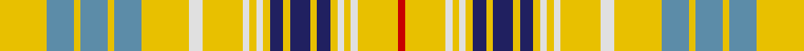

This page is one **sett** — a single exact thread-count. It belongs to the [tartan](/tartans/y7b4y1b4y1b4y7ln2y6ln1y1ln1y1db2y1db3y1db2y1ln1y1ln1y6r1/)
(the same proportion at any scale), whose colour order is pattern [RYWYWYBYBYBYWYWYWYBYBYBY](/stripes/rywywybybybywywywybybyby/).

Sourced from house-of-tartan.  It is a [24 stripe tartan](/stripes/stripes24/).

Original link http://www.house-of-tartan.scotland.net/house/TartanViewjs.asp?colr=Def&tnam=2021

## Thread count
Y/28 B16 Y4 B16 Y4 B16 Y28 LN8 Y24 LN4 Y4 LN4 Y4 DB8 Y4 DB12 Y4 DB8 Y4 LN4 Y4 LN4 Y24 R/4

## Palette
Each colour and the base-6 reference it is a variant of.

| Colour | Shade | Base |
|---|---|---|
| B | <code style="background-color:#5C8CA8;">#5C8CA8</code> `oklch(61.7% 0.067 235.0)` <small>#5C8CA8</small> | B <code style="background-color:#2A418A;">#2A418A</code> |
| DB | <code style="background-color:#202060;">#202060</code> `oklch(28.9% 0.111 276.9)` <small>#202060</small> | B <code style="background-color:#2A418A;">#2A418A</code> |
| LN | <code style="background-color:#E0E0E0;">#E0E0E0</code> `oklch(90.7% 0.000 89.9)` <small>#E0E0E0</small> | W <code style="background-color:#F7F7F7;">#F7F7F7</code> |
| R | <code style="background-color:#C80000;">#C80000</code> `oklch(52.3% 0.215 29.2)` <small>#C80000</small> | R <code style="background-color:#CC0000;">#CC0000</code> |
| Y | <code style="background-color:#E8C000;">#E8C000</code> `oklch(81.9% 0.168 93.7)` <small>#E8C000</small> | Y <code style="background-color:#F2BF00;">#F2BF00</code> |

## Nearest tartans

The nearest existing variants by ΔTartan distance, with this tartan at the top so the swatches line up against it.

ΔTartan

Tartan

Sett

—

<a href="/ttd/edit/#slug=ly7t4ly1t4ly1t4ly7w2ly6w1ly1w1ly1db2ly1db3ly1db2ly1w1ly1w1ly6r1~x4">Ottawa District Tartan Tartan Number: 2021. Earliest known date: 1966 In two blocks - Navy Block ends on 14th colour change Gold 24. Azure Block starts on the following White 8. The design was accepted as the Official Tartan of Ottawa by order of the Council on November 21st 1966. In 1985 it was no longer in commercial production. See products available Copyright © Blair Urquhart, Comrie, 2015</a> <a class="nn-out" href="/setts/s24/ly7t4ly1t4ly1t4ly7w2ly6w1ly1w1ly1db2ly1db3ly1db2ly1w1ly1w1ly6r1~x4/" title="open its dictionary page">↗</a>

1.37

<a href="/ttd/edit/#slug=lo7b4lo1b4lo1b4lo7w2lo6w1lo1w1lo1db2lo1db3lo1db2lo1w1lo1w1lo6r1~x4">Ottawa (District)</a> <a class="nn-out" href="/setts/s24/lo7b4lo1b4lo1b4lo7w2lo6w1lo1w1lo1db2lo1db3lo1db2lo1w1lo1w1lo6r1~x4/" title="open its dictionary page">↗</a>

1.45

<a href="/ttd/edit/#slug=y7t4y1t4y1t4y7w2y6w1y1w1y1db2y1db3y1db2y1w1y1w1y6r1~x4">Ottawa</a> <a class="nn-out" href="/setts/s24/y7t4y1t4y1t4y7w2y6w1y1w1y1db2y1db3y1db2y1w1y1w1y6r1~x4/" title="open its dictionary page">↗</a>

1.85

<a href="/setts/s26/r3g2ly2g14r2g3r2g3w17g2w2k2r2w3~x2/">Hay, White Dress</a>

1.92

<a href="/ttd/edit/#slug=o3g3o18g6o4b3w3b18o6g18w3g3o4b6o18g3o3~x2">Reid of Straloch (Personal)</a> <a class="nn-out" href="/setts/s17/o3g3o18g6o4b3w3b18o6g18w3g3o4b6o18g3o3~x2/" title="open its dictionary page">↗</a>

1.97

<a href="/ttd/edit/#slug=w54dt7w19k5w8y8w8y16k8dy8w21r11y7dt11y8w7~x2">Beckett Beaumont</a> <a class="nn-out" href="/setts/s16/w54dt7w19k5w8y8w8y16k8dy8w21r11y7dt11y8w7~x2/" title="open its dictionary page">↗</a>

2.04

<a href="/ttd/edit/#slug=ly4db5ly4db5lb8dg2lb24r2lb8db5ly4db5ly4~x2">Aelfleda Arisaid (Personal)</a> <a class="nn-out" href="/setts/s13/ly4db5ly4db5lb8dg2lb24r2lb8db5ly4db5ly4~x2/" title="open its dictionary page">↗</a>

2.15

<a href="/ttd/edit/#slug=w2r1w8o2k2w1o1w1o4w2k1w1r1~x4">Balmoral (Ghillies white variation)</a> <a class="nn-out" href="/setts/s13/w2r1w8o2k2w1o1w1o4w2k1w1r1~x4/" title="open its dictionary page">↗</a>

2.19

<a href="/ttd/edit/#slug=r6g4ly4g25r4g6r4g6w34g4w4k4r4w6">Hay, White Dress</a> <a class="nn-out" href="/setts/s14/r6g4ly4g25r4g6r4g6w34g4w4k4r4w6/" title="open its dictionary page">↗</a>

2.19

<a href="/ttd/edit/#slug=n12lb14k3r6lb10n28lb10r6k3lb8r10lb8k3r6lb40n6lb6n6">Miyuki #3 (Fashion)</a> <a class="nn-out" href="/setts/s18/n12lb14k3r6lb10n28lb10r6k3lb8r10lb8k3r6lb40n6lb6n6/" title="open its dictionary page">↗</a>

2.19

<a href="/ttd/edit/#slug=k2g2lr10g2lr7g2lr7g2lr5g2r14lr1g2~x2">Glen Affric, Fragment</a> <a class="nn-out" href="/setts/s13/k2g2lr10g2lr7g2lr7g2lr5g2r14lr1g2~x2/" title="open its dictionary page">↗</a>

## Neighbour map

Every grey dot is one of 14299 variants placed by the first two principal components of the ΔTartan feature space (44% of its variance). Red is this tartan; blue dots are its nearest — click one to open its page.

<svg viewBox="0 0 640 380" role="img" style="max-width:100%;height:auto;border:1px solid #e0e0e0;border-radius:4px;display:block" xmlns="http://www.w3.org/2000/svg"><image href="/nn/cloud.v1.png" width="640" height="380"/><a href="/setts/s24/lo7b4lo1b4lo1b4lo7w2lo6w1lo1w1lo1db2lo1db3lo1db2lo1w1lo1w1lo6r1~x4/"><circle cx="215.9" cy="134.0" r="4" fill="#3465a4"><title>Ottawa (District)</title></circle></a><a href="/setts/s24/y7t4y1t4y1t4y7w2y6w1y1w1y1db2y1db3y1db2y1w1y1w1y6r1~x4/"><circle cx="225.8" cy="144.7" r="4" fill="#3465a4"><title>Ottawa</title></circle></a><a href="/setts/s26/r3g2ly2g14r2g3r2g3w17g2w2k2r2w3~x2/"><circle cx="152.6" cy="89.1" r="4" fill="#3465a4"><title>Hay, White Dress</title></circle></a><a href="/setts/s17/o3g3o18g6o4b3w3b18o6g18w3g3o4b6o18g3o3~x2/"><circle cx="209.9" cy="175.7" r="4" fill="#3465a4"><title>Reid of Straloch (Personal)</title></circle></a><a href="/setts/s16/w54dt7w19k5w8y8w8y16k8dy8w21r11y7dt11y8w7~x2/"><circle cx="200.1" cy="101.2" r="4" fill="#3465a4"><title>Beckett Beaumont</title></circle></a><a href="/setts/s13/ly4db5ly4db5lb8dg2lb24r2lb8db5ly4db5ly4~x2/"><circle cx="201.0" cy="120.6" r="4" fill="#3465a4"><title>Aelfleda Arisaid (Personal)</title></circle></a><a href="/setts/s13/w2r1w8o2k2w1o1w1o4w2k1w1r1~x4/"><circle cx="241.7" cy="150.3" r="4" fill="#3465a4"><title>Balmoral (Ghillies white variation)</title></circle></a><a href="/setts/s14/r6g4ly4g25r4g6r4g6w34g4w4k4r4w6/"><circle cx="155.2" cy="121.1" r="4" fill="#3465a4"><title>Hay, White Dress</title></circle></a><a href="/setts/s18/n12lb14k3r6lb10n28lb10r6k3lb8r10lb8k3r6lb40n6lb6n6/"><circle cx="247.8" cy="129.0" r="4" fill="#3465a4"><title>Miyuki #3 (Fashion)</title></circle></a><a href="/setts/s13/k2g2lr10g2lr7g2lr7g2lr5g2r14lr1g2~x2/"><circle cx="259.5" cy="148.5" r="4" fill="#3465a4"><title>Glen Affric, Fragment</title></circle></a><circle cx="211.7" cy="128.2" r="5" fill="#c00000"/></svg>

ID: /setts/s24/ly7t4ly1t4ly1t4ly7w2ly6w1ly1w1ly1db2ly1db3ly1db2ly1w1ly1w1ly6r1~x4/
