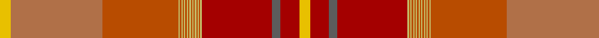

This page is one **sett** — a single exact thread-count. It belongs to the [tartan](/tartans/y8lt68do56lg1do1lg1do1lg1do1lg1do1lg1do1lg1do1lg1do1lg1do1lg1dr52n6dr14y8/)
(the same proportion at any scale), whose colour order is pattern [YRBRYRYRYRYRYRYRYRYRYRRY](/stripes/yrbryryryryryryryryryrry/).

Sourced from tartans-authority.  It is a [24 stripe tartan](/stripes/stripes24/).

Original link http://www.tartansauthority.com/tartan-ferret/display/8240/

## Thread count
Y/8 LT68 DO56 LG1 DO1 LG1 DO1 LG1 DO1 LG1 DO1 LG1 DO1 LG1 DO1 LG1 DO1 LG1 DO1 LG1 DR52 N6 DR14 Y/8

## Palette
Each colour and the base-6 reference it is a variant of.

| Colour | Shade | Base |
|---|---|---|
| DO | <code style="background-color:#B84C00;">#B84C00</code> `oklch(55.1% 0.156 45.5)` <small>#B84C00</small> | R <code style="background-color:#CC0000;">#CC0000</code> |
| DR | <code style="background-color:#A40000;">#A40000</code> `oklch(45.1% 0.185 29.2)` <small>#A40000</small> | R <code style="background-color:#CC0000;">#CC0000</code> |
| LG | <code style="background-color:#C4BC68;">#C4BC68</code> `oklch(78.4% 0.107 103.7)` <small>#C4BC68</small> | Y <code style="background-color:#F2BF00;">#F2BF00</code> |
| LT | <code style="background-color:#B07048;">#B07048</code> `oklch(60.5% 0.098 51.9)` <small>#B07048</small> | R <code style="background-color:#CC0000;">#CC0000</code> |
| N | <code style="background-color:#5C5C5C;">#5C5C5C</code> `oklch(47.5% 0.000 89.9)` <small>#5C5C5C</small> | B <code style="background-color:#2A418A;">#2A418A</code> |
| Y | <code style="background-color:#E8C000;">#E8C000</code> `oklch(81.9% 0.168 93.7)` <small>#E8C000</small> | Y <code style="background-color:#F2BF00;">#F2BF00</code> |

## Nearest tartans

The nearest existing variants by ΔTartan distance, with this tartan at the top so the swatches line up against it.

ΔTartan

Tartan

Sett

—

<a href="/ttd/edit/#slug=ly8o68o56ly1o1ly1o1ly1o1ly1o1ly1o1ly1o1ly1o1ly1o1ly1r52n6r14ly8">Lehbrink No. 1 (Fashion)</a> <a class="nn-out" href="/setts/s24/ly8o68o56ly1o1ly1o1ly1o1ly1o1ly1o1ly1o1ly1o1ly1o1ly1r52n6r14ly8/" title="open its dictionary page">↗</a>

2.61

<a href="/ttd/edit/#slug=y1r4r2r2y27r4y2r4dp10r3r2r2r2r3y10r10y10r2dp2r26r3r2r3y1~x2">MacDougall - 1819 (Clan)</a> <a class="nn-out" href="/setts/s24/y1r4r2r2y27r4y2r4dp10r3r2r2r2r3y10r10y10r2dp2r26r3r2r3y1~x2/" title="open its dictionary page">↗</a>

2.73

<a href="/ttd/edit/#slug=dt1y2dt1y3g6dt1y6dt2lo5r13dy23lo1dy1lo1dy2lo1~x2">Langermann (Name)</a> <a class="nn-out" href="/setts/s16/dt1y2dt1y3g6dt1y6dt2lo5r13dy23lo1dy1lo1dy2lo1~x2/" title="open its dictionary page">↗</a>

2.91

<a href="/ttd/edit/#slug=w2lo1r3y20r1lo1r3lo2o14ly2r2ly2~x2">Flodden</a> <a class="nn-out" href="/setts/s12/w2lo1r3y20r1lo1r3lo2o14ly2r2ly2~x2/" title="open its dictionary page">↗</a>

2.91

<a href="/ttd/edit/#slug=o28r3dr2y2dr2r3y8o2dr8o5dr3w2dr2o3dr1~x2">Caithness</a> <a class="nn-out" href="/setts/s15/o28r3dr2y2dr2r3y8o2dr8o5dr3w2dr2o3dr1~x2/" title="open its dictionary page">↗</a>

3.00

<a href="/ttd/edit/#slug=o29lo2o2lo4o2lo20ly1lo2ly10w3ly10lo2ly1lo20o2lo4o2lo2o29k3~x2">Shenzhen</a> <a class="nn-out" href="/setts/s20/o29lo2o2lo4o2lo20ly1lo2ly10w3ly10lo2ly1lo20o2lo4o2lo2o29k3~x2/" title="open its dictionary page">↗</a>

3.04

<a href="/ttd/edit/#slug=db1y2db1y3dg6db1y6db2r5r13do23r1do1r1do2r1~x2">Langerman (Anchorage)</a> <a class="nn-out" href="/setts/s16/db1y2db1y3dg6db1y6db2r5r13do23r1do1r1do2r1~x2/" title="open its dictionary page">↗</a>

3.16

<a href="/ttd/edit/#slug=p96g10p8g8p10o34r1o6r4o4r6o2r7w3r7o2r6o4r4o6r1o34t36o6t18~x2">Unidentified 22</a> <a class="nn-out" href="/setts/s25/p96g10p8g8p10o34r1o6r4o4r6o2r7w3r7o2r6o4r4o6r1o34t36o6t18~x2/" title="open its dictionary page">↗</a>

3.16

<a href="/ttd/edit/#slug=n9o2n2r2o18r2n2n1n1n19r33n2~x2">Pride of Scotland, Silver (Fashion)</a> <a class="nn-out" href="/setts/s12/n9o2n2r2o18r2n2n1n1n19r33n2~x2/" title="open its dictionary page">↗</a>

3.25

<a href="/ttd/edit/#slug=o8y1o1y1o1y25dt1y1dt1y1dt25y7lo6~x2">Johansson (Aneby, Sweden), Christian (Personal)</a> <a class="nn-out" href="/setts/s13/o8y1o1y1o1y25dt1y1dt1y1dt25y7lo6~x2/" title="open its dictionary page">↗</a>

3.26

<a href="/ttd/edit/#slug=w6lt5lg4lt5lo2r5lg2r14lg10lo30lt1lg2r4lg2r1lo30r10lt14lg2lt5~x2">elCorte</a> <a class="nn-out" href="/setts/s20/w6lt5lg4lt5lo2r5lg2r14lg10lo30lt1lg2r4lg2r1lo30r10lt14lg2lt5~x2/" title="open its dictionary page">↗</a>

## Neighbour map

Every grey dot is one of 14299 variants placed by the first two principal components of the ΔTartan feature space (44% of its variance). Red is this tartan; blue dots are its nearest — click one to open its page.

<svg viewBox="0 0 640 380" role="img" style="max-width:100%;height:auto;border:1px solid #e0e0e0;border-radius:4px;display:block" xmlns="http://www.w3.org/2000/svg"><image href="/nn/cloud.v1.png" width="640" height="380"/><a href="/setts/s24/y1r4r2r2y27r4y2r4dp10r3r2r2r2r3y10r10y10r2dp2r26r3r2r3y1~x2/"><circle cx="266.0" cy="71.7" r="4" fill="#3465a4"><title>MacDougall - 1819 (Clan)</title></circle></a><a href="/setts/s16/dt1y2dt1y3g6dt1y6dt2lo5r13dy23lo1dy1lo1dy2lo1~x2/"><circle cx="251.8" cy="102.1" r="4" fill="#3465a4"><title>Langermann (Name)</title></circle></a><a href="/setts/s12/w2lo1r3y20r1lo1r3lo2o14ly2r2ly2~x2/"><circle cx="254.4" cy="112.6" r="4" fill="#3465a4"><title>Flodden</title></circle></a><a href="/setts/s15/o28r3dr2y2dr2r3y8o2dr8o5dr3w2dr2o3dr1~x2/"><circle cx="252.3" cy="90.5" r="4" fill="#3465a4"><title>Caithness</title></circle></a><a href="/setts/s20/o29lo2o2lo4o2lo20ly1lo2ly10w3ly10lo2ly1lo20o2lo4o2lo2o29k3~x2/"><circle cx="324.6" cy="89.0" r="4" fill="#3465a4"><title>Shenzhen</title></circle></a><a href="/setts/s16/db1y2db1y3dg6db1y6db2r5r13do23r1do1r1do2r1~x2/"><circle cx="273.4" cy="116.8" r="4" fill="#3465a4"><title>Langerman (Anchorage)</title></circle></a><a href="/setts/s25/p96g10p8g8p10o34r1o6r4o4r6o2r7w3r7o2r6o4r4o6r1o34t36o6t18~x2/"><circle cx="273.3" cy="36.8" r="4" fill="#3465a4"><title>Unidentified 22</title></circle></a><a href="/setts/s12/n9o2n2r2o18r2n2n1n1n19r33n2~x2/"><circle cx="367.3" cy="139.9" r="4" fill="#3465a4"><title>Pride of Scotland, Silver (Fashion)</title></circle></a><a href="/setts/s13/o8y1o1y1o1y25dt1y1dt1y1dt25y7lo6~x2/"><circle cx="340.4" cy="152.9" r="4" fill="#3465a4"><title>Johansson (Aneby, Sweden), Christian (Personal)</title></circle></a><a href="/setts/s20/w6lt5lg4lt5lo2r5lg2r14lg10lo30lt1lg2r4lg2r1lo30r10lt14lg2lt5~x2/"><circle cx="287.6" cy="107.0" r="4" fill="#3465a4"><title>elCorte</title></circle></a><circle cx="314.0" cy="33.9" r="5" fill="#c00000"/></svg>

ID: /setts/s24/ly8o68o56ly1o1ly1o1ly1o1ly1o1ly1o1ly1o1ly1o1ly1o1ly1r52n6r14ly8/
