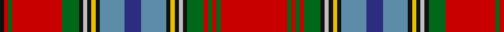

**Bands:** [KRGRGKWKYKBBBKYKWKGRGRGR](/stripes/krgrgkwkykbbbkykwkgrgrgr/) · **Stripes:** [K R G R G K LB K LY K T DB T K LY K LB K G R G R G R](/stripes/stripes24/) K R G R G K LB K LY K T DB T K LY K LB K G R G R G R

This was sourced from register-of-tartans.  It is a [24 band tartan](/bands/bands24/).

Original link https://www.tartanregister.gov.uk/tartanDetails.aspx?ref=2276

## Attestations

This cloth appears in 2 source records; the oldest owns this page.

- 01/01/1831 — Macan of Lurgyvallan (register-of-tartans, [record](https://www.tartanregister.gov.uk/tartanDetails.aspx?ref=2276))
- 1831? — MacAn of Lurgyvallan (Portrait) (tartans-authority, [record](http://www.tartansauthority.com/tartan-ferret/display/1155/))

## Register references

External register numbers recorded for this tartan.

- Scottish Register of Tartans: [2276](https://www.tartanregister.gov.uk/tartanDetails.aspx?ref=2276)
- Scottish Tartans Authority (ITI): 1155
- Scottish Tartans World Register: 1155

## Thread count
K/4 R4 G4 R48 G16 K4 N4 K4 Y4 K4 B24 DB16 B24 K4 Y4 K4 N4 K4 G16 R4 G4 R4 G4 R/64

## Palette
Each colour and its ΔE from the base-6 reference it is a variant of.

| Colour | Shade | Base | ΔE (OKLab) |
|---|---|---|---|
| B | <code style="background-color:#5C8CA8;">#5C8CA8</code> `#5C8CA8` | B <code style="background-color:#2A418A;">#2A418A</code> | 0.23 |
| DB | <code style="background-color:#2C2C80;">#2C2C80</code> `#2C2C80` | B <code style="background-color:#2A418A;">#2A418A</code> | 0.06 |
| G | <code style="background-color:#006818;">#006818</code> `#006818` | G <code style="background-color:#006100;">#006100</code> | 0.02 |
| K | <code style="background-color:#101010;">#101010</code> `#101010` | K <code style="background-color:#000000;">#000000</code> | 0.17 |
| N | <code style="background-color:#C0C0C0;">#C0C0C0</code> `#C0C0C0` | W <code style="background-color:#F7F7F7;">#F7F7F7</code> | 0.17 |
| R | <code style="background-color:#C80000;">#C80000</code> `#C80000` | R <code style="background-color:#CC0000;">#CC0000</code> | 0.01 |
| Y | <code style="background-color:#E8C000;">#E8C000</code> `#E8C000` | Y <code style="background-color:#F2BF00;">#F2BF00</code> | 0.02 |

## Nearest tartans

The nearest existing variants by ΔTartan distance.

1. [Macan, of Lurgyvallan](/setts/s24/r16g1r1g1r1g4k1w1k1ly1k1t6db4t6k1ly1k1w1k1g4r12g1r1k1~x2/) — ΔT 0.59
1. [Inverclyde](/setts/s20/db5db2db9n10t2n4t2g10r33w2r33g10t2n4t2n10db9db2db5w3~x2/) — ΔT 0.97
1. [Fitzgerald dress](/setts/s25/w2k1r3t3r3r3r12r3r3db3r3db19ly3g19r3db3r3r3r12r3r3t3r3k1w2~x2/) — ΔT 1.24
1. [Hay or Leith Clan Tartan Tartan Number: 1215. Earliest known date: 1810-15 Also recorded by Logan and Wilson in the Wilson's pattern books. The Hay Leith connection is believed to have come about through a marriage between the two families. At Delgattie Castle, Turriff, there is a Clan Hay centre and Leith Hall, home of the Leith-Hays, is owned by the National Trust for Scotland. See products available Copyright © Blair Urquhart, Comrie, 2015](/setts/s23/k3r1ly1k2r16dp2r1ly1r2dp15r1k15w1g15r2ly1r1g2r16k2ly1r1k3~x2/) — ΔT 1.26
1. [Fitzgerald Dress](/setts/s25/w2k1r3db3r3r3r19r3r3db3r3db29ly3g29r3db3r3r3r19r3r3db3r3k1w2~x4/) — ΔT 1.31
1. [Fitzgerald Family Tartan Tartan Number: 1818. Earliest known date: 1985 One of four Fitzgerald tartans all apparently designed by Robert P. Fitzgerald of Philadelphia. Starting with this variation of Robertson (for no discernible reason) he then designed the blue and hunting as color variations and a further "fancy dress" version. See products available Copyright © Blair Urquhart, Comrie, 2015](/setts/s25/w2k1r3t3r3m3r12m3r3db3r3db19ly3g19r3db3r3m3r12m3r3t3r3k1w2~x2/) — ΔT 1.32
1. [Canadian Dental Association (Corp.)](/setts/s18/r8k3o15k1w3k1o8k1w3k1r19k2ly2k2g2k2r2k2~x2/) — ΔT 1.35
1. [House of Edgar Shotts & Dykehead](/setts/s22/db10w2db3ly2db2w2db2n14r22db2r6db2r6db2r22n14db2w2db2ly2db3w2~x2/) — ΔT 1.39
1. [Unnamed C18th - Hynde Cotton Jacket](/setts/s18/r40p5k26r4p10db14p10r5k2r5k2r5k2r5lr2dg26lb6lr2/) — ΔT 1.40
1. [MacBean](/setts/s19/r24w1db2t1w1t1db2w1k1g6k1w1r2r2g1r2r2w1g3~x2/) — ΔT 1.40

## Neighbour map

Every grey dot is one of 14313 variants placed by the first two principal components of the ΔTartan feature space (44% of its variance). Red is this tartan; blue dots are its nearest — click one to open its page.

<svg viewBox="0 0 640 380" role="img" style="max-width:100%;height:auto;border:1px solid #e0e0e0;border-radius:4px;display:block" xmlns="http://www.w3.org/2000/svg"><image href="/nn/cloud.v1.png" width="640" height="380"/><a href="/setts/s24/r16g1r1g1r1g4k1w1k1ly1k1t6db4t6k1ly1k1w1k1g4r12g1r1k1~x2/"><circle cx="169.9" cy="36.6" r="4" fill="#3465a4"><title>Macan, of Lurgyvallan</title></circle></a><a href="/setts/s20/db5db2db9n10t2n4t2g10r33w2r33g10t2n4t2n10db9db2db5w3~x2/"><circle cx="177.3" cy="69.1" r="4" fill="#3465a4"><title>Inverclyde</title></circle></a><a href="/setts/s25/w2k1r3t3r3r3r12r3r3db3r3db19ly3g19r3db3r3r3r12r3r3t3r3k1w2~x2/"><circle cx="141.6" cy="39.4" r="4" fill="#3465a4"><title>Fitzgerald dress</title></circle></a><a href="/setts/s23/k3r1ly1k2r16dp2r1ly1r2dp15r1k15w1g15r2ly1r1g2r16k2ly1r1k3~x2/"><circle cx="179.0" cy="62.1" r="4" fill="#3465a4"><title>Hay or Leith Clan Tartan Tartan Number: 1215. Earliest known date: 1810-15 Also recorded by Logan and Wilson in the Wilson's pattern books. The Hay Leith connection is believed to have come about through a marriage between the two families. At Delgattie Castle, Turriff, there is a Clan Hay centre and Leith Hall, home of the Leith-Hays, is owned by the National Trust for Scotland. See products available Copyright © Blair Urquhart, Comrie, 2015</title></circle></a><a href="/setts/s25/w2k1r3db3r3r3r19r3r3db3r3db29ly3g29r3db3r3r3r19r3r3db3r3k1w2~x4/"><circle cx="185.7" cy="19.3" r="4" fill="#3465a4"><title>Fitzgerald Dress</title></circle></a><a href="/setts/s25/w2k1r3t3r3m3r12m3r3db3r3db19ly3g19r3db3r3m3r12m3r3t3r3k1w2~x2/"><circle cx="142.2" cy="38.3" r="4" fill="#3465a4"><title>Fitzgerald Family Tartan Tartan Number: 1818. Earliest known date: 1985 One of four Fitzgerald tartans all apparently designed by Robert P. Fitzgerald of Philadelphia. Starting with this variation of Robertson (for no discernible reason) he then designed the blue and hunting as color variations and a further &quot;fancy dress&quot; version. See products available Copyright © Blair Urquhart, Comrie, 2015</title></circle></a><a href="/setts/s18/r8k3o15k1w3k1o8k1w3k1r19k2ly2k2g2k2r2k2~x2/"><circle cx="172.7" cy="64.0" r="4" fill="#3465a4"><title>Canadian Dental Association (Corp.)</title></circle></a><a href="/setts/s22/db10w2db3ly2db2w2db2n14r22db2r6db2r6db2r22n14db2w2db2ly2db3w2~x2/"><circle cx="189.4" cy="88.2" r="4" fill="#3465a4"><title>House of Edgar Shotts &amp; Dykehead</title></circle></a><a href="/setts/s18/r40p5k26r4p10db14p10r5k2r5k2r5k2r5lr2dg26lb6lr2/"><circle cx="142.1" cy="58.0" r="4" fill="#3465a4"><title>Unnamed C18th - Hynde Cotton Jacket</title></circle></a><a href="/setts/s19/r24w1db2t1w1t1db2w1k1g6k1w1r2r2g1r2r2w1g3~x2/"><circle cx="256.8" cy="14.0" r="4" fill="#3465a4"><title>MacBean</title></circle></a><circle cx="186.5" cy="43.4" r="5" fill="#c00000"/></svg>

ID: /setts/s24/r16g1r1g1r1g4k1lb1k1ly1k1t6db4t6k1ly1k1lb1k1g4r12g1r1k1~x4/
