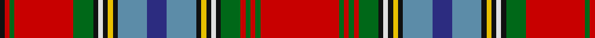

In pattern [KRGRGKWKYKBBBKYKWKGRGRGR](/patterns/krgrgkwkykbbbkykwkgrgrgr/).

This was sourced from house-of-tartan.  It is a [24 stripes tartan](/stripes/stripes24/).

Original link http://www.house-of-tartan.scotland.net/house/TartanViewjs.asp?colr=Def&tnam=1155

## Thread count
K/2 R2 G2 R24 G8 K2 LN2 K2 Y2 K2 B12 DB8 B12 K2 Y2 K2 LN2 K2 G8 R2 G2 R2 G2 R/32

## Palette
Each colour and its ΔE from the base-6 reference it is a variant of.

| Colour | Shade | Base | ΔE (OKLab) |
|---|---|---|---|
| B | <code style="background-color:#5C8CA8;">#5C8CA8</code> `#5C8CA8` | B <code style="background-color:#2A418A;">#2A418A</code> | 0.23 |
| DB | <code style="background-color:#2C2C80;">#2C2C80</code> `#2C2C80` | B <code style="background-color:#2A418A;">#2A418A</code> | 0.06 |
| G | <code style="background-color:#006818;">#006818</code> `#006818` | G <code style="background-color:#006100;">#006100</code> | 0.02 |
| K | <code style="background-color:#101010;">#101010</code> `#101010` | K <code style="background-color:#000000;">#000000</code> | 0.17 |
| LN | <code style="background-color:#E0E0E0;">#E0E0E0</code> `#E0E0E0` | W <code style="background-color:#F7F7F7;">#F7F7F7</code> | 0.07 |
| R | <code style="background-color:#C80000;">#C80000</code> `#C80000` | R <code style="background-color:#CC0000;">#CC0000</code> | 0.01 |
| Y | <code style="background-color:#E8C000;">#E8C000</code> `#E8C000` | Y <code style="background-color:#F2BF00;">#F2BF00</code> | 0.02 |

## Nearest tartans

The nearest existing variants by ΔTartan distance.

1. [Macan of Lurgyvallan](/setts/s24/r16g1r1g1r1g4k1w1k1y1k1b6ba4b6k1y1k1w1k1g4r12g1r1k1~b5c8ca8-ba2c2c80-g006818-k101010-rc80000-wc0c0c0-ye8c000~x4/) — ΔT 0.10
1. [Macan, of Lurgyvallan](/setts/s24/r16g1r1g1r1g4k1w1k1y1k1b6ba4b6k1y1k1w1k1g4r12g1r1k1~b5480b0-ba304080-g008000-k000000-rc00000-we0e0e0-yf0c000~x2/) — ΔT 0.50
1. [Inverclyde](/setts/s20/b5ba2b9bb10bc2bb4bc2g10r33w2r33g10bc2bb4bc2bb10b9ba2b5w3~b202060-ba2c2c80-bb5c5c5c-bc2888c4-g006818-rc80000-we0e0e0~x2/) — ΔT 1.03
1. [Hay or Leith Clan Tartan Tartan Number: 1215. Earliest known date: 1810-15 Also recorded by Logan and Wilson in the Wilson's pattern books. The Hay Leith connection is believed to have come about through a marriage between the two families. At Delgattie Castle, Turriff, there is a Clan Hay centre and Leith Hall, home of the Leith-Hays, is owned by the National Trust for Scotland. See products available Copyright © Blair Urquhart, Comrie, 2015](/setts/s23/k3r1y1k2r16b2r1y1r2b15r1k15w1g15r2y1r1g2r16k2y1r1k3~b780078-g006818-k101010-rc80000-we0e0e0-ye8c000~x2/) — ΔT 1.26
1. [Fitzgerald dress](/setts/s25/w2k1r3b3r3ra3r12ra3r3ba3r3ba19y3g19r3ba3r3ra3r12ra3r3b3r3k1w2~b5480b0-ba304080-g008000-k000000-rc00000-ra900030-we0e0e0-yf0c000~x2/) — ΔT 1.26
1. [Fitzgerald Dress](/setts/s25/w2k1r3b3r3ra3r19ra3r3b3r3b29y3g29r3b3r3ra3r19ra3r3b3r3k1w2~b000088-g007800-k000000-rc40000-ra9c0030-we0e0e0-y9c9c00~x4/) — ΔT 1.29
1. [Canadian Dental Association (Corp.)](/setts/s18/r8k3ra15k1w3k1ra8k1w3k1r19k2y2k2g2k2r2k2~g006818-k101010-rc80000-ra888888-we0e0e0-yfccc00~x2/) — ΔT 1.32
1. [Fitzgerald Family Tartan Tartan Number: 1818. Earliest known date: 1985 One of four Fitzgerald tartans all apparently designed by Robert P. Fitzgerald of Philadelphia. Starting with this variation of Robertson (for no discernible reason) he then designed the blue and hunting as color variations and a further "fancy dress" version. See products available Copyright © Blair Urquhart, Comrie, 2015](/setts/s25/w2k1r3b3r3ra3r12ra3r3ba3r3ba19y3g19r3ba3r3ra3r12ra3r3b3r3k1w2~b5c8ca8-ba2c2c80-g006818-k101010-rc80000-raa00048-we0e0e0-ye8c000~x2/) — ΔT 1.34
1. [MacGlashan (Clan?)](/setts/s16/r24k2w2b6w2y2r2k2r2y2w2ba6k2r3y3w2~b5c5c5c-ba2474e8-k101010-r880000-we0e0e0-yd09800~x2/) — ΔT 1.38
1. [MacBean](/setts/s19/r24w1b2ba1w1ba1b2w1k1g6k1w1r2ra2g1ra2r2w1g3~b304080-ba5480b0-g008000-k000000-rc00000-ra900030-we0e0e0~x2/) — ΔT 1.38

## Neighbour map

Every grey dot is one of 15726 variants placed by the first two principal components of the ΔTartan feature space (44% of its variance). Red is this tartan; blue dots are its nearest — click one to open its page.

<svg viewBox="0 0 640 380" role="img" style="max-width:100%;height:auto;border:1px solid #e0e0e0;border-radius:4px;display:block" xmlns="http://www.w3.org/2000/svg"><image href="/nn/cloud.v1.png" width="640" height="380"/><a href="/setts/s24/r16g1r1g1r1g4k1w1k1y1k1b6ba4b6k1y1k1w1k1g4r12g1r1k1~b5c8ca8-ba2c2c80-g006818-k101010-rc80000-wc0c0c0-ye8c000~x4/"><circle cx="184.8" cy="41.0" r="4" fill="#3465a4"><title>Macan of Lurgyvallan</title></circle></a><a href="/setts/s24/r16g1r1g1r1g4k1w1k1y1k1b6ba4b6k1y1k1w1k1g4r12g1r1k1~b5480b0-ba304080-g008000-k000000-rc00000-we0e0e0-yf0c000~x2/"><circle cx="167.9" cy="35.8" r="4" fill="#3465a4"><title>Macan, of Lurgyvallan</title></circle></a><a href="/setts/s20/b5ba2b9bb10bc2bb4bc2g10r33w2r33g10bc2bb4bc2bb10b9ba2b5w3~b202060-ba2c2c80-bb5c5c5c-bc2888c4-g006818-rc80000-we0e0e0~x2/"><circle cx="175.7" cy="64.7" r="4" fill="#3465a4"><title>Inverclyde</title></circle></a><a href="/setts/s23/k3r1y1k2r16b2r1y1r2b15r1k15w1g15r2y1r1g2r16k2y1r1k3~b780078-g006818-k101010-rc80000-we0e0e0-ye8c000~x2/"><circle cx="177.3" cy="60.6" r="4" fill="#3465a4"><title>Hay or Leith Clan Tartan Tartan Number: 1215. Earliest known date: 1810-15 Also recorded by Logan and Wilson in the Wilson's pattern books. The Hay Leith connection is believed to have come about through a marriage between the two families. At Delgattie Castle, Turriff, there is a Clan Hay centre and Leith Hall, home of the Leith-Hays, is owned by the National Trust for Scotland. See products available Copyright © Blair Urquhart, Comrie, 2015</title></circle></a><a href="/setts/s25/w2k1r3b3r3ra3r12ra3r3ba3r3ba19y3g19r3ba3r3ra3r12ra3r3b3r3k1w2~b5480b0-ba304080-g008000-k000000-rc00000-ra900030-we0e0e0-yf0c000~x2/"><circle cx="140.1" cy="35.0" r="4" fill="#3465a4"><title>Fitzgerald dress</title></circle></a><a href="/setts/s25/w2k1r3b3r3ra3r19ra3r3b3r3b29y3g29r3b3r3ra3r19ra3r3b3r3k1w2~b000088-g007800-k000000-rc40000-ra9c0030-we0e0e0-y9c9c00~x4/"><circle cx="183.4" cy="17.2" r="4" fill="#3465a4"><title>Fitzgerald Dress</title></circle></a><a href="/setts/s18/r8k3ra15k1w3k1ra8k1w3k1r19k2y2k2g2k2r2k2~g006818-k101010-rc80000-ra888888-we0e0e0-yfccc00~x2/"><circle cx="171.0" cy="63.9" r="4" fill="#3465a4"><title>Canadian Dental Association (Corp.)</title></circle></a><a href="/setts/s25/w2k1r3b3r3ra3r12ra3r3ba3r3ba19y3g19r3ba3r3ra3r12ra3r3b3r3k1w2~b5c8ca8-ba2c2c80-g006818-k101010-rc80000-raa00048-we0e0e0-ye8c000~x2/"><circle cx="140.7" cy="34.1" r="4" fill="#3465a4"><title>Fitzgerald Family Tartan Tartan Number: 1818. Earliest known date: 1985 One of four Fitzgerald tartans all apparently designed by Robert P. Fitzgerald of Philadelphia. Starting with this variation of Robertson (for no discernible reason) he then designed the blue and hunting as color variations and a further &quot;fancy dress&quot; version. See products available Copyright © Blair Urquhart, Comrie, 2015</title></circle></a><a href="/setts/s16/r24k2w2b6w2y2r2k2r2y2w2ba6k2r3y3w2~b5c5c5c-ba2474e8-k101010-r880000-we0e0e0-yd09800~x2/"><circle cx="204.5" cy="78.0" r="4" fill="#3465a4"><title>MacGlashan (Clan?)</title></circle></a><a href="/setts/s19/r24w1b2ba1w1ba1b2w1k1g6k1w1r2ra2g1ra2r2w1g3~b304080-ba5480b0-g008000-k000000-rc00000-ra900030-we0e0e0~x2/"><circle cx="255.6" cy="14.0" r="4" fill="#3465a4"><title>MacBean</title></circle></a><circle cx="181.9" cy="39.7" r="5" fill="#c00000"/></svg>

ID: /setts/s24/r16g1r1g1r1g4k1w1k1y1k1b6ba4b6k1y1k1w1k1g4r12g1r1k1~b5c8ca8-ba2c2c80-g006818-k101010-rc80000-we0e0e0-ye8c000~x2/
