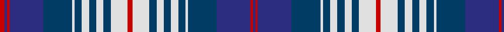

In pattern [BRBBWBWBWBWRWBWBWBWBBRBR](/stripes/brbbwbwbwbwrwbwbwbwbbrbr/).

This was sourced from register-of-tartans.  It is a [24 stripe tartan](/stripes/stripes24/).

Original link https://www.tartanregister.gov.uk/tartanDetails.aspx?ref=1746

## Register references

External register numbers recorded for this tartan.

- Scottish Register of Tartans: [1746](https://www.tartanregister.gov.uk/tartanDetails.aspx?ref=1746)
- Scottish Tartans Authority (ITI): 2621
- Scottish Tartans World Register: 2621

## Thread count
R/4 DB2 R2 DB28 DBa24 LN2 DBa6 LN6 DBa6 LN6 DBa6 LN14 R4 LN14 DBa6 LN6 DBa6 LN6 DBa6 LN2 DBa24 DB28 R2 DB/2

## Palette
Each colour and the base-6 reference it is a variant of.

| Colour | Shade | Base |
|---|---|---|
| DB | <code style="background-color:#2C2C80;">#2C2C80</code> `oklch(35.0% 0.138 276.6)` <small>#2C2C80</small> | B <code style="background-color:#2A418A;">#2A418A</code> |
| DBa | <code style="background-color:#003C64;">#003C64</code> `oklch(34.5% 0.089 246.0)` <small>#003C64</small> | B <code style="background-color:#2A418A;">#2A418A</code> |
| LN | <code style="background-color:#E0E0E0;">#E0E0E0</code> `oklch(90.7% 0.000 89.9)` <small>#E0E0E0</small> | W <code style="background-color:#F7F7F7;">#F7F7F7</code> |
| R | <code style="background-color:#C80000;">#C80000</code> `oklch(52.3% 0.215 29.2)` <small>#C80000</small> | R <code style="background-color:#CC0000;">#CC0000</code> |

## Nearest tartans

The nearest existing variants by ΔTartan distance, with this tartan at the top so the swatches line up against it.

ΔTartan

Tartan

Sett

—

<a href="/ttd/edit/#slug=r2w7dt3w3dt3w3dt3w1dt12db14r1db1r2~x2">Hogmany Plaid</a> <a class="nn-out" href="/setts/s24/r2w7dt3w3dt3w3dt3w1dt12db14r1db1r2~x2/" title="open its dictionary page">↗</a>

1.04

<a href="/setts/s22/lb4r1db20k6lb5k4lb4k4lb3k2r1db2~x2/">Scottish Knights Templar St. Andrews</a>

1.27

<a href="/ttd/edit/#slug=r2w7dt3w3dt3w3dt3w1dt12db14r1db1r2~x2">Hogmany Plaid (Fashion)</a> <a class="nn-out" href="/setts/s13/r2w7dt3w3dt3w3dt3w1dt12db14r1db1r2~x2/" title="open its dictionary page">↗</a>

1.31

<a href="/setts/s18/db2r2k2lb3k4lb5k6db20r2lb4r2db20k6lb5k4lb3k2r2~x2/">Scottish Knights Templar Militi Templi Scotia</a>

1.31

<a href="/ttd/edit/#slug=b3w8o2w2o2w2o8k2o2k2o2k8w2b22w2b2o2b3~x2">Wcwm 1586</a> <a class="nn-out" href="/setts/s18/b3w8o2w2o2w2o8k2o2k2o2k8w2b22w2b2o2b3~x2/" title="open its dictionary page">↗</a>

1.33

<a href="/ttd/edit/#slug=r4b5r2b7r10k4lo2k2lo2k4lb4k4b18r1k2r1b4r3~x2">Anderson Blue (Westwood)</a> <a class="nn-out" href="/setts/s18/r4b5r2b7r10k4lo2k2lo2k4lb4k4b18r1k2r1b4r3~x2/" title="open its dictionary page">↗</a>

1.33

<a href="/ttd/edit/#slug=m4lb6k1m2k1lb14k3lb3k2m2k2m2db4m2db6m2db6m2">Royal Canadian Air Force</a> <a class="nn-out" href="/setts/s18/m4lb6k1m2k1lb14k3lb3k2m2k2m2db4m2db6m2db6m2/" title="open its dictionary page">↗</a>

1.42

<a href="/setts/s22/db8w8db4dp4db36dp4db4o26db2o26g2db5/">Historic Scotland (1998)</a>

1.42

<a href="/ttd/edit/#slug=k1lr2k2lr2k1lr4k1db9lo1db9k1lr4k1lr2k2lr2k1r1~x4">Hanna of Stirlingshire</a> <a class="nn-out" href="/setts/s18/k1lr2k2lr2k1lr4k1db9lo1db9k1lr4k1lr2k2lr2k1r1~x4/" title="open its dictionary page">↗</a>

1.48

<a href="/ttd/edit/#slug=k34y5k5y8k5y56lb5y5lb36ly5lb36y5lb5y56k5y8k5y5k34ly5">Chartered Institute of Bankers</a> <a class="nn-out" href="/setts/s20/k34y5k5y8k5y56lb5y5lb36ly5lb36y5lb5y56k5y8k5y5k34ly5/" title="open its dictionary page">↗</a>

1.51

<a href="/ttd/edit/#slug=db4dg10k2db2w14k2dg2k2dg2k2dg2k2dg2k2db25w8dg4k4db3k1db3k1~x2">Alberta, Quebec, Nova Scotia.</a> <a class="nn-out" href="/setts/s22/db4dg10k2db2w14k2dg2k2dg2k2dg2k2dg2k2db25w8dg4k4db3k1db3k1~x2/" title="open its dictionary page">↗</a>

## Neighbour map

Every grey dot is one of 14299 variants placed by the first two principal components of the ΔTartan feature space (44% of its variance). Red is this tartan; blue dots are its nearest — click one to open its page.

<svg viewBox="0 0 640 380" role="img" style="max-width:100%;height:auto;border:1px solid #e0e0e0;border-radius:4px;display:block" xmlns="http://www.w3.org/2000/svg"><image href="/nn/cloud.v1.png" width="640" height="380"/><a href="/setts/s22/lb4r1db20k6lb5k4lb4k4lb3k2r1db2~x2/"><circle cx="203.2" cy="104.6" r="4" fill="#3465a4"><title>Scottish Knights Templar St. Andrews</title></circle></a><a href="/setts/s13/r2w7dt3w3dt3w3dt3w1dt12db14r1db1r2~x2/"><circle cx="177.9" cy="141.5" r="4" fill="#3465a4"><title>Hogmany Plaid (Fashion)</title></circle></a><a href="/setts/s18/db2r2k2lb3k4lb5k6db20r2lb4r2db20k6lb5k4lb3k2r2~x2/"><circle cx="202.6" cy="139.3" r="4" fill="#3465a4"><title>Scottish Knights Templar Militi Templi Scotia</title></circle></a><a href="/setts/s18/b3w8o2w2o2w2o8k2o2k2o2k8w2b22w2b2o2b3~x2/"><circle cx="153.7" cy="112.2" r="4" fill="#3465a4"><title>Wcwm 1586</title></circle></a><a href="/setts/s18/r4b5r2b7r10k4lo2k2lo2k4lb4k4b18r1k2r1b4r3~x2/"><circle cx="188.5" cy="112.1" r="4" fill="#3465a4"><title>Anderson Blue (Westwood)</title></circle></a><a href="/setts/s18/m4lb6k1m2k1lb14k3lb3k2m2k2m2db4m2db6m2db6m2/"><circle cx="135.5" cy="125.3" r="4" fill="#3465a4"><title>Royal Canadian Air Force</title></circle></a><a href="/setts/s22/db8w8db4dp4db36dp4db4o26db2o26g2db5/"><circle cx="231.5" cy="102.5" r="4" fill="#3465a4"><title>Historic Scotland (1998)</title></circle></a><a href="/setts/s18/k1lr2k2lr2k1lr4k1db9lo1db9k1lr4k1lr2k2lr2k1r1~x4/"><circle cx="147.9" cy="128.3" r="4" fill="#3465a4"><title>Hanna of Stirlingshire</title></circle></a><a href="/setts/s20/k34y5k5y8k5y56lb5y5lb36ly5lb36y5lb5y56k5y8k5y5k34ly5/"><circle cx="205.4" cy="121.8" r="4" fill="#3465a4"><title>Chartered Institute of Bankers</title></circle></a><a href="/setts/s22/db4dg10k2db2w14k2dg2k2dg2k2dg2k2dg2k2db25w8dg4k4db3k1db3k1~x2/"><circle cx="190.6" cy="86.2" r="4" fill="#3465a4"><title>Alberta, Quebec, Nova Scotia.</title></circle></a><circle cx="174.2" cy="118.9" r="5" fill="#c00000"/></svg>

ID: /setts/s24/r2w7dt3w3dt3w3dt3w1dt12db14r1db1r2~x2/
