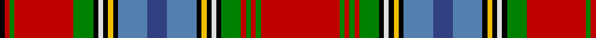

In pattern [KRGRGKWKYKBBBKYKWKGRGRGR](/patterns/krgrgkwkykbbbkykwkgrgrgr/).

This was sourced from weddslist.  It is a [24 stripes tartan](/stripes/stripes24/).

Original link http://www.weddslist.com/cgi-bin/tartans/pg.pl?source=sts

## Thread count
K/2 R2 G2 R24 G8 K2 LN2 K2 Y2 K2 Ba12 B8 Ba12 K2 Y2 K2 LN2 K2 G8 R2 G2 R2 G2 R/32

## Palette
Each colour and its ΔE from the base-6 reference it is a variant of.

| Colour | Shade | Base | ΔE (OKLab) |
|---|---|---|---|
| B | <code style="background-color:#304080;">#304080</code> `#304080` | B <code style="background-color:#2A418A;">#2A418A</code> | 0.02 |
| Ba | <code style="background-color:#5480B0;">#5480B0</code> `#5480B0` | B <code style="background-color:#2A418A;">#2A418A</code> | 0.19 |
| G | <code style="background-color:#008000;">#008000</code> `#008000` | G <code style="background-color:#006100;">#006100</code> | 0.10 |
| K | <code style="background-color:#000000;">#000000</code> `#000000` | K <code style="background-color:#000000;">#000000</code> | 0.00 |
| LN | <code style="background-color:#E0E0E0;">#E0E0E0</code> `#E0E0E0` | W <code style="background-color:#F7F7F7;">#F7F7F7</code> | 0.07 |
| R | <code style="background-color:#C00000;">#C00000</code> `#C00000` | R <code style="background-color:#CC0000;">#CC0000</code> | 0.03 |
| Y | <code style="background-color:#F0C000;">#F0C000</code> `#F0C000` | Y <code style="background-color:#F2BF00;">#F2BF00</code> | 0.00 |

## Nearest tartans

The nearest existing variants by ΔTartan distance.

1. [Macan of Lurgyvallan Portrait Tartan Tartan Number: 1155. Earliest known date: 1831 The portrait of 'Captain Macan of Lurgyvallan painted and presented to him by his sincere friend William MacKenzie, 24th Oct. 1831' was recently sold at auction in London. The watercolour measured 10 by 7 inches. The chief (three eagles feathers) is wearing full Highland Dress. The tartan is a sort of MacLean of Duart, in the red Stewart group, but showing the MacLean inversion. No such person or clan or tartan or chief ever existed. See products available Copyright © Blair Urquhart, Comrie, 2015](/setts/s24/r32g2r2g2r2g8k2w2k2y2k2b12ba8b12k2y2k2w2k2g8r24g2r2k2-b5c8ca8-ba2c2c80-g006818-k101010-rc80000-we0e0e0-ye8c000/) — ΔT 0.49
1. [Macan of Lurgyvallan](/setts/s24/r64g4r4g4r4g16k4w4k4y4k4b24ba16b24k4y4k4w4k4g16r48g4r4k4-b5c8ca8-ba2c2c80-g006818-k101010-rc80000-wc0c0c0-ye8c000/) — ΔT 0.58
1. [Hay, or Leith](/setts/s23/k6r2y2k4r32b4r2y2r4ba30r2k30w2g30r4y2r2g4r32k4y2r2k6-b800080-ba304080-g008000-k000000-rc00000-we0e0e0-yf0c000/) — ΔT 1.05
1. [Fitzgerald Dress](/setts/s25/w8k4r12b12r12ra12r76ra12r12b12r12b116y12g116r12b12r12ra12r76ra12r12b12r12k4w8-b000088-g007800-k000000-rc40000-ra9c0030-we0e0e0-y9c9c00/) — ΔT 1.21
1. [Hay or Leith Clan Tartan Tartan Number: 1215. Earliest known date: 1810-15 Also recorded by Logan and Wilson in the Wilson's pattern books. The Hay Leith connection is believed to have come about through a marriage between the two families. At Delgattie Castle, Turriff, there is a Clan Hay centre and Leith Hall, home of the Leith-Hays, is owned by the National Trust for Scotland. See products available Copyright © Blair Urquhart, Comrie, 2015](/setts/s23/k6r2y2k4r32b4r2y2r4b30r2k30w2g30r4y2r2g4r32k4y2r2k6-b780078-g006818-k101010-rc80000-we0e0e0-ye8c000/) — ΔT 1.28
1. [Canadian Dental Association (Corp.)](/setts/s18/r16k6ra30k2w6k2ra16k2w6k2r38k4y4k4g4k4r4k4-g006818-k101010-rc80000-ra888888-we0e0e0-yfccc00/) — ΔT 1.32
1. [Inverclyde](/setts/s20/b10ba4b18bb20bc4bb8bc4g20r66w4r66g20bc4bb8bc4bb20b18ba4b10w6-b202060-ba2c2c80-bb5c5c5c-bc2888c4-g006818-rc80000-we0e0e0/) — ΔT 1.32
1. [Palmer, General W.J.](/setts/s16/r8ra4w4ra46w4ra4r8ra4w4ra4w24b12y4k8ba4w4-b003c64-ba646464-k000000-re87878-ra743838-wc8c8c8-ye8c000/) — ΔT 1.32
1. [MacGlashan (Clan?)](/setts/s16/r48k4w4b12w4y4r4k4r4y4w4ba12k4r6y6w4-b5c5c5c-ba2474e8-k101010-r880000-we0e0e0-yd09800/) — ΔT 1.34
1. [Leith, (Hay)](/setts/s23/k6r2y2k4r32b4r2y2r4b30r2k30w2g30r4y2r2g4r32k4y2r2k6-b304080-g008000-k000000-rc00000-we0e0e0-yf0c000/) — ΔT 1.35

## Neighbour map

Every grey dot is one of 15726 variants placed by the first two principal components of the ΔTartan feature space (44% of its variance). Red is this tartan; blue dots are its nearest — click one to open its page.

<svg viewBox="0 0 640 380" role="img" style="max-width:100%;height:auto;border:1px solid #e0e0e0;border-radius:4px;display:block" xmlns="http://www.w3.org/2000/svg"><image href="/nn/cloud.v1.png" width="640" height="380"/><a href="/setts/s24/r32g2r2g2r2g8k2w2k2y2k2b12ba8b12k2y2k2w2k2g8r24g2r2k2-b5c8ca8-ba2c2c80-g006818-k101010-rc80000-we0e0e0-ye8c000/"><circle cx="178.3" cy="40.9" r="4" fill="#3465a4"><title>Macan of Lurgyvallan Portrait Tartan Tartan Number: 1155. Earliest known date: 1831 The portrait of 'Captain Macan of Lurgyvallan painted and presented to him by his sincere friend William MacKenzie, 24th Oct. 1831' was recently sold at auction in London. The watercolour measured 10 by 7 inches. The chief (three eagles feathers) is wearing full Highland Dress. The tartan is a sort of MacLean of Duart, in the red Stewart group, but showing the MacLean inversion. No such person or clan or tartan or chief ever existed. See products available Copyright © Blair Urquhart, Comrie, 2015</title></circle></a><a href="/setts/s24/r64g4r4g4r4g16k4w4k4y4k4b24ba16b24k4y4k4w4k4g16r48g4r4k4-b5c8ca8-ba2c2c80-g006818-k101010-rc80000-wc0c0c0-ye8c000/"><circle cx="181.1" cy="42.3" r="4" fill="#3465a4"><title>Macan of Lurgyvallan</title></circle></a><a href="/setts/s23/k6r2y2k4r32b4r2y2r4ba30r2k30w2g30r4y2r2g4r32k4y2r2k6-b800080-ba304080-g008000-k000000-rc00000-we0e0e0-yf0c000/"><circle cx="130.4" cy="41.5" r="4" fill="#3465a4"><title>Hay, or Leith</title></circle></a><a href="/setts/s25/w8k4r12b12r12ra12r76ra12r12b12r12b116y12g116r12b12r12ra12r76ra12r12b12r12k4w8-b000088-g007800-k000000-rc40000-ra9c0030-we0e0e0-y9c9c00/"><circle cx="179.2" cy="18.1" r="4" fill="#3465a4"><title>Fitzgerald Dress</title></circle></a><a href="/setts/s23/k6r2y2k4r32b4r2y2r4b30r2k30w2g30r4y2r2g4r32k4y2r2k6-b780078-g006818-k101010-rc80000-we0e0e0-ye8c000/"><circle cx="174.1" cy="61.4" r="4" fill="#3465a4"><title>Hay or Leith Clan Tartan Tartan Number: 1215. Earliest known date: 1810-15 Also recorded by Logan and Wilson in the Wilson's pattern books. The Hay Leith connection is believed to have come about through a marriage between the two families. At Delgattie Castle, Turriff, there is a Clan Hay centre and Leith Hall, home of the Leith-Hays, is owned by the National Trust for Scotland. See products available Copyright © Blair Urquhart, Comrie, 2015</title></circle></a><a href="/setts/s18/r16k6ra30k2w6k2ra16k2w6k2r38k4y4k4g4k4r4k4-g006818-k101010-rc80000-ra888888-we0e0e0-yfccc00/"><circle cx="168.2" cy="64.4" r="4" fill="#3465a4"><title>Canadian Dental Association (Corp.)</title></circle></a><a href="/setts/s20/b10ba4b18bb20bc4bb8bc4g20r66w4r66g20bc4bb8bc4bb20b18ba4b10w6-b202060-ba2c2c80-bb5c5c5c-bc2888c4-g006818-rc80000-we0e0e0/"><circle cx="171.9" cy="66.7" r="4" fill="#3465a4"><title>Inverclyde</title></circle></a><a href="/setts/s16/r8ra4w4ra46w4ra4r8ra4w4ra4w24b12y4k8ba4w4-b003c64-ba646464-k000000-re87878-ra743838-wc8c8c8-ye8c000/"><circle cx="143.7" cy="71.1" r="4" fill="#3465a4"><title>Palmer, General W.J.</title></circle></a><a href="/setts/s16/r48k4w4b12w4y4r4k4r4y4w4ba12k4r6y6w4-b5c5c5c-ba2474e8-k101010-r880000-we0e0e0-yd09800/"><circle cx="202.1" cy="77.7" r="4" fill="#3465a4"><title>MacGlashan (Clan?)</title></circle></a><a href="/setts/s23/k6r2y2k4r32b4r2y2r4b30r2k30w2g30r4y2r2g4r32k4y2r2k6-b304080-g008000-k000000-rc00000-we0e0e0-yf0c000/"><circle cx="149.3" cy="57.4" r="4" fill="#3465a4"><title>Leith, (Hay)</title></circle></a><circle cx="164.5" cy="36.6" r="5" fill="#c00000"/></svg>

ID: /setts/s24/r32g2r2g2r2g8k2w2k2y2k2b12ba8b12k2y2k2w2k2g8r24g2r2k2-b5480b0-ba304080-g008000-k000000-rc00000-we0e0e0-yf0c000/
