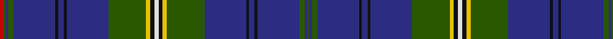

In pattern [GBGBKBKBGYKWKYGBKBKBGBGR](/stripes/gbgbkbkbgykwkygbkbkbgbgr/).

This was sourced from register-of-tartans.  It is a [24 stripe tartan](/stripes/stripes24/).

Original link https://www.tartanregister.gov.uk/tartanDetails.aspx?ref=1908

## Register references

External register numbers recorded for this tartan.

- Scottish Register of Tartans: [1908](https://www.tartanregister.gov.uk/tartanDetails.aspx?ref=1908)
- Scottish Tartans Authority (ITI): 2598
- Scottish Tartans World Register: 2598

## Thread count
R/6 G2 DB4 G8 DB60 K4 DB8 K4 DB60 G54 Y6 K6 LN6 K6 Y6 G54 DB60 K4 DB8 K4 DB60 G8 DB4 G/2

## Palette
Each colour and the base-6 reference it is a variant of.

| Colour | Shade | Base |
|---|---|---|
| DB | <code style="background-color:#2C2C80;">#2C2C80</code> `oklch(35.0% 0.138 276.6)` <small>#2C2C80</small> | B <code style="background-color:#2A418A;">#2A418A</code> |
| G | <code style="background-color:#285800;">#285800</code> `oklch(41.0% 0.122 135.8)` <small>#285800</small> | G <code style="background-color:#006100;">#006100</code> |
| K | <code style="background-color:#101010;">#101010</code> `oklch(17.3% 0.000 89.9)` <small>#101010</small> | K <code style="background-color:#000000;">#000000</code> |
| LN | <code style="background-color:#E0E0E0;">#E0E0E0</code> `oklch(90.7% 0.000 89.9)` <small>#E0E0E0</small> | W <code style="background-color:#F7F7F7;">#F7F7F7</code> |
| R | <code style="background-color:#C80000;">#C80000</code> `oklch(52.3% 0.215 29.2)` <small>#C80000</small> | R <code style="background-color:#CC0000;">#CC0000</code> |
| Y | <code style="background-color:#E8C000;">#E8C000</code> `oklch(81.9% 0.168 93.7)` <small>#E8C000</small> | Y <code style="background-color:#F2BF00;">#F2BF00</code> |

## Nearest tartans

The nearest existing variants by ΔTartan distance, with this tartan at the top so the swatches line up against it.

ΔTartan

Tartan

Sett

—

<a href="/ttd/edit/#slug=r3dg1db2dg4db30k2db4k2db30dg27ly3k3w3~x2">Joss</a> <a class="nn-out" href="/setts/s24/r3dg1db2dg4db30k2db4k2db30dg27ly3k3w3~x2/" title="open its dictionary page">↗</a>

0.92

<a href="/ttd/edit/#slug=db24k2db24k1lb1k1g12r2k2r2g12k1lb1k1db24r2lb2g2db24k1lb1k1g12r2k2r2g12k1lb1k1~x2">Italian</a> <a class="nn-out" href="/setts/s30/db24k2db24k1lb1k1g12r2k2r2g12k1lb1k1db24r2lb2g2db24k1lb1k1g12r2k2r2g12k1lb1k1~x2/" title="open its dictionary page">↗</a>

1.26

<a href="/ttd/edit/#slug=db2k2db2k21db2r2g21db2k2db2t2db21db21lr1db21t2~x2">Westminster College</a> <a class="nn-out" href="/setts/s16/db2k2db2k21db2r2g21db2k2db2t2db21db21lr1db21t2~x2/" title="open its dictionary page">↗</a>

1.31

<a href="/ttd/edit/#slug=r3dg1db2dg4db30k2db4k2db30dg27ly3k3w3~x2">Joss (Clan)</a> <a class="nn-out" href="/setts/s13/r3dg1db2dg4db30k2db4k2db30dg27ly3k3w3~x2/" title="open its dictionary page">↗</a>

1.36

<a href="/ttd/edit/#slug=db15k1dg1k1dg1k1db5k1w1k1db5k1ly1k1dg5k1r1~x2">Cockburn Blue</a> <a class="nn-out" href="/setts/s17/db15k1dg1k1dg1k1db5k1w1k1db5k1ly1k1dg5k1r1~x2/" title="open its dictionary page">↗</a>

1.37

<a href="/setts/s18/db6w1db40m1k12dg12m6dg2dp2dg4~x2/">Scotland the Brave</a>

1.39

<a href="/ttd/edit/#slug=db40g10lo1g5r5w1r2w1r5g5lo1g10db40ly2~x2">St. Andrew Quebec City</a> <a class="nn-out" href="/setts/s14/db40g10lo1g5r5w1r2w1r5g5lo1g10db40ly2~x2/" title="open its dictionary page">↗</a>

1.41

<a href="/ttd/edit/#slug=db67dy5g10r5ly2r5g10dy5db4dy5g10r5o2r5dy5g10db24">Indianapolis MPD Emerald Society</a> <a class="nn-out" href="/setts/s17/db67dy5g10r5ly2r5g10dy5db4dy5g10r5o2r5dy5g10db24/" title="open its dictionary page">↗</a>

1.45

<a href="/setts/s20/b14db4g2db2g3db2b17db31b1db1w2~x2/">Schiehallion</a>

1.48

<a href="/ttd/edit/#slug=db60ly2db2ly2db5k15db5g20r2k3r2g20db5k15g5db20ly2g4~x2">Whitworth (Name)</a> <a class="nn-out" href="/setts/s18/db60ly2db2ly2db5k15db5g20r2k3r2g20db5k15g5db20ly2g4~x2/" title="open its dictionary page">↗</a>

1.49

<a href="/ttd/edit/#slug=db24k2db24k1lb1k1k12r2k2r2k12k1lb1k1db24r2lb2g2db24k1lb1k1k12r2k2r2k12k1lb1k1~x2">Italian (Fashion)</a> <a class="nn-out" href="/setts/s30/db24k2db24k1lb1k1k12r2k2r2k12k1lb1k1db24r2lb2g2db24k1lb1k1k12r2k2r2k12k1lb1k1~x2/" title="open its dictionary page">↗</a>

## Neighbour map

Every grey dot is one of 14299 variants placed by the first two principal components of the ΔTartan feature space (44% of its variance). Red is this tartan; blue dots are its nearest — click one to open its page.

<svg viewBox="0 0 640 380" role="img" style="max-width:100%;height:auto;border:1px solid #e0e0e0;border-radius:4px;display:block" xmlns="http://www.w3.org/2000/svg"><image href="/nn/cloud.v1.png" width="640" height="380"/><a href="/setts/s30/db24k2db24k1lb1k1g12r2k2r2g12k1lb1k1db24r2lb2g2db24k1lb1k1g12r2k2r2g12k1lb1k1~x2/"><circle cx="306.1" cy="70.2" r="4" fill="#3465a4"><title>Italian</title></circle></a><a href="/setts/s16/db2k2db2k21db2r2g21db2k2db2t2db21db21lr1db21t2~x2/"><circle cx="336.2" cy="124.2" r="4" fill="#3465a4"><title>Westminster College</title></circle></a><a href="/setts/s13/r3dg1db2dg4db30k2db4k2db30dg27ly3k3w3~x2/"><circle cx="343.5" cy="97.8" r="4" fill="#3465a4"><title>Joss (Clan)</title></circle></a><a href="/setts/s17/db15k1dg1k1dg1k1db5k1w1k1db5k1ly1k1dg5k1r1~x2/"><circle cx="319.2" cy="110.4" r="4" fill="#3465a4"><title>Cockburn Blue</title></circle></a><a href="/setts/s18/db6w1db40m1k12dg12m6dg2dp2dg4~x2/"><circle cx="322.3" cy="77.9" r="4" fill="#3465a4"><title>Scotland the Brave</title></circle></a><a href="/setts/s14/db40g10lo1g5r5w1r2w1r5g5lo1g10db40ly2~x2/"><circle cx="387.1" cy="74.4" r="4" fill="#3465a4"><title>St. Andrew Quebec City</title></circle></a><a href="/setts/s17/db67dy5g10r5ly2r5g10dy5db4dy5g10r5o2r5dy5g10db24/"><circle cx="326.2" cy="76.4" r="4" fill="#3465a4"><title>Indianapolis MPD Emerald Society</title></circle></a><a href="/setts/s20/b14db4g2db2g3db2b17db31b1db1w2~x2/"><circle cx="384.4" cy="108.1" r="4" fill="#3465a4"><title>Schiehallion</title></circle></a><a href="/setts/s18/db60ly2db2ly2db5k15db5g20r2k3r2g20db5k15g5db20ly2g4~x2/"><circle cx="313.3" cy="97.3" r="4" fill="#3465a4"><title>Whitworth (Name)</title></circle></a><a href="/setts/s30/db24k2db24k1lb1k1k12r2k2r2k12k1lb1k1db24r2lb2g2db24k1lb1k1k12r2k2r2k12k1lb1k1~x2/"><circle cx="354.6" cy="93.3" r="4" fill="#3465a4"><title>Italian (Fashion)</title></circle></a><circle cx="351.7" cy="80.4" r="5" fill="#c00000"/></svg>

ID: /setts/s24/r3dg1db2dg4db30k2db4k2db30dg27ly3k3w3~x2/
