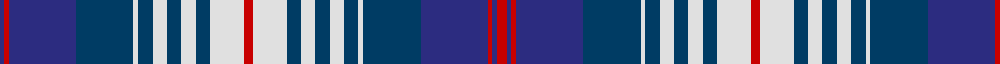

In pattern [BRBBWBWBWBWRWBWBWBWBBRBR](/patterns/brbbwbwbwbwrwbwbwbwbbrbr/).

This was sourced from register-of-tartans.  It is a [24 stripes tartan](/stripes/stripes24/).

Original link https://www.tartanregister.gov.uk/tartanDetails.aspx?ref=1746

## Thread count
DB/2 R2 DB28 DBa24 LN2 DBa6 LN6 DBa6 LN6 DBa6 LN14 R4 LN14 DBa6 LN6 DBa6 LN6 DBa6 LN2 DBa24 DB28 R2 DB2 R/4

## Palette
Each colour and its ΔE from the base-6 reference it is a variant of.

| Colour | Shade | Base | ΔE (OKLab) |
|---|---|---|---|
| DB | <code style="background-color:#2C2C80;">#2C2C80</code> `#2C2C80` | B <code style="background-color:#2C4084;">#2C4084</code> | 0.05 |
| DBa | <code style="background-color:#003C64;">#003C64</code> `#003C64` | B <code style="background-color:#2C4084;">#2C4084</code> | 0.07 |
| LN | <code style="background-color:#E0E0E0;">#E0E0E0</code> `#E0E0E0` | W <code style="background-color:#F4F4F0;">#F4F4F0</code> | 0.06 |
| R | <code style="background-color:#C80000;">#C80000</code> `#C80000` | R <code style="background-color:#C80000;">#C80000</code> | 0.00 |

## Nearest tartans

The nearest existing variants by ΔTartan distance.

1. [Scottish Knights Templar St. Andrews](/setts/s22/b4r2k4w6k8w8k8w10k12b40r2w8r2b40k12w10k8w8k8w6k4r2-b2c2c80-k101010-rc80000-wc0c0c0/) — ΔT 1.03
1. [Hogmany Plaid (Fashion)](/setts/s13/r4w14b6w6b6w6b6w2b24ba28r2ba2r4-b003c64-ba2c2c80-rc80000-we0e0e0/) — ΔT 1.28
1. [Scottish Knights Templar Militi Templi Scotia](/setts/s18/b4r4k4w6k8w10k12b40r4w8r4b40k12w10k8w6k4r4-b2c2c80-k101010-rc80000-wc0c0c0/) — ΔT 1.30
1. [Wcwm 1586](/setts/s18/b6w16r4w4r4w4r16k4r4k4r4k16w4b44w4b4r4b6-b3474fc-k000000-ra0783c-wf0f0b0/) — ΔT 1.30
1. [Royal Canadian Air Force](/setts/s18/r8w12k2r4k2w28k6w6k4r4k4r4b8r4b12r4b12r4-b000064-k000000-r8b1c62-wd0d0d0/) — ΔT 1.32
1. [Anderson Blue (Westwood)](/setts/s18/r8b10r4b14r20k8y4k4y4k8w8k8b36r2k4r2b8r6-b2474e8-k101010-r880000-wc0c0c0-yd09800/) — ΔT 1.32
1. [Historic Scotland (1998)](/setts/s22/b8w8b4ba4b36ba4b4r26b2r26g2b5g2r26b2r26b4ba4b36ba4b4w8-b202060-ba780078-g006818-r888888-we0e0e0/) — ΔT 1.41
1. [Hanna of Stirlingshire](/setts/s18/k4y8k8y8k4y16k4b36ya4b36k4y16k4y8k8y8k4r4-b1c0070-k101010-r880000-yb8b8b8-yad09800/) — ΔT 1.41
1. [Chartered Institute of Bankers](/setts/s20/k34g5k5g8k5g56w5g5w36y5w36g5w5g56k5g8k5g5k34y5-g808080-k101010-w98d0f0-ye8c000/) — ΔT 1.48
1. [Alberta, Quebec, Nova Scotia.](/setts/s22/b8g20k4b4w28k4g4k4g4k4g4k4g4k4b50w16g8k8b6k2b6k2-b2c4084-g005020-k101010-we0e0e0/) — ΔT 1.51

## Neighbour map

Every grey dot is one of 15726 variants placed by the first two principal components of the ΔTartan feature space (44% of its variance). Red is this tartan; blue dots are its nearest — click one to open its page.

<svg viewBox="0 0 640 380" role="img" style="max-width:100%;height:auto;border:1px solid #e0e0e0;border-radius:4px;display:block" xmlns="http://www.w3.org/2000/svg"><image href="/nn/cloud.v1.png" width="640" height="380"/><a href="/setts/s22/b4r2k4w6k8w8k8w10k12b40r2w8r2b40k12w10k8w8k8w6k4r2-b2c2c80-k101010-rc80000-wc0c0c0/"><circle cx="197.7" cy="103.3" r="4" fill="#3465a4"><title>Scottish Knights Templar St. Andrews</title></circle></a><a href="/setts/s13/r4w14b6w6b6w6b6w2b24ba28r2ba2r4-b003c64-ba2c2c80-rc80000-we0e0e0/"><circle cx="173.2" cy="140.8" r="4" fill="#3465a4"><title>Hogmany Plaid (Fashion)</title></circle></a><a href="/setts/s18/b4r4k4w6k8w10k12b40r4w8r4b40k12w10k8w6k4r4-b2c2c80-k101010-rc80000-wc0c0c0/"><circle cx="198.1" cy="138.3" r="4" fill="#3465a4"><title>Scottish Knights Templar Militi Templi Scotia</title></circle></a><a href="/setts/s18/b6w16r4w4r4w4r16k4r4k4r4k16w4b44w4b4r4b6-b3474fc-k000000-ra0783c-wf0f0b0/"><circle cx="148.7" cy="112.7" r="4" fill="#3465a4"><title>Wcwm 1586</title></circle></a><a href="/setts/s18/r8w12k2r4k2w28k6w6k4r4k4r4b8r4b12r4b12r4-b000064-k000000-r8b1c62-wd0d0d0/"><circle cx="131.1" cy="126.1" r="4" fill="#3465a4"><title>Royal Canadian Air Force</title></circle></a><a href="/setts/s18/r8b10r4b14r20k8y4k4y4k8w8k8b36r2k4r2b8r6-b2474e8-k101010-r880000-wc0c0c0-yd09800/"><circle cx="183.5" cy="110.7" r="4" fill="#3465a4"><title>Anderson Blue (Westwood)</title></circle></a><a href="/setts/s22/b8w8b4ba4b36ba4b4r26b2r26g2b5g2r26b2r26b4ba4b36ba4b4w8-b202060-ba780078-g006818-r888888-we0e0e0/"><circle cx="226.2" cy="100.1" r="4" fill="#3465a4"><title>Historic Scotland (1998)</title></circle></a><a href="/setts/s18/k4y8k8y8k4y16k4b36ya4b36k4y16k4y8k8y8k4r4-b1c0070-k101010-r880000-yb8b8b8-yad09800/"><circle cx="142.8" cy="127.8" r="4" fill="#3465a4"><title>Hanna of Stirlingshire</title></circle></a><a href="/setts/s20/k34g5k5g8k5g56w5g5w36y5w36g5w5g56k5g8k5g5k34y5-g808080-k101010-w98d0f0-ye8c000/"><circle cx="201.2" cy="121.6" r="4" fill="#3465a4"><title>Chartered Institute of Bankers</title></circle></a><a href="/setts/s22/b8g20k4b4w28k4g4k4g4k4g4k4g4k4b50w16g8k8b6k2b6k2-b2c4084-g005020-k101010-we0e0e0/"><circle cx="184.1" cy="84.4" r="4" fill="#3465a4"><title>Alberta, Quebec, Nova Scotia.</title></circle></a><circle cx="168.8" cy="117.7" r="5" fill="#c00000"/></svg>

ID: /setts/s24/r4b2r2b28ba24w2ba6w6ba6w6ba6w14r4w14ba6w6ba6w6ba6w2ba24b28r2b2-b2c2c80-ba003c64-rc80000-we0e0e0/
