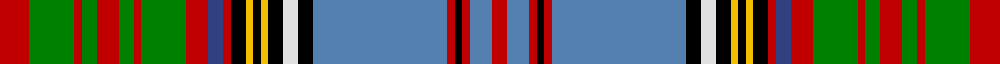

In pattern [RBRKRBKWKYKYKRBRGRGRGRGR](/stripes/rbrkrbkwkykykrbrgrgrgrgr/).

This was sourced from weddslist.  It is a [24 stripe tartan](/stripes/stripes24/).

Original link http://www.weddslist.com/cgi-bin/tartans/pg.pl?source=sts

## Thread count
R/8 G12 R2 G4 R6 G4 R2 G12 R6 B4 R2 K4 Y2 K2 Y2 K4 LN4 K4 Ba36 R2 K2 R2 Ba6 R/4

## Palette
Each colour and the base-6 reference it is a variant of.

| Colour | Shade | Base |
|---|---|---|
| B | <code style="background-color:#304080;">#304080</code> `oklch(39.4% 0.109 270.2)` <small>#304080</small> | B <code style="background-color:#2A418A;">#2A418A</code> |
| Ba | <code style="background-color:#5480B0;">#5480B0</code> `oklch(58.8% 0.089 251.5)` <small>#5480B0</small> | B <code style="background-color:#2A418A;">#2A418A</code> |
| G | <code style="background-color:#008000;">#008000</code> `oklch(52.0% 0.177 142.5)` <small>#008000</small> | G <code style="background-color:#006100;">#006100</code> |
| K | <code style="background-color:#000000;">#000000</code> `oklch(0.0% 0.000 0.0)` <small>#000000</small> | K <code style="background-color:#000000;">#000000</code> |
| LN | <code style="background-color:#E0E0E0;">#E0E0E0</code> `oklch(90.7% 0.000 89.9)` <small>#E0E0E0</small> | W <code style="background-color:#F7F7F7;">#F7F7F7</code> |
| R | <code style="background-color:#C00000;">#C00000</code> `oklch(50.7% 0.208 29.2)` <small>#C00000</small> | R <code style="background-color:#CC0000;">#CC0000</code> |
| Y | <code style="background-color:#F0C000;">#F0C000</code> `oklch(82.7% 0.169 90.5)` <small>#F0C000</small> | Y <code style="background-color:#F2BF00;">#F2BF00</code> |

## Nearest tartans

The nearest existing variants by ΔTartan distance.

1. [Anderson (MacGregor-Hastie #4)](/setts/s24/r4dg6r1dg2r3dg2r1dg6r3db2r1k2ly1k1ly1k2w2k2t18r1k1r1t3r2~x2/) — ΔT 0.54
1. [Whisky](/setts/s20/ly10k2w3k6o4k2lb8k2o4k6lb3lr49lo4k42o42ly6o6ly6o6ly8/) — ΔT 0.78
1. [Anderson 5](/setts/s20/r4g6r2g6r3db4r1k4ly1k1ly1k3w3k3t18r1k2r1t6r3~x2/) — ΔT 0.85
1. [Anderson (Paton)](/setts/s22/dy6t12k2r3k2t40k6w6k6ly3k3ly3k12r3db12r3dy14k2r3k2dy14r5/) — ΔT 0.93
1. [Bethune Name Tartan Tartan Number: 2428. Earliest known date: pre 1997 Designed by Phil Smith - same as Macbeth but with the addition of a light blue stripe in the middle of the darker blue ground. Count said to be from William MacIntosh & Co. See products available Copyright © Blair Urquhart, Comrie, 2015](/setts/s24/db18ly4k5ly1k1w1k2g8r6k1r3w1r3k1r6g8k2w1k1ly1k5ly4db18t2~x4/) — ΔT 0.95
1. [Anderson 1](/setts/s22/o6t12k2r3k2t40k6w6k6ly3k3ly3k12r3db12r3o14k2r3k2o14r5/) — ΔT 1.03
1. [Whiskey & Bourbon (Corporate)](/setts/s32/ly8k2w3k4lo3k2t6k2lo3k4t3db44k4lo4k4dy5lo5dy5lo6dy5lo5dy5k4dy5ly5dy5ly6dy5ly5dy5k4w6/) — ΔT 1.03
1. [Anderson 3](/setts/s24/r3g6r1db1r2db1r1g6r2db4r1k4ly1k2ly1k2w3db4t14r1db1r1t4r3~x2/) — ΔT 1.03
1. [Whiskey & Bourbon](/setts/s32/ly8k2w3k4y3k2lb6k2y3k4lb3t44k4y4k4dy5y5dy5y6dy5y5dy5k4dy5ly5dy5ly6dy5ly5dy5k4w6/) — ΔT 1.04
1. [Hunter (Wilsons)](/setts/s30/w2r8w2k15g4w2t5w2g20w2r32w2g20g3ly3r2w2r2ly3g3g20g2g20w2t5w2k15w2r8w2~x2/) — ΔT 1.06

## Neighbour map

Every grey dot is one of 14299 variants placed by the first two principal components of the ΔTartan feature space (44% of its variance). Red is this tartan; blue dots are its nearest — click one to open its page.

<svg viewBox="0 0 640 380" role="img" style="max-width:100%;height:auto;border:1px solid #e0e0e0;border-radius:4px;display:block" xmlns="http://www.w3.org/2000/svg"><image href="/nn/cloud.v1.png" width="640" height="380"/><a href="/setts/s24/r4dg6r1dg2r3dg2r1dg6r3db2r1k2ly1k1ly1k2w2k2t18r1k1r1t3r2~x2/"><circle cx="112.6" cy="47.4" r="4" fill="#3465a4"><title>Anderson (MacGregor-Hastie #4)</title></circle></a><a href="/setts/s20/ly10k2w3k6o4k2lb8k2o4k6lb3lr49lo4k42o42ly6o6ly6o6ly8/"><circle cx="113.5" cy="36.4" r="4" fill="#3465a4"><title>Whisky</title></circle></a><a href="/setts/s20/r4g6r2g6r3db4r1k4ly1k1ly1k3w3k3t18r1k2r1t6r3~x2/"><circle cx="83.0" cy="60.0" r="4" fill="#3465a4"><title>Anderson 5</title></circle></a><a href="/setts/s22/dy6t12k2r3k2t40k6w6k6ly3k3ly3k12r3db12r3dy14k2r3k2dy14r5/"><circle cx="108.0" cy="56.7" r="4" fill="#3465a4"><title>Anderson (Paton)</title></circle></a><a href="/setts/s24/db18ly4k5ly1k1w1k2g8r6k1r3w1r3k1r6g8k2w1k1ly1k5ly4db18t2~x4/"><circle cx="103.1" cy="51.8" r="4" fill="#3465a4"><title>Bethune Name Tartan Tartan Number: 2428. Earliest known date: pre 1997 Designed by Phil Smith - same as Macbeth but with the addition of a light blue stripe in the middle of the darker blue ground. Count said to be from William MacIntosh &amp; Co. See products available Copyright © Blair Urquhart, Comrie, 2015</title></circle></a><a href="/setts/s22/o6t12k2r3k2t40k6w6k6ly3k3ly3k12r3db12r3o14k2r3k2o14r5/"><circle cx="91.8" cy="47.1" r="4" fill="#3465a4"><title>Anderson 1</title></circle></a><a href="/setts/s32/ly8k2w3k4lo3k2t6k2lo3k4t3db44k4lo4k4dy5lo5dy5lo6dy5lo5dy5k4dy5ly5dy5ly6dy5ly5dy5k4w6/"><circle cx="58.3" cy="20.8" r="4" fill="#3465a4"><title>Whiskey &amp; Bourbon (Corporate)</title></circle></a><a href="/setts/s24/r3g6r1db1r2db1r1g6r2db4r1k4ly1k2ly1k2w3db4t14r1db1r1t4r3~x2/"><circle cx="42.7" cy="66.1" r="4" fill="#3465a4"><title>Anderson 3</title></circle></a><a href="/setts/s32/ly8k2w3k4y3k2lb6k2y3k4lb3t44k4y4k4dy5y5dy5y6dy5y5dy5k4dy5ly5dy5ly6dy5ly5dy5k4w6/"><circle cx="49.8" cy="16.8" r="4" fill="#3465a4"><title>Whiskey &amp; Bourbon</title></circle></a><a href="/setts/s30/w2r8w2k15g4w2t5w2g20w2r32w2g20g3ly3r2w2r2ly3g3g20g2g20w2t5w2k15w2r8w2~x2/"><circle cx="111.9" cy="44.2" r="4" fill="#3465a4"><title>Hunter (Wilsons)</title></circle></a><circle cx="98.7" cy="41.5" r="5" fill="#c00000"/></svg>

ID: /setts/s24/r4g6r1g2r3g2r1g6r3db2r1k2ly1k1ly1k2w2k2t18r1k1r1t3r2~x2/
