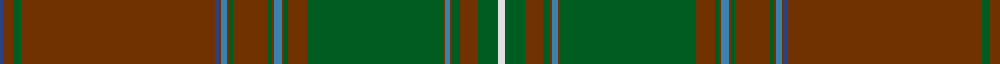

**Bands:** [BGGGBGBGGGGGBGGGGGBGGGGW](/stripes/bgggbgbgggggbgggggbggggw/) · **Stripes:** [DB DY DG DY DB DY T DY DG DY DG DY T DY DG DY DG DY T DY DG DY DG W](/stripes/stripes24/) DB DY DG DY DB DY T DY DG DY DG DY T DY DG DY DG DY T DY DG DY DG W

This was sourced from register-of-tartans.  It is a [24 band tartan](/bands/bands24/).

Original link https://www.tartanregister.gov.uk/tartanDetails.aspx?ref=4347

## Register references

External register numbers recorded for this tartan.

- Scottish Register of Tartans: [4347](https://www.tartanregister.gov.uk/tartanDetails.aspx?ref=4347)
- Scottish Tartans World Register: 606

## Thread count
B/4 T10 G8 T198 B4 T2 Ba6 T2 G4 T36 G4 T2 Ba8 T2 G4 T20 G138 T2 Ba6 T2 G8 T18 G20 LN/8

## Palette
Each colour and its ΔE from the base-6 reference it is a variant of.

| Colour | Shade | Base | ΔE (OKLab) |
|---|---|---|---|
| B | <code style="background-color:#2C4084;">#2C4084</code> `#2C4084` | B <code style="background-color:#2A418A;">#2A418A</code> | 0.01 |
| Ba | <code style="background-color:#3C82AF;">#3C82AF</code> `#3C82AF` | B <code style="background-color:#2A418A;">#2A418A</code> | 0.19 |
| G | <code style="background-color:#005C20;">#005C20</code> `#005C20` | G <code style="background-color:#006100;">#006100</code> | 0.03 |
| LN | <code style="background-color:#E0E0E0;">#E0E0E0</code> `#E0E0E0` | W <code style="background-color:#F7F7F7;">#F7F7F7</code> | 0.07 |
| T | <code style="background-color:#703200;">#703200</code> `#703200` | G <code style="background-color:#006100;">#006100</code> | 0.18 |

## Nearest tartans

The nearest existing variants by ΔTartan distance.

1. [Unidentified Plaid 1](/setts/s24/w4g10o9g4o1t3o1g69o10g2o1t4o1g2o18g2o1t3o1db2o99g4o5db2~x2/) — ΔT 0.23
1. [New House Highland (Corporate)](/setts/s18/lo3k1r22k1r1k10dg1r1dg11k1r4k1dg8k1r4k1dg48k1~x2/) — ΔT 2.02
1. [Gudbrandsdalen of Mannsdrakt](/setts/s16/dg44r3do6dg6r2do1dg2r10dg2do1r2dg6do6r3lr1r42~x4/) — ΔT 2.06
1. [Murphy and his Gang (Phoenix Arizona) (Personal)](/setts/s20/dg29n1dg2n2dg2n3dg2n5r1k1r1n5dg2n3dg2n2dg2n1dg14lo3~x2/) — ΔT 2.06
1. [Austrian Bowhunters Hunting](/setts/s20/dg40k2r3k2dg3k3r3k3r3k3r5ly1r5k3dg3k2r3k2dg3k3~x2/) — ΔT 2.09
1. [Tomatin Distillery](/setts/s12/do9k8y15dy50k3r2k2dg1k2do1k1dy9~x2/) — ΔT 2.10
1. [Ellis Island](/setts/s13/o68k1dg6b4dg1b12w1dg6ly1dg24ly1dg2ly3~x2/) — ΔT 2.18
1. [Brewer](/setts/s19/g3r2b1r19g1r1g1r8g1b8r1g8r1g1r1g28ly1g2m2~x2/) — ΔT 2.18
1. [Ridgeback (Corporate)](/setts/s12/g74o6g3o24k1g9o12db2g2db2g2db2~x2/) — ΔT 2.26
1. [Berry Tribute](/setts/s12/dg43dp3o3dp2o4r3g2dg13g2o9dg1lo2~x2/) — ΔT 2.29

## Neighbour map

Every grey dot is one of 14313 variants placed by the first two principal components of the ΔTartan feature space (44% of its variance). Red is this tartan; blue dots are its nearest — click one to open its page.

<svg viewBox="0 0 640 380" role="img" style="max-width:100%;height:auto;border:1px solid #e0e0e0;border-radius:4px;display:block" xmlns="http://www.w3.org/2000/svg"><image href="/nn/cloud.v1.png" width="640" height="380"/><a href="/setts/s24/w4g10o9g4o1t3o1g69o10g2o1t4o1g2o18g2o1t3o1db2o99g4o5db2~x2/"><circle cx="482.7" cy="66.2" r="4" fill="#3465a4"><title>Unidentified Plaid 1</title></circle></a><a href="/setts/s18/lo3k1r22k1r1k10dg1r1dg11k1r4k1dg8k1r4k1dg48k1~x2/"><circle cx="438.3" cy="92.4" r="4" fill="#3465a4"><title>New House Highland (Corporate)</title></circle></a><a href="/setts/s16/dg44r3do6dg6r2do1dg2r10dg2do1r2dg6do6r3lr1r42~x4/"><circle cx="418.8" cy="113.0" r="4" fill="#3465a4"><title>Gudbrandsdalen of Mannsdrakt</title></circle></a><a href="/setts/s20/dg29n1dg2n2dg2n3dg2n5r1k1r1n5dg2n3dg2n2dg2n1dg14lo3~x2/"><circle cx="485.5" cy="120.8" r="4" fill="#3465a4"><title>Murphy and his Gang (Phoenix Arizona) (Personal)</title></circle></a><a href="/setts/s20/dg40k2r3k2dg3k3r3k3r3k3r5ly1r5k3dg3k2r3k2dg3k3~x2/"><circle cx="383.5" cy="84.2" r="4" fill="#3465a4"><title>Austrian Bowhunters Hunting</title></circle></a><a href="/setts/s12/do9k8y15dy50k3r2k2dg1k2do1k1dy9~x2/"><circle cx="426.3" cy="94.6" r="4" fill="#3465a4"><title>Tomatin Distillery</title></circle></a><a href="/setts/s13/o68k1dg6b4dg1b12w1dg6ly1dg24ly1dg2ly3~x2/"><circle cx="412.5" cy="71.6" r="4" fill="#3465a4"><title>Ellis Island</title></circle></a><a href="/setts/s19/g3r2b1r19g1r1g1r8g1b8r1g8r1g1r1g28ly1g2m2~x2/"><circle cx="364.2" cy="98.8" r="4" fill="#3465a4"><title>Brewer</title></circle></a><a href="/setts/s12/g74o6g3o24k1g9o12db2g2db2g2db2~x2/"><circle cx="541.1" cy="129.3" r="4" fill="#3465a4"><title>Ridgeback (Corporate)</title></circle></a><a href="/setts/s12/dg43dp3o3dp2o4r3g2dg13g2o9dg1lo2~x2/"><circle cx="467.0" cy="101.3" r="4" fill="#3465a4"><title>Berry Tribute</title></circle></a><circle cx="487.9" cy="69.8" r="5" fill="#c00000"/></svg>

ID: /setts/s24/w4dg10dy9dg4dy1t3dy1dg69dy10dg2dy1t4dy1dg2dy18dg2dy1t3dy1db2dy99dg4dy5db2~x2/
