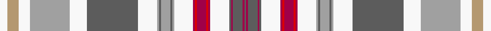

**Bands:** [BRBRBWRRRRRWYBYBYWBWYWYW](/stripes/brbrbwrrrrrwybybywbwywyw/) · **Stripes:** [N M N M N W M R M R M W LR N LR N LR W N W LR W LO W](/stripes/stripes24/) N M N M N W M R M R M W LR N LR N LR W N W LR W LO W

This was sourced from register-of-tartans.  It is a [24 band tartan](/bands/bands24/).

Original link https://www.tartanregister.gov.uk/tartanDetails.aspx?ref=10961

## Register references

External register numbers recorded for this tartan.

- Scottish Register of Tartans: [10961](https://www.tartanregister.gov.uk/tartanDetails.aspx?ref=10961)

## Thread count
W/8 LT12 W12 N42 W18 Na54 W20 N2 Na2 N10 Na2 N2 W20 Ra2 R2 Ra10 R2 Ra2 W20 Na2 Ra2 Na10 Ra2 Na/2

## Palette
Each colour and its ΔE from the base-6 reference it is a variant of.

| Colour | Shade | Base | ΔE (OKLab) |
|---|---|---|---|
| LT | <code style="background-color:#B49870;">#B49870</code> `#B49870` | Y <code style="background-color:#F2BF00;">#F2BF00</code> | 0.17 |
| N | <code style="background-color:#A0A0A0;">#A0A0A0</code> `#A0A0A0` | Y <code style="background-color:#F2BF00;">#F2BF00</code> | 0.21 |
| Na | <code style="background-color:#5C5C5C;">#5C5C5C</code> `#5C5C5C` | B <code style="background-color:#2A418A;">#2A418A</code> | 0.15 |
| R | <code style="background-color:#DC0000;">#DC0000</code> `#DC0000` | R <code style="background-color:#CC0000;">#CC0000</code> | 0.03 |
| Ra | <code style="background-color:#A00048;">#A00048</code> `#A00048` | R <code style="background-color:#CC0000;">#CC0000</code> | 0.12 |
| W | <code style="background-color:#F8F8F8;">#F8F8F8</code> `#F8F8F8` | W <code style="background-color:#F7F7F7;">#F7F7F7</code> | 0.00 |

## Nearest tartans

The nearest existing variants by ΔTartan distance.

1. [Oriflame](/setts/s24/w4lb6w6lb21w9n27w10lb1n1lb5n1lb1w10r1r1r5r1r1w10n1r1n5r1n1~x2/) — ΔT 0.91
1. [Seller, Reproduction Dress](/setts/s22/w63k4lb9ly2lb4ly2lb4dy11r8lb2r4w5~x2/) — ΔT 1.14
1. [MacBean, Meta (Personal)](/setts/s29/k6w40t5w2t5w5g12w5r5r5g2r5r5w5g10w5r5r5g2r5r5w5g12w5t5w2t5w40r6~x2/) — ΔT 1.40
1. [MacBean, Meta..](/setts/s29/k6w40t5w2t5w5g12w5r5m5g2m5r5w5g10w5r5m5g2m5r5w5g12w5t5w2t5w40r6~x2/) — ΔT 1.44
1. [Inverness County (Canada)](/setts/s16/lb18ly2lb2ly1r3g3r2g2r1k2lb3w7lb2w2lb1w4~x4/) — ΔT 1.46
1. [Highlands of Haliburton Dress](/setts/s15/t4w2t1w19r2dr4t8g4w2t3o2g2dr2r2o2~x2/) — ΔT 1.46
1. [Stewart/Stuart Dress (Four red lines)](/setts/s28/r4k3r15g42w5db3lo3db13k13w66r4w2r2w10r2w2r4w66k13db13lo3db3w5g42r15k3r4w2/) — ΔT 1.47
1. [Unidentified Plaid 15](/setts/s28/w70o7db7w7db7o7w7db5o9ly4o3w4o3g13o70g30o4r10o4g30o15db4o4db4o4db27g6db27~x2/) — ΔT 1.52
1. [Unidentified Cant #08](/setts/s26/w38db6w5k6w3k2w3k2lb24r24k2r8w2r8k2r24lb24k2w3k2w3k6w5db6w38r4/) — ΔT 1.54
1. [MacDonald Dress #3](/setts/s31/k4w2r1w7b3w23b3w7r1w2k4dg4r1dg1r1dg1r1dg1r1dg4k4r1k4r1db1r1db1r1db1r1db4~x2/) — ΔT 1.54

## Neighbour map

Every grey dot is one of 14299 variants placed by the first two principal components of the ΔTartan feature space (44% of its variance). Red is this tartan; blue dots are its nearest — click one to open its page.

<svg viewBox="0 0 640 380" role="img" style="max-width:100%;height:auto;border:1px solid #e0e0e0;border-radius:4px;display:block" xmlns="http://www.w3.org/2000/svg"><image href="/nn/cloud.v1.png" width="640" height="380"/><a href="/setts/s24/w4lb6w6lb21w9n27w10lb1n1lb5n1lb1w10r1r1r5r1r1w10n1r1n5r1n1~x2/"><circle cx="187.0" cy="46.3" r="4" fill="#3465a4"><title>Oriflame</title></circle></a><a href="/setts/s22/w63k4lb9ly2lb4ly2lb4dy11r8lb2r4w5~x2/"><circle cx="184.6" cy="14.0" r="4" fill="#3465a4"><title>Seller, Reproduction Dress</title></circle></a><a href="/setts/s29/k6w40t5w2t5w5g12w5r5r5g2r5r5w5g10w5r5r5g2r5r5w5g12w5t5w2t5w40r6~x2/"><circle cx="200.5" cy="35.6" r="4" fill="#3465a4"><title>MacBean, Meta (Personal)</title></circle></a><a href="/setts/s29/k6w40t5w2t5w5g12w5r5m5g2m5r5w5g10w5r5m5g2m5r5w5g12w5t5w2t5w40r6~x2/"><circle cx="196.9" cy="34.8" r="4" fill="#3465a4"><title>MacBean, Meta..</title></circle></a><a href="/setts/s16/lb18ly2lb2ly1r3g3r2g2r1k2lb3w7lb2w2lb1w4~x4/"><circle cx="205.8" cy="75.1" r="4" fill="#3465a4"><title>Inverness County (Canada)</title></circle></a><a href="/setts/s15/t4w2t1w19r2dr4t8g4w2t3o2g2dr2r2o2~x2/"><circle cx="133.5" cy="65.8" r="4" fill="#3465a4"><title>Highlands of Haliburton Dress</title></circle></a><a href="/setts/s28/r4k3r15g42w5db3lo3db13k13w66r4w2r2w10r2w2r4w66k13db13lo3db3w5g42r15k3r4w2/"><circle cx="174.2" cy="14.0" r="4" fill="#3465a4"><title>Stewart/Stuart Dress (Four red lines)</title></circle></a><a href="/setts/s28/w70o7db7w7db7o7w7db5o9ly4o3w4o3g13o70g30o4r10o4g30o15db4o4db4o4db27g6db27~x2/"><circle cx="147.1" cy="45.4" r="4" fill="#3465a4"><title>Unidentified Plaid 15</title></circle></a><a href="/setts/s26/w38db6w5k6w3k2w3k2lb24r24k2r8w2r8k2r24lb24k2w3k2w3k6w5db6w38r4/"><circle cx="165.5" cy="50.4" r="4" fill="#3465a4"><title>Unidentified Cant #08</title></circle></a><a href="/setts/s31/k4w2r1w7b3w23b3w7r1w2k4dg4r1dg1r1dg1r1dg1r1dg4k4r1k4r1db1r1db1r1db1r1db4~x2/"><circle cx="162.6" cy="14.7" r="4" fill="#3465a4"><title>MacDonald Dress #3</title></circle></a><circle cx="167.8" cy="34.1" r="5" fill="#c00000"/></svg>

ID: /setts/s24/w4lo6w6lr21w9n27w10lr1n1lr5n1lr1w10m1r1m5r1m1w10n1m1n5m1n1~x2/
