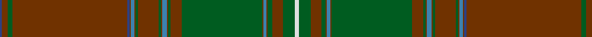

In pattern [BRGRBRBRGRGRBRGRGRBRGRGW](/patterns/brgrbrbrgrgrbrgrgrbrgrgw/).

This was sourced from register-of-tartans.  It is a [24 stripes tartan](/stripes/stripes24/).

Original link https://www.tartanregister.gov.uk/tartanDetails.aspx?ref=4347

## Thread count
B/4 T10 G8 T198 B4 T2 Ba6 T2 G4 T36 G4 T2 Ba8 T2 G4 T20 G138 T2 Ba6 T2 G8 T18 G20 LN/8

## Palette
Each colour and its ΔE from the base-6 reference it is a variant of.

| Colour | Shade | Base | ΔE (OKLab) |
|---|---|---|---|
| B | <code style="background-color:#2C4084;">#2C4084</code> `#2C4084` | B <code style="background-color:#2C4084;">#2C4084</code> | 0.00 |
| Ba | <code style="background-color:#3C82AF;">#3C82AF</code> `#3C82AF` | B <code style="background-color:#2C4084;">#2C4084</code> | 0.20 |
| G | <code style="background-color:#005C20;">#005C20</code> `#005C20` | G <code style="background-color:#006400;">#006400</code> | 0.04 |
| LN | <code style="background-color:#E0E0E0;">#E0E0E0</code> `#E0E0E0` | W <code style="background-color:#F4F4F0;">#F4F4F0</code> | 0.06 |
| T | <code style="background-color:#703200;">#703200</code> `#703200` | R <code style="background-color:#C80000;">#C80000</code> | 0.18 |

ID: /setts/s24/w8g20r18g8r2b6r2g138r20g4r2b8r2g4r36g4r2b6r2ba4r198g8r10ba4-b3c82af-ba2c4084-g005c20-r703200-we0e0e0/
