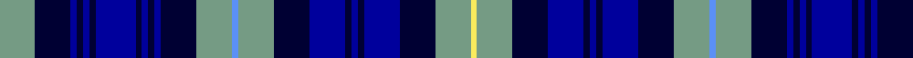

In pattern [YKBKBKBKBKBKYBYKBKBKBKYY](/patterns/ykbkbkbkbkbkybykbkbkbkyy/).

This was sourced from register-of-tartans.  It is a [24 stripes tartan](/stripes/stripes24/).

Original link https://www.tartanregister.gov.uk/tartanDetails.aspx?ref=10443

## Thread count
LG/34 DB34 DBa6 DB6 DBa6 DB6 DBa38 DB6 DBa6 DB6 DBa6 DB34 LG34 B6 LG34 DB34 DBa34 DB6 DBa6 DB6 DBa34 DB34 LG34 LY/6

## Palette
Each colour and its ΔE from the base-6 reference it is a variant of.

| Colour | Shade | Base | ΔE (OKLab) |
|---|---|---|---|
| B | <code style="background-color:#5B90F6;">#5B90F6</code> `#5B90F6` | B <code style="background-color:#2A418A;">#2A418A</code> | 0.27 |
| DB | <code style="background-color:#000033;">#000033</code> `#000033` | K <code style="background-color:#000000;">#000000</code> | 0.18 |
| DBa | <code style="background-color:#00009C;">#00009C</code> `#00009C` | B <code style="background-color:#2A418A;">#2A418A</code> | 0.13 |
| LG | <code style="background-color:#759B84;">#759B84</code> `#759B84` | Y <code style="background-color:#F2BF00;">#F2BF00</code> | 0.23 |
| LY | <code style="background-color:#FBEC5D;">#FBEC5D</code> `#FBEC5D` | Y <code style="background-color:#F2BF00;">#F2BF00</code> | 0.11 |

## Nearest tartans

The nearest existing variants by ΔTartan distance.

1. [MacKenzie Blue](/setts/s15/b6k1b1k1b1k6w6k1wa1k1w6k6b6k1r1x4~b0000cd-k101010-rc80000-w82cffd-waffffff/) — ΔT 1.31
1. [Van Ingelgem Dress (Personal)](/setts/s18/y3k18b3k3b3k3b17ba3b3ba3b3ba12w2ba12b9ba12k2w2x2~b003c64-ba0000cd-k101010-wffffff-ydaa520/) — ΔT 1.34
1. [Mundigl](/setts/s15/b12k2b2k2b2k10r2k10ba12k3ba12k10b11k2b2x2~b3850c8-ba2474e8-k101010-rc80000/) — ΔT 1.53
1. [Palatine Union Personal Tartan Tartan Number: 6802. Earliest known date: 2004 Designed as a unique tartan for the wedding of Traepischke Graves (Trapper Graves) and Steve Lalor in Seattle. Palatine is an old Scottish name and also a district in Seattle. See products available Copyright © Blair Urquhart, Comrie, 2015](/setts/s15/b13k3b3k3b3k10ba10w4r4w4ba10k10b14k3b3x2~b2c2c80-ba2888c4-k101010-rc80000-we0e0e0/) — ΔT 1.53
1. [Scottish National Dress District Tartan Tartan Number: 2160. Earliest known date: 1994 In 1934 The National Association of Scottish Woollen Manufacturers designed a tartan they named 'National'. In 1994 Highland clothiers, McCalls of Aberdeen, designed and registered a tartan they called the 'National Dress' which appears to have retained some elements of the original design. The 'Dress' tartan was registered as a patented design, No. 601292, on 22nd March 1994. See products available Copyright © Blair Urquhart, Comrie, 2015](/setts/s26/b12w11r2w11b12g11k2g3k2g11k8b2r2b2w2b11w2b2r2b2k8g11k2g3k2g11x2~b1c0070-g003820-k101010-rc80000-we0e0e0/) — ΔT 1.56
1. [Tartan Army](/setts/s21/b22k2b4k2b4k8w2k2w2k10r5y2r5k10w2k2w2k8b18k2b4x2~b304080-k000030-rc00000-we0e0e0-yf0c000/) — ΔT 1.60
1. [William Murdoch, (Scottish Gas)](/setts/s15/b11k2b4k2b4k11ba11k2bb4k2ba11k11b11k2b4x2~b8080d0-ba304080-bb5480b0-k000030/) — ΔT 1.61
1. [Palatine Union (Personal)](/setts/s40/b13k3b3k3b3k10ba10w4r4w4ba10k10b14k3b3k3b14k10ba8w3r3w3ba8k10b13k3b3k3b13k10ba10w4r4w4ba10k10b3k3b3k3x2~b2c2c80-ba2888c4-k101010-rc80000-we0e0e0/) — ΔT 1.68
1. [Hanna of Stirlingshire](/setts/s18/k1y2k2y2k1y4k1b9ya1b9k1y4k1y2k2y2k1r1x4~b1c0070-k101010-r880000-yb8b8b8-yad09800/) — ΔT 1.72
1. [Citadel, Military Academy](/setts/s15/r3k2b18ba11w3ba2w2ba5w2ba2w3ba11b18k2y3x2~b304080-ba000050-k000000-rc00000-we0e0e0-yf0c000/) — ΔT 1.73

## Neighbour map

Every grey dot is one of 15726 variants placed by the first two principal components of the ΔTartan feature space (44% of its variance). Red is this tartan; blue dots are its nearest — click one to open its page.

<svg viewBox="0 0 640 380" role="img" style="max-width:100%;height:auto;border:1px solid #e0e0e0;border-radius:4px;display:block" xmlns="http://www.w3.org/2000/svg"><image href="/nn/cloud.v1.png" width="640" height="380"/><a href="/setts/s15/b6k1b1k1b1k6w6k1wa1k1w6k6b6k1r1x4~b0000cd-k101010-rc80000-w82cffd-waffffff/"><circle cx="102.8" cy="163.6" r="4" fill="#3465a4"><title>MacKenzie Blue</title></circle></a><a href="/setts/s18/y3k18b3k3b3k3b17ba3b3ba3b3ba12w2ba12b9ba12k2w2x2~b003c64-ba0000cd-k101010-wffffff-ydaa520/"><circle cx="153.7" cy="160.5" r="4" fill="#3465a4"><title>Van Ingelgem Dress (Personal)</title></circle></a><a href="/setts/s15/b12k2b2k2b2k10r2k10ba12k3ba12k10b11k2b2x2~b3850c8-ba2474e8-k101010-rc80000/"><circle cx="168.9" cy="205.4" r="4" fill="#3465a4"><title>Mundigl</title></circle></a><a href="/setts/s15/b13k3b3k3b3k10ba10w4r4w4ba10k10b14k3b3x2~b2c2c80-ba2888c4-k101010-rc80000-we0e0e0/"><circle cx="87.4" cy="197.6" r="4" fill="#3465a4"><title>Palatine Union Personal Tartan Tartan Number: 6802. Earliest known date: 2004 Designed as a unique tartan for the wedding of Traepischke Graves (Trapper Graves) and Steve Lalor in Seattle. Palatine is an old Scottish name and also a district in Seattle. See products available Copyright © Blair Urquhart, Comrie, 2015</title></circle></a><a href="/setts/s26/b12w11r2w11b12g11k2g3k2g11k8b2r2b2w2b11w2b2r2b2k8g11k2g3k2g11x2~b1c0070-g003820-k101010-rc80000-we0e0e0/"><circle cx="66.5" cy="147.6" r="4" fill="#3465a4"><title>Scottish National Dress District Tartan Tartan Number: 2160. Earliest known date: 1994 In 1934 The National Association of Scottish Woollen Manufacturers designed a tartan they named 'National'. In 1994 Highland clothiers, McCalls of Aberdeen, designed and registered a tartan they called the 'National Dress' which appears to have retained some elements of the original design. The 'Dress' tartan was registered as a patented design, No. 601292, on 22nd March 1994. See products available Copyright © Blair Urquhart, Comrie, 2015</title></circle></a><a href="/setts/s21/b22k2b4k2b4k8w2k2w2k10r5y2r5k10w2k2w2k8b18k2b4x2~b304080-k000030-rc00000-we0e0e0-yf0c000/"><circle cx="198.4" cy="129.3" r="4" fill="#3465a4"><title>Tartan Army</title></circle></a><a href="/setts/s15/b11k2b4k2b4k11ba11k2bb4k2ba11k11b11k2b4x2~b8080d0-ba304080-bb5480b0-k000030/"><circle cx="135.9" cy="208.8" r="4" fill="#3465a4"><title>William Murdoch, (Scottish Gas)</title></circle></a><a href="/setts/s40/b13k3b3k3b3k10ba10w4r4w4ba10k10b14k3b3k3b14k10ba8w3r3w3ba8k10b13k3b3k3b13k10ba10w4r4w4ba10k10b3k3b3k3x2~b2c2c80-ba2888c4-k101010-rc80000-we0e0e0/"><circle cx="47.9" cy="155.3" r="4" fill="#3465a4"><title>Palatine Union (Personal)</title></circle></a><a href="/setts/s18/k1y2k2y2k1y4k1b9ya1b9k1y4k1y2k2y2k1r1x4~b1c0070-k101010-r880000-yb8b8b8-yad09800/"><circle cx="144.3" cy="128.4" r="4" fill="#3465a4"><title>Hanna of Stirlingshire</title></circle></a><a href="/setts/s15/r3k2b18ba11w3ba2w2ba5w2ba2w3ba11b18k2y3x2~b304080-ba000050-k000000-rc00000-we0e0e0-yf0c000/"><circle cx="144.4" cy="128.3" r="4" fill="#3465a4"><title>Citadel, Military Academy</title></circle></a><circle cx="110.5" cy="159.5" r="5" fill="#c00000"/></svg>

ID: /setts/s24/y17k17b3k3b3k3b19k3b3k3b3k17y17ba3y17k17b17k3b3k3b17k17y17ya3x2~b00009c-ba5b90f6-k000033-y759b84-yafbec5d/
