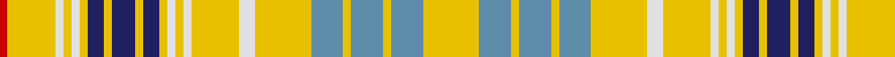

In pattern [RYWYWYBYBYBYWYWYWYBYBYBY](/patterns/rywywybybybywywywybybyby/).

This was sourced from house-of-tartan.  It is a [24 stripes tartan](/stripes/stripes24/).

Original link http://www.house-of-tartan.scotland.net/house/TartanViewjs.asp?colr=Def&tnam=2021

## Thread count
R/4 Y24 LN4 Y4 LN4 Y4 DB8 Y4 DB12 Y4 DB8 Y4 LN4 Y4 LN4 Y24 LN8 Y28 B16 Y4 B16 Y4 B16 Y/28

## Palette
Each colour and its ΔE from the base-6 reference it is a variant of.

| Colour | Shade | Base | ΔE (OKLab) |
|---|---|---|---|
| B | <code style="background-color:#5C8CA8;">#5C8CA8</code> `#5C8CA8` | B <code style="background-color:#2C4084;">#2C4084</code> | 0.23 |
| DB | <code style="background-color:#202060;">#202060</code> `#202060` | B <code style="background-color:#2C4084;">#2C4084</code> | 0.11 |
| LN | <code style="background-color:#E0E0E0;">#E0E0E0</code> `#E0E0E0` | W <code style="background-color:#F4F4F0;">#F4F4F0</code> | 0.06 |
| R | <code style="background-color:#C80000;">#C80000</code> `#C80000` | R <code style="background-color:#C80000;">#C80000</code> | 0.00 |
| Y | <code style="background-color:#E8C000;">#E8C000</code> `#E8C000` | Y <code style="background-color:#E8C000;">#E8C000</code> | 0.00 |

ID: /setts/s24/y28b16y4b16y4b16y28w8y24w4y4w4y4ba8y4ba12y4ba8y4w4y4w4y24r4-b5c8ca8-ba202060-rc80000-we0e0e0-ye8c000/
