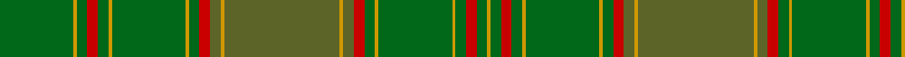

In pattern [GYGRGYGYGRGYGYGRGYGYGRGY](/stripes/gygrgygygrgygygrgygygrgy/).

This was sourced from house-of-tartan.  It is a [24 stripe tartan](/stripes/stripes24/).

Original link http://www.house-of-tartan.scotland.net/house/TartanViewjs.asp?colr=Def&tnam=2204

## Also known as

This cloth is also recorded under:

- Terry Clan/Family Weavers

## Thread count
G/42 DY2 G6 R6 G6 DY2 G42 DY2 G6 R6 Ga6 DY2 Ga66 DY2 Ga6 R6 G6 DY2 G42 DY2 G6 R6 G6 DY/2

## Palette
Each colour and the base-6 reference it is a variant of.

| Colour | Shade | Base |
|---|---|---|
| DR | <code style="background-color:#880000;">#880000</code> `oklch(39.4% 0.162 29.2)` <small>#880000</small> | R <code style="background-color:#CC0000;">#CC0000</code> |
| DY | <code style="background-color:#D09800;">#D09800</code> `oklch(71.4% 0.147 82.1)` <small>#D09800</small> | Y <code style="background-color:#F2BF00;">#F2BF00</code> |
| G | <code style="background-color:#006818;">#006818</code> `oklch(45.0% 0.142 145.0)` <small>#006818</small> | G <code style="background-color:#006100;">#006100</code> |
| Ga | <code style="background-color:#5C6428;">#5C6428</code> `oklch(48.3% 0.084 116.0)` <small>#5C6428</small> | G <code style="background-color:#006100;">#006100</code> |
| R | <code style="background-color:#C80000;">#C80000</code> `oklch(52.3% 0.215 29.2)` <small>#C80000</small> | R <code style="background-color:#CC0000;">#CC0000</code> |

## Nearest tartans

The nearest existing variants by ΔTartan distance, with this tartan at the top so the swatches line up against it.

ΔTartan

Tartan

Sett

—

<a href="/ttd/edit/#slug=y33lo1y3r3g3lo1g21lo1g3r3g3lo1g21~x2">Terry Clan/Family Weavers Tartan Tartan Number: 2204. Earliest known date: 1993 Designed by Thomas Terry of Geneseo, IL, USA. Registered with the Scottish Tartans Society 9-15-93. Info from Sue Miller, April 1995. With no evidence to the contrary it is assumed that all of the name 'Terry' can wear this tartan. See products available Copyright © Blair Urquhart, Comrie, 2015</a> <a class="nn-out" href="/setts/s24/y33lo1y3r3g3lo1g21lo1g3r3g3lo1g21~x2/" title="open its dictionary page">↗</a>

1.79

<a href="/ttd/edit/#slug=g3y1lo2g3y1lo2dy21g18dy2g3dy2g18dy21y1lo2~x2">Prince David</a> <a class="nn-out" href="/setts/s15/g3y1lo2g3y1lo2dy21g18dy2g3dy2g18dy21y1lo2~x2/" title="open its dictionary page">↗</a>

1.84

<a href="/ttd/edit/#slug=y33lo1y3r3g3lo1g21lo1g3r3g3lo1g21~x2">Terry</a> <a class="nn-out" href="/setts/s13/y33lo1y3r3g3lo1g21lo1g3r3g3lo1g21~x2/" title="open its dictionary page">↗</a>

2.04

<a href="/ttd/edit/#slug=g20dy3g6dy6g6dy8db2dy2g20dy2db2dy46db3dy8~x2">MacAlister of Glenbarr Hunting</a> <a class="nn-out" href="/setts/s14/g20dy3g6dy6g6dy8db2dy2g20dy2db2dy46db3dy8~x2/" title="open its dictionary page">↗</a>

2.08

<a href="/ttd/edit/#slug=g33ly1g3r3g3ly1g21ly1g3r3g3ly1g21~x2">Terry</a> <a class="nn-out" href="/setts/s13/g33ly1g3r3g3ly1g21ly1g3r3g3ly1g21~x2/" title="open its dictionary page">↗</a>

2.14

<a href="/ttd/edit/#slug=dg3g1lo2dg3g1lo2dy21dg18dy2dg3dy2dg18dy21g1lo2~x2">Prince David Royal Family Tartan Tartan Number: 2125. Earliest known date: 1930 Mackinlay suggests that David was the pet name of the Duke of Windsor when he was a boy and that the tartan was designed for his personal use. See products available Copyright © Blair Urquhart, Comrie, 2015</a> <a class="nn-out" href="/setts/s15/dg3g1lo2dg3g1lo2dy21dg18dy2dg3dy2dg18dy21g1lo2~x2/" title="open its dictionary page">↗</a>

2.17

<a href="/ttd/edit/#slug=dg24g2dg4g16dg1lb2dg1g16dg3ly1dg12o2dg5~x2">O'Neill (Personal)</a> <a class="nn-out" href="/setts/s13/dg24g2dg4g16dg1lb2dg1g16dg3ly1dg12o2dg5~x2/" title="open its dictionary page">↗</a>

2.17

<a href="/ttd/edit/#slug=g21k1r4k1dy21g3dy3g3dy21g3ly4g21dy3g3dy3~x2">Ensign of Ontario Canadian Tartan Tartan Number: 2032. Earliest known date: 1965 The Ensign tartan owes its inspiration to the Provincial Coat of Arms which was granted to the province by Royal Warrant of Queen Victoria in 1868. The yellow is taken from the three golden maple leaves of the lower shield and the red from the cross of St George on the upper. The black and brown come from the bear, the moose and the deer. There is also a District tartan called Northern Ontario. See products available Copyright © Blair Urquhart, Comrie, 2015</a> <a class="nn-out" href="/setts/s15/g21k1r4k1dy21g3dy3g3dy21g3ly4g21dy3g3dy3~x2/" title="open its dictionary page">↗</a>

2.21

<a href="/ttd/edit/#slug=dg21k1r4k1dy21dg3dy3dg3dy21dg3lo4dg21dy3dg3dy3~x2">Ensign of Ontario (Fashion)</a> <a class="nn-out" href="/setts/s15/dg21k1r4k1dy21dg3dy3dg3dy21dg3lo4dg21dy3dg3dy3~x2/" title="open its dictionary page">↗</a>

2.24

<a href="/ttd/edit/#slug=lo4g1o21g18o2g3o2g18o21lo2g1g3lo2g1g3~x2">Prince David</a> <a class="nn-out" href="/setts/s15/lo4g1o21g18o2g3o2g18o21lo2g1g3lo2g1g3~x2/" title="open its dictionary page">↗</a>

2.28

<a href="/ttd/edit/#slug=r1dy3dg2dy3r1dg24r1dy3dg2dy3r1~x2">Unnamed Green (Teddy Bear)</a> <a class="nn-out" href="/setts/s11/r1dy3dg2dy3r1dg24r1dy3dg2dy3r1~x2/" title="open its dictionary page">↗</a>

## Neighbour map

Every grey dot is one of 14299 variants placed by the first two principal components of the ΔTartan feature space (44% of its variance). Red is this tartan; blue dots are its nearest — click one to open its page.

<svg viewBox="0 0 640 380" role="img" style="max-width:100%;height:auto;border:1px solid #e0e0e0;border-radius:4px;display:block" xmlns="http://www.w3.org/2000/svg"><image href="/nn/cloud.v1.png" width="640" height="380"/><a href="/setts/s15/g3y1lo2g3y1lo2dy21g18dy2g3dy2g18dy21y1lo2~x2/"><circle cx="423.6" cy="196.1" r="4" fill="#3465a4"><title>Prince David</title></circle></a><a href="/setts/s13/y33lo1y3r3g3lo1g21lo1g3r3g3lo1g21~x2/"><circle cx="482.7" cy="186.8" r="4" fill="#3465a4"><title>Terry</title></circle></a><a href="/setts/s14/g20dy3g6dy6g6dy8db2dy2g20dy2db2dy46db3dy8~x2/"><circle cx="498.7" cy="208.2" r="4" fill="#3465a4"><title>MacAlister of Glenbarr Hunting</title></circle></a><a href="/setts/s13/g33ly1g3r3g3ly1g21ly1g3r3g3ly1g21~x2/"><circle cx="439.2" cy="167.6" r="4" fill="#3465a4"><title>Terry</title></circle></a><a href="/setts/s15/dg3g1lo2dg3g1lo2dy21dg18dy2dg3dy2dg18dy21g1lo2~x2/"><circle cx="407.7" cy="187.5" r="4" fill="#3465a4"><title>Prince David Royal Family Tartan Tartan Number: 2125. Earliest known date: 1930 Mackinlay suggests that David was the pet name of the Duke of Windsor when he was a boy and that the tartan was designed for his personal use. See products available Copyright © Blair Urquhart, Comrie, 2015</title></circle></a><a href="/setts/s13/dg24g2dg4g16dg1lb2dg1g16dg3ly1dg12o2dg5~x2/"><circle cx="444.2" cy="197.3" r="4" fill="#3465a4"><title>O'Neill (Personal)</title></circle></a><a href="/setts/s15/g21k1r4k1dy21g3dy3g3dy21g3ly4g21dy3g3dy3~x2/"><circle cx="366.2" cy="168.1" r="4" fill="#3465a4"><title>Ensign of Ontario Canadian Tartan Tartan Number: 2032. Earliest known date: 1965 The Ensign tartan owes its inspiration to the Provincial Coat of Arms which was granted to the province by Royal Warrant of Queen Victoria in 1868. The yellow is taken from the three golden maple leaves of the lower shield and the red from the cross of St George on the upper. The black and brown come from the bear, the moose and the deer. There is also a District tartan called Northern Ontario. See products available Copyright © Blair Urquhart, Comrie, 2015</title></circle></a><a href="/setts/s15/dg21k1r4k1dy21dg3dy3dg3dy21dg3lo4dg21dy3dg3dy3~x2/"><circle cx="406.3" cy="190.1" r="4" fill="#3465a4"><title>Ensign of Ontario (Fashion)</title></circle></a><a href="/setts/s15/lo4g1o21g18o2g3o2g18o21lo2g1g3lo2g1g3~x2/"><circle cx="364.3" cy="166.1" r="4" fill="#3465a4"><title>Prince David</title></circle></a><a href="/setts/s11/r1dy3dg2dy3r1dg24r1dy3dg2dy3r1~x2/"><circle cx="545.1" cy="198.6" r="4" fill="#3465a4"><title>Unnamed Green (Teddy Bear)</title></circle></a><circle cx="463.1" cy="137.8" r="5" fill="#c00000"/></svg>

ID: /setts/s24/y33lo1y3r3g3lo1g21lo1g3r3g3lo1g21~x2/
