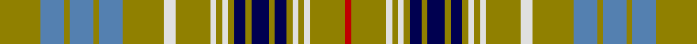

This page is one **sett** — a single exact thread-count. It belongs to the [tartan](/tartans/lg7b4lg1b4lg1b4lg7ln2lg6ln1lg1ln1lg1db2lg1db3lg1db2lg1ln1lg1ln1lg6r1/)
(the same proportion at any scale), whose colour order is pattern [GBGBGBGWGWGWGBGBGBGWGWGR](/stripes/gbgbgbgwgwgwgbgbgbgwgwgr/).

Sourced from weddslist.  It is a [24 stripe tartan](/stripes/stripes24/).

Original link http://www.weddslist.com/cgi-bin/tartans/pg.pl?source=sts

## Thread count
LG/28 B16 LG4 B16 LG4 B16 LG28 LN8 LG24 LN4 LG4 LN4 LG4 DB8 LG4 DB12 LG4 DB8 LG4 LN4 LG4 LN4 LG24 R/4

## Palette
Each colour and the base-6 reference it is a variant of.

| Colour | Shade | Base |
|---|---|---|
| B | <code style="background-color:#5480B0;">#5480B0</code> `oklch(58.8% 0.089 251.5)` <small>#5480B0</small> | B <code style="background-color:#2A418A;">#2A418A</code> |
| DB | <code style="background-color:#000050;">#000050</code> `oklch(19.5% 0.135 264.1)` <small>#000050</small> | B <code style="background-color:#2A418A;">#2A418A</code> |
| LG | <code style="background-color:#908000;">#908000</code> `oklch(59.6% 0.124 100.6)` <small>#908000</small> | G <code style="background-color:#006100;">#006100</code> |
| LN | <code style="background-color:#E0E0E0;">#E0E0E0</code> `oklch(90.7% 0.000 89.9)` <small>#E0E0E0</small> | W <code style="background-color:#F7F7F7;">#F7F7F7</code> |
| R | <code style="background-color:#C00000;">#C00000</code> `oklch(50.7% 0.208 29.2)` <small>#C00000</small> | R <code style="background-color:#CC0000;">#CC0000</code> |

## Nearest tartans

The nearest existing variants by ΔTartan distance, with this tartan at the top so the swatches line up against it.

ΔTartan

Tartan

Sett

—

<a href="/ttd/edit/#slug=y7t4y1t4y1t4y7w2y6w1y1w1y1db2y1db3y1db2y1w1y1w1y6r1~x4">Ottawa</a> <a class="nn-out" href="/setts/s24/y7t4y1t4y1t4y7w2y6w1y1w1y1db2y1db3y1db2y1w1y1w1y6r1~x4/" title="open its dictionary page">↗</a>

0.80

<a href="/ttd/edit/#slug=lo7b4lo1b4lo1b4lo7w2lo6w1lo1w1lo1db2lo1db3lo1db2lo1w1lo1w1lo6r1~x4">Ottawa (District)</a> <a class="nn-out" href="/setts/s24/lo7b4lo1b4lo1b4lo7w2lo6w1lo1w1lo1db2lo1db3lo1db2lo1w1lo1w1lo6r1~x4/" title="open its dictionary page">↗</a>

1.45

<a href="/ttd/edit/#slug=ly7t4ly1t4ly1t4ly7w2ly6w1ly1w1ly1db2ly1db3ly1db2ly1w1ly1w1ly6r1~x4">Ottawa District Tartan Tartan Number: 2021. Earliest known date: 1966 In two blocks - Navy Block ends on 14th colour change Gold 24. Azure Block starts on the following White 8. The design was accepted as the Official Tartan of Ottawa by order of the Council on November 21st 1966. In 1985 it was no longer in commercial production. See products available Copyright © Blair Urquhart, Comrie, 2015</a> <a class="nn-out" href="/setts/s24/ly7t4ly1t4ly1t4ly7w2ly6w1ly1w1ly1db2ly1db3ly1db2ly1w1ly1w1ly6r1~x4/" title="open its dictionary page">↗</a>

1.65

<a href="/ttd/edit/#slug=w5n3w3n20k15n10g2n2g3n2g3n6lp3n4lp5~x2">Thistle Dubh</a> <a class="nn-out" href="/setts/s15/w5n3w3n20k15n10g2n2g3n2g3n6lp3n4lp5~x2/" title="open its dictionary page">↗</a>

1.66

<a href="/ttd/edit/#slug=g4r2g14w2db14r2db14g14db2g5db2g14db14r2db14w2g14r2g4ly3~x2">Hunter of Hunterston</a> <a class="nn-out" href="/setts/s20/g4r2g14w2db14r2db14g14db2g5db2g14db14r2db14w2g14r2g4ly3~x2/" title="open its dictionary page">↗</a>

1.73

<a href="/ttd/edit/#slug=dg6lo2db2lo11dg2lo2m3lo2dg2lo11db2lo2dg6m3~x2">Invertere (Daks #1)</a> <a class="nn-out" href="/setts/s14/dg6lo2db2lo11dg2lo2m3lo2dg2lo11db2lo2dg6m3~x2/" title="open its dictionary page">↗</a>

1.78

<a href="/ttd/edit/#slug=dg12y2dg2y7ly4o2ly8o2ly4y7dg2y2dg16w2dg4~x2">Confessore Family Tartan Tartan Number: 2165. Earliest known date: 1994 Designed for Mr Confessore of Napoli, Italy in 1994 by Mr. Keith Lumsden, researcher at the Scottish Tartans Society. The colours reflect the shades and tones of the Italian countryside. See products available Copyright © Blair Urquhart, Comrie, 2015</a> <a class="nn-out" href="/setts/s15/dg12y2dg2y7ly4o2ly8o2ly4y7dg2y2dg16w2dg4~x2/" title="open its dictionary page">↗</a>

1.81

<a href="/ttd/edit/#slug=o3g3o18g6o4b3w3b18o6g18w3g3o4b6o18g3o3~x2">Reid of Straloch (Personal)</a> <a class="nn-out" href="/setts/s17/o3g3o18g6o4b3w3b18o6g18w3g3o4b6o18g3o3~x2/" title="open its dictionary page">↗</a>

1.81

<a href="/ttd/edit/#slug=lb5g3lb24n7k6lb3n3lb3n11lb6k3lb3g3~x2">Balmoral (Green) (Royal)</a> <a class="nn-out" href="/setts/s13/lb5g3lb24n7k6lb3n3lb3n11lb6k3lb3g3~x2/" title="open its dictionary page">↗</a>

1.82

<a href="/ttd/edit/#slug=lb25g3lb4g4lb5g5lb15r6lb5g19lb8g26lb4w4lb4g7lb4db21~x2">Shedor (2013)</a> <a class="nn-out" href="/setts/s18/lb25g3lb4g4lb5g5lb15r6lb5g19lb8g26lb4w4lb4g7lb4db21~x2/" title="open its dictionary page">↗</a>

1.84

<a href="/ttd/edit/#slug=lo14ly3k6w2k2w2k2g8lo6k2lo3w1lo3k2lo6g8k2w2k2w2k6ly3lo14w2~x2">O'Farrell</a> <a class="nn-out" href="/setts/s24/lo14ly3k6w2k2w2k2g8lo6k2lo3w1lo3k2lo6g8k2w2k2w2k6ly3lo14w2~x2/" title="open its dictionary page">↗</a>

## Neighbour map

Every grey dot is one of 14299 variants placed by the first two principal components of the ΔTartan feature space (44% of its variance). Red is this tartan; blue dots are its nearest — click one to open its page.

<svg viewBox="0 0 640 380" role="img" style="max-width:100%;height:auto;border:1px solid #e0e0e0;border-radius:4px;display:block" xmlns="http://www.w3.org/2000/svg"><image href="/nn/cloud.v1.png" width="640" height="380"/><a href="/setts/s24/lo7b4lo1b4lo1b4lo7w2lo6w1lo1w1lo1db2lo1db3lo1db2lo1w1lo1w1lo6r1~x4/"><circle cx="215.9" cy="134.0" r="4" fill="#3465a4"><title>Ottawa (District)</title></circle></a><a href="/setts/s24/ly7t4ly1t4ly1t4ly7w2ly6w1ly1w1ly1db2ly1db3ly1db2ly1w1ly1w1ly6r1~x4/"><circle cx="211.7" cy="128.2" r="4" fill="#3465a4"><title>Ottawa District Tartan Tartan Number: 2021. Earliest known date: 1966 In two blocks - Navy Block ends on 14th colour change Gold 24. Azure Block starts on the following White 8. The design was accepted as the Official Tartan of Ottawa by order of the Council on November 21st 1966. In 1985 it was no longer in commercial production. See products available Copyright © Blair Urquhart, Comrie, 2015</title></circle></a><a href="/setts/s15/w5n3w3n20k15n10g2n2g3n2g3n6lp3n4lp5~x2/"><circle cx="229.9" cy="144.8" r="4" fill="#3465a4"><title>Thistle Dubh</title></circle></a><a href="/setts/s20/g4r2g14w2db14r2db14g14db2g5db2g14db14r2db14w2g14r2g4ly3~x2/"><circle cx="205.7" cy="169.3" r="4" fill="#3465a4"><title>Hunter of Hunterston</title></circle></a><a href="/setts/s14/dg6lo2db2lo11dg2lo2m3lo2dg2lo11db2lo2dg6m3~x2/"><circle cx="250.7" cy="201.8" r="4" fill="#3465a4"><title>Invertere (Daks #1)</title></circle></a><a href="/setts/s15/dg12y2dg2y7ly4o2ly8o2ly4y7dg2y2dg16w2dg4~x2/"><circle cx="180.2" cy="161.2" r="4" fill="#3465a4"><title>Confessore Family Tartan Tartan Number: 2165. Earliest known date: 1994 Designed for Mr Confessore of Napoli, Italy in 1994 by Mr. Keith Lumsden, researcher at the Scottish Tartans Society. The colours reflect the shades and tones of the Italian countryside. See products available Copyright © Blair Urquhart, Comrie, 2015</title></circle></a><a href="/setts/s17/o3g3o18g6o4b3w3b18o6g18w3g3o4b6o18g3o3~x2/"><circle cx="209.9" cy="175.7" r="4" fill="#3465a4"><title>Reid of Straloch (Personal)</title></circle></a><a href="/setts/s13/lb5g3lb24n7k6lb3n3lb3n11lb6k3lb3g3~x2/"><circle cx="247.6" cy="163.2" r="4" fill="#3465a4"><title>Balmoral (Green) (Royal)</title></circle></a><a href="/setts/s18/lb25g3lb4g4lb5g5lb15r6lb5g19lb8g26lb4w4lb4g7lb4db21~x2/"><circle cx="164.8" cy="144.7" r="4" fill="#3465a4"><title>Shedor (2013)</title></circle></a><a href="/setts/s24/lo14ly3k6w2k2w2k2g8lo6k2lo3w1lo3k2lo6g8k2w2k2w2k6ly3lo14w2~x2/"><circle cx="160.7" cy="108.6" r="4" fill="#3465a4"><title>O'Farrell</title></circle></a><circle cx="225.8" cy="144.7" r="5" fill="#c00000"/></svg>

ID: /setts/s24/y7t4y1t4y1t4y7w2y6w1y1w1y1db2y1db3y1db2y1w1y1w1y6r1~x4/
