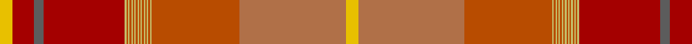

In pattern [YRBRYRYRYRYRYRYRYRYRYRRY](/patterns/yrbryryryryryryryryryrry/).

This was sourced from tartans-authority.  It is a [24 stripes tartan](/stripes/stripes24/).

Original link http://www.tartansauthority.com/tartan-ferret/display/8240/

## Thread count
Y/16 DR28 N12 DR104 LG2 DO2 LG2 DO2 LG2 DO2 LG2 DO2 LG2 DO2 LG2 DO2 LG2 DO2 LG2 DO2 LG2 DO112 LT136 Y/16

## Palette
Each colour and its ΔE from the base-6 reference it is a variant of.

| Colour | Shade | Base | ΔE (OKLab) |
|---|---|---|---|
| DO | <code style="background-color:#B84C00;">#B84C00</code> `#B84C00` | R <code style="background-color:#CC0000;">#CC0000</code> | 0.08 |
| DR | <code style="background-color:#A40000;">#A40000</code> `#A40000` | R <code style="background-color:#CC0000;">#CC0000</code> | 0.09 |
| LG | <code style="background-color:#C4BC68;">#C4BC68</code> `#C4BC68` | Y <code style="background-color:#F2BF00;">#F2BF00</code> | 0.08 |
| LT | <code style="background-color:#B07048;">#B07048</code> `#B07048` | R <code style="background-color:#CC0000;">#CC0000</code> | 0.15 |
| N | <code style="background-color:#5C5C5C;">#5C5C5C</code> `#5C5C5C` | B <code style="background-color:#2A418A;">#2A418A</code> | 0.15 |
| Y | <code style="background-color:#E8C000;">#E8C000</code> `#E8C000` | Y <code style="background-color:#F2BF00;">#F2BF00</code> | 0.02 |

## Nearest tartans

The nearest existing variants by ΔTartan distance.

1. [MacDougall - 1819 (Clan)](/setts/s24/g1r4ra2rb2ga27rb4ga2rb4b10r3ra2rb2ra2r3ga10rb10ga10rb2b2rb26r3ra2rb3g1x2~b440044-g789484-ga5c6428-rcc4438-rae87878-rbc80000/) — ΔT 2.62
1. [Langermann (Name)](/setts/s16/b1g2b1g3ga6b1g6b2y5r13gb23y1gb1y1gb2y1x2~b003c64-g5c6428-ga006818-gb604000-rc80000-yd87c00/) — ΔT 2.72
1. [Flodden](/setts/s12/w2y1r3g20r1y1r3y2ra14ya2r2ya2x2~g5c6428-rc8002c-ra98481c-wf8f8f8-yc88c00-ya9c9c00/) — ΔT 2.90
1. [Caithness](/setts/s15/r28ra3b2g2b2ra3g8rb2b8rb5b3w2b2rb3b1x2~b401000-g808080-r806050-rac00000-rb906030-we0e0e0/) — ΔT 2.91
1. [Shenzhen](/setts/s20/r29y2r2y4r2y20ya1y2ya10w3ya10y2ya1y20r2y4r2y2r29k3x2~k101010-rb84c00-we0e0e0-ydc943c-yae8c000/) — ΔT 3.00
1. [Langerman (Anchorage)](/setts/s16/b1g2b1g3ga6b1g6b2r5ra13ba23r1ba1r1ba2r1x2~b000080-ba441800-g416041-ga344a35-ra00000-ra880000/) — ΔT 3.04
1. [Pride of Scotland, Silver (Fashion)](/setts/s12/b9r2b2ra2r18ra2b2b1b1b19ra33b2x2~b5c5c5c-r888888-rac80000/) — ΔT 3.16
1. [Unidentified 22](/setts/s25/b96g10b8g8b10r34ra1r6ra4r4ra6r2ra7w3ra7r2ra6r4ra4r6ra1r34ba36r6ba18x2~b800080-ba5480b0-g008000-r806050-rac00000-we0e0e0/) — ΔT 3.17
1. [Johansson (Aneby, Sweden), Christian (Personal)](/setts/s13/r8g1r1g1r1g25b1g1b1g1b25ga7y6x2~b3f4441-g70714d-ga75786c-r97342f-yc5831b/) — ΔT 3.24
1. [elCorte](/setts/s20/w6wa5y4wa5ya2r5y2r14y10ya30wa1y2r4y2r1ya30r10wa14y2wa5x2~re87878-wffea97-wa82cffd-y86c67c-yadc943c/) — ΔT 3.25

## Neighbour map

Every grey dot is one of 15726 variants placed by the first two principal components of the ΔTartan feature space (44% of its variance). Red is this tartan; blue dots are its nearest — click one to open its page.

<svg viewBox="0 0 640 380" role="img" style="max-width:100%;height:auto;border:1px solid #e0e0e0;border-radius:4px;display:block" xmlns="http://www.w3.org/2000/svg"><image href="/nn/cloud.v1.png" width="640" height="380"/><a href="/setts/s24/g1r4ra2rb2ga27rb4ga2rb4b10r3ra2rb2ra2r3ga10rb10ga10rb2b2rb26r3ra2rb3g1x2~b440044-g789484-ga5c6428-rcc4438-rae87878-rbc80000/"><circle cx="266.1" cy="63.9" r="4" fill="#3465a4"><title>MacDougall - 1819 (Clan)</title></circle></a><a href="/setts/s16/b1g2b1g3ga6b1g6b2y5r13gb23y1gb1y1gb2y1x2~b003c64-g5c6428-ga006818-gb604000-rc80000-yd87c00/"><circle cx="251.0" cy="90.8" r="4" fill="#3465a4"><title>Langermann (Name)</title></circle></a><a href="/setts/s12/w2y1r3g20r1y1r3y2ra14ya2r2ya2x2~g5c6428-rc8002c-ra98481c-wf8f8f8-yc88c00-ya9c9c00/"><circle cx="254.1" cy="103.1" r="4" fill="#3465a4"><title>Flodden</title></circle></a><a href="/setts/s15/r28ra3b2g2b2ra3g8rb2b8rb5b3w2b2rb3b1x2~b401000-g808080-r806050-rac00000-rb906030-we0e0e0/"><circle cx="251.4" cy="81.2" r="4" fill="#3465a4"><title>Caithness</title></circle></a><a href="/setts/s20/r29y2r2y4r2y20ya1y2ya10w3ya10y2ya1y20r2y4r2y2r29k3x2~k101010-rb84c00-we0e0e0-ydc943c-yae8c000/"><circle cx="325.5" cy="82.9" r="4" fill="#3465a4"><title>Shenzhen</title></circle></a><a href="/setts/s16/b1g2b1g3ga6b1g6b2r5ra13ba23r1ba1r1ba2r1x2~b000080-ba441800-g416041-ga344a35-ra00000-ra880000/"><circle cx="272.5" cy="103.1" r="4" fill="#3465a4"><title>Langerman (Anchorage)</title></circle></a><a href="/setts/s12/b9r2b2ra2r18ra2b2b1b1b19ra33b2x2~b5c5c5c-r888888-rac80000/"><circle cx="367.6" cy="130.5" r="4" fill="#3465a4"><title>Pride of Scotland, Silver (Fashion)</title></circle></a><a href="/setts/s25/b96g10b8g8b10r34ra1r6ra4r4ra6r2ra7w3ra7r2ra6r4ra4r6ra1r34ba36r6ba18x2~b800080-ba5480b0-g008000-r806050-rac00000-we0e0e0/"><circle cx="272.1" cy="27.0" r="4" fill="#3465a4"><title>Unidentified 22</title></circle></a><a href="/setts/s13/r8g1r1g1r1g25b1g1b1g1b25ga7y6x2~b3f4441-g70714d-ga75786c-r97342f-yc5831b/"><circle cx="339.7" cy="135.9" r="4" fill="#3465a4"><title>Johansson (Aneby, Sweden), Christian (Personal)</title></circle></a><a href="/setts/s20/w6wa5y4wa5ya2r5y2r14y10ya30wa1y2r4y2r1ya30r10wa14y2wa5x2~re87878-wffea97-wa82cffd-y86c67c-yadc943c/"><circle cx="287.7" cy="95.7" r="4" fill="#3465a4"><title>elCorte</title></circle></a><circle cx="314.8" cy="20.2" r="5" fill="#c00000"/></svg>

ID: /setts/s24/y8r68ra56ya1ra1ya1ra1ya1ra1ya1ra1ya1ra1ya1ra1ya1ra1ya1ra1ya1rb52b6rb14y8x2~b5c5c5c-rb07048-rab84c00-rba40000-ye8c000-yac4bc68/
