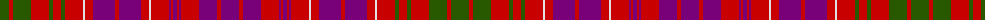

In pattern [BRBRBRBRBRWRBRBRWRGRGRGRG](/patterns/brbrbrbrbrwrbrbrwrgrgrgrg/).

This was sourced from tartans-authority.  It is a [25 stripes tartan](/stripes/stripes25/).

Original link http://www.tartansauthority.com/tartan-ferret/display/417/

## Thread count
G/18 R4 G18 R18 G4 R8 G4 R18 LN2 R8 P22 R4 P22 R8 LN2 R18 P2 R2 P4 R2 P2 R18 P18 R4 P/18

## Palette
Each colour and its ΔE from the base-6 reference it is a variant of.

| Colour | Shade | Base | ΔE (OKLab) |
|---|---|---|---|
| G | <code style="background-color:#285800;">#285800</code> `#285800` | G <code style="background-color:#006400;">#006400</code> | 0.04 |
| LN | <code style="background-color:#E0E0E0;">#E0E0E0</code> `#E0E0E0` | W <code style="background-color:#F4F4F0;">#F4F4F0</code> | 0.06 |
| P | <code style="background-color:#780078;">#780078</code> `#780078` | B <code style="background-color:#2C4084;">#2C4084</code> | 0.16 |
| R | <code style="background-color:#C80000;">#C80000</code> `#C80000` | R <code style="background-color:#C80000;">#C80000</code> | 0.00 |

ID: /setts/s25/b18r4b18r18b2r2b4r2b2r18w2r8b22r4b22r8w2r18g4r8g4r18g18r4g18-b780078-g285800-rc80000-we0e0e0/
