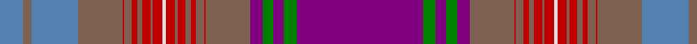

In pattern [BGBGBRRRRRRRRWRRRRRRRRBRB](/patterns/bgbgbrrrrrrrrwrrrrrrrrbrb/).

This was sourced from weddslist.  It is a [25 stripes tartan](/stripes/stripes25/).

Original link http://www.weddslist.com/cgi-bin/tartans/pg.pl?source=sts

## Thread count
B/36 LT12 B72 LT68 R2 LT12 R8 LT8 R12 LT4 R14 LN6 R14 LT4 R12 LT8 R8 LT12 R2 LT68 P20 G16 P16 G20 P/192

## Palette
Each colour and its ΔE from the base-6 reference it is a variant of.

| Colour | Shade | Base | ΔE (OKLab) |
|---|---|---|---|
| B | <code style="background-color:#5480B0;">#5480B0</code> `#5480B0` | B <code style="background-color:#2C4084;">#2C4084</code> | 0.20 |
| G | <code style="background-color:#008000;">#008000</code> `#008000` | G <code style="background-color:#006400;">#006400</code> | 0.09 |
| LN | <code style="background-color:#E0E0E0;">#E0E0E0</code> `#E0E0E0` | W <code style="background-color:#F4F4F0;">#F4F4F0</code> | 0.06 |
| LT | <code style="background-color:#806050;">#806050</code> `#806050` | R <code style="background-color:#C80000;">#C80000</code> | 0.17 |
| P | <code style="background-color:#800080;">#800080</code> `#800080` | B <code style="background-color:#2C4084;">#2C4084</code> | 0.17 |
| R | <code style="background-color:#C00000;">#C00000</code> `#C00000` | R <code style="background-color:#C80000;">#C80000</code> | 0.02 |

## Nearest tartans

The nearest existing variants by ΔTartan distance.

1. [Arran - 1978 (Fashion)](/setts/s25/b86g4b4g4b4g16r2g4r3g3r4g2r6w3r6g2r4g3r3g4r2g16b24g4b10-b780078-g006818-rc80000-we0e0e0/) — ΔT 1.24
1. [Unidentified #5](/setts/s25/b192g20b16g16b20ga68r2ga12r8ga8r12ga4r14w6r14ga4r12ga8r8ga12r2ga68ba72ga12ba36-b5a008c-ba3c82af-g005020-ga503c14-rdc0000-we0e0e0/) — ΔT 1.31
1. [Unidentified Plaid 5](/setts/s25/b4r4b4r4b12r10w4r150b26w10b18ra4b90rb2b6rb4b4rb6b2rb20w4b20ba4rb28ba4-b304080-ba5480b0-rc00000-rad03030-rb806050-we0e0e0/) — ΔT 1.50
1. [Unidentified Cant #11](/setts/s48/b18g6b36g34r2g6r4g4r6g2r7w3r7g2r6g4r4g6r2g34ra10ga4ra8ga6ra99ga6ra8ga4ra10g34r2g6r4g4r6g2r7w3r7g2r6g4r4g6r2g34b36g6-b2888c4-g604000-ga289c18-rc80000-ra9c68a4-we0e0e0/) — ΔT 1.81
1. [Unidentified Cant #13](/setts/s34/r88ra8b32r8ra12b16ra12r12b4r8b4r8b4r12w2g48ba12w2ba12g48w2r12b4r8b4r8b4r12ra12b16ra12r8b32ra8-b2c2c80-ba2888c4-g006818-rc80000-ra9c68a4-we0e0e0/) — ΔT 1.91
1. [Arran, Isle of (Strathmore)](/setts/s25/b172ba8b8ba8b8k32r4k8r6k6r8k4r12w6r12k4r8k6r6k8r4k32ba48k8ba20-b440044-ba5c5c5c-k101010-r880000-wf8f8f8/) — ΔT 1.99
1. [Isle of Arran (Lochcarron) (Fashion)](/setts/s25/b80g4b4g4b4k14r2k4r4k4r4k2r6k4r6k2r4k4r4k4r2k14r20k4r8-b440044-g006818-k101010-rc8002c/) — ΔT 2.01
1. [Unidentified Plaid #11](/setts/s25/b4r4b4r4b12r10w4r150b26w10b18ra4b90g2b6g4b4g6b2g20w4b20ba4g28ba4-b2c4084-ba3c82af-g503c14-rdc0000-rac82828-we0e0e0/) — ΔT 2.03
1. [Monarch of the Glen](/setts/s22/b84ba6g2ba4r2ba4b4bb40ba2r4ba6g2ba4r2ba4b4g6ba2g4y2g4bb4-b780078-ba003c64-bb202060-g006818-r800028-ybc8c00/) — ΔT 2.11
1. [Caithness](/setts/s15/r56ra6b4g4b4ra6g16rb4b16rb10b6w4b4rb6b2-b401000-g808080-r806050-rac00000-rb906030-we0e0e0/) — ΔT 2.12

## Neighbour map

Every grey dot is one of 15726 variants placed by the first two principal components of the ΔTartan feature space (44% of its variance). Red is this tartan; blue dots are its nearest — click one to open its page.

<svg viewBox="0 0 640 380" role="img" style="max-width:100%;height:auto;border:1px solid #e0e0e0;border-radius:4px;display:block" xmlns="http://www.w3.org/2000/svg"><image href="/nn/cloud.v1.png" width="640" height="380"/><a href="/setts/s25/b86g4b4g4b4g16r2g4r3g3r4g2r6w3r6g2r4g3r3g4r2g16b24g4b10-b780078-g006818-rc80000-we0e0e0/"><circle cx="283.7" cy="15.7" r="4" fill="#3465a4"><title>Arran - 1978 (Fashion)</title></circle></a><a href="/setts/s25/b192g20b16g16b20ga68r2ga12r8ga8r12ga4r14w6r14ga4r12ga8r8ga12r2ga68ba72ga12ba36-b5a008c-ba3c82af-g005020-ga503c14-rdc0000-we0e0e0/"><circle cx="237.0" cy="23.5" r="4" fill="#3465a4"><title>Unidentified #5</title></circle></a><a href="/setts/s25/b4r4b4r4b12r10w4r150b26w10b18ra4b90rb2b6rb4b4rb6b2rb20w4b20ba4rb28ba4-b304080-ba5480b0-rc00000-rad03030-rb806050-we0e0e0/"><circle cx="303.5" cy="14.0" r="4" fill="#3465a4"><title>Unidentified Plaid 5</title></circle></a><a href="/setts/s48/b18g6b36g34r2g6r4g4r6g2r7w3r7g2r6g4r4g6r2g34ra10ga4ra8ga6ra99ga6ra8ga4ra10g34r2g6r4g4r6g2r7w3r7g2r6g4r4g6r2g34b36g6-b2888c4-g604000-ga289c18-rc80000-ra9c68a4-we0e0e0/"><circle cx="237.7" cy="14.0" r="4" fill="#3465a4"><title>Unidentified Cant #11</title></circle></a><a href="/setts/s34/r88ra8b32r8ra12b16ra12r12b4r8b4r8b4r12w2g48ba12w2ba12g48w2r12b4r8b4r8b4r12ra12b16ra12r8b32ra8-b2c2c80-ba2888c4-g006818-rc80000-ra9c68a4-we0e0e0/"><circle cx="201.1" cy="22.6" r="4" fill="#3465a4"><title>Unidentified Cant #13</title></circle></a><a href="/setts/s25/b172ba8b8ba8b8k32r4k8r6k6r8k4r12w6r12k4r8k6r6k8r4k32ba48k8ba20-b440044-ba5c5c5c-k101010-r880000-wf8f8f8/"><circle cx="323.3" cy="47.8" r="4" fill="#3465a4"><title>Arran, Isle of (Strathmore)</title></circle></a><a href="/setts/s25/b80g4b4g4b4k14r2k4r4k4r4k2r6k4r6k2r4k4r4k4r2k14r20k4r8-b440044-g006818-k101010-rc8002c/"><circle cx="276.0" cy="22.1" r="4" fill="#3465a4"><title>Isle of Arran (Lochcarron) (Fashion)</title></circle></a><a href="/setts/s25/b4r4b4r4b12r10w4r150b26w10b18ra4b90g2b6g4b4g6b2g20w4b20ba4g28ba4-b2c4084-ba3c82af-g503c14-rdc0000-rac82828-we0e0e0/"><circle cx="285.5" cy="14.0" r="4" fill="#3465a4"><title>Unidentified Plaid #11</title></circle></a><a href="/setts/s22/b84ba6g2ba4r2ba4b4bb40ba2r4ba6g2ba4r2ba4b4g6ba2g4y2g4bb4-b780078-ba003c64-bb202060-g006818-r800028-ybc8c00/"><circle cx="356.1" cy="42.7" r="4" fill="#3465a4"><title>Monarch of the Glen</title></circle></a><a href="/setts/s15/r56ra6b4g4b4ra6g16rb4b16rb10b6w4b4rb6b2-b401000-g808080-r806050-rac00000-rb906030-we0e0e0/"><circle cx="246.8" cy="84.2" r="4" fill="#3465a4"><title>Caithness</title></circle></a><circle cx="266.3" cy="30.0" r="5" fill="#c00000"/></svg>

ID: /setts/s25/b192g20b16g16b20r68ra2r12ra8r8ra12r4ra14w6ra14r4ra12r8ra8r12ra2r68ba72r12ba36-b800080-ba5480b0-g008000-r806050-rac00000-we0e0e0/
