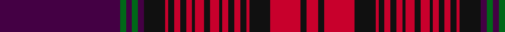

In pattern [BGBGBKRKRKRKRKRKRKRKRKRKR](/patterns/bgbgbkrkrkrkrkrkrkrkrkrkr/).

This was sourced from tartans-authority.  It is a [25 stripes tartan](/stripes/stripes25/).

Original link http://www.tartansauthority.com/tartan-ferret/display/4088/

## Thread count
DP/80 G4 DP4 G4 DP4 Ka14 Ra2 Ka4 Ra4 Ka4 Ra4 Ka2 Ra6 K4 Ra6 Ka2 Ra4 Ka4 Ra4 Ka4 Ra2 Ka14 R20 Ka4 R/8

## Palette
Each colour and its ΔE from the base-6 reference it is a variant of.

| Colour | Shade | Base | ΔE (OKLab) |
|---|---|---|---|
| DP | <code style="background-color:#440044;">#440044</code> `#440044` | B <code style="background-color:#2A418A;">#2A418A</code> | 0.18 |
| G | <code style="background-color:#006818;">#006818</code> `#006818` | G <code style="background-color:#006100;">#006100</code> | 0.02 |
| K | <code style="background-color:#101010;">#101010</code> `#101010` | K <code style="background-color:#000000;">#000000</code> | 0.17 |
| Ka | <code style="background-color:#101010;">#101010</code> `#101010` | K <code style="background-color:#000000;">#000000</code> | 0.17 |
| R | <code style="background-color:#C8002C;">#C8002C</code> `#C8002C` | R <code style="background-color:#CC0000;">#CC0000</code> | 0.03 |
| Ra | <code style="background-color:#C8002C;">#C8002C</code> `#C8002C` | R <code style="background-color:#CC0000;">#CC0000</code> | 0.03 |

## Nearest tartans

The nearest existing variants by ΔTartan distance.

1. [Arran - 1978 (Fashion)](/setts/s25/b86g4b4g4b4g16r2g4r3g3r4g2r6w3r6g2r4g3r3g4r2g16b24g4b10~b780078-g006818-rc80000-we0e0e0/) — ΔT 1.11
1. [Arran, Isle of (Strathmore)](/setts/s25/b86ba4b4ba4b4k16r2k4r3k3r4k2r6w3r6k2r4k3r3k4r2k16ba24k4ba10~b440044-ba5c5c5c-k101010-r880000-wf8f8f8~x2/) — ΔT 1.41
1. [Arran District Tartan Tartan Number: 381. Earliest known date: 1982 The Arran District tartan is a modern sett introduced by MacNaughtons of Pitlochry in 1982. It has recently been produced with a colour modification by Lochcarron Mills in Galashiels. The unusual ever decreasing stripe effect is taken from a pattern book of old plaids found on the Isle of Arran. See products available Copyright © Blair Urquhart, Comrie, 2015](/setts/s24/b90r5b5r5b5k16ra3k5ra4k4ra5k3ra6w4ra6k3ra5k4ra4k5ra3k16r22k5~b780078-k101010-r888888-rac80000-we0e0e0/) — ΔT 1.52
1. [Unidentified Plaid 5](/setts/s25/b2r2b2r2b6r5w2r75b13w5b9ra2b45rb1b3rb2b2rb3b1rb10w2b10ba2rb14ba2~b304080-ba5480b0-rc00000-rad03030-rb806050-we0e0e0~x2/) — ΔT 1.56
1. [Unidentified #5](/setts/s25/b96g10b8g8b10ga34r1ga6r4ga4r6ga2r7w3r7ga2r6ga4r4ga6r1ga34ba36ga6ba18~b5a008c-ba3c82af-g005020-ga503c14-rdc0000-we0e0e0~x2/) — ΔT 1.66
1. [Unidentified Plaid #11](/setts/s25/b2r2b2r2b6r5w2r75b13w5b9ra2b45g1b3g2b2g3b1g10w2b10ba2g14ba2~b2c4084-ba3c82af-g503c14-rdc0000-rac82828-we0e0e0~x2/) — ΔT 1.70
1. [Breeding](/setts/s18/w6k2r40k16b6k2b4k2ba4k2bb2k2ba4b7k2ba6b1r4~b003c64-ba60707c-bb2888b8-k101010-r982428-wf0e8d0~x2/) — ΔT 1.77
1. [Arran](/setts/s25/b80g4b4g4b4k14r2k4r3k3r4k2r5w3r5k2r4k3r3k4r2k14ga19k5ga9~b800080-g008000-ga808080-k000000-rc00000-we0e0e0~x2/) — ΔT 1.81
1. [Arran, Isle of (Lochcarron)](/setts/s48/k7r1k2r2k2r2k1r3w2r3k1r2k2r2k2r1k7b10k2b4k2b10k7r1k2r2k2r2k1r3w2r3k1r2k2r2k2r1k7ba2g2ba2g2ba40g2ba2g2ba2~b5c5c5c-ba440044-g006818-k101010-rc8002c-wf8f8f8~x2/) — ΔT 1.89
1. [MacDougall of MacDougall](/setts/s24/b2ba10r3ra4g72ra7g4ra10bb24ba6r5ra4r5ba7g24ra24g24ra3bb3ra74ba7r5ra6b2~b3c82af-ba5a008c-bb2c4084-g005020-rc82828-radc0000~x2/) — ΔT 1.91

## Neighbour map

Every grey dot is one of 15726 variants placed by the first two principal components of the ΔTartan feature space (44% of its variance). Red is this tartan; blue dots are its nearest — click one to open its page.

<svg viewBox="0 0 640 380" role="img" style="max-width:100%;height:auto;border:1px solid #e0e0e0;border-radius:4px;display:block" xmlns="http://www.w3.org/2000/svg"><image href="/nn/cloud.v1.png" width="640" height="380"/><a href="/setts/s25/b86g4b4g4b4g16r2g4r3g3r4g2r6w3r6g2r4g3r3g4r2g16b24g4b10~b780078-g006818-rc80000-we0e0e0/"><circle cx="289.2" cy="14.0" r="4" fill="#3465a4"><title>Arran - 1978 (Fashion)</title></circle></a><a href="/setts/s25/b86ba4b4ba4b4k16r2k4r3k3r4k2r6w3r6k2r4k3r3k4r2k16ba24k4ba10~b440044-ba5c5c5c-k101010-r880000-wf8f8f8~x2/"><circle cx="328.7" cy="46.2" r="4" fill="#3465a4"><title>Arran, Isle of (Strathmore)</title></circle></a><a href="/setts/s24/b90r5b5r5b5k16ra3k5ra4k4ra5k3ra6w4ra6k3ra5k4ra4k5ra3k16r22k5~b780078-k101010-r888888-rac80000-we0e0e0/"><circle cx="275.6" cy="36.2" r="4" fill="#3465a4"><title>Arran District Tartan Tartan Number: 381. Earliest known date: 1982 The Arran District tartan is a modern sett introduced by MacNaughtons of Pitlochry in 1982. It has recently been produced with a colour modification by Lochcarron Mills in Galashiels. The unusual ever decreasing stripe effect is taken from a pattern book of old plaids found on the Isle of Arran. See products available Copyright © Blair Urquhart, Comrie, 2015</title></circle></a><a href="/setts/s25/b2r2b2r2b6r5w2r75b13w5b9ra2b45rb1b3rb2b2rb3b1rb10w2b10ba2rb14ba2~b304080-ba5480b0-rc00000-rad03030-rb806050-we0e0e0~x2/"><circle cx="308.6" cy="14.0" r="4" fill="#3465a4"><title>Unidentified Plaid 5</title></circle></a><a href="/setts/s25/b96g10b8g8b10ga34r1ga6r4ga4r6ga2r7w3r7ga2r6ga4r4ga6r1ga34ba36ga6ba18~b5a008c-ba3c82af-g005020-ga503c14-rdc0000-we0e0e0~x2/"><circle cx="242.4" cy="21.6" r="4" fill="#3465a4"><title>Unidentified #5</title></circle></a><a href="/setts/s25/b2r2b2r2b6r5w2r75b13w5b9ra2b45g1b3g2b2g3b1g10w2b10ba2g14ba2~b2c4084-ba3c82af-g503c14-rdc0000-rac82828-we0e0e0~x2/"><circle cx="290.3" cy="14.0" r="4" fill="#3465a4"><title>Unidentified Plaid #11</title></circle></a><a href="/setts/s18/w6k2r40k16b6k2b4k2ba4k2bb2k2ba4b7k2ba6b1r4~b003c64-ba60707c-bb2888b8-k101010-r982428-wf0e8d0~x2/"><circle cx="228.7" cy="40.5" r="4" fill="#3465a4"><title>Breeding</title></circle></a><a href="/setts/s25/b80g4b4g4b4k14r2k4r3k3r4k2r5w3r5k2r4k3r3k4r2k14ga19k5ga9~b800080-g008000-ga808080-k000000-rc00000-we0e0e0~x2/"><circle cx="239.6" cy="14.0" r="4" fill="#3465a4"><title>Arran</title></circle></a><a href="/setts/s48/k7r1k2r2k2r2k1r3w2r3k1r2k2r2k2r1k7b10k2b4k2b10k7r1k2r2k2r2k1r3w2r3k1r2k2r2k2r1k7ba2g2ba2g2ba40g2ba2g2ba2~b5c5c5c-ba440044-g006818-k101010-rc8002c-wf8f8f8~x2/"><circle cx="190.2" cy="14.0" r="4" fill="#3465a4"><title>Arran, Isle of (Lochcarron)</title></circle></a><a href="/setts/s24/b2ba10r3ra4g72ra7g4ra10bb24ba6r5ra4r5ba7g24ra24g24ra3bb3ra74ba7r5ra6b2~b3c82af-ba5a008c-bb2c4084-g005020-rc82828-radc0000~x2/"><circle cx="248.6" cy="32.8" r="4" fill="#3465a4"><title>MacDougall of MacDougall</title></circle></a><circle cx="281.3" cy="20.8" r="5" fill="#c00000"/></svg>

ID: /setts/s25/b40g2b2g2b2k7r1k2r2k2r2k1r3k2r3k1r2k2r2k2r1k7r10k2r4~b440044-g006818-k101010-rc8002c~x2/
