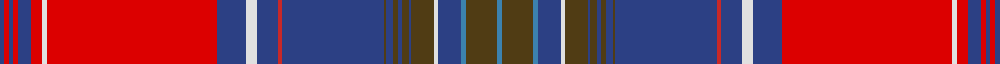

In pattern [BGBBWGBGBGBGBRBWBRWRBRBRB](/stripes/bgbbwgbgbgbgbrbwbrwrbrbrb/).

This was sourced from register-of-tartans.  It is a [25 stripe tartan](/stripes/stripes25/).

Original link https://www.tartanregister.gov.uk/tartanDetails.aspx?ref=4344

## Register references

External register numbers recorded for this tartan.

- Scottish Register of Tartans: [4344](https://www.tartanregister.gov.uk/tartanDetails.aspx?ref=4344)
- Scottish Tartans World Register: 406

## Thread count
B/4 R4 B4 R4 B12 R10 LN4 R150 B26 LN10 B18 Ra4 B90 T2 B6 T4 B4 T6 B2 T20 LN4 B20 Ba4 T28 Ba/4

## Palette
Each colour and the base-6 reference it is a variant of.

| Colour | Shade | Base |
|---|---|---|
| B | <code style="background-color:#2C4084;">#2C4084</code> `oklch(39.4% 0.117 268.3)` <small>#2C4084</small> | B <code style="background-color:#2A418A;">#2A418A</code> |
| Ba | <code style="background-color:#3C82AF;">#3C82AF</code> `oklch(58.1% 0.099 239.8)` <small>#3C82AF</small> | B <code style="background-color:#2A418A;">#2A418A</code> |
| LN | <code style="background-color:#E0E0E0;">#E0E0E0</code> `oklch(90.7% 0.000 89.9)` <small>#E0E0E0</small> | W <code style="background-color:#F7F7F7;">#F7F7F7</code> |
| R | <code style="background-color:#DC0000;">#DC0000</code> `oklch(56.2% 0.230 29.2)` <small>#DC0000</small> | R <code style="background-color:#CC0000;">#CC0000</code> |
| Ra | <code style="background-color:#C82828;">#C82828</code> `oklch(54.2% 0.196 26.8)` <small>#C82828</small> | R <code style="background-color:#CC0000;">#CC0000</code> |
| T | <code style="background-color:#503C14;">#503C14</code> `oklch(37.0% 0.062 81.8)` <small>#503C14</small> | G <code style="background-color:#006100;">#006100</code> |

## Nearest tartans

The nearest existing variants by ΔTartan distance.

1. [Unidentified Plaid 5](/setts/s25/db2r2db2r2db6r5w2r75db13w5db9r2db45o1db3o2db2o3db1o10w2db10t2o14t2~x2/) — ΔT 0.68
1. [Arran - 1978 (Fashion)](/setts/s25/dp86g4dp4g4dp4g16r2g4r3g3r4g2r6w3r6g2r4g3r3g4r2g16dp24g4dp10/) — ΔT 1.32
1. [MacDougall of MacDougall](/setts/s24/t2dp10r3r4dg72r7dg4r10db24dp6r5r4r5dp7dg24r24dg24r3db3r74dp7r5r6t2~x2/) — ΔT 1.34
1. [Chinese Scottish](/setts/s18/r24g6r3g3db6w1db1w2db58w2db1w1db6g3r3g6r24ly3~x2/) — ΔT 1.45
1. [Hay](/setts/s23/k12r4ly4k8r66g8r1ly1r8g60w3k60r3dp60r8ly3r3dp8r66k8ly4r4k6~x2/) — ΔT 1.54
1. [Arran District Tartan Tartan Number: 381. Earliest known date: 1982 The Arran District tartan is a modern sett introduced by MacNaughtons of Pitlochry in 1982. It has recently been produced with a colour modification by Lochcarron Mills in Galashiels. The unusual ever decreasing stripe effect is taken from a pattern book of old plaids found on the Isle of Arran. See products available Copyright © Blair Urquhart, Comrie, 2015](/setts/s24/dp90o5dp5o5dp5k16r3k5r4k4r5k3r6w4r6k3r5k4r4k5r3k16o22k5/) — ΔT 1.56
1. [Unidentified #5](/setts/s25/dp96dg10dp8dg8dp10dy34r1dy6r4dy4r6dy2r7w3r7dy2r6dy4r4dy6r1dy34t36dy6t18~x2/) — ΔT 1.57
1. [Unidentified #14](/setts/s17/dg4r3t1dp1r35dp1t1r3dp16r3t1dp1r2dg35r7k1t2~x2/) — ΔT 1.58
1. [Breeding](/setts/s18/w6k2r40k16dt6k2dt4k2n4k2t2k2n4dt7k2n6dt1r4~x2/) — ΔT 1.58
1. [Whitworth Artifact Tartan Tartan Number: 1724. Earliest known date: c.1790-1800 A piece of material 11x8 inches supposedly cut from a plaid worn by Prince Charles during the '45 rebellion. The piece was loaned to the Scottish Tartans Society museum in 1978 by Anthony Whitworth. The tartan expert, James Scarlett, noted that the sample was woven with a flying shuttle and appeared to be of commercial manufacture. He suggests that it may be a commercial copy of one of the many 'Princes Plaids' made c.1790. See products available Copyright © Blair Urquhart, Comrie, 2015](/setts/s20/r5ly1r8w1db20w1t20w1g20ly1r5ly1r5ly1g20ly2r52w1ly5w1~x2/) — ΔT 1.60

## Neighbour map

Every grey dot is one of 14299 variants placed by the first two principal components of the ΔTartan feature space (44% of its variance). Red is this tartan; blue dots are its nearest — click one to open its page.

<svg viewBox="0 0 640 380" role="img" style="max-width:100%;height:auto;border:1px solid #e0e0e0;border-radius:4px;display:block" xmlns="http://www.w3.org/2000/svg"><image href="/nn/cloud.v1.png" width="640" height="380"/><a href="/setts/s25/db2r2db2r2db6r5w2r75db13w5db9r2db45o1db3o2db2o3db1o10w2db10t2o14t2~x2/"><circle cx="309.8" cy="14.0" r="4" fill="#3465a4"><title>Unidentified Plaid 5</title></circle></a><a href="/setts/s25/dp86g4dp4g4dp4g16r2g4r3g3r4g2r6w3r6g2r4g3r3g4r2g16dp24g4dp10/"><circle cx="290.6" cy="20.9" r="4" fill="#3465a4"><title>Arran - 1978 (Fashion)</title></circle></a><a href="/setts/s24/t2dp10r3r4dg72r7dg4r10db24dp6r5r4r5dp7dg24r24dg24r3db3r74dp7r5r6t2~x2/"><circle cx="249.8" cy="36.5" r="4" fill="#3465a4"><title>MacDougall of MacDougall</title></circle></a><a href="/setts/s18/r24g6r3g3db6w1db1w2db58w2db1w1db6g3r3g6r24ly3~x2/"><circle cx="313.4" cy="34.5" r="4" fill="#3465a4"><title>Chinese Scottish</title></circle></a><a href="/setts/s23/k12r4ly4k8r66g8r1ly1r8g60w3k60r3dp60r8ly3r3dp8r66k8ly4r4k6~x2/"><circle cx="232.7" cy="19.7" r="4" fill="#3465a4"><title>Hay</title></circle></a><a href="/setts/s24/dp90o5dp5o5dp5k16r3k5r4k4r5k3r6w4r6k3r5k4r4k5r3k16o22k5/"><circle cx="277.3" cy="38.4" r="4" fill="#3465a4"><title>Arran District Tartan Tartan Number: 381. Earliest known date: 1982 The Arran District tartan is a modern sett introduced by MacNaughtons of Pitlochry in 1982. It has recently been produced with a colour modification by Lochcarron Mills in Galashiels. The unusual ever decreasing stripe effect is taken from a pattern book of old plaids found on the Isle of Arran. See products available Copyright © Blair Urquhart, Comrie, 2015</title></circle></a><a href="/setts/s25/dp96dg10dp8dg8dp10dy34r1dy6r4dy4r6dy2r7w3r7dy2r6dy4r4dy6r1dy34t36dy6t18~x2/"><circle cx="244.6" cy="28.9" r="4" fill="#3465a4"><title>Unidentified #5</title></circle></a><a href="/setts/s17/dg4r3t1dp1r35dp1t1r3dp16r3t1dp1r2dg35r7k1t2~x2/"><circle cx="307.0" cy="54.0" r="4" fill="#3465a4"><title>Unidentified #14</title></circle></a><a href="/setts/s18/w6k2r40k16dt6k2dt4k2n4k2t2k2n4dt7k2n6dt1r4~x2/"><circle cx="230.9" cy="44.4" r="4" fill="#3465a4"><title>Breeding</title></circle></a><a href="/setts/s20/r5ly1r8w1db20w1t20w1g20ly1r5ly1r5ly1g20ly2r52w1ly5w1~x2/"><circle cx="249.2" cy="18.9" r="4" fill="#3465a4"><title>Whitworth Artifact Tartan Tartan Number: 1724. Earliest known date: c.1790-1800 A piece of material 11x8 inches supposedly cut from a plaid worn by Prince Charles during the '45 rebellion. The piece was loaned to the Scottish Tartans Society museum in 1978 by Anthony Whitworth. The tartan expert, James Scarlett, noted that the sample was woven with a flying shuttle and appeared to be of commercial manufacture. He suggests that it may be a commercial copy of one of the many 'Princes Plaids' made c.1790. See products available Copyright © Blair Urquhart, Comrie, 2015</title></circle></a><circle cx="291.7" cy="14.0" r="5" fill="#c00000"/></svg>

ID: /setts/s25/db2r2db2r2db6r5w2r75db13w5db9r2db45dy1db3dy2db2dy3db1dy10w2db10t2dy14t2~x2/
