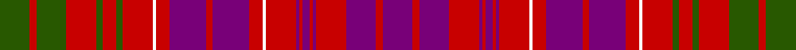

This page is one **sett** — a single exact thread-count. It belongs to the [tartan](/tartans/g9r2g9r9g2r4g2r9w1r4p11r2p11r4w1r9p1r1p2r1p1r9p9r2p9/)
(the same proportion at any scale), whose colour order is pattern [BRBRBRBRBRWRBRBRWRGRGRGRG](/stripes/brbrbrbrbrwrbrbrwrgrgrgrg/).

Sourced from register-of-tartans.  It is a [25 stripe tartan](/stripes/stripes25/).

Original link https://www.tartanregister.gov.uk/tartanDetails.aspx?ref=2246

2 attestations — the source records this cloth was collapsed from (oldest owns this page)

<ul>
<li>01/01/1975 — Lumsden of Clova (register-of-tartans, <a href="https://www.tartanregister.gov.uk/tartanDetails.aspx?ref=2246">record</a>)</li>
<li>1975 — Lumsden of Clova (Clan?) (tartans-authority, <a href="http://www.tartansauthority.com/tartan-ferret/display/417/">record</a>)</li>
</ul>

## Register references

External register numbers recorded for this tartan.

- Scottish Register of Tartans: [2246](https://www.tartanregister.gov.uk/tartanDetails.aspx?ref=2246)
- Scottish Tartans Authority (ITI): 417
- Scottish Tartans World Register: 417

## Thread count
G/18 R4 G18 R18 G4 R8 G4 R18 W2 R8 P22 R4 P22 R8 W2 R18 P2 R2 P4 R2 P2 R18 P18 R4 P/18

## Palette
Each colour and the base-6 reference it is a variant of.

| Colour | Shade | Base |
|---|---|---|
| G | <code style="background-color:#285800;">#285800</code> `oklch(41.0% 0.122 135.8)` <small>#285800</small> | G <code style="background-color:#006100;">#006100</code> |
| P | <code style="background-color:#780078;">#780078</code> `oklch(40.2% 0.185 328.4)` <small>#780078</small> | B <code style="background-color:#2A418A;">#2A418A</code> |
| R | <code style="background-color:#C80000;">#C80000</code> `oklch(52.3% 0.215 29.2)` <small>#C80000</small> | R <code style="background-color:#CC0000;">#CC0000</code> |
| W | <code style="background-color:#FCFCFC;">#FCFCFC</code> `oklch(99.1% 0.000 89.9)` <small>#FCFCFC</small> | W <code style="background-color:#F7F7F7;">#F7F7F7</code> |

## Nearest tartans

The nearest existing variants by ΔTartan distance, with this tartan at the top so the swatches line up against it.

ΔTartan

Tartan

Sett

—

<a href="/ttd/edit/#slug=dg9r2dg9r9dg2r4dg2r9w1r4dp11r2dp11r4w1r9dp1r1dp2r1dp1r9dp9r2dp9~x2">Lumsden of Clova</a> <a class="nn-out" href="/setts/s25/dg9r2dg9r9dg2r4dg2r9w1r4dp11r2dp11r4w1r9dp1r1dp2r1dp1r9dp9r2dp9~x2/" title="open its dictionary page">↗</a>

0.84

<a href="/ttd/edit/#slug=k4r5p6r8g12r13g2r2p12r20p2r2p4r2p2r3p6r3p2r2p4~x2">Murray of Tullibardine 3</a> <a class="nn-out" href="/setts/s21/k4r5p6r8g12r13g2r2p12r20p2r2p4r2p2r3p6r3p2r2p4~x2/" title="open its dictionary page">↗</a>

1.13

<a href="/ttd/edit/#slug=k4r5dp6r8dg12r13dg2r2dp12r20dp2r2dp4r2dp2r3dp6r3dp2r2dp4~x2">Murray of Tullibardine #3</a> <a class="nn-out" href="/setts/s21/k4r5dp6r8dg12r13dg2r2dp12r20dp2r2dp4r2dp2r3dp6r3dp2r2dp4~x2/" title="open its dictionary page">↗</a>

1.29

<a href="/ttd/edit/#slug=db3y1db2r14y2r1y2db10r10db10w2r2w2r14y6r10db10w2~x2">Ensemble Pour l'Avenir</a> <a class="nn-out" href="/setts/s18/db3y1db2r14y2r1y2db10r10db10w2r2w2r14y6r10db10w2~x2/" title="open its dictionary page">↗</a>

1.37

<a href="/ttd/edit/#slug=db4r1db1r2db10r2db1r1k1r1db1r12db6r4g4r12g10r6db4r2k2~x4">MacLeod of Tullibardine</a> <a class="nn-out" href="/setts/s21/db4r1db1r2db10r2db1r1k1r1db1r12db6r4g4r12g10r6db4r2k2~x4/" title="open its dictionary page">↗</a>

1.40

<a href="/ttd/edit/#slug=dg23r6dg23r26dg4r9dg4r26w3r8dp31r6dp31r8w3r26dp2r2dp4r2dp2r26dp2r2dp4r2dp2r26dg23r6dg23~x2">Ross #3</a> <a class="nn-out" href="/setts/s31/dg23r6dg23r26dg4r9dg4r26w3r8dp31r6dp31r8w3r26dp2r2dp4r2dp2r26dp2r2dp4r2dp2r26dg23r6dg23~x2/" title="open its dictionary page">↗</a>

1.44

<a href="/ttd/edit/#slug=db4r2db2r3db12r3db2r2k5r2db2r22db26r6dg6r22dg23r14db8r7k3~x2">Murray of Tullibardine</a> <a class="nn-out" href="/setts/s21/db4r2db2r3db12r3db2r2k5r2db2r22db26r6dg6r22dg23r14db8r7k3~x2/" title="open its dictionary page">↗</a>

1.47

<a href="/ttd/edit/#slug=g23r6g23r26g4r9g4r26w3r8p31r6p31r8w3r26p2r2p4r2p2r26p2r2p4r2p2r26g23r6g23~x2">Ross 7</a> <a class="nn-out" href="/setts/s31/g23r6g23r26g4r9g4r26w3r8p31r6p31r8w3r26p2r2p4r2p2r26p2r2p4r2p2r26g23r6g23~x2/" title="open its dictionary page">↗</a>

1.47

<a href="/ttd/edit/#slug=db3o1db2r14o2r1o2db10r10db10w2r2w2r14o6r10db10w2~x2">Ensemble Pour L'Avenir</a> <a class="nn-out" href="/setts/s18/db3o1db2r14o2r1o2db10r10db10w2r2w2r14o6r10db10w2~x2/" title="open its dictionary page">↗</a>

1.51

<a href="/setts/s20/db25db2r25g10r4db25r2g2r25g2r2~x2/">Hebrides #2</a>

1.55

<a href="/ttd/edit/#slug=r25t2db25r2g2r25g2r2db25r4db25r2g2r25g2r2db25t2r25g10~x2">Hebrides #4</a> <a class="nn-out" href="/setts/s20/r25t2db25r2g2r25g2r2db25r4db25r2g2r25g2r2db25t2r25g10~x2/" title="open its dictionary page">↗</a>

## Neighbour map

Every grey dot is one of 14299 variants placed by the first two principal components of the ΔTartan feature space (44% of its variance). Red is this tartan; blue dots are its nearest — click one to open its page.

<svg viewBox="0 0 640 380" role="img" style="max-width:100%;height:auto;border:1px solid #e0e0e0;border-radius:4px;display:block" xmlns="http://www.w3.org/2000/svg"><image href="/nn/cloud.v1.png" width="640" height="380"/><a href="/setts/s21/k4r5p6r8g12r13g2r2p12r20p2r2p4r2p2r3p6r3p2r2p4~x2/"><circle cx="291.3" cy="149.3" r="4" fill="#3465a4"><title>Murray of Tullibardine 3</title></circle></a><a href="/setts/s21/k4r5dp6r8dg12r13dg2r2dp12r20dp2r2dp4r2dp2r3dp6r3dp2r2dp4~x2/"><circle cx="277.0" cy="142.4" r="4" fill="#3465a4"><title>Murray of Tullibardine #3</title></circle></a><a href="/setts/s18/db3y1db2r14y2r1y2db10r10db10w2r2w2r14y6r10db10w2~x2/"><circle cx="276.0" cy="148.8" r="4" fill="#3465a4"><title>Ensemble Pour l'Avenir</title></circle></a><a href="/setts/s21/db4r1db1r2db10r2db1r1k1r1db1r12db6r4g4r12g10r6db4r2k2~x4/"><circle cx="268.0" cy="142.1" r="4" fill="#3465a4"><title>MacLeod of Tullibardine</title></circle></a><a href="/setts/s31/dg23r6dg23r26dg4r9dg4r26w3r8dp31r6dp31r8w3r26dp2r2dp4r2dp2r26dp2r2dp4r2dp2r26dg23r6dg23~x2/"><circle cx="265.5" cy="106.7" r="4" fill="#3465a4"><title>Ross #3</title></circle></a><a href="/setts/s21/db4r2db2r3db12r3db2r2k5r2db2r22db26r6dg6r22dg23r14db8r7k3~x2/"><circle cx="258.8" cy="132.5" r="4" fill="#3465a4"><title>Murray of Tullibardine</title></circle></a><a href="/setts/s31/g23r6g23r26g4r9g4r26w3r8p31r6p31r8w3r26p2r2p4r2p2r26p2r2p4r2p2r26g23r6g23~x2/"><circle cx="276.2" cy="112.9" r="4" fill="#3465a4"><title>Ross 7</title></circle></a><a href="/setts/s18/db3o1db2r14o2r1o2db10r10db10w2r2w2r14o6r10db10w2~x2/"><circle cx="263.8" cy="141.4" r="4" fill="#3465a4"><title>Ensemble Pour L'Avenir</title></circle></a><a href="/setts/s20/db25db2r25g10r4db25r2g2r25g2r2~x2/"><circle cx="293.1" cy="138.2" r="4" fill="#3465a4"><title>Hebrides #2</title></circle></a><a href="/setts/s20/r25t2db25r2g2r25g2r2db25r4db25r2g2r25g2r2db25t2r25g10~x2/"><circle cx="291.5" cy="142.0" r="4" fill="#3465a4"><title>Hebrides #4</title></circle></a><circle cx="256.3" cy="150.8" r="5" fill="#c00000"/></svg>

ID: /setts/s25/dg9r2dg9r9dg2r4dg2r9w1r4dp11r2dp11r4w1r9dp1r1dp2r1dp1r9dp9r2dp9~x2/
