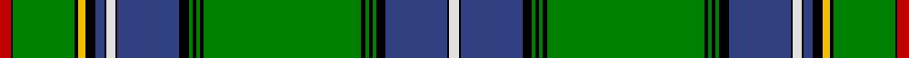

In pattern [RKGKYKBKWKBKGKGKGKGKGKBKW](/stripes/rkgkykbkwkbkgkgkgkgkgkbkw/).

This was sourced from weddslist.  It is a [25 stripe tartan](/stripes/stripes25/).

Original link http://www.weddslist.com/cgi-bin/tartans/pg.pl?source=sts

## Thread count
R/12 K2 G68 K4 Y8 K10 B10 K2 LN10 K2 B68 K10 G4 K4 G4 K4 G172 K4 G4 K4 G4 K10 B68 K2 LN/10

## Palette
Each colour and the base-6 reference it is a variant of.

| Colour | Shade | Base |
|---|---|---|
| B | <code style="background-color:#304080;">#304080</code> `oklch(39.4% 0.109 270.2)` <small>#304080</small> | B <code style="background-color:#2A418A;">#2A418A</code> |
| G | <code style="background-color:#008000;">#008000</code> `oklch(52.0% 0.177 142.5)` <small>#008000</small> | G <code style="background-color:#006100;">#006100</code> |
| K | <code style="background-color:#000000;">#000000</code> `oklch(0.0% 0.000 0.0)` <small>#000000</small> | K <code style="background-color:#000000;">#000000</code> |
| LN | <code style="background-color:#E0E0E0;">#E0E0E0</code> `oklch(90.7% 0.000 89.9)` <small>#E0E0E0</small> | W <code style="background-color:#F7F7F7;">#F7F7F7</code> |
| R | <code style="background-color:#C00000;">#C00000</code> `oklch(50.7% 0.208 29.2)` <small>#C00000</small> | R <code style="background-color:#CC0000;">#CC0000</code> |
| Y | <code style="background-color:#F0C000;">#F0C000</code> `oklch(82.7% 0.169 90.5)` <small>#F0C000</small> | Y <code style="background-color:#F2BF00;">#F2BF00</code> |

## Nearest tartans

The nearest existing variants by ΔTartan distance.

1. [Cockburn (Old Pattern)](/setts/s25/r6k1g34k2ly4k5db5k1w5k1db34k5g2k2g2k2g86k2g2k2g2k5db34k1w5/) — ΔT 0.88
1. [Unnamed 8](/setts/s20/g82k2g2k2g2k8db28k1w6k1db28k1ly6k1g32k2r5k2g15w6~x2/) — ΔT 0.92
1. [Cockburn](/setts/s31/r5k2g30k2ly5k2db31k2w5k2db31k6g2k2g2k2g86k2g2k2g2k6db31k2w5k2db31k6g25k2r5~x2/) — ΔT 0.99
1. [Cockburn](/setts/s17/g36k1g1k1g1k1db12k1w1k1db12k1ly1k1g12k2r2~x2/) — ΔT 1.24
1. [Sillars](/setts/s22/g64k4db9ly2db4ly2db4g11r8db2r4w3~x2/) — ΔT 1.29
1. [Ayre Personal Tartan Tartan Number: 6305. Earliest known date: 1819 This is Wilsons No. 038 (1819) and has been adopted by David Ayre of Kilmarnock as a private family tartan. See #805. See products available Copyright © Blair Urquhart, Comrie, 2015](/setts/s38/g82k2g2k2g2k8db28k2w6k2db28k2ly6k2g32k2r5k2g15w6/) — ΔT 1.34
1. [Un-named C19th Plaid](/setts/s31/g105db9k16ly6k8w3k8g16r24k1r4k2r3k3r2k4r1k9g1k4g2k3g3k2g4k1g40r9g10k3w5~x2/) — ΔT 1.41
1. [MacMaster](/setts/s24/g34k1r4w1r4k1g4k1ly2k1g7k1r3k1g3k1r3k1g3w1db5w1ly4w2~x2/) — ΔT 1.51
1. [Unidentified #30](/setts/s20/dg82k2dg2k2dg2k8db28k1w6k1db28k1ly6k1dg32k2r5k2dg15w6~x2/) — ΔT 1.52
1. [MacMaster (USA) #2](/setts/s24/dg34k1r4w1r4k1dg4k1ly2k1dg7k1r3k1dg3k1r3k1dg3w1db5w1ly4w2~x2/) — ΔT 1.57

## Neighbour map

Every grey dot is one of 14299 variants placed by the first two principal components of the ΔTartan feature space (44% of its variance). Red is this tartan; blue dots are its nearest — click one to open its page.

<svg viewBox="0 0 640 380" role="img" style="max-width:100%;height:auto;border:1px solid #e0e0e0;border-radius:4px;display:block" xmlns="http://www.w3.org/2000/svg"><image href="/nn/cloud.v1.png" width="640" height="380"/><a href="/setts/s25/r6k1g34k2ly4k5db5k1w5k1db34k5g2k2g2k2g86k2g2k2g2k5db34k1w5/"><circle cx="312.5" cy="19.3" r="4" fill="#3465a4"><title>Cockburn (Old Pattern)</title></circle></a><a href="/setts/s20/g82k2g2k2g2k8db28k1w6k1db28k1ly6k1g32k2r5k2g15w6~x2/"><circle cx="320.9" cy="28.9" r="4" fill="#3465a4"><title>Unnamed 8</title></circle></a><a href="/setts/s31/r5k2g30k2ly5k2db31k2w5k2db31k6g2k2g2k2g86k2g2k2g2k6db31k2w5k2db31k6g25k2r5~x2/"><circle cx="243.4" cy="16.7" r="4" fill="#3465a4"><title>Cockburn</title></circle></a><a href="/setts/s17/g36k1g1k1g1k1db12k1w1k1db12k1ly1k1g12k2r2~x2/"><circle cx="330.9" cy="49.7" r="4" fill="#3465a4"><title>Cockburn</title></circle></a><a href="/setts/s22/g64k4db9ly2db4ly2db4g11r8db2r4w3~x2/"><circle cx="286.1" cy="40.1" r="4" fill="#3465a4"><title>Sillars</title></circle></a><a href="/setts/s38/g82k2g2k2g2k8db28k2w6k2db28k2ly6k2g32k2r5k2g15w6/"><circle cx="254.6" cy="16.2" r="4" fill="#3465a4"><title>Ayre Personal Tartan Tartan Number: 6305. Earliest known date: 1819 This is Wilsons No. 038 (1819) and has been adopted by David Ayre of Kilmarnock as a private family tartan. See #805. See products available Copyright © Blair Urquhart, Comrie, 2015</title></circle></a><a href="/setts/s31/g105db9k16ly6k8w3k8g16r24k1r4k2r3k3r2k4r1k9g1k4g2k3g3k2g4k1g40r9g10k3w5~x2/"><circle cx="345.0" cy="14.0" r="4" fill="#3465a4"><title>Un-named C19th Plaid</title></circle></a><a href="/setts/s24/g34k1r4w1r4k1g4k1ly2k1g7k1r3k1g3k1r3k1g3w1db5w1ly4w2~x2/"><circle cx="294.6" cy="18.6" r="4" fill="#3465a4"><title>MacMaster</title></circle></a><a href="/setts/s20/dg82k2dg2k2dg2k8db28k1w6k1db28k1ly6k1dg32k2r5k2dg15w6~x2/"><circle cx="355.4" cy="46.5" r="4" fill="#3465a4"><title>Unidentified #30</title></circle></a><a href="/setts/s24/dg34k1r4w1r4k1dg4k1ly2k1dg7k1r3k1dg3k1r3k1dg3w1db5w1ly4w2~x2/"><circle cx="314.7" cy="25.5" r="4" fill="#3465a4"><title>MacMaster (USA) #2</title></circle></a><circle cx="291.9" cy="14.0" r="5" fill="#c00000"/></svg>

ID: /setts/s25/r6k1g34k2ly4k5db5k1w5k1db34k5g2k2g2k2g86k2g2k2g2k5db34k1w5~x2/
