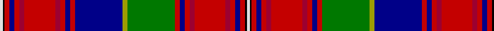

In pattern [WKRBRRRRRBRBYGRBRRRRRBRKW](/patterns/wkrbrrrrrbrbygrbrrrrrbrkw/).

This was sourced from register-of-tartans.  It is a [25 stripes tartan](/stripes/stripes25/).

Original link https://www.tartanregister.gov.uk/tartanDetails.aspx?ref=1195

## Thread count
LN/8 K4 R12 DB12 R12 DR12 R76 DR12 R12 DB12 R12 DB116 LG12 G116 R12 DB12 R12 DR12 R76 DR12 R12 DB12 R12 K4 LN/8

## Palette
Each colour and its ΔE from the base-6 reference it is a variant of.

| Colour | Shade | Base | ΔE (OKLab) |
|---|---|---|---|
| DB | <code style="background-color:#000088;">#000088</code> `#000088` | B <code style="background-color:#2A418A;">#2A418A</code> | 0.14 |
| DR | <code style="background-color:#9C0030;">#9C0030</code> `#9C0030` | R <code style="background-color:#CC0000;">#CC0000</code> | 0.11 |
| G | <code style="background-color:#007800;">#007800</code> `#007800` | G <code style="background-color:#006100;">#006100</code> | 0.07 |
| K | <code style="background-color:#000000;">#000000</code> `#000000` | K <code style="background-color:#000000;">#000000</code> | 0.00 |
| LG | <code style="background-color:#9C9C00;">#9C9C00</code> `#9C9C00` | Y <code style="background-color:#F2BF00;">#F2BF00</code> | 0.17 |
| LN | <code style="background-color:#E0E0E0;">#E0E0E0</code> `#E0E0E0` | W <code style="background-color:#F7F7F7;">#F7F7F7</code> | 0.07 |
| R | <code style="background-color:#C40000;">#C40000</code> `#C40000` | R <code style="background-color:#CC0000;">#CC0000</code> | 0.02 |

## Nearest tartans

The nearest existing variants by ΔTartan distance.

1. [Holyrood (Chair)](/setts/s24/r34w1b10g10w1y1g2ba2w1b2ba10r6w1r6ba10b2w1ba2g2y1w1g10b10w1x2~b202060-ba2888c4-g003820-rc80000-wfcfcfc-yd8b000/) — ΔT 1.08
1. [Macan, of Lurgyvallan](/setts/s24/r16g1r1g1r1g4k1w1k1y1k1b6ba4b6k1y1k1w1k1g4r12g1r1k1x2~b5480b0-ba304080-g008000-k000000-rc00000-we0e0e0-yf0c000/) — ΔT 1.21
1. [Unnamed C18th - Hynde Cotton Jacket](/setts/s18/r40b5k26r4b10ba14b10r5k2r5k2r5k2r5y2g26w6y2~b9058d8-ba202060-g285800-k101010-rc80000-w98c8e8-yb0b0b0/) — ΔT 1.21
1. [Sellers/Sillars](/setts/s22/g63k4w9y2b4y2b4g11r8w2r4wa5r4w2r8g11b4y2b4y2w9k4x2~b1c0070-g604000-k101010-rc80000-wa8ace8-waf8f8f8-ye8c000/) — ΔT 1.23
1. [Hay or Leith](/setts/s22/b41r2k42w2g41r3y2r3g3r31k3y2r3k5r3y2k3r31b3r3y2r3x2~b2c4084-g005020-k101010-rdc0000-we0e0e0-ye8c000/) — ΔT 1.23
1. [Macan of Lurgyvallan Portrait Tartan Tartan Number: 1155. Earliest known date: 1831 The portrait of 'Captain Macan of Lurgyvallan painted and presented to him by his sincere friend William MacKenzie, 24th Oct. 1831' was recently sold at auction in London. The watercolour measured 10 by 7 inches. The chief (three eagles feathers) is wearing full Highland Dress. The tartan is a sort of MacLean of Duart, in the red Stewart group, but showing the MacLean inversion. No such person or clan or tartan or chief ever existed. See products available Copyright © Blair Urquhart, Comrie, 2015](/setts/s24/r16g1r1g1r1g4k1w1k1y1k1b6ba4b6k1y1k1w1k1g4r12g1r1k1x2~b5c8ca8-ba2c2c80-g006818-k101010-rc80000-we0e0e0-ye8c000/) — ΔT 1.29
1. [Macan of Lurgyvallan](/setts/s24/r16g1r1g1r1g4k1w1k1y1k1b6ba4b6k1y1k1w1k1g4r12g1r1k1x4~b5c8ca8-ba2c2c80-g006818-k101010-rc80000-wc0c0c0-ye8c000/) — ΔT 1.31
1. [Hay & Leith - 1800 (Clan)](/setts/s23/k10r3y3k6r48g6r2y2r6g40w2k38r2b40r6y2r2b6r48k6y2r3k10~b280034-g285800-k101010-rc80000-wfcfcfc-ye8c000/) — ΔT 1.36
1. [Hay, or Leith](/setts/s23/k3r1y1k2r16b2r1y1r2ba15r1k15w1g15r2y1r1g2r16k2y1r1k3x2~b800080-ba304080-g008000-k000000-rc00000-we0e0e0-yf0c000/) — ΔT 1.38
1. [Ross Wedding Dress](/setts/s24/k4w2k2w1b6r6g6w1g27w1ba4b4ga3w1ga3b4ba4w1r36ba3b2w1b2ba3x2~b5c8ca8-ba2c2c80-g006818-ga604000-k101010-rc80000-we0e0e0/) — ΔT 1.38

## Neighbour map

Every grey dot is one of 15726 variants placed by the first two principal components of the ΔTartan feature space (44% of its variance). Red is this tartan; blue dots are its nearest — click one to open its page.

<svg viewBox="0 0 640 380" role="img" style="max-width:100%;height:auto;border:1px solid #e0e0e0;border-radius:4px;display:block" xmlns="http://www.w3.org/2000/svg"><image href="/nn/cloud.v1.png" width="640" height="380"/><a href="/setts/s24/r34w1b10g10w1y1g2ba2w1b2ba10r6w1r6ba10b2w1ba2g2y1w1g10b10w1x2~b202060-ba2888c4-g003820-rc80000-wfcfcfc-yd8b000/"><circle cx="175.6" cy="25.9" r="4" fill="#3465a4"><title>Holyrood (Chair)</title></circle></a><a href="/setts/s24/r16g1r1g1r1g4k1w1k1y1k1b6ba4b6k1y1k1w1k1g4r12g1r1k1x2~b5480b0-ba304080-g008000-k000000-rc00000-we0e0e0-yf0c000/"><circle cx="167.9" cy="35.8" r="4" fill="#3465a4"><title>Macan, of Lurgyvallan</title></circle></a><a href="/setts/s18/r40b5k26r4b10ba14b10r5k2r5k2r5k2r5y2g26w6y2~b9058d8-ba202060-g285800-k101010-rc80000-w98c8e8-yb0b0b0/"><circle cx="140.1" cy="55.6" r="4" fill="#3465a4"><title>Unnamed C18th - Hynde Cotton Jacket</title></circle></a><a href="/setts/s22/g63k4w9y2b4y2b4g11r8w2r4wa5r4w2r8g11b4y2b4y2w9k4x2~b1c0070-g604000-k101010-rc80000-wa8ace8-waf8f8f8-ye8c000/"><circle cx="247.5" cy="14.0" r="4" fill="#3465a4"><title>Sellers/Sillars</title></circle></a><a href="/setts/s22/b41r2k42w2g41r3y2r3g3r31k3y2r3k5r3y2k3r31b3r3y2r3x2~b2c4084-g005020-k101010-rdc0000-we0e0e0-ye8c000/"><circle cx="169.9" cy="48.0" r="4" fill="#3465a4"><title>Hay or Leith</title></circle></a><a href="/setts/s24/r16g1r1g1r1g4k1w1k1y1k1b6ba4b6k1y1k1w1k1g4r12g1r1k1x2~b5c8ca8-ba2c2c80-g006818-k101010-rc80000-we0e0e0-ye8c000/"><circle cx="181.9" cy="39.7" r="4" fill="#3465a4"><title>Macan of Lurgyvallan Portrait Tartan Tartan Number: 1155. Earliest known date: 1831 The portrait of 'Captain Macan of Lurgyvallan painted and presented to him by his sincere friend William MacKenzie, 24th Oct. 1831' was recently sold at auction in London. The watercolour measured 10 by 7 inches. The chief (three eagles feathers) is wearing full Highland Dress. The tartan is a sort of MacLean of Duart, in the red Stewart group, but showing the MacLean inversion. No such person or clan or tartan or chief ever existed. See products available Copyright © Blair Urquhart, Comrie, 2015</title></circle></a><a href="/setts/s24/r16g1r1g1r1g4k1w1k1y1k1b6ba4b6k1y1k1w1k1g4r12g1r1k1x4~b5c8ca8-ba2c2c80-g006818-k101010-rc80000-wc0c0c0-ye8c000/"><circle cx="184.8" cy="41.0" r="4" fill="#3465a4"><title>Macan of Lurgyvallan</title></circle></a><a href="/setts/s23/k10r3y3k6r48g6r2y2r6g40w2k38r2b40r6y2r2b6r48k6y2r3k10~b280034-g285800-k101010-rc80000-wfcfcfc-ye8c000/"><circle cx="203.9" cy="49.3" r="4" fill="#3465a4"><title>Hay &amp; Leith - 1800 (Clan)</title></circle></a><a href="/setts/s23/k3r1y1k2r16b2r1y1r2ba15r1k15w1g15r2y1r1g2r16k2y1r1k3x2~b800080-ba304080-g008000-k000000-rc00000-we0e0e0-yf0c000/"><circle cx="133.8" cy="40.9" r="4" fill="#3465a4"><title>Hay, or Leith</title></circle></a><a href="/setts/s24/k4w2k2w1b6r6g6w1g27w1ba4b4ga3w1ga3b4ba4w1r36ba3b2w1b2ba3x2~b5c8ca8-ba2c2c80-g006818-ga604000-k101010-rc80000-we0e0e0/"><circle cx="162.4" cy="14.0" r="4" fill="#3465a4"><title>Ross Wedding Dress</title></circle></a><circle cx="183.4" cy="17.2" r="5" fill="#c00000"/></svg>

ID: /setts/s25/w2k1r3b3r3ra3r19ra3r3b3r3b29y3g29r3b3r3ra3r19ra3r3b3r3k1w2x4~b000088-g007800-k000000-rc40000-ra9c0030-we0e0e0-y9c9c00/
