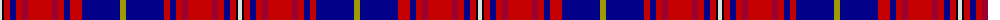

In pattern [WKRBRRRRRBRBYBRBRRRRRBRKW](/patterns/wkrbrrrrrbrbybrbrrrrrbrkw/).

This was sourced from tartans-authority.  It is a [25 stripes tartan](/stripes/stripes25/).

Original link http://www.tartansauthority.com/tartan-ferret/display/1818/

## Thread count
LN/4 K2 R6 DB6 R6 DR6 R24 DR6 R6 DBa6 R12 DBa38 LG6 DBb38 R6 DBa6 R6 DR6 R24 DR6 R6 DB6 R6 K2 LN/4

## Palette
Each colour and its ΔE from the base-6 reference it is a variant of.

| Colour | Shade | Base | ΔE (OKLab) |
|---|---|---|---|
| DB | <code style="background-color:#000088;">#000088</code> `#000088` | B <code style="background-color:#2C4084;">#2C4084</code> | 0.14 |
| DBa | <code style="background-color:#000088;">#000088</code> `#000088` | B <code style="background-color:#2C4084;">#2C4084</code> | 0.14 |
| DBb | <code style="background-color:#000088;">#000088</code> `#000088` | B <code style="background-color:#2C4084;">#2C4084</code> | 0.14 |
| DR | <code style="background-color:#9C0030;">#9C0030</code> `#9C0030` | R <code style="background-color:#C80000;">#C80000</code> | 0.10 |
| K | <code style="background-color:#000000;">#000000</code> `#000000` | K <code style="background-color:#000000;">#000000</code> | 0.00 |
| LG | <code style="background-color:#9C9C00;">#9C9C00</code> `#9C9C00` | Y <code style="background-color:#E8C000;">#E8C000</code> | 0.16 |
| LN | <code style="background-color:#E0E0E0;">#E0E0E0</code> `#E0E0E0` | W <code style="background-color:#F4F4F0;">#F4F4F0</code> | 0.06 |
| R | <code style="background-color:#C40000;">#C40000</code> `#C40000` | R <code style="background-color:#C80000;">#C80000</code> | 0.01 |

ID: /setts/s25/w4k2r6b6r6ra6r24ra6r6b6r12b38y6b38r6b6r6ra6r24ra6r6b6r6k2w4-b000088-k000000-rc40000-ra9c0030-we0e0e0-y9c9c00/
