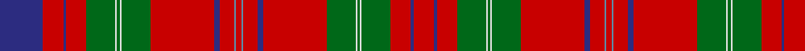

In pattern [BRBRGWGWGRBRBRBRBRGWGWGRBR](/patterns/brbrgwgwgrbrbrbrbrgwgwgrbr/).

This was sourced from register-of-tartans.  It is a [26 stripes tartan](/stripes/stripes26/).

Original link https://www.tartanregister.gov.uk/tartanDetails.aspx?ref=4417

## Register references

External register numbers recorded for this tartan.

- Scottish Register of Tartans: [4417](https://www.tartanregister.gov.uk/tartanDetails.aspx?ref=4417)
- Scottish Tartans Authority (ITI): 460
- Scottish Tartans World Register: 460

## Thread count
DB/60 R28 DB4 R28 G40 LN2 G4 LN2 G40 R88 DB8 R20 B2 R8 B2 R20 DB8 R88 G40 LN2 G4 LN2 G40 R28 DB4 R/28

## Palette
Each colour and its ΔE from the base-6 reference it is a variant of.

| Colour | Shade | Base | ΔE (OKLab) |
|---|---|---|---|
| B | <code style="background-color:#5C8CA8;">#5C8CA8</code> `#5C8CA8` | B <code style="background-color:#2A418A;">#2A418A</code> | 0.23 |
| DB | <code style="background-color:#2C2C80;">#2C2C80</code> `#2C2C80` | B <code style="background-color:#2A418A;">#2A418A</code> | 0.06 |
| G | <code style="background-color:#006818;">#006818</code> `#006818` | G <code style="background-color:#006100;">#006100</code> | 0.02 |
| LN | <code style="background-color:#E0E0E0;">#E0E0E0</code> `#E0E0E0` | W <code style="background-color:#F7F7F7;">#F7F7F7</code> | 0.07 |
| R | <code style="background-color:#C80000;">#C80000</code> `#C80000` | R <code style="background-color:#CC0000;">#CC0000</code> | 0.01 |

## Nearest tartans

The nearest existing variants by ΔTartan distance.

1. [MacDougall - 1970 (H of E)](/setts/s27/r5g10r2b2r30ba3r2w1r2ba3r30b2r2g10r10g10ba4r2ba4b10r4g2r4g30r2ba3w1~b2c2c80-ba6c0070-g006818-rc80000-wfcfcfc~x2/) — ΔT 0.94
1. [MacDougall Clan Tartan Tartan Number: 1519. Earliest known date: 1815-16 The earliest reference to the MacDougall tartan is in the collection of the Highland Society of London where a sample exists, signed and sealed by the Clan Chief around 1815. The sett is a complex one and the nearest count to the present day day tartan comes from a sample in Paton's collection housed at the Scottish Tartans Museum, and dating to about 1830. The Highland Society also have a sample certified by the Chief MacDougall of MacDougall dated 1906, in their archives store at the Royal Caledonian School near London. See products available Copyright © Blair Urquhart, Comrie, 2015](/setts/s27/r5g10r2b2r30y3r2w1r2y3r30b2r2g10r10g10y4r2y4b10r4g2r4g30r2y3w1~b2c2c80-g006818-rc80000-we0e0e0-yc090a0~x2/) — ΔT 1.00
1. [MacDougall 9](/setts/s27/r5g10r2b2r30ba3r2w1r2ba3r30b2r2g10r10g10ba4r2ba4b10r4g2r4g30r2ba3w1~b304080-ba800080-g008000-rc00000-we0e0e0~x2/) — ΔT 1.01
1. [MacDougal](/setts/s26/g10r2b2r30ba3r2w1r2ba3r30b2r2g10r10g10ba4r2ba4b10r4g2r4g30r2ba3w1~b2c2c80-ba6c0070-g006818-rc80000-wfcfcfc~x2/) — ΔT 1.04
1. [Wood Dress (Clan)](/setts/s23/k1w1k2g1k1g10b8r10g2r10g2r30g2r10g2r10b8g10k1g1k2y1k1~b2c2c80-g006818-k101010-rc80000-we0e0e0-ye8c000~x2/) — ΔT 1.15
1. [Dalziel (Logan) Family Tartan Tartan Number: 969. Earliest known date: 1831 Dalziel or Dalzell tartan is similar to the Munro. The basic form of the design was used for a 'George IV' tartan produced in honour of the King's visit in 1822. The Barony of Dalzell in Lanarkshire is the origin of the name. In Old Scots it means 'I dare' and this is also the motto on the family coat of arms. A cadet branch of the family built the House of the Binns in West Lothian which is now owned by the National Trust for Scotland. See products available Copyright © Blair Urquhart, Comrie, 2015](/setts/s17/r24w1b2r4g32r4b2w1r4b6r4w1b2r32g2ra3g6~b2c2c80-g006818-rc80000-raa00048-we0e0e0~x2/) — ΔT 1.20
1. [Dalziel (Clan)](/setts/s17/r24w1b2r4g32r4b2w1r4b6r4w1b2r32g6ra6g6~b780078-g006818-rc80000-racc4438-we0e0e0~x2/) — ΔT 1.24
1. [Dalziel #2](/setts/s17/r24w1b2r4g32r4b2w1r4b6r4w1b2r32g2ra3g6~b780078-g006818-rc80000-racc4438-we0e0e0~x2/) — ΔT 1.28
1. [Dalziel](/setts/s17/r24w1b2r4g32r4b2w1r4b6r4w1b2r32g2ra3g6~b304080-g008000-rc00000-ra900030-we0e0e0~x2/) — ΔT 1.29
1. [Munro (Clan)](/setts/s17/r36y2b1r3g41r3b1y2r3b12r3y2b1r36g3ra3g4~b2c2c80-g006818-rc80000-racc4438-ye8c000~x2/) — ΔT 1.30

## Neighbour map

Every grey dot is one of 15726 variants placed by the first two principal components of the ΔTartan feature space (44% of its variance). Red is this tartan; blue dots are its nearest — click one to open its page.

<svg viewBox="0 0 640 380" role="img" style="max-width:100%;height:auto;border:1px solid #e0e0e0;border-radius:4px;display:block" xmlns="http://www.w3.org/2000/svg"><image href="/nn/cloud.v1.png" width="640" height="380"/><a href="/setts/s27/r5g10r2b2r30ba3r2w1r2ba3r30b2r2g10r10g10ba4r2ba4b10r4g2r4g30r2ba3w1~b2c2c80-ba6c0070-g006818-rc80000-wfcfcfc~x2/"><circle cx="307.3" cy="60.7" r="4" fill="#3465a4"><title>MacDougall - 1970 (H of E)</title></circle></a><a href="/setts/s27/r5g10r2b2r30y3r2w1r2y3r30b2r2g10r10g10y4r2y4b10r4g2r4g30r2y3w1~b2c2c80-g006818-rc80000-we0e0e0-yc090a0~x2/"><circle cx="306.0" cy="59.8" r="4" fill="#3465a4"><title>MacDougall Clan Tartan Tartan Number: 1519. Earliest known date: 1815-16 The earliest reference to the MacDougall tartan is in the collection of the Highland Society of London where a sample exists, signed and sealed by the Clan Chief around 1815. The sett is a complex one and the nearest count to the present day day tartan comes from a sample in Paton's collection housed at the Scottish Tartans Museum, and dating to about 1830. The Highland Society also have a sample certified by the Chief MacDougall of MacDougall dated 1906, in their archives store at the Royal Caledonian School near London. See products available Copyright © Blair Urquhart, Comrie, 2015</title></circle></a><a href="/setts/s27/r5g10r2b2r30ba3r2w1r2ba3r30b2r2g10r10g10ba4r2ba4b10r4g2r4g30r2ba3w1~b304080-ba800080-g008000-rc00000-we0e0e0~x2/"><circle cx="305.7" cy="60.4" r="4" fill="#3465a4"><title>MacDougall 9</title></circle></a><a href="/setts/s26/g10r2b2r30ba3r2w1r2ba3r30b2r2g10r10g10ba4r2ba4b10r4g2r4g30r2ba3w1~b2c2c80-ba6c0070-g006818-rc80000-wfcfcfc~x2/"><circle cx="300.6" cy="61.7" r="4" fill="#3465a4"><title>MacDougal</title></circle></a><a href="/setts/s23/k1w1k2g1k1g10b8r10g2r10g2r30g2r10g2r10b8g10k1g1k2y1k1~b2c2c80-g006818-k101010-rc80000-we0e0e0-ye8c000~x2/"><circle cx="309.3" cy="52.0" r="4" fill="#3465a4"><title>Wood Dress (Clan)</title></circle></a><a href="/setts/s17/r24w1b2r4g32r4b2w1r4b6r4w1b2r32g2ra3g6~b2c2c80-g006818-rc80000-raa00048-we0e0e0~x2/"><circle cx="358.7" cy="72.8" r="4" fill="#3465a4"><title>Dalziel (Logan) Family Tartan Tartan Number: 969. Earliest known date: 1831 Dalziel or Dalzell tartan is similar to the Munro. The basic form of the design was used for a 'George IV' tartan produced in honour of the King's visit in 1822. The Barony of Dalzell in Lanarkshire is the origin of the name. In Old Scots it means 'I dare' and this is also the motto on the family coat of arms. A cadet branch of the family built the House of the Binns in West Lothian which is now owned by the National Trust for Scotland. See products available Copyright © Blair Urquhart, Comrie, 2015</title></circle></a><a href="/setts/s17/r24w1b2r4g32r4b2w1r4b6r4w1b2r32g6ra6g6~b780078-g006818-rc80000-racc4438-we0e0e0~x2/"><circle cx="345.4" cy="78.1" r="4" fill="#3465a4"><title>Dalziel (Clan)</title></circle></a><a href="/setts/s17/r24w1b2r4g32r4b2w1r4b6r4w1b2r32g2ra3g6~b780078-g006818-rc80000-racc4438-we0e0e0~x2/"><circle cx="366.7" cy="73.6" r="4" fill="#3465a4"><title>Dalziel #2</title></circle></a><a href="/setts/s17/r24w1b2r4g32r4b2w1r4b6r4w1b2r32g2ra3g6~b304080-g008000-rc00000-ra900030-we0e0e0~x2/"><circle cx="357.3" cy="73.1" r="4" fill="#3465a4"><title>Dalziel</title></circle></a><a href="/setts/s17/r36y2b1r3g41r3b1y2r3b12r3y2b1r36g3ra3g4~b2c2c80-g006818-rc80000-racc4438-ye8c000~x2/"><circle cx="361.7" cy="57.3" r="4" fill="#3465a4"><title>Munro (Clan)</title></circle></a><circle cx="347.7" cy="59.5" r="5" fill="#c00000"/></svg>

ID: /setts/s26/b30r14b2r14g20w1g2w1g20r44b4r10ba1r4ba1r10b4r44g20w1g2w1g20r14b2r14~b2c2c80-ba5c8ca8-g006818-rc80000-we0e0e0~x2/
