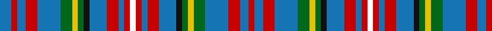

This page is one **sett** — a single exact thread-count. It belongs to the [tartan](/tartans/b4r2b3r4b8g4ly2g2k2b6r4b2r2w2/)
(the same proportion at any scale), whose colour order is pattern [BRBRBGYGKBRBRWRBRBKGYGBRBR](/stripes/brbrbgygkbrbrwrbrbkgygbrbr/).

Sourced from register-of-tartans.  It is a [26 stripe tartan](/stripes/stripes26/).

Original link https://www.tartanregister.gov.uk/tartanDetails.aspx?ref=1807

## Register references

External register numbers recorded for this tartan.

- Scottish Register of Tartans: [1807](https://www.tartanregister.gov.uk/tartanDetails.aspx?ref=1807)
- Scottish Tartans Authority (ITI): 2134
- Scottish Tartans World Register: 2134

## Thread count
B/16 R8 B12 R16 B32 G16 Y8 G8 K8 B24 R16 B8 R8 Wa8 R8 B8 R16 B24 K8 G8 Y8 G16 B32 R16 B12 R/8

## Palette

Palette: <strong>Tartan Register</strong> <small style="color:#888">(8 of 9 colours)</small>
<table><thead><tr><th>Colour</th><th>Threads</th><th>Shade</th><th>Base</th><th>OKLCh</th></tr></thead><tbody><tr><td>B/</td><td style="text-align:right;font-variant-numeric:tabular-nums">16</td><td><code style="background-color:#1474B4;">#1474B4</code> <small style="color:#888">#1474B4</small></td><td>B <code style="background-color:#2A418A;">#2A418A</code></td><td><small style="color:#888">oklch(54.0% 0.129 245.1)</small></td></tr><tr><td>R</td><td style="text-align:right;font-variant-numeric:tabular-nums">8</td><td><code style="background-color:#C80000;">#C80000</code> <small style="color:#888">#C80000</small></td><td>R <code style="background-color:#CC0000;">#CC0000</code></td><td><small style="color:#888">oklch(52.3% 0.215 29.2)</small></td></tr><tr><td>B</td><td style="text-align:right;font-variant-numeric:tabular-nums">12</td><td><code style="background-color:#1474B4;">#1474B4</code> <small style="color:#888">#1474B4</small></td><td>B <code style="background-color:#2A418A;">#2A418A</code></td><td><small style="color:#888">oklch(54.0% 0.129 245.1)</small></td></tr><tr><td>R</td><td style="text-align:right;font-variant-numeric:tabular-nums">16</td><td><code style="background-color:#C80000;">#C80000</code> <small style="color:#888">#C80000</small></td><td>R <code style="background-color:#CC0000;">#CC0000</code></td><td><small style="color:#888">oklch(52.3% 0.215 29.2)</small></td></tr><tr><td>B</td><td style="text-align:right;font-variant-numeric:tabular-nums">32</td><td><code style="background-color:#1474B4;">#1474B4</code> <small style="color:#888">#1474B4</small></td><td>B <code style="background-color:#2A418A;">#2A418A</code></td><td><small style="color:#888">oklch(54.0% 0.129 245.1)</small></td></tr><tr><td>G</td><td style="text-align:right;font-variant-numeric:tabular-nums">16</td><td><code style="background-color:#006818;">#006818</code> <small style="color:#888">#006818</small></td><td>G <code style="background-color:#006100;">#006100</code></td><td><small style="color:#888">oklch(45.0% 0.142 145.0)</small></td></tr><tr><td>Y</td><td style="text-align:right;font-variant-numeric:tabular-nums">8</td><td><code style="background-color:#E8C000;">#E8C000</code> <small style="color:#888">#E8C000</small></td><td>Y <code style="background-color:#F2BF00;">#F2BF00</code></td><td><small style="color:#888">oklch(81.9% 0.168 93.7)</small></td></tr><tr><td>G</td><td style="text-align:right;font-variant-numeric:tabular-nums">8</td><td><code style="background-color:#006818;">#006818</code> <small style="color:#888">#006818</small></td><td>G <code style="background-color:#006100;">#006100</code></td><td><small style="color:#888">oklch(45.0% 0.142 145.0)</small></td></tr><tr><td>K</td><td style="text-align:right;font-variant-numeric:tabular-nums">8</td><td><code style="background-color:#101010;">#101010</code> <small style="color:#888">#101010</small></td><td>K <code style="background-color:#000000;">#000000</code></td><td><small style="color:#888">oklch(17.3% 0.000 89.9)</small></td></tr><tr><td>B</td><td style="text-align:right;font-variant-numeric:tabular-nums">24</td><td><code style="background-color:#1474B4;">#1474B4</code> <small style="color:#888">#1474B4</small></td><td>B <code style="background-color:#2A418A;">#2A418A</code></td><td><small style="color:#888">oklch(54.0% 0.129 245.1)</small></td></tr><tr><td>R</td><td style="text-align:right;font-variant-numeric:tabular-nums">16</td><td><code style="background-color:#C80000;">#C80000</code> <small style="color:#888">#C80000</small></td><td>R <code style="background-color:#CC0000;">#CC0000</code></td><td><small style="color:#888">oklch(52.3% 0.215 29.2)</small></td></tr><tr><td>B</td><td style="text-align:right;font-variant-numeric:tabular-nums">8</td><td><code style="background-color:#1474B4;">#1474B4</code> <small style="color:#888">#1474B4</small></td><td>B <code style="background-color:#2A418A;">#2A418A</code></td><td><small style="color:#888">oklch(54.0% 0.129 245.1)</small></td></tr><tr><td>R</td><td style="text-align:right;font-variant-numeric:tabular-nums">8</td><td><code style="background-color:#C80000;">#C80000</code> <small style="color:#888">#C80000</small></td><td>R <code style="background-color:#CC0000;">#CC0000</code></td><td><small style="color:#888">oklch(52.3% 0.215 29.2)</small></td></tr><tr><td>Wa</td><td style="text-align:right;font-variant-numeric:tabular-nums">8</td><td><code style="background-color:#FCFCFC;">#FCFCFC</code> <small style="color:#888">#FCFCFC</small></td><td>W <code style="background-color:#F7F7F7;">#F7F7F7</code></td><td><small style="color:#888">oklch(99.1% 0.000 89.9)</small></td></tr><tr><td>R</td><td style="text-align:right;font-variant-numeric:tabular-nums">8</td><td><code style="background-color:#C80000;">#C80000</code> <small style="color:#888">#C80000</small></td><td>R <code style="background-color:#CC0000;">#CC0000</code></td><td><small style="color:#888">oklch(52.3% 0.215 29.2)</small></td></tr><tr><td>B</td><td style="text-align:right;font-variant-numeric:tabular-nums">8</td><td><code style="background-color:#1474B4;">#1474B4</code> <small style="color:#888">#1474B4</small></td><td>B <code style="background-color:#2A418A;">#2A418A</code></td><td><small style="color:#888">oklch(54.0% 0.129 245.1)</small></td></tr><tr><td>R</td><td style="text-align:right;font-variant-numeric:tabular-nums">16</td><td><code style="background-color:#C80000;">#C80000</code> <small style="color:#888">#C80000</small></td><td>R <code style="background-color:#CC0000;">#CC0000</code></td><td><small style="color:#888">oklch(52.3% 0.215 29.2)</small></td></tr><tr><td>B</td><td style="text-align:right;font-variant-numeric:tabular-nums">24</td><td><code style="background-color:#1474B4;">#1474B4</code> <small style="color:#888">#1474B4</small></td><td>B <code style="background-color:#2A418A;">#2A418A</code></td><td><small style="color:#888">oklch(54.0% 0.129 245.1)</small></td></tr><tr><td>K</td><td style="text-align:right;font-variant-numeric:tabular-nums">8</td><td><code style="background-color:#101010;">#101010</code> <small style="color:#888">#101010</small></td><td>K <code style="background-color:#000000;">#000000</code></td><td><small style="color:#888">oklch(17.3% 0.000 89.9)</small></td></tr><tr><td>G</td><td style="text-align:right;font-variant-numeric:tabular-nums">8</td><td><code style="background-color:#006818;">#006818</code> <small style="color:#888">#006818</small></td><td>G <code style="background-color:#006100;">#006100</code></td><td><small style="color:#888">oklch(45.0% 0.142 145.0)</small></td></tr><tr><td>Y</td><td style="text-align:right;font-variant-numeric:tabular-nums">8</td><td><code style="background-color:#E8C000;">#E8C000</code> <small style="color:#888">#E8C000</small></td><td>Y <code style="background-color:#F2BF00;">#F2BF00</code></td><td><small style="color:#888">oklch(81.9% 0.168 93.7)</small></td></tr><tr><td>G</td><td style="text-align:right;font-variant-numeric:tabular-nums">16</td><td><code style="background-color:#006818;">#006818</code> <small style="color:#888">#006818</small></td><td>G <code style="background-color:#006100;">#006100</code></td><td><small style="color:#888">oklch(45.0% 0.142 145.0)</small></td></tr><tr><td>B</td><td style="text-align:right;font-variant-numeric:tabular-nums">32</td><td><code style="background-color:#1474B4;">#1474B4</code> <small style="color:#888">#1474B4</small></td><td>B <code style="background-color:#2A418A;">#2A418A</code></td><td><small style="color:#888">oklch(54.0% 0.129 245.1)</small></td></tr><tr><td>R</td><td style="text-align:right;font-variant-numeric:tabular-nums">16</td><td><code style="background-color:#C80000;">#C80000</code> <small style="color:#888">#C80000</small></td><td>R <code style="background-color:#CC0000;">#CC0000</code></td><td><small style="color:#888">oklch(52.3% 0.215 29.2)</small></td></tr><tr><td>B</td><td style="text-align:right;font-variant-numeric:tabular-nums">12</td><td><code style="background-color:#1474B4;">#1474B4</code> <small style="color:#888">#1474B4</small></td><td>B <code style="background-color:#2A418A;">#2A418A</code></td><td><small style="color:#888">oklch(54.0% 0.129 245.1)</small></td></tr><tr><td>R/</td><td style="text-align:right;font-variant-numeric:tabular-nums">8</td><td><code style="background-color:#C80000;">#C80000</code> <small style="color:#888">#C80000</small></td><td>R <code style="background-color:#CC0000;">#CC0000</code></td><td><small style="color:#888">oklch(52.3% 0.215 29.2)</small></td></tr></tbody></table>

## Nearest tartans

The nearest existing variants by ΔTartan distance, with this tartan at the top so the swatches line up against it.

ΔTartan

Tartan

Sett

—

<a href="/ttd/edit/#slug=b4r2b3r4b8g4ly2g2k2b6r4b2r2w2~x4">Hyndman</a> <a class="nn-out" href="/setts/s26/b4r2b3r4b8g4ly2g2k2b6r4b2r2w2~x4/" title="open its dictionary page">↗</a>

1.27

<a href="/ttd/edit/#slug=b4r2b3r4b8g4ly2g2k2b6r4b2r2w2~x4">Hyndman (Name)</a> <a class="nn-out" href="/setts/s14/b4r2b3r4b8g4ly2g2k2b6r4b2r2w2~x4/" title="open its dictionary page">↗</a>

1.43

<a href="/ttd/edit/#slug=db2lb2b7r4ly8db4b10lb2db2b9db2lb2b10db4ly8r4b7lb2db2ly2~x4">Healy (Suspect)</a> <a class="nn-out" href="/setts/s20/db2lb2b7r4ly8db4b10lb2db2b9db2lb2b10db4ly8r4b7lb2db2ly2~x4/" title="open its dictionary page">↗</a>

1.59

<a href="/setts/s20/r3ly3db18dy15b16w3b16dy15b18ly3r3~x2/">Hirter Karo</a>

1.60

<a href="/ttd/edit/#slug=db4lb6r2do6b2db4b2do6lo1do2r2lb2r2do2lo1do6b2~x4">Wcwm 1572-1</a> <a class="nn-out" href="/setts/s17/db4lb6r2do6b2db4b2do6lo1do2r2lb2r2do2lo1do6b2~x4/" title="open its dictionary page">↗</a>

1.64

<a href="/ttd/edit/#slug=r4g4w2t12r5t12w2k5ly2k5t4w2dp5w4dp5w2t4k5ly2k5w2t12r5t12w2g4r4g4~x2">Wilson's No.117</a> <a class="nn-out" href="/setts/s28/r4g4w2t12r5t12w2k5ly2k5t4w2dp5w4dp5w2t4k5ly2k5w2t12r5t12w2g4r4g4~x2/" title="open its dictionary page">↗</a>

1.74

<a href="/ttd/edit/#slug=b10r3b10ly5k2r6lr2r6lr2r6n2ly2b5lr2~x2">Ogilvy</a> <a class="nn-out" href="/setts/s14/b10r3b10ly5k2r6lr2r6lr2r6n2ly2b5lr2~x2/" title="open its dictionary page">↗</a>

1.74

<a href="/ttd/edit/#slug=b10r3b10ly5k2r6lr2r6lr2r6n2ly2b5lr2">Ogilvy</a> <a class="nn-out" href="/setts/s14/b10r3b10ly5k2r6lr2r6lr2r6n2ly2b5lr2/" title="open its dictionary page">↗</a>

1.78

<a href="/ttd/edit/#slug=w2t2dg8k2t6dg5r5lo5r4w2r4lo5r5dg5t6k2r10lo2~x2">Kutztown (Berks Co., PA) (District)</a> <a class="nn-out" href="/setts/s18/w2t2dg8k2t6dg5r5lo5r4w2r4lo5r5dg5t6k2r10lo2~x2/" title="open its dictionary page">↗</a>

1.83

<a href="/ttd/edit/#slug=k2w1db7k4r1db4r2db4w2db4r2db4r1dg7w1ly2~x4">MacLellan/McLellan (Personal)</a> <a class="nn-out" href="/setts/s16/k2w1db7k4r1db4r2db4w2db4r2db4r1dg7w1ly2~x4/" title="open its dictionary page">↗</a>

1.85

<a href="/ttd/edit/#slug=k2w1db7k4r1db4r2db4w2db4r2db4r1g7w1ly2~x2">MacLellan, Blue McLellan</a> <a class="nn-out" href="/setts/s16/k2w1db7k4r1db4r2db4w2db4r2db4r1g7w1ly2~x2/" title="open its dictionary page">↗</a>

## Neighbour map

Every grey dot is one of 14359 variants placed by the first two principal components of the ΔTartan feature space (44% of its variance). Red is this tartan; blue dots are its nearest — click one to open its page.

<svg viewBox="0 0 640 380" role="img" style="max-width:100%;height:auto;border:1px solid #e0e0e0;border-radius:4px;display:block" xmlns="http://www.w3.org/2000/svg"><image href="/nn/cloud.v1.png" width="640" height="380"/><a href="/setts/s14/b4r2b3r4b8g4ly2g2k2b6r4b2r2w2~x4/"><circle cx="121.6" cy="200.5" r="4" fill="#3465a4"><title>Hyndman (Name)</title></circle></a><a href="/setts/s20/db2lb2b7r4ly8db4b10lb2db2b9db2lb2b10db4ly8r4b7lb2db2ly2~x4/"><circle cx="125.9" cy="179.3" r="4" fill="#3465a4"><title>Healy (Suspect)</title></circle></a><a href="/setts/s20/r3ly3db18dy15b16w3b16dy15b18ly3r3~x2/"><circle cx="119.4" cy="167.4" r="4" fill="#3465a4"><title>Hirter Karo</title></circle></a><a href="/setts/s17/db4lb6r2do6b2db4b2do6lo1do2r2lb2r2do2lo1do6b2~x4/"><circle cx="89.1" cy="166.0" r="4" fill="#3465a4"><title>Wcwm 1572-1</title></circle></a><a href="/setts/s28/r4g4w2t12r5t12w2k5ly2k5t4w2dp5w4dp5w2t4k5ly2k5w2t12r5t12w2g4r4g4~x2/"><circle cx="46.8" cy="117.9" r="4" fill="#3465a4"><title>Wilson's No.117</title></circle></a><a href="/setts/s14/b10r3b10ly5k2r6lr2r6lr2r6n2ly2b5lr2~x2/"><circle cx="113.9" cy="182.0" r="4" fill="#3465a4"><title>Ogilvy</title></circle></a><a href="/setts/s14/b10r3b10ly5k2r6lr2r6lr2r6n2ly2b5lr2/"><circle cx="113.9" cy="182.0" r="4" fill="#3465a4"><title>Ogilvy</title></circle></a><a href="/setts/s18/w2t2dg8k2t6dg5r5lo5r4w2r4lo5r5dg5t6k2r10lo2~x2/"><circle cx="48.6" cy="183.8" r="4" fill="#3465a4"><title>Kutztown (Berks Co., PA) (District)</title></circle></a><a href="/setts/s16/k2w1db7k4r1db4r2db4w2db4r2db4r1dg7w1ly2~x4/"><circle cx="129.3" cy="162.4" r="4" fill="#3465a4"><title>MacLellan/McLellan (Personal)</title></circle></a><a href="/setts/s16/k2w1db7k4r1db4r2db4w2db4r2db4r1g7w1ly2~x2/"><circle cx="116.7" cy="157.4" r="4" fill="#3465a4"><title>MacLellan, Blue McLellan</title></circle></a><circle cx="110.4" cy="175.6" r="5" fill="#c00000"/></svg>

ID: /setts/s26/b4r2b3r4b8g4ly2g2k2b6r4b2r2w2~x4/
