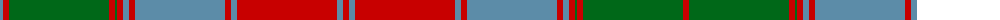

In pattern [BRGRGRBRBRBRBRBRBRBRBRGRGR](/patterns/brgrgrbrbrbrbrbrbrbrbrgrgr/).

This was sourced from register-of-tartans.  It is a [26 stripes tartan](/stripes/stripes26/).

Original link https://www.tartanregister.gov.uk/tartanDetails.aspx?ref=4808

## Thread count
B/6 R6 G100 R6 G2 R6 B6 R6 B90 R6 B6 R100 B6 R6 B6 R100 B6 R6 B90 R6 B6 R6 G2 R6 G100 R/6

## Palette
Each colour and its ΔE from the base-6 reference it is a variant of.

| Colour | Shade | Base | ΔE (OKLab) |
|---|---|---|---|
| B | <code style="background-color:#5C8CA8;">#5C8CA8</code> `#5C8CA8` | B <code style="background-color:#2C4084;">#2C4084</code> | 0.23 |
| DB | <code style="background-color:#2C2C80;">#2C2C80</code> `#2C2C80` | B <code style="background-color:#2C4084;">#2C4084</code> | 0.05 |
| G | <code style="background-color:#006818;">#006818</code> `#006818` | G <code style="background-color:#006400;">#006400</code> | 0.02 |
| R | <code style="background-color:#C80000;">#C80000</code> `#C80000` | R <code style="background-color:#C80000;">#C80000</code> | 0.00 |

ID: /setts/s26/b6r6g100r6g2r6b6r6b90r6b6r100b6r6b6r100b6r6b90r6b6r6g2r6g100r6-b5c8ca8-g006818-rc80000/
