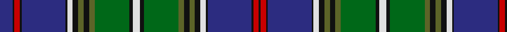

In pattern [BKRKBKWKGKGGKWKGGKGKWKBKRK](/patterns/bkrkbkwkgkggkwkggkgkwkbkrk/).

This was sourced from register-of-tartans.  It is a [26 stripes tartan](/stripes/stripes26/).

Original link https://www.tartanregister.gov.uk/tartanDetails.aspx?ref=3982

## Thread count
DB/14 K2 R6 K2 DB48 K2 LN6 K6 Ga6 K6 Ga6 G38 K4 LN8 K4 G38 Ga6 K6 Ga6 K6 LN6 K2 DB48 K2 R6 K/2

## Palette
Each colour and its ΔE from the base-6 reference it is a variant of.

| Colour | Shade | Base | ΔE (OKLab) |
|---|---|---|---|
| DB | <code style="background-color:#2C2C80;">#2C2C80</code> `#2C2C80` | B <code style="background-color:#2A418A;">#2A418A</code> | 0.06 |
| G | <code style="background-color:#006818;">#006818</code> `#006818` | G <code style="background-color:#006100;">#006100</code> | 0.02 |
| Ga | <code style="background-color:#5C6428;">#5C6428</code> `#5C6428` | G <code style="background-color:#006100;">#006100</code> | 0.10 |
| K | <code style="background-color:#101010;">#101010</code> `#101010` | K <code style="background-color:#000000;">#000000</code> | 0.17 |
| LN | <code style="background-color:#E0E0E0;">#E0E0E0</code> `#E0E0E0` | W <code style="background-color:#F7F7F7;">#F7F7F7</code> | 0.07 |
| R | <code style="background-color:#C80000;">#C80000</code> `#C80000` | R <code style="background-color:#CC0000;">#CC0000</code> | 0.01 |

## Nearest tartans

The nearest existing variants by ΔTartan distance.

1. [Wood (Clan)](/setts/s23/k3y2k6g3k3g21b18r1b2r1b2r3b2r1b2r1b18g21k3g3k6ya2k3x2~b2c2c80-g006818-k101010-rc80000-yb8b8b8-yae8c000/) — ΔT 0.84
1. [St. Andrews Grand](/setts/s24/k3w2b23g18k12r1ra1r1ra1ga2r1ra1g4ra1r1ga2ra1r1ra1r1k12g18b23w2x2~b2c2c80-g006818-ga003820-k101010-re87878-rac80000-wf8f8f8/) — ΔT 0.95
1. [Hunnisett/Edinchip (Personal)](/setts/s20/b38w2b2k10g2y2g22k3r3k3r3k3r3k3g22y2g2k10b2w2x2~b202060-g006818-k101010-rc80000-we0e0e0-ye8c000/) — ΔT 0.99
1. [St. Andrews Soc. of New York (Corp)](/setts/s27/r8w2b34k1b5k2b4k3b3k4b2k5b1k36g1k5g2k4g3k3g4k2g5k1g34k4ra8x2~b2c2c80-g006818-k101010-rc80000-rae87878-wfcfcfc/) — ΔT 1.02
1. [Peter Pan](/setts/s20/b22g2ga2g2ga2g2b6k3g14b1gb4b1g2gb2g2gb2g1b1k1r2x2~b1c0070-g006818-ga0098a0-gb289c18-k101010-rc80000/) — ΔT 1.04
1. [Ferrari (Coldrerio)](/setts/s19/y6b2ya2b1k1b1yb4ba2yb2b17k2ba3k8ba3k2ba17k2ba2yb2x2~b28648d-ba344870-k0e1014-yd8d34c-yac49c00-ybd19d2c/) — ΔT 1.06
1. [Cockburn #2](/setts/s27/r3k2g9b12w3b12g2k2g2k2g36k2g2k2g2b12w3b12k3y3k2g12k2r3k2g6w3x2~b2c4084-g005020-k101010-rdc0000-we0e0e0-ye8c000/) — ΔT 1.11
1. [Smithsonian](/setts/s20/b24y1r2g2r2y1k24g24w2b2w2g24k24y1r2g2r2y1b24g2x2~b202060-g406054-k101010-rc80000-we0e0e0-ye8c000/) — ΔT 1.13
1. [Couper of Gogar](/setts/s18/b2w4r2g24b4g2b4k10w4b2w4g8b1k1b22w4b2r2x2~b2c2c80-g006818-k101010-rc80000-wc49cd8/) — ΔT 1.24
1. [Couper of Gogar (Clan)](/setts/s18/r2w4b2g24b4g2b4k10w4b2w4g8b1k2b22w4b2r2x2~b2c2c80-g006818-k101010-rc80000-wc49cd8/) — ΔT 1.25

## Neighbour map

Every grey dot is one of 15726 variants placed by the first two principal components of the ΔTartan feature space (44% of its variance). Red is this tartan; blue dots are its nearest — click one to open its page.

<svg viewBox="0 0 640 380" role="img" style="max-width:100%;height:auto;border:1px solid #e0e0e0;border-radius:4px;display:block" xmlns="http://www.w3.org/2000/svg"><image href="/nn/cloud.v1.png" width="640" height="380"/><a href="/setts/s23/k3y2k6g3k3g21b18r1b2r1b2r3b2r1b2r1b18g21k3g3k6ya2k3x2~b2c2c80-g006818-k101010-rc80000-yb8b8b8-yae8c000/"><circle cx="198.8" cy="80.1" r="4" fill="#3465a4"><title>Wood (Clan)</title></circle></a><a href="/setts/s24/k3w2b23g18k12r1ra1r1ra1ga2r1ra1g4ra1r1ga2ra1r1ra1r1k12g18b23w2x2~b2c2c80-g006818-ga003820-k101010-re87878-rac80000-wf8f8f8/"><circle cx="152.8" cy="42.7" r="4" fill="#3465a4"><title>St. Andrews Grand</title></circle></a><a href="/setts/s20/b38w2b2k10g2y2g22k3r3k3r3k3r3k3g22y2g2k10b2w2x2~b202060-g006818-k101010-rc80000-we0e0e0-ye8c000/"><circle cx="171.3" cy="74.2" r="4" fill="#3465a4"><title>Hunnisett/Edinchip (Personal)</title></circle></a><a href="/setts/s27/r8w2b34k1b5k2b4k3b3k4b2k5b1k36g1k5g2k4g3k3g4k2g5k1g34k4ra8x2~b2c2c80-g006818-k101010-rc80000-rae87878-wfcfcfc/"><circle cx="217.3" cy="37.4" r="4" fill="#3465a4"><title>St. Andrews Soc. of New York (Corp)</title></circle></a><a href="/setts/s20/b22g2ga2g2ga2g2b6k3g14b1gb4b1g2gb2g2gb2g1b1k1r2x2~b1c0070-g006818-ga0098a0-gb289c18-k101010-rc80000/"><circle cx="213.0" cy="72.6" r="4" fill="#3465a4"><title>Peter Pan</title></circle></a><a href="/setts/s19/y6b2ya2b1k1b1yb4ba2yb2b17k2ba3k8ba3k2ba17k2ba2yb2x2~b28648d-ba344870-k0e1014-yd8d34c-yac49c00-ybd19d2c/"><circle cx="141.5" cy="85.7" r="4" fill="#3465a4"><title>Ferrari (Coldrerio)</title></circle></a><a href="/setts/s27/r3k2g9b12w3b12g2k2g2k2g36k2g2k2g2b12w3b12k3y3k2g12k2r3k2g6w3x2~b2c4084-g005020-k101010-rdc0000-we0e0e0-ye8c000/"><circle cx="218.5" cy="76.1" r="4" fill="#3465a4"><title>Cockburn #2</title></circle></a><a href="/setts/s20/b24y1r2g2r2y1k24g24w2b2w2g24k24y1r2g2r2y1b24g2x2~b202060-g406054-k101010-rc80000-we0e0e0-ye8c000/"><circle cx="186.6" cy="78.8" r="4" fill="#3465a4"><title>Smithsonian</title></circle></a><a href="/setts/s18/b2w4r2g24b4g2b4k10w4b2w4g8b1k1b22w4b2r2x2~b2c2c80-g006818-k101010-rc80000-wc49cd8/"><circle cx="195.0" cy="93.0" r="4" fill="#3465a4"><title>Couper of Gogar</title></circle></a><a href="/setts/s18/r2w4b2g24b4g2b4k10w4b2w4g8b1k2b22w4b2r2x2~b2c2c80-g006818-k101010-rc80000-wc49cd8/"><circle cx="191.4" cy="93.9" r="4" fill="#3465a4"><title>Couper of Gogar (Clan)</title></circle></a><circle cx="176.1" cy="55.8" r="5" fill="#c00000"/></svg>

ID: /setts/s26/b7k1r3k1b24k1w3k3g3k3g3ga19k2w4k2ga19g3k3g3k3w3k1b24k1r3k1x2~b2c2c80-g5c6428-ga006818-k101010-rc80000-we0e0e0/
