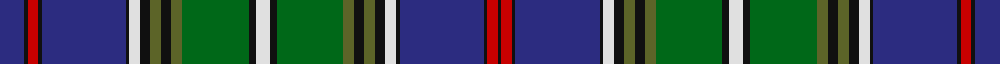

In pattern [BKRKBKWKGKGGKWKGGKGKWKBKRK](/stripes/bkrkbkwkgkggkwkggkgkwkbkrk/).

This was sourced from register-of-tartans.  It is a [26 stripe tartan](/stripes/stripes26/).

Original link https://www.tartanregister.gov.uk/tartanDetails.aspx?ref=3982

## Also known as

This cloth is also recorded under:

- Strathclyde, University of (Corporat

## Register references

External register numbers recorded for this tartan.

- Scottish Register of Tartans: [3982](https://www.tartanregister.gov.uk/tartanDetails.aspx?ref=3982)
- Scottish Tartans Authority (ITI): 2419
- Scottish Tartans World Register: 2419

## Thread count
DB/14 K2 R6 K2 DB48 K2 LN6 K6 Ga6 K6 Ga6 G38 K4 LN8 K4 G38 Ga6 K6 Ga6 K6 LN6 K2 DB48 K2 R6 K/2

## Palette
Each colour and the base-6 reference it is a variant of.

| Colour | Shade | Base |
|---|---|---|
| DB | <code style="background-color:#2C2C80;">#2C2C80</code> `oklch(35.0% 0.138 276.6)` <small>#2C2C80</small> | B <code style="background-color:#2A418A;">#2A418A</code> |
| G | <code style="background-color:#006818;">#006818</code> `oklch(45.0% 0.142 145.0)` <small>#006818</small> | G <code style="background-color:#006100;">#006100</code> |
| Ga | <code style="background-color:#5C6428;">#5C6428</code> `oklch(48.3% 0.084 116.0)` <small>#5C6428</small> | G <code style="background-color:#006100;">#006100</code> |
| K | <code style="background-color:#101010;">#101010</code> `oklch(17.3% 0.000 89.9)` <small>#101010</small> | K <code style="background-color:#000000;">#000000</code> |
| LN | <code style="background-color:#E0E0E0;">#E0E0E0</code> `oklch(90.7% 0.000 89.9)` <small>#E0E0E0</small> | W <code style="background-color:#F7F7F7;">#F7F7F7</code> |
| R | <code style="background-color:#C80000;">#C80000</code> `oklch(52.3% 0.215 29.2)` <small>#C80000</small> | R <code style="background-color:#CC0000;">#CC0000</code> |

## Nearest tartans

The nearest existing variants by ΔTartan distance, with this tartan at the top so the swatches line up against it.

ΔTartan

Tartan

Sett

—

<a href="/ttd/edit/#slug=db7k1r3k1db24k1w3k3y3k3y3g19k2w4~x2">Strathclyde, University of</a> <a class="nn-out" href="/setts/s26/db7k1r3k1db24k1w3k3y3k3y3g19k2w4~x2/" title="open its dictionary page">↗</a>

0.84

<a href="/ttd/edit/#slug=k3lr2k6g3k3g21db18r1db2r1db2r3db2r1db2r1db18g21k3g3k6ly2k3~x2">Wood (Clan)</a> <a class="nn-out" href="/setts/s23/k3lr2k6g3k3g21db18r1db2r1db2r3db2r1db2r1db18g21k3g3k6ly2k3~x2/" title="open its dictionary page">↗</a>

0.95

<a href="/setts/s24/g4r1r1dg2r1r1r1r1k12g18db23w2k3~x2/">St. Andrews Grand</a>

0.99

<a href="/setts/s20/db38w2db2k10g2ly2g22k3r3k3r3~x2/">Hunnisett/Edinchip (Personal)</a>

1.02

<a href="/ttd/edit/#slug=r8k4g34k1g5k2g4k3g3k4g2k5g1k36db1k5db2k4db3k3db4k2db5k1db34w2r8">St. Andrews Soc. of New York (Corp)</a> <a class="nn-out" href="/setts/s27/r8k4g34k1g5k2g4k3g3k4g2k5g1k36db1k5db2k4db3k3db4k2db5k1db34w2r8/" title="open its dictionary page">↗</a>

1.04

<a href="/ttd/edit/#slug=db22g2g2g2g2g2db6k3g14db1g4db1g2g2g2g2g1db1k1r2~x2">Peter Pan</a> <a class="nn-out" href="/setts/s20/db22g2g2g2g2g2db6k3g14db1g4db1g2g2g2g2g1db1k1r2~x2/" title="open its dictionary page">↗</a>

1.06

<a href="/ttd/edit/#slug=ly6n2ly2n1k1n1lo4n2lo2n17k2n3k8n3k2n17k2n2lo2~x2">Ferrari (Coldrerio)</a> <a class="nn-out" href="/setts/s19/ly6n2ly2n1k1n1lo4n2lo2n17k2n3k8n3k2n17k2n2lo2~x2/" title="open its dictionary page">↗</a>

1.11

<a href="/ttd/edit/#slug=r3k2dg9db12w3db12dg2k2dg2k2dg36k2dg2k2dg2db12w3db12k3ly3k2dg12k2r3k2dg6w3~x2">Cockburn #2</a> <a class="nn-out" href="/setts/s27/r3k2dg9db12w3db12dg2k2dg2k2dg36k2dg2k2dg2db12w3db12k3ly3k2dg12k2r3k2dg6w3~x2/" title="open its dictionary page">↗</a>

1.13

<a href="/ttd/edit/#slug=db24ly1r2y2r2ly1k24y24w2db2w2y24k24ly1r2y2r2ly1db24y2~x2">Smithsonian</a> <a class="nn-out" href="/setts/s20/db24ly1r2y2r2ly1k24y24w2db2w2y24k24ly1r2y2r2ly1db24y2~x2/" title="open its dictionary page">↗</a>

1.24

<a href="/ttd/edit/#slug=db2lp4r2g24db4g2db4k10lp4db2lp4g8db1k1db22lp4db2r2~x2">Couper of Gogar</a> <a class="nn-out" href="/setts/s18/db2lp4r2g24db4g2db4k10lp4db2lp4g8db1k1db22lp4db2r2~x2/" title="open its dictionary page">↗</a>

1.25

<a href="/ttd/edit/#slug=r2lp4db2g24db4g2db4k10lp4db2lp4g8db1k2db22lp4db2r2~x2">Couper of Gogar (Clan)</a> <a class="nn-out" href="/setts/s18/r2lp4db2g24db4g2db4k10lp4db2lp4g8db1k2db22lp4db2r2~x2/" title="open its dictionary page">↗</a>

## Neighbour map

Every grey dot is one of 14299 variants placed by the first two principal components of the ΔTartan feature space (44% of its variance). Red is this tartan; blue dots are its nearest — click one to open its page.

<svg viewBox="0 0 640 380" role="img" style="max-width:100%;height:auto;border:1px solid #e0e0e0;border-radius:4px;display:block" xmlns="http://www.w3.org/2000/svg"><image href="/nn/cloud.v1.png" width="640" height="380"/><a href="/setts/s23/k3lr2k6g3k3g21db18r1db2r1db2r3db2r1db2r1db18g21k3g3k6ly2k3~x2/"><circle cx="202.2" cy="87.0" r="4" fill="#3465a4"><title>Wood (Clan)</title></circle></a><a href="/setts/s24/g4r1r1dg2r1r1r1r1k12g18db23w2k3~x2/"><circle cx="156.5" cy="49.4" r="4" fill="#3465a4"><title>St. Andrews Grand</title></circle></a><a href="/setts/s20/db38w2db2k10g2ly2g22k3r3k3r3~x2/"><circle cx="174.9" cy="79.8" r="4" fill="#3465a4"><title>Hunnisett/Edinchip (Personal)</title></circle></a><a href="/setts/s27/r8k4g34k1g5k2g4k3g3k4g2k5g1k36db1k5db2k4db3k3db4k2db5k1db34w2r8/"><circle cx="220.8" cy="43.8" r="4" fill="#3465a4"><title>St. Andrews Soc. of New York (Corp)</title></circle></a><a href="/setts/s20/db22g2g2g2g2g2db6k3g14db1g4db1g2g2g2g2g1db1k1r2~x2/"><circle cx="216.9" cy="78.4" r="4" fill="#3465a4"><title>Peter Pan</title></circle></a><a href="/setts/s19/ly6n2ly2n1k1n1lo4n2lo2n17k2n3k8n3k2n17k2n2lo2~x2/"><circle cx="144.9" cy="91.5" r="4" fill="#3465a4"><title>Ferrari (Coldrerio)</title></circle></a><a href="/setts/s27/r3k2dg9db12w3db12dg2k2dg2k2dg36k2dg2k2dg2db12w3db12k3ly3k2dg12k2r3k2dg6w3~x2/"><circle cx="221.8" cy="82.4" r="4" fill="#3465a4"><title>Cockburn #2</title></circle></a><a href="/setts/s20/db24ly1r2y2r2ly1k24y24w2db2w2y24k24ly1r2y2r2ly1db24y2~x2/"><circle cx="189.9" cy="86.2" r="4" fill="#3465a4"><title>Smithsonian</title></circle></a><a href="/setts/s18/db2lp4r2g24db4g2db4k10lp4db2lp4g8db1k1db22lp4db2r2~x2/"><circle cx="198.5" cy="97.2" r="4" fill="#3465a4"><title>Couper of Gogar</title></circle></a><a href="/setts/s18/r2lp4db2g24db4g2db4k10lp4db2lp4g8db1k2db22lp4db2r2~x2/"><circle cx="194.9" cy="98.2" r="4" fill="#3465a4"><title>Couper of Gogar (Clan)</title></circle></a><circle cx="179.7" cy="61.7" r="5" fill="#c00000"/></svg>

ID: /setts/s26/db7k1r3k1db24k1w3k3y3k3y3g19k2w4~x2/
