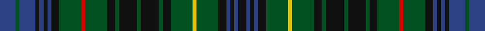

This page is one **sett** — a single exact thread-count. It belongs to the [tartan](/tartans/b8g2b8k2b2k2b2k4g11r2g11k4g2k9g2k9g2k4g11y2g11k4b2k2b2k4/)
(the same proportion at any scale), whose colour order is pattern [BGBKBKBKGRGKGKGKGKGYGKBKBK](/stripes/bgbkbkbkgrgkgkgkgkgygkbkbk/).

Sourced from register-of-tartans.  It is a [26 stripe tartan](/stripes/stripes26/).

Original link https://www.tartanregister.gov.uk/tartanDetails.aspx?ref=4006

## Also known as

This cloth is also recorded under:

- Stuart/Stewart Hunting #3

## Register references

External register numbers recorded for this tartan.

- Scottish Register of Tartans: [4006](https://www.tartanregister.gov.uk/tartanDetails.aspx?ref=4006)
- Scottish Tartans World Register: 1917

## Thread count
B/16 G4 B16 K4 B4 K4 B4 K8 G22 R4 G22 K8 G4 K18 G4 K18 G4 K8 G22 Y4 G22 K8 B4 K4 B4 K/8

## Palette
Each colour and the base-6 reference it is a variant of.

| Colour | Shade | Base |
|---|---|---|
| B | <code style="background-color:#2C4084;">#2C4084</code> `oklch(39.4% 0.117 268.3)` <small>#2C4084</small> | B <code style="background-color:#2A418A;">#2A418A</code> |
| G | <code style="background-color:#005020;">#005020</code> `oklch(37.7% 0.105 149.6)` <small>#005020</small> | G <code style="background-color:#006100;">#006100</code> |
| K | <code style="background-color:#101010;">#101010</code> `oklch(17.3% 0.000 89.9)` <small>#101010</small> | K <code style="background-color:#000000;">#000000</code> |
| R | <code style="background-color:#DC0000;">#DC0000</code> `oklch(56.2% 0.230 29.2)` <small>#DC0000</small> | R <code style="background-color:#CC0000;">#CC0000</code> |
| Y | <code style="background-color:#E8C000;">#E8C000</code> `oklch(81.9% 0.168 93.7)` <small>#E8C000</small> | Y <code style="background-color:#F2BF00;">#F2BF00</code> |

## Nearest tartans

The nearest existing variants by ΔTartan distance, with this tartan at the top so the swatches line up against it.

ΔTartan

Tartan

Sett

—

<a href="/ttd/edit/#slug=db8dg2db8k2db2k2db2k4dg11r2dg11k4dg2k9dg2k9dg2k4dg11ly2dg11k4db2k2db2k4~x2">Stuart/Stewart Hunting #3</a> <a class="nn-out" href="/setts/s26/db8dg2db8k2db2k2db2k4dg11r2dg11k4dg2k9dg2k9dg2k4dg11ly2dg11k4db2k2db2k4~x2/" title="open its dictionary page">↗</a>

0.95

<a href="/ttd/edit/#slug=g2r2g12k4n11r2n11k4n2k9n2k9n2k4n11ly2n11k4g12r2g2~x2">Allen (1998)</a> <a class="nn-out" href="/setts/s21/g2r2g12k4n11r2n11k4n2k9n2k9n2k4n11ly2n11k4g12r2g2~x2/" title="open its dictionary page">↗</a>

0.99

<a href="/ttd/edit/#slug=k1g6k6db1k1db1k1db7k1db1k1db1k6g6k1r1k1g6k6db6k1db1k1db6k6g6k1ly1~x4">MacEwen (Clans Originaux)</a> <a class="nn-out" href="/setts/s28/k1g6k6db1k1db1k1db7k1db1k1db1k6g6k1r1k1g6k6db6k1db1k1db6k6g6k1ly1~x4/" title="open its dictionary page">↗</a>

1.18

<a href="/ttd/edit/#slug=g8k1w2k1dt8k8g1k1g1k1g8k1g1k1g1k8dt8k1r2dt1r2k1dt8g8k1g5~x2">Killen (Name)</a> <a class="nn-out" href="/setts/s26/g8k1w2k1dt8k8g1k1g1k1g8k1g1k1g1k8dt8k1r2dt1r2k1dt8g8k1g5~x2/" title="open its dictionary page">↗</a>

1.34

<a href="/ttd/edit/#slug=db2k1db6k6g6r2g6k6db1k1db1k1db6k1db1k1db1k6g6r2g6k6db6k1db1~x8">Murray</a> <a class="nn-out" href="/setts/s25/db2k1db6k6g6r2g6k6db1k1db1k1db6k1db1k1db1k6g6r2g6k6db6k1db1~x8/" title="open its dictionary page">↗</a>

1.37

<a href="/ttd/edit/#slug=g9db2dy3db2dy5db2dy3lo3dy6lo3dy3db2dy5db2dy3db2g16r3db2r3g7~x2">Limerick Irish County Tartan Tartan Number: 2272. Earliest known date: 1996 One of a series of Irish District tartans designed by Polly Wittering of the House of Edgar, with colours reminiscent of the Country with soft warm colours dominating. See products available Copyright © Blair Urquhart, Comrie, 2015</a> <a class="nn-out" href="/setts/s21/g9db2dy3db2dy5db2dy3lo3dy6lo3dy3db2dy5db2dy3db2g16r3db2r3g7~x2/" title="open its dictionary page">↗</a>

1.39

<a href="/ttd/edit/#slug=db14k3db3k3db3k14g14k3w3k3g14k14db14k3r3k14db14k3r3k3db14k14g14k3w3k3g14k14db3k3db3k3db7~x4">MacKenzie</a> <a class="nn-out" href="/setts/s33/db14k3db3k3db3k14g14k3w3k3g14k14db14k3r3k14db14k3r3k3db14k14g14k3w3k3g14k14db3k3db3k3db7~x4/" title="open its dictionary page">↗</a>

1.41

<a href="/ttd/edit/#slug=dg10r5dg42db16g5db5g5db5g36db5g5db5g5db16dg42r5dg10ly5dg42db16g5db5g5db5g36db5g5db5g5db16dg42ly5">Summers Family Tartan Tartan Number: 2179. Earliest known date: 19th C A fragment of this tartan was found in an old bible belonging to the Summers family which may have arrived in the US when the family emigrated in the early 18th C. See products available Copyright © Blair Urquhart, Comrie, 2015</a> <a class="nn-out" href="/setts/s32/dg10r5dg42db16g5db5g5db5g36db5g5db5g5db16dg42r5dg10ly5dg42db16g5db5g5db5g36db5g5db5g5db16dg42ly5/" title="open its dictionary page">↗</a>

1.41

<a href="/ttd/edit/#slug=k2g8k7db8dp2db8k7g2k2g2k2g10k2g2k2g2k7db8dp2db8k7g8k2g2~x2">Lochinvar Marine Harvest (Corporate)</a> <a class="nn-out" href="/setts/s24/k2g8k7db8dp2db8k7g2k2g2k2g10k2g2k2g2k7db8dp2db8k7g8k2g2~x2/" title="open its dictionary page">↗</a>

1.45

<a href="/ttd/edit/#slug=n5lb2n12k21dg12k4dg4k4r4k4dg4k4dg12k21n12lb2n4~x2">Psychological Operations Regiment</a> <a class="nn-out" href="/setts/s17/n5lb2n12k21dg12k4dg4k4r4k4dg4k4dg12k21n12lb2n4~x2/" title="open its dictionary page">↗</a>

1.46

<a href="/setts/s24/db18r5db3r5db3k20dg18lo4dg18k20db20k6db6/">Keith District District Tartan Tartan Number: 5782. Earliest known date: 2003 Designed by Councillor Linda Gorn of Keith who was instrumental in having a tartan museum established in Keith circa 1998 under the auspices of the Scottish Tartans Society. Keith is also home to Macnaughton Group's weaving mill (Isla Mill). The House of Edgar who formalised this design is also part of the same group. See products available Copyright © Blair Urquhart, Comrie, 2015</a>

## Neighbour map

Every grey dot is one of 14299 variants placed by the first two principal components of the ΔTartan feature space (44% of its variance). Red is this tartan; blue dots are its nearest — click one to open its page.

<svg viewBox="0 0 640 380" role="img" style="max-width:100%;height:auto;border:1px solid #e0e0e0;border-radius:4px;display:block" xmlns="http://www.w3.org/2000/svg"><image href="/nn/cloud.v1.png" width="640" height="380"/><a href="/setts/s21/g2r2g12k4n11r2n11k4n2k9n2k9n2k4n11ly2n11k4g12r2g2~x2/"><circle cx="170.7" cy="193.5" r="4" fill="#3465a4"><title>Allen (1998)</title></circle></a><a href="/setts/s28/k1g6k6db1k1db1k1db7k1db1k1db1k6g6k1r1k1g6k6db6k1db1k1db6k6g6k1ly1~x4/"><circle cx="182.8" cy="168.6" r="4" fill="#3465a4"><title>MacEwen (Clans Originaux)</title></circle></a><a href="/setts/s26/g8k1w2k1dt8k8g1k1g1k1g8k1g1k1g1k8dt8k1r2dt1r2k1dt8g8k1g5~x2/"><circle cx="176.7" cy="161.7" r="4" fill="#3465a4"><title>Killen (Name)</title></circle></a><a href="/setts/s25/db2k1db6k6g6r2g6k6db1k1db1k1db6k1db1k1db1k6g6r2g6k6db6k1db1~x8/"><circle cx="165.3" cy="201.2" r="4" fill="#3465a4"><title>Murray</title></circle></a><a href="/setts/s21/g9db2dy3db2dy5db2dy3lo3dy6lo3dy3db2dy5db2dy3db2g16r3db2r3g7~x2/"><circle cx="180.2" cy="181.2" r="4" fill="#3465a4"><title>Limerick Irish County Tartan Tartan Number: 2272. Earliest known date: 1996 One of a series of Irish District tartans designed by Polly Wittering of the House of Edgar, with colours reminiscent of the Country with soft warm colours dominating. See products available Copyright © Blair Urquhart, Comrie, 2015</title></circle></a><a href="/setts/s33/db14k3db3k3db3k14g14k3w3k3g14k14db14k3r3k14db14k3r3k3db14k14g14k3w3k3g14k14db3k3db3k3db7~x4/"><circle cx="145.9" cy="179.4" r="4" fill="#3465a4"><title>MacKenzie</title></circle></a><a href="/setts/s32/dg10r5dg42db16g5db5g5db5g36db5g5db5g5db16dg42r5dg10ly5dg42db16g5db5g5db5g36db5g5db5g5db16dg42ly5/"><circle cx="236.0" cy="157.9" r="4" fill="#3465a4"><title>Summers Family Tartan Tartan Number: 2179. Earliest known date: 19th C A fragment of this tartan was found in an old bible belonging to the Summers family which may have arrived in the US when the family emigrated in the early 18th C. See products available Copyright © Blair Urquhart, Comrie, 2015</title></circle></a><a href="/setts/s24/k2g8k7db8dp2db8k7g2k2g2k2g10k2g2k2g2k7db8dp2db8k7g8k2g2~x2/"><circle cx="154.4" cy="222.8" r="4" fill="#3465a4"><title>Lochinvar Marine Harvest (Corporate)</title></circle></a><a href="/setts/s17/n5lb2n12k21dg12k4dg4k4r4k4dg4k4dg12k21n12lb2n4~x2/"><circle cx="229.6" cy="185.9" r="4" fill="#3465a4"><title>Psychological Operations Regiment</title></circle></a><a href="/setts/s24/db18r5db3r5db3k20dg18lo4dg18k20db20k6db6/"><circle cx="164.0" cy="207.1" r="4" fill="#3465a4"><title>Keith District District Tartan Tartan Number: 5782. Earliest known date: 2003 Designed by Councillor Linda Gorn of Keith who was instrumental in having a tartan museum established in Keith circa 1998 under the auspices of the Scottish Tartans Society. Keith is also home to Macnaughton Group's weaving mill (Isla Mill). The House of Edgar who formalised this design is also part of the same group. See products available Copyright © Blair Urquhart, Comrie, 2015</title></circle></a><circle cx="193.8" cy="200.3" r="5" fill="#c00000"/></svg>

ID: /setts/s26/db8dg2db8k2db2k2db2k4dg11r2dg11k4dg2k9dg2k9dg2k4dg11ly2dg11k4db2k2db2k4~x2/
