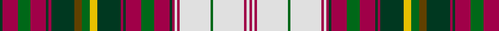

In pattern [GRGRGRGGGYGRGRGRGRWRWGWRWR](/stripes/grgrgrgggygrgrgrgrwrwgwrwr/).

This was sourced from house-of-tartan.  It is a [26 stripe tartan](/stripes/stripes26/).

Original link http://www.house-of-tartan.scotland.net/house/TartanViewjs.asp?colr=Def&tnam=2033

## Thread count
DG/4 R24 G20 R24 DG4 R4 DG36 T12 G12 Y12 DG36 R4 DG4 R24 G20 R24 DG4 R4 LN4 R4 LN48 G4 LN48 R4 LN4 R/4

## Palette
Each colour and its ΔE from the base-6 reference it is a variant of.

| Colour | Shade | Base | ΔE (OKLab) |
|---|---|---|---|
| DG | <code style="background-color:#003820;">#003820</code> `#003820` | G <code style="background-color:#006100;">#006100</code> | 0.15 |
| G | <code style="background-color:#006818;">#006818</code> `#006818` | G <code style="background-color:#006100;">#006100</code> | 0.02 |
| LN | <code style="background-color:#E0E0E0;">#E0E0E0</code> `#E0E0E0` | W <code style="background-color:#F7F7F7;">#F7F7F7</code> | 0.07 |
| R | <code style="background-color:#A00048;">#A00048</code> `#A00048` | R <code style="background-color:#CC0000;">#CC0000</code> | 0.12 |
| T | <code style="background-color:#604000;">#604000</code> `#604000` | G <code style="background-color:#006100;">#006100</code> | 0.14 |
| Y | <code style="background-color:#E8C000;">#E8C000</code> `#E8C000` | Y <code style="background-color:#F2BF00;">#F2BF00</code> | 0.02 |

## Nearest tartans

The nearest existing variants by ΔTartan distance.

1. [Maple Leaf, dress](/setts/s26/dg1r6g5r6dg1r1dg9o3dg3y3dg9r1dg1r6g5r6dg1r1w1r1w12g1w12r1w1r1~x4/) — ΔT 0.38
1. [Harrods](/setts/s26/dy3do9lo2do5lo4w1dy1w1dy1w12k2w2dy2w2k2w12dy1w1dy1w1lo4do5lo2do9dy3r2~x2/) — ΔT 0.56
1. [Victoria Highland Dress Artifact Tartan Tartan Number: 1677. Earliest known date: 19th C. The sett from late Victorian child's Highland Dress. The proportions differ slightly from the pattern recorded by W and A Smith (1850) as 'Victoria', possibly to allow tailoring of this miniature outfit. There is a minor variation between warp and weft in this sample which is not usually reproduced in the manufactured cloth. This tartan is sometimes called Royal Stewart Dress. It is known to have been favourably regarded by Queen Victoria. See products available Copyright © Blair Urquhart, Comrie, 2015](/setts/s26/w23db5w5k7ly3k3w2k3g16r8g3r6w3r6g3r8g16k3w2k3ly3k7w5db5w23r5~x2/) — ΔT 0.72
1. [Wilson's No.181](/setts/s28/r3g3r16g22ly3k3w5k3ly3k19t9k2t9r25t9k2t9k19ly3k3w5k3ly3g22r16g3r3g3~x2/) — ΔT 0.85
1. [Maple Leaf Dress (Lumsden)](/setts/s26/m1dg1m6g5m6dg1m1dg9lo3g3do3dg9m1dg1m6g5m6dg1m1w1m1w12g1w12m1w1~x4/) — ΔT 0.85
1. [Stuart/Stewart - Prince Charles Edward](/setts/s22/r14lg4dt6ly1dt2w2dt2lg12r6dt2r2w1~x4/) — ΔT 0.86
1. [Anderson (MacGregor-Hastie #3)](/setts/s24/r6dg10r2k2r4k2r2dg10r4k9r2k9ly2k3ly2k4w6k6t27r2k2r2t10r6~x2/) — ΔT 0.96
1. [Lasting](/setts/s23/w8dp7w2y6w2ly4w2dp4w2ly4w2dg19w2dp7w2dp7w2r19w4r3y2r3w2~x2/) — ΔT 1.01
1. [Wilson's No.043](/setts/s28/k5w4r19t12k2t2k2t12k20ly3g26r19t5r20t5r19g26ly3k20t12k2t2k2t12r19w4k5r5~x2/) — ΔT 1.02
1. [Wilson's No.152](/setts/s30/r5k4r13g25k3w5k3ly3k16t9k2t9r12k2g3k2r12t9k2t9k16ly3k3w5k3g25r13k4r5w3~x2/) — ΔT 1.03

## Neighbour map

Every grey dot is one of 14299 variants placed by the first two principal components of the ΔTartan feature space (44% of its variance). Red is this tartan; blue dots are its nearest — click one to open its page.

<svg viewBox="0 0 640 380" role="img" style="max-width:100%;height:auto;border:1px solid #e0e0e0;border-radius:4px;display:block" xmlns="http://www.w3.org/2000/svg"><image href="/nn/cloud.v1.png" width="640" height="380"/><a href="/setts/s26/dg1r6g5r6dg1r1dg9o3dg3y3dg9r1dg1r6g5r6dg1r1w1r1w12g1w12r1w1r1~x4/"><circle cx="77.7" cy="80.0" r="4" fill="#3465a4"><title>Maple Leaf, dress</title></circle></a><a href="/setts/s26/dy3do9lo2do5lo4w1dy1w1dy1w12k2w2dy2w2k2w12dy1w1dy1w1lo4do5lo2do9dy3r2~x2/"><circle cx="96.7" cy="73.2" r="4" fill="#3465a4"><title>Harrods</title></circle></a><a href="/setts/s26/w23db5w5k7ly3k3w2k3g16r8g3r6w3r6g3r8g16k3w2k3ly3k7w5db5w23r5~x2/"><circle cx="73.9" cy="78.4" r="4" fill="#3465a4"><title>Victoria Highland Dress Artifact Tartan Tartan Number: 1677. Earliest known date: 19th C. The sett from late Victorian child's Highland Dress. The proportions differ slightly from the pattern recorded by W and A Smith (1850) as 'Victoria', possibly to allow tailoring of this miniature outfit. There is a minor variation between warp and weft in this sample which is not usually reproduced in the manufactured cloth. This tartan is sometimes called Royal Stewart Dress. It is known to have been favourably regarded by Queen Victoria. See products available Copyright © Blair Urquhart, Comrie, 2015</title></circle></a><a href="/setts/s28/r3g3r16g22ly3k3w5k3ly3k19t9k2t9r25t9k2t9k19ly3k3w5k3ly3g22r16g3r3g3~x2/"><circle cx="66.0" cy="85.1" r="4" fill="#3465a4"><title>Wilson's No.181</title></circle></a><a href="/setts/s26/m1dg1m6g5m6dg1m1dg9lo3g3do3dg9m1dg1m6g5m6dg1m1w1m1w12g1w12m1w1~x4/"><circle cx="56.3" cy="62.8" r="4" fill="#3465a4"><title>Maple Leaf Dress (Lumsden)</title></circle></a><a href="/setts/s22/r14lg4dt6ly1dt2w2dt2lg12r6dt2r2w1~x4/"><circle cx="99.1" cy="80.3" r="4" fill="#3465a4"><title>Stuart/Stewart - Prince Charles Edward</title></circle></a><a href="/setts/s24/r6dg10r2k2r4k2r2dg10r4k9r2k9ly2k3ly2k4w6k6t27r2k2r2t10r6~x2/"><circle cx="81.0" cy="85.3" r="4" fill="#3465a4"><title>Anderson (MacGregor-Hastie #3)</title></circle></a><a href="/setts/s23/w8dp7w2y6w2ly4w2dp4w2ly4w2dg19w2dp7w2dp7w2r19w4r3y2r3w2~x2/"><circle cx="35.7" cy="78.2" r="4" fill="#3465a4"><title>Lasting</title></circle></a><a href="/setts/s28/k5w4r19t12k2t2k2t12k20ly3g26r19t5r20t5r19g26ly3k20t12k2t2k2t12r19w4k5r5~x2/"><circle cx="102.7" cy="92.7" r="4" fill="#3465a4"><title>Wilson's No.043</title></circle></a><a href="/setts/s30/r5k4r13g25k3w5k3ly3k16t9k2t9r12k2g3k2r12t9k2t9k16ly3k3w5k3g25r13k4r5w3~x2/"><circle cx="59.6" cy="88.1" r="4" fill="#3465a4"><title>Wilson's No.152</title></circle></a><circle cx="76.9" cy="78.4" r="5" fill="#c00000"/></svg>

ID: /setts/s26/dg1m6g5m6dg1m1dg9dy3g3ly3dg9m1dg1m6g5m6dg1m1w1m1w12g1w12m1w1m1~x4/
