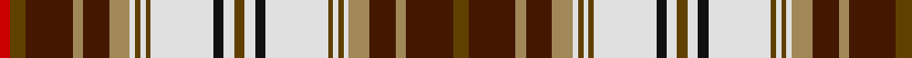

**Bands:** [GBYBYWGWGWKWGWKWGWGWYBYBGR](/stripes/gbybywgwgwkwgwkwgwgwybybgr/) · **Stripes:** [DY DO LO DO LO W DY W DY W K W DY W K W DY W DY W LO DO LO DO DY R](/stripes/stripes26/) DY DO LO DO LO W DY W DY W K W DY W K W DY W DY W LO DO LO DO DY R

This was sourced from register-of-tartans.  It is a [26 band tartan](/bands/bands26/).

Original link https://www.tartanregister.gov.uk/tartanDetails.aspx?ref=1618

## Register references

External register numbers recorded for this tartan.

- Scottish Register of Tartans: [1618](https://www.tartanregister.gov.uk/tartanDetails.aspx?ref=1618)
- Scottish Tartans Authority (ITI): 2551
- Scottish Tartans World Register: 2551

## Thread count
R/4 T6 DR18 LT4 DR10 LT8 LN2 T2 LN2 T2 LN24 K4 LN4 T4 LN4 K4 LN24 T2 LN2 T2 LN2 LT8 DR10 LT4 DR18 T/6

## Palette
Each colour and its ΔE from the base-6 reference it is a variant of.

| Colour | Shade | Base | ΔE (OKLab) |
|---|---|---|---|
| DR | <code style="background-color:#441800;">#441800</code> `#441800` | B <code style="background-color:#2A418A;">#2A418A</code> | 0.23 |
| K | <code style="background-color:#101010;">#101010</code> `#101010` | K <code style="background-color:#000000;">#000000</code> | 0.17 |
| LN | <code style="background-color:#E0E0E0;">#E0E0E0</code> `#E0E0E0` | W <code style="background-color:#F7F7F7;">#F7F7F7</code> | 0.07 |
| LT | <code style="background-color:#A08858;">#A08858</code> `#A08858` | Y <code style="background-color:#F2BF00;">#F2BF00</code> | 0.21 |
| R | <code style="background-color:#C80000;">#C80000</code> `#C80000` | R <code style="background-color:#CC0000;">#CC0000</code> | 0.01 |
| T | <code style="background-color:#604000;">#604000</code> `#604000` | G <code style="background-color:#006100;">#006100</code> | 0.14 |

## Nearest tartans

The nearest existing variants by ΔTartan distance.

1. [Victoria Highland Dress Artifact Tartan Tartan Number: 1677. Earliest known date: 19th C. The sett from late Victorian child's Highland Dress. The proportions differ slightly from the pattern recorded by W and A Smith (1850) as 'Victoria', possibly to allow tailoring of this miniature outfit. There is a minor variation between warp and weft in this sample which is not usually reproduced in the manufactured cloth. This tartan is sometimes called Royal Stewart Dress. It is known to have been favourably regarded by Queen Victoria. See products available Copyright © Blair Urquhart, Comrie, 2015](/setts/s26/w23db5w5k7ly3k3w2k3g16r8g3r6w3r6g3r8g16k3w2k3ly3k7w5db5w23r5~x2/) — ΔT 0.52
1. [Maple Leaf Dress District Tartan Tartan Number: 2033. Earliest known date: pre 1992 In creating the Maple Leaf Tartan fabric, David Weiser captured the natural phenomena of these leaves turning from summer into autumn. (The Office of the High Commissioner for Canada.) This is a dress version of the Maple Leaf tartan. See products available Copyright © Blair Urquhart, Comrie, 2015](/setts/s26/dg1m6g5m6dg1m1dg9dy3g3ly3dg9m1dg1m6g5m6dg1m1w1m1w12g1w12m1w1m1~x4/) — ΔT 0.56
1. [Maple Leaf, dress](/setts/s26/dg1r6g5r6dg1r1dg9o3dg3y3dg9r1dg1r6g5r6dg1r1w1r1w12g1w12r1w1r1~x4/) — ΔT 0.59
1. [Stuart/Stewart - Prince Charles Edward](/setts/s22/r14lg4dt6ly1dt2w2dt2lg12r6dt2r2w1r2dt2r6lg12dt2w2dt2ly1dt6lg4~x4/) — ΔT 0.86
1. [Unidentified Lindley #3](/setts/s22/g3lo19w2db3w3db6w2db3w2ly4db14ly4w2db3w2db6w3db3w2lo19g3k2~x2/) — ΔT 1.00
1. [MacAlister Dress](/setts/s30/r12g3ly1r2ly1g3r3db3r6t1r1w8r1t1w12t1r1g8r1t1w6g2r1t1r2t1r1g3ly1r4~x4/) — ΔT 1.00
1. [Maple Leaf Dress](/setts/s24/r6g5r6dg1r1dg9o3g3o3r9r1dg1r6g5r6dg1r1w1r1w12g1w12r1w1~x4/) — ΔT 1.01
1. [Anderson](/setts/s20/r4dg6r2dg6r3db4r1k4ly1k1ly1k3lb3k3lb18r1k2r1lb6r3~x2/) — ΔT 1.03
1. [Maple Leaf Dress (Lumsden)](/setts/s26/m1dg1m6g5m6dg1m1dg9lo3g3do3dg9m1dg1m6g5m6dg1m1w1m1w12g1w12m1w1~x4/) — ΔT 1.03
1. [Harmon Dress (Personal)](/setts/s19/k2lr6ly2lr2ly2lr19db2g2db2lr2r4k2r11g2r2g2r11g2ly2~x2/) — ΔT 1.03

## Neighbour map

Every grey dot is one of 14313 variants placed by the first two principal components of the ΔTartan feature space (44% of its variance). Red is this tartan; blue dots are its nearest — click one to open its page.

<svg viewBox="0 0 640 380" role="img" style="max-width:100%;height:auto;border:1px solid #e0e0e0;border-radius:4px;display:block" xmlns="http://www.w3.org/2000/svg"><image href="/nn/cloud.v1.png" width="640" height="380"/><a href="/setts/s26/w23db5w5k7ly3k3w2k3g16r8g3r6w3r6g3r8g16k3w2k3ly3k7w5db5w23r5~x2/"><circle cx="74.2" cy="78.3" r="4" fill="#3465a4"><title>Victoria Highland Dress Artifact Tartan Tartan Number: 1677. Earliest known date: 19th C. The sett from late Victorian child's Highland Dress. The proportions differ slightly from the pattern recorded by W and A Smith (1850) as 'Victoria', possibly to allow tailoring of this miniature outfit. There is a minor variation between warp and weft in this sample which is not usually reproduced in the manufactured cloth. This tartan is sometimes called Royal Stewart Dress. It is known to have been favourably regarded by Queen Victoria. See products available Copyright © Blair Urquhart, Comrie, 2015</title></circle></a><a href="/setts/s26/dg1m6g5m6dg1m1dg9dy3g3ly3dg9m1dg1m6g5m6dg1m1w1m1w12g1w12m1w1m1~x4/"><circle cx="77.1" cy="78.3" r="4" fill="#3465a4"><title>Maple Leaf Dress District Tartan Tartan Number: 2033. Earliest known date: pre 1992 In creating the Maple Leaf Tartan fabric, David Weiser captured the natural phenomena of these leaves turning from summer into autumn. (The Office of the High Commissioner for Canada.) This is a dress version of the Maple Leaf tartan. See products available Copyright © Blair Urquhart, Comrie, 2015</title></circle></a><a href="/setts/s26/dg1r6g5r6dg1r1dg9o3dg3y3dg9r1dg1r6g5r6dg1r1w1r1w12g1w12r1w1r1~x4/"><circle cx="77.9" cy="79.8" r="4" fill="#3465a4"><title>Maple Leaf, dress</title></circle></a><a href="/setts/s22/r14lg4dt6ly1dt2w2dt2lg12r6dt2r2w1r2dt2r6lg12dt2w2dt2ly1dt6lg4~x4/"><circle cx="99.3" cy="80.2" r="4" fill="#3465a4"><title>Stuart/Stewart - Prince Charles Edward</title></circle></a><a href="/setts/s22/g3lo19w2db3w3db6w2db3w2ly4db14ly4w2db3w2db6w3db3w2lo19g3k2~x2/"><circle cx="99.3" cy="81.0" r="4" fill="#3465a4"><title>Unidentified Lindley #3</title></circle></a><a href="/setts/s30/r12g3ly1r2ly1g3r3db3r6t1r1w8r1t1w12t1r1g8r1t1w6g2r1t1r2t1r1g3ly1r4~x4/"><circle cx="127.5" cy="62.3" r="4" fill="#3465a4"><title>MacAlister Dress</title></circle></a><a href="/setts/s24/r6g5r6dg1r1dg9o3g3o3r9r1dg1r6g5r6dg1r1w1r1w12g1w12r1w1~x4/"><circle cx="128.8" cy="95.2" r="4" fill="#3465a4"><title>Maple Leaf Dress</title></circle></a><a href="/setts/s20/r4dg6r2dg6r3db4r1k4ly1k1ly1k3lb3k3lb18r1k2r1lb6r3~x2/"><circle cx="110.0" cy="62.7" r="4" fill="#3465a4"><title>Anderson</title></circle></a><a href="/setts/s26/m1dg1m6g5m6dg1m1dg9lo3g3do3dg9m1dg1m6g5m6dg1m1w1m1w12g1w12m1w1~x4/"><circle cx="56.5" cy="62.6" r="4" fill="#3465a4"><title>Maple Leaf Dress (Lumsden)</title></circle></a><a href="/setts/s19/k2lr6ly2lr2ly2lr19db2g2db2lr2r4k2r11g2r2g2r11g2ly2~x2/"><circle cx="132.3" cy="91.4" r="4" fill="#3465a4"><title>Harmon Dress (Personal)</title></circle></a><circle cx="97.0" cy="73.0" r="5" fill="#c00000"/></svg>

ID: /setts/s26/dy3do9lo2do5lo4w1dy1w1dy1w12k2w2dy2w2k2w12dy1w1dy1w1lo4do5lo2do9dy3r2~x2/
